## 3. Stakeholders

### 3.1. Danh sách Stakeholders và vai trò

Các bên liên quan đến quá trình xây dựng, vận hành và sử dụng CAB System được xác định như sau:

| STT | Stakeholder | Vai trò / Mối quan tâm |
|---|---|---|
| 1 | **Khách hàng (Customer/Passenger)** | Sử dụng hệ thống để đặt xe, theo dõi chuyến đi, thanh toán, xem lịch sử chuyến và đánh giá tài xế. Quan tâm đến tính thuận tiện, chính xác và an toàn của dịch vụ. |
| 2 | **Tài xế (Driver)** | Cập nhật hồ sơ, phương tiện, trạng thái hoạt động và vị trí; nhận hoặc từ chối yêu cầu chuyến; thực hiện và cập nhật trạng thái chuyến đi. |
| 3 | **Nhân viên vận hành (Operation Staff)** | Quản lý khách hàng, tài xế, phương tiện và chuyến đi; giám sát hoạt động và hỗ trợ xử lý các trường hợp bất thường hoặc chuyến đi gặp sự cố. |
| 4 | **Quản trị viên (Administrator)** | Quản lý tài khoản, phân quyền, kiểm soát quyền truy cập, theo dõi nhật ký và thực hiện các chức năng quản trị hệ thống. |
| 5 | **Ban lãnh đạo Công ty ABC (Management)** | Đưa ra mục tiêu và định hướng của dự án; theo dõi số lượng chuyến, doanh thu, tỷ lệ hoàn thành, tỷ lệ hủy và hiệu quả hoạt động của tài xế. |
| 6 | **Nhà cung cấp thanh toán (Payment Provider)** | Cung cấp dịch vụ thanh toán điện tử, xử lý giao dịch và trả kết quả thanh toán cho CAB System mà không yêu cầu hệ thống lưu trực tiếp thông tin thanh toán nhạy cảm. |
| 7 | **Nhà cung cấp thông báo (Notification Provider)** | Cung cấp dịch vụ gửi thông báo cho khách hàng và tài xế thông qua các kênh như Push Notification, SMS hoặc Email. |
| 8 | **Business Analyst (BA)** | Thu thập, phân tích và làm rõ yêu cầu; xác định phạm vi, quy trình nghiệp vụ, quy tắc nghiệp vụ, ngoại lệ và các vấn đề cần xác nhận với khách hàng. |
| 9 | **Nhóm phát triển (Development Team)** | Thiết kế kiến trúc, xây dựng, tích hợp và triển khai CAB System dựa trên các yêu cầu đã được thống nhất. |
| 10 | **Nhóm kiểm thử (QA/Tester)** | Kiểm thử chức năng, tích hợp, hiệu năng, bảo mật và độ ổn định nhằm đảm bảo hệ thống đáp ứng các yêu cầu đã xác định. |

---

### 3.2. Stakeholder Matrix

Stakeholders được đánh giá dựa trên hai tiêu chí:

- **Influence:** Mức độ ảnh hưởng của Stakeholder đến dự án và các quyết định của hệ thống.
- **Interest:** Mức độ quan tâm và mức độ chịu ảnh hưởng bởi kết quả của dự án.

| Stakeholder | Influence | Interest | Nhóm quản lý | Cách tương tác |
|---|---|---|---|---|
| **Ban lãnh đạo Công ty ABC** | High | High | Manage Closely | Thường xuyên trao đổi, báo cáo tiến độ và xác nhận các quyết định nghiệp vụ quan trọng. |
| **Nhân viên vận hành** | High | High | Manage Closely | Phỏng vấn và trao đổi thường xuyên để xác nhận quy trình vận hành và các trường hợp ngoại lệ. |
| **Quản trị viên** | High | High | Manage Closely | Làm rõ các yêu cầu về quản trị, phân quyền, bảo mật và kiểm soát hệ thống. |
| **Business Analyst** | High | High | Manage Closely | Phối hợp với các bên để thu thập, phân tích, quản lý và xác nhận yêu cầu. |
| **Development Team** | High | High | Manage Closely | Phối hợp với BA để đánh giá tính khả thi và triển khai các yêu cầu đã được xác nhận. |
| **Payment Provider** | High | Low | Keep Satisfied | Làm rõ API, quy trình thanh toán, bảo mật và xử lý các giao dịch thất bại. |
| **Notification Provider** | High | Low | Keep Satisfied | Làm rõ API, kênh thông báo và cơ chế tích hợp. |
| **Khách hàng** | Low | High | Keep Informed | Thu thập nhu cầu và phản hồi về đặt xe, theo dõi chuyến và thanh toán. |
| **Tài xế** | Low | High | Keep Informed | Thu thập yêu cầu và phản hồi về nhận chuyến, vị trí và trạng thái chuyến. |
| **QA/Tester** | Low | High | Keep Informed | Cập nhật thay đổi yêu cầu và phối hợp xây dựng các trường hợp kiểm thử. |

---

### 3.3. Phân loại Stakeholders theo Influence – Interest Matrix

| | **Interest thấp (Low)** | **Interest cao (High)** |
|---|---|---|
| **Influence cao (High)** | **Keep Satisfied:** Payment Provider, Notification Provider | **Manage Closely:** Management, Operation Staff, Administrator, BA, Development Team |
| **Influence thấp (Low)** | **Monitor:** Các bên hỗ trợ khác nếu phát sinh | **Keep Informed:** Customer, Driver, QA/Tester |

---

### 3.4. Sơ đồ Stakeholders

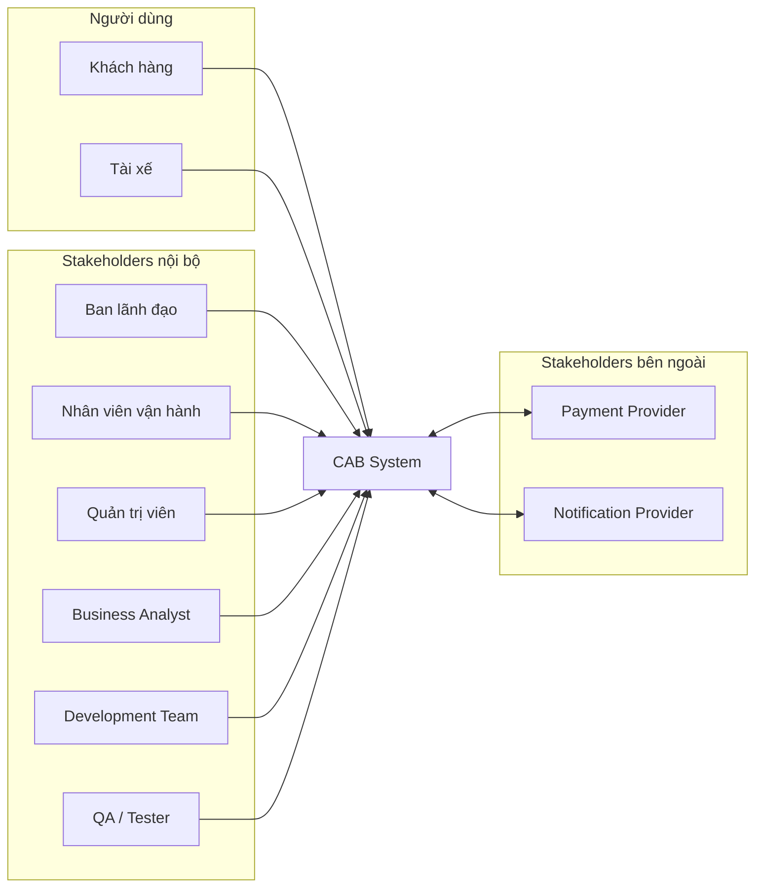

---

### 3.5. Sơ đồ Stakeholder Matrix

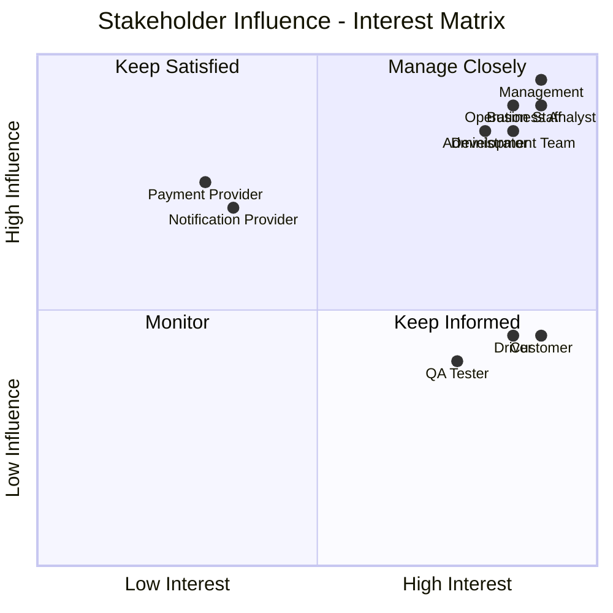

---

## 4. Business Goals

### 4.1. Mục tiêu nghiệp vụ

Từ các yêu cầu quan trọng của Công ty ABC, các mục tiêu nghiệp vụ chính của CAB System được xác định như sau:

| Mã | Business Goal | Mô tả |
|---|---|---|
| **BG-01** | **Xây dựng nền tảng đặt xe trực tuyến toàn diện** | Hỗ trợ toàn bộ quy trình từ khi khách hàng tạo yêu cầu đặt xe, tìm tài xế, thực hiện chuyến, tính cước, thanh toán đến đánh giá sau chuyến. |
| **BG-02** | **Tự động hóa quá trình tìm và phân công tài xế** | Tự động xác định và ưu tiên tài xế phù hợp dựa trên vị trí và trạng thái sẵn sàng; tiếp tục tìm tài xế khác khi tài xế trước từ chối hoặc không phản hồi. |
| **BG-03** | **Nâng cao trải nghiệm đặt xe và theo dõi chuyến đi** | Cho phép khách hàng theo dõi tài xế, ETA và trạng thái chuyến; đồng thời nhận thông báo tại các thời điểm quan trọng. |
| **BG-04** | **Quản lý tập trung cước phí và thanh toán** | Hỗ trợ tính cước, quản lý giao dịch, thanh toán tiền mặt và thanh toán điện tử thông qua nhà cung cấp bên ngoài. |
| **BG-05** | **Nâng cao hiệu quả quản lý và vận hành dịch vụ** | Quản lý tập trung khách hàng, tài xế, phương tiện, chuyến đi và giao dịch; hỗ trợ giám sát, xử lý sự cố và báo cáo hoạt động. |
| **BG-06** | **Xây dựng nền tảng ổn định, bảo mật và có khả năng mở rộng lâu dài** | Đảm bảo hệ thống có thể phục vụ số lượng lớn người dùng, bảo vệ dữ liệu, hạn chế ảnh hưởng khi một thành phần gặp lỗi và hỗ trợ mở rộng trong tương lai. |

---

### 4.2. Chuyển đổi yêu cầu khách hàng thành Business Goals

| Yêu cầu quan trọng của khách hàng | Business Goal |
|---|---|
| Xây dựng nền tảng hỗ trợ đầy đủ quy trình đặt và thực hiện chuyến xe. | **BG-01** |
| Giảm việc phân công thủ công và tự động tìm tài xế phù hợp. | **BG-02** |
| Cho phép khách hàng theo dõi tài xế, ETA, trạng thái chuyến và nhận thông báo. | **BG-03** |
| Quản lý tập trung tính cước, giao dịch và thanh toán. | **BG-04** |
| Hỗ trợ quản lý, giám sát, xử lý sự cố và báo cáo kinh doanh. | **BG-05** |
| Đảm bảo hệ thống ổn định, bảo mật và có khả năng mở rộng. | **BG-06** |

---

### 4.3. Liên kết Business Goals với Stakeholders

| Business Goal | Stakeholders liên quan chính |
|---|---|
| **BG-01** | Customer, Driver, Operation Staff, Management |
| **BG-02** | Customer, Driver, Operation Staff |
| **BG-03** | Customer, Driver, Notification Provider |
| **BG-04** | Customer, Operation Staff, Payment Provider |
| **BG-05** | Operation Staff, Administrator, Management |
| **BG-06** | Administrator, Management, Development Team |

---

### 4.4. Ưu tiên Business Goals

| Business Goal | Mức ưu tiên | Lý do |
|---|---|---|
| **BG-01** | **Must Have** | Là mục tiêu cốt lõi để hình thành quy trình đặt xe hoàn chỉnh. |
| **BG-02** | **Must Have** | Giải quyết hạn chế phân công tài xế thủ công của hệ thống hiện tại. |
| **BG-03** | **Must Have** | Đảm bảo khách hàng và tài xế có thể theo dõi và phối hợp trong chuyến đi. |
| **BG-04** | **Must Have** | Tính cước và thanh toán cần thiết để hoàn thành chuyến đi. |
| **BG-05** | **Should Have** | Cần thiết cho vận hành, nhưng báo cáo nâng cao có thể phát triển sau. |
| **BG-06** | **Should Have** | Cần thiết về kiến trúc, bảo mật và khả năng phát triển lâu dài. |

---

## 5. Phạm vi phát triển hệ thống

### 5.1. Xác định phạm vi

Dựa trên các Business Goals và thời gian phát triển **7 tuần**, CAB System tập trung vào các module cốt lõi để hoàn thành quy trình đặt xe.

Các chức năng có độ phức tạp cao được giới hạn hoặc chuyển sang phiên bản tiếp theo nhằm đảm bảo tính khả thi của dự án.

---

### 5.2. Phạm vi các Module

| Mã | Module | BG liên quan | Phạm vi | Nội dung triển khai |
|---|---|---|---|---|
| **M01** | **User & Authentication** | BG-01, BG-06 | **In Scope** | Đăng ký, đăng nhập, cập nhật hồ sơ, xác thực và phân quyền cơ bản. |
| **M02** | **Booking Management** | BG-01 | **In Scope** | Nhập điểm đón, điểm đến, chọn loại xe và tạo yêu cầu đặt xe. |
| **M03** | **Driver & Vehicle Management** | BG-01, BG-02 | **In Scope** | Quản lý hồ sơ tài xế, phương tiện, trạng thái hoạt động và vị trí. |
| **M04** | **Driver Matching & Dispatch** | BG-02 | **In Scope** | Tìm tài xế khả dụng gần khách hàng và tìm tài xế khác khi tài xế trước từ chối hoặc không phản hồi. |
| **M05** | **Trip Management & Tracking** | BG-01, BG-03 | **In Scope** | Quản lý trạng thái chuyến từ lúc tìm tài xế đến khi hoàn thành hoặc hủy. |
| **M06** | **Fare & Payment** | BG-04 | **Limited Scope** | Tính cước cơ bản, thanh toán tiền mặt và tích hợp **01 Payment Provider**. |
| **M07** | **Notification** | BG-03 | **Limited Scope** | Thông báo các sự kiện quan trọng của chuyến qua **01 kênh thông báo chính**. |
| **M08** | **Trip History & Rating** | BG-01, BG-03 | **In Scope** | Xem lịch sử chuyến và đánh giá tài xế sau chuyến. |
| **M09** | **Operation & Administration** | BG-05, BG-06 | **In Scope** | Quản lý Customer, Driver, Vehicle, Trip; theo dõi chuyến và phân quyền quản trị cơ bản. |
| **M10** | **Reporting & Analytics** | BG-05 | **Limited Scope** | Báo cáo cơ bản về số chuyến, doanh thu, tỷ lệ hoàn thành, tỷ lệ hủy và hiệu quả tài xế. |
| **M11** | **Advanced Services & Integrations** | BG-06 | **Out of Scope** | Các dịch vụ và tích hợp nâng cao được phát triển trong phiên bản sau. |

---

### 5.3. Phân loại phạm vi

#### 5.3.1. In Scope

Các module ưu tiên phát triển:

- **M01 – User & Authentication**
- **M02 – Booking Management**
- **M03 – Driver & Vehicle Management**
- **M04 – Driver Matching & Dispatch**
- **M05 – Trip Management & Tracking**
- **M08 – Trip History & Rating**
- **M09 – Operation & Administration**

Luồng nghiệp vụ chính:

**Đặt xe → Tìm tài xế → Tài xế nhận chuyến → Thực hiện chuyến → Hoàn thành chuyến.**

#### 5.3.2. Limited Scope

- **M06 – Fare & Payment:** tính cước cơ bản, tiền mặt và **01 Payment Provider**.
- **M07 – Notification:** triển khai **01 kênh thông báo chính**.
- **M10 – Reporting & Analytics:** chỉ triển khai báo cáo cơ bản.

#### 5.3.3. Out of Scope

Các chức năng chưa triển khai trong phiên bản 7 tuần:

- Nhiều Payment Provider.
- Nhiều Notification Provider/kênh thông báo.
- AI/ML nâng cao cho Driver Matching.
- Dynamic Pricing/Surge Pricing phức tạp.
- Advanced Analytics và Business Intelligence.
- Các loại dịch vụ vận chuyển mới.
- Các tích hợp bên thứ ba nâng cao.

---

### 5.4. Liên kết Business Goals với Module

| Business Goal | Module đáp ứng |
|---|---|
| **BG-01** | M01, M02, M03, M05, M08 |
| **BG-02** | M03, M04 |
| **BG-03** | M05, M07, M08 |
| **BG-04** | M06 |
| **BG-05** | M09, M10 |
| **BG-06** | M01, M09, M11 |

---

### 5.5. Sơ đồ phạm vi Module

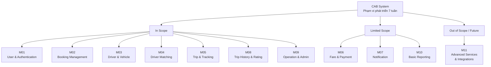

---

### 5.6. Kết luận phạm vi

Trong thời gian phát triển **7 tuần**, dự án ưu tiên hoàn thiện các chức năng cần thiết để thực hiện luồng đặt xe cốt lõi.

Các chức năng thanh toán, thông báo và báo cáo được giới hạn ở mức cơ bản để đảm bảo tính khả thi. Các chức năng nâng cao được đưa ra ngoài phạm vi phiên bản đầu tiên nhưng hệ thống cần được thiết kế để có thể mở rộng trong tương lai.

---

## 6. Business Requirements


### 6.1. BG-01 – Xây dựng nền tảng đặt xe trực tuyến toàn diện

| Mã Business Requirement          | Business Requirement         | Mô tả                                                                                          |
| -------------------------------- | ---------------------------- | ---------------------------------------------------------------------------------------------- |
| **BG01_QuanLyTaiKhoanKhachHang** | Quản lý tài khoản khách hàng | Cho phép khách hàng đăng ký, đăng nhập và quản lý thông tin cá nhân để sử dụng dịch vụ đặt xe. |
| **BG01_TaoYeuCauDatXe**          | Tạo yêu cầu đặt xe           | Khách hàng có thể nhập điểm đón, điểm đến, lựa chọn loại xe và gửi yêu cầu đặt xe.             |
| **BG01_QuanLyChuyenDi**          | Quản lý chuyến đi            | Hệ thống quản lý chuyến đi từ khi yêu cầu được tạo cho đến khi chuyến hoàn thành hoặc bị hủy.  |
| **BG01_QuanLyLichSuChuyenDi**    | Quản lý lịch sử chuyến đi    | Lưu trữ và cho phép khách hàng tra cứu các chuyến đi đã thực hiện.                             |
| **BG01_DanhGiaTaiXe**            | Đánh giá tài xế              | Cho phép khách hàng đánh giá tài xế sau khi chuyến đi hoàn thành.                              |

---

### 6.2. BG-02 – Tự động hóa quá trình tìm và phân công tài xế

| Mã Business Requirement       | Business Requirement      | Mô tả                                                                                                         |
| ----------------------------- | ------------------------- | ------------------------------------------------------------------------------------------------------------- |
| **BG02_QuanLyTrangThaiTaiXe** | Quản lý trạng thái tài xế | Hệ thống ghi nhận trạng thái sẵn sàng hoặc không sẵn sàng nhận chuyến của tài xế.                             |
| **BG02_TheoDoiViTriTaiXe**    | Theo dõi vị trí tài xế    | Ghi nhận vị trí tài xế để hỗ trợ xác định tài xế phù hợp với yêu cầu đặt xe.                                  |
| **BG02_TimTaiXePhuHop**       | Tìm tài xế phù hợp        | Hệ thống tự động tìm và ưu tiên tài xế phù hợp dựa trên vị trí, trạng thái sẵn sàng và các tiêu chí vận hành. |
| **BG02_PhanCongTaiXe**        | Phân công tài xế          | Gửi yêu cầu chuyến đến tài xế phù hợp và ghi nhận việc tài xế chấp nhận hoặc từ chối.                         |
| **BG02_TimLaiTaiXe**          | Tìm lại tài xế            | Tự động tiếp tục tìm tài xế khác nếu tài xế được đề xuất từ chối hoặc không phản hồi.                         |
| **BG02_XuLyKhongCoTaiXe**     | Xử lý khi không có tài xế | Thông báo rõ ràng cho khách hàng khi hệ thống không tìm được tài xế phù hợp.                                  |

---

### 6.3. BG-03 – Nâng cao trải nghiệm đặt xe và theo dõi chuyến đi

| Mã Business Requirement           | Business Requirement          | Mô tả                                                                                                  |
| --------------------------------- | ----------------------------- | ------------------------------------------------------------------------------------------------------ |
| **BG03_TheoDoiTrangThaiDatXe**    | Theo dõi trạng thái đặt xe    | Cho phép khách hàng biết hệ thống đang tìm tài xế hoặc đã tìm được tài xế.                             |
| **BG03_HienThiThongTinTaiXe**     | Hiển thị thông tin tài xế     | Cung cấp thông tin tài xế đã nhận chuyến cho khách hàng.                                               |
| **BG03_HienThiThoiGianDuKien**    | Hiển thị thời gian dự kiến    | Cung cấp thời gian dự kiến tài xế đến điểm đón cho khách hàng.                                         |
| **BG03_TheoDoiTrangThaiChuyenDi** | Theo dõi trạng thái chuyến đi | Cho phép theo dõi các trạng thái như tài xế đã đến, đã đón khách, đang di chuyển và hoàn thành chuyến. |
| **BG03_ThongBaoSuKienChuyenDi**   | Thông báo sự kiện chuyến đi   | Gửi thông báo cho khách hàng và tài xế khi có các sự kiện quan trọng liên quan đến chuyến đi.          |

---

### 6.4. BG-04 – Quản lý tập trung cước phí và thanh toán

| Mã Business Requirement         | Business Requirement        | Mô tả                                                                                                 |
| ------------------------------- | --------------------------- | ----------------------------------------------------------------------------------------------------- |
| **BG04_TinhCuocChuyenDi**       | Tính cước chuyến đi         | Xác định số tiền khách hàng phải trả dựa trên loại dịch vụ và thông tin chuyến đi.                    |
| **BG04_ThanhToanTienMat**       | Thanh toán tiền mặt         | Cho phép khách hàng lựa chọn thanh toán bằng tiền mặt sau khi chuyến đi hoàn thành.                   |
| **BG04_ThanhToanDienTu**        | Thanh toán điện tử          | Cho phép thanh toán thông qua nhà cung cấp thanh toán bên ngoài.                                      |
| **BG04_BaoVeThongTinThanhToan** | Bảo vệ thông tin thanh toán | Không lưu trực tiếp thông tin nhạy cảm của thẻ hoặc tài khoản thanh toán trong CAB System.            |
| **BG04_XuLyThanhToanThatBai**   | Xử lý thanh toán thất bại   | Thông báo khi giao dịch thất bại và hỗ trợ thực hiện lại thanh toán theo chính sách của doanh nghiệp. |
| **BG04_LuuLichSuGiaoDich**      | Lưu lịch sử giao dịch       | Lưu thông tin cần thiết của giao dịch để phục vụ tra cứu và quản lý.                                  |

---

### 6.5. BG-05 – Nâng cao hiệu quả quản lý và vận hành dịch vụ

| Mã Business Requirement   | Business Requirement  | Mô tả                                                                                                   |
| ------------------------- | --------------------- | ------------------------------------------------------------------------------------------------------- |
| **BG05_QuanLyKhachHang**  | Quản lý khách hàng    | Cho phép nhân viên vận hành tra cứu và quản lý thông tin khách hàng.                                    |
| **BG05_QuanLyTaiXe**      | Quản lý tài xế        | Cho phép quản lý hồ sơ, trạng thái hoạt động và thông tin liên quan đến tài xế.                         |
| **BG05_QuanLyPhuongTien** | Quản lý phương tiện   | Quản lý thông tin phương tiện của các tài xế.                                                           |
| **BG05_GiamSatChuyenDi**  | Giám sát chuyến đi    | Cho phép nhân viên vận hành xem và theo dõi các chuyến đang diễn ra.                                    |
| **BG05_XuLySuCoChuyenDi** | Xử lý sự cố chuyến đi | Hỗ trợ nhân viên vận hành kiểm tra và xử lý các trường hợp chuyến đi gặp lỗi hoặc bất thường.           |
| **BG05_TraCuuGiaoDich**   | Tra cứu giao dịch     | Cho phép nhân viên có quyền phù hợp tra cứu lịch sử giao dịch.                                          |
| **BG05_BaoCaoHoatDong**   | Báo cáo hoạt động     | Cung cấp báo cáo về số chuyến, doanh thu, tỷ lệ hoàn thành, tỷ lệ hủy và hiệu quả hoạt động của tài xế. |

---

### 6.6. BG-06 – Xây dựng nền tảng ổn định, bảo mật và có khả năng mở rộng lâu dài

| Mã Business Requirement     | Business Requirement    | Mô tả                                                                                                                                                  |
| --------------------------- | ----------------------- | ------------------------------------------------------------------------------------------------------------------------------------------------------ |
| **BG06_XacThucNguoiDung**   | Xác thực người dùng     | Khách hàng và tài xế phải được xác thực trước khi sử dụng các chức năng yêu cầu tài khoản.                                                             |
| **BG06_PhanQuyenQuanTri**   | Phân quyền quản trị     | Kiểm soát quyền truy cập để các thao tác quản trị nhạy cảm chỉ được thực hiện bởi người có quyền phù hợp.                                              |
| **BG06_BaoVeDuLieu**        | Bảo vệ dữ liệu          | Bảo vệ thông tin cá nhân, phương tiện, vị trí và dữ liệu giao dịch của người dùng.                                                                     |
| **BG06_LuuVetHoatDong**     | Lưu vết hoạt động       | Ghi nhận các thao tác quan trọng để hỗ trợ kiểm tra và xử lý khi có sự cố.                                                                             |
| **BG06_DamBaoTinhSanSang**  | Đảm bảo tính sẵn sàng   | Hạn chế việc lỗi ở một thành phần như thanh toán hoặc thông báo làm gián đoạn toàn bộ hệ thống đặt xe.                                                 |
| **BG06_HoTroMoRongHeThong** | Hỗ trợ mở rộng hệ thống | Cho phép các thành phần có thể mở rộng độc lập khi số lượng khách hàng, tài xế hoặc chuyến đi tăng.                                                    |
| **BG06_HoTroMoRongTichHop** | Hỗ trợ mở rộng tích hợp | Kiến trúc cho phép bổ sung loại dịch vụ, phương thức thanh toán và nhà cung cấp thông báo trong tương lai mà không phải xây dựng lại toàn bộ hệ thống. |

---

### 6.7. Traceability Business Goal – Business Requirement

| Business Goal | Business Requirements                                                                                                                                         |
| ------------- | ------------------------------------------------------------------------------------------------------------------------------------------------------------- |
| **BG-01**     | BG01_QuanLyTaiKhoanKhachHang, BG01_TaoYeuCauDatXe, BG01_QuanLyChuyenDi, BG01_QuanLyLichSuChuyenDi, BG01_DanhGiaTaiXe                                          |
| **BG-02**     | BG02_QuanLyTrangThaiTaiXe, BG02_TheoDoiViTriTaiXe, BG02_TimTaiXePhuHop, BG02_PhanCongTaiXe, BG02_TimLaiTaiXe, BG02_XuLyKhongCoTaiXe                           |
| **BG-03**     | BG03_TheoDoiTrangThaiDatXe, BG03_HienThiThongTinTaiXe, BG03_HienThiThoiGianDuKien, BG03_TheoDoiTrangThaiChuyenDi, BG03_ThongBaoSuKienChuyenDi                 |
| **BG-04**     | BG04_TinhCuocChuyenDi, BG04_ThanhToanTienMat, BG04_ThanhToanDienTu, BG04_BaoVeThongTinThanhToan, BG04_XuLyThanhToanThatBai, BG04_LuuLichSuGiaoDich            |
| **BG-05**     | BG05_QuanLyKhachHang, BG05_QuanLyTaiXe, BG05_QuanLyPhuongTien, BG05_GiamSatChuyenDi, BG05_XuLySuCoChuyenDi, BG05_TraCuuGiaoDich, BG05_BaoCaoHoatDong          |
| **BG-06**     | BG06_XacThucNguoiDung, BG06_PhanQuyenQuanTri, BG06_BaoVeDuLieu, BG06_LuuVetHoatDong, BG06_DamBaoTinhSanSang, BG06_HoTroMoRongHeThong, BG06_HoTroMoRongTichHop |


---
## 7. Business Process

### 7.1. BP-01 – Quy trình đăng ký và quản lý tài khoản khách hàng

**Business Requirements liên quan:** `BG01_QuanLyTaiKhoanKhachHang`, `BG06_XacThucNguoiDung`


---

### 7.2. BP-02 – Quy trình tạo yêu cầu đặt xe

**Business Requirements liên quan:** `BG01_TaoYeuCauDatXe`, `BG01_QuanLyChuyenDi`

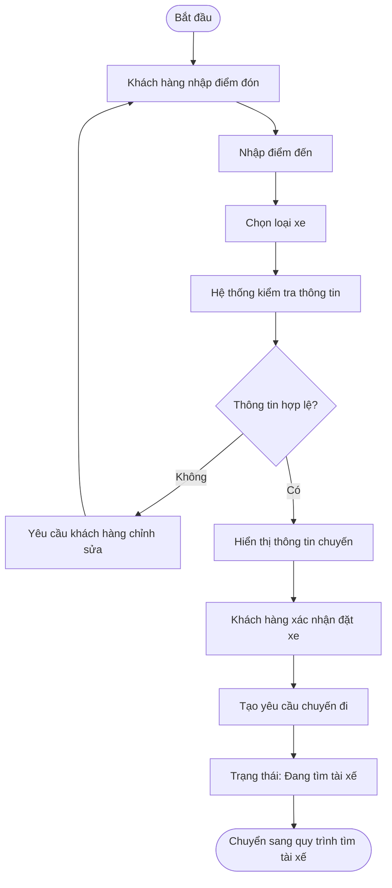

---

### 7.3. BP-03 – Quy trình tìm và phân công tài xế

**Business Requirements liên quan:** `BG02_QuanLyTrangThaiTaiXe`, `BG02_TheoDoiViTriTaiXe`, `BG02_TimTaiXePhuHop`, `BG02_PhanCongTaiXe`, `BG02_TimLaiTaiXe`, `BG02_XuLyKhongCoTaiXe`

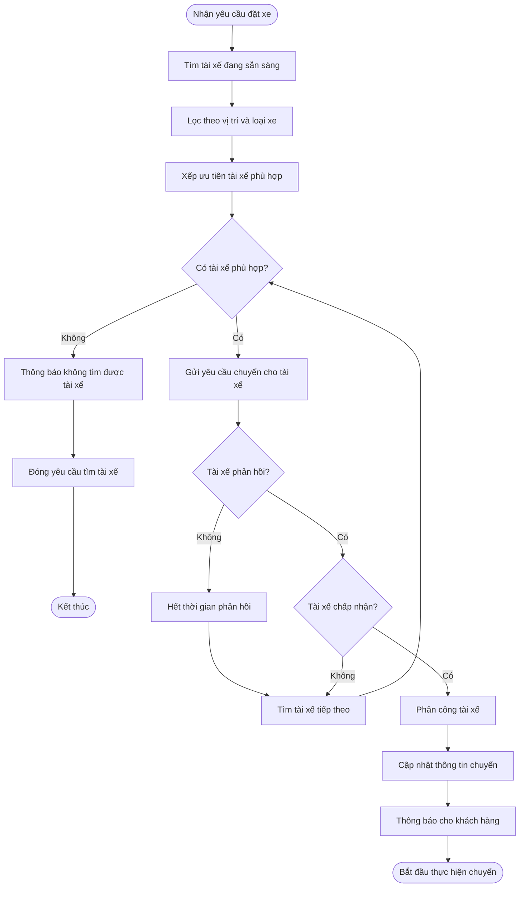

---

### 7.4. BP-04 – Quy trình thực hiện và theo dõi chuyến đi

**Business Requirements liên quan:** `BG01_QuanLyChuyenDi`, `BG03_HienThiThongTinTaiXe`, `BG03_HienThiThoiGianDuKien`, `BG03_TheoDoiTrangThaiChuyenDi`


---

### 7.5. BP-05 – Quy trình tính cước và thanh toán

**Business Requirements liên quan:** `BG04_TinhCuocChuyenDi`, `BG04_ThanhToanTienMat`, `BG04_ThanhToanDienTu`, `BG04_XuLyThanhToanThatBai`, `BG04_LuuLichSuGiaoDich`

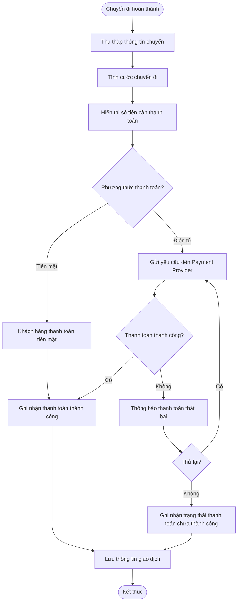

---

### 7.6. BP-06 – Quy trình gửi thông báo

**Business Requirements liên quan:** `BG03_ThongBaoSuKienChuyenDi`

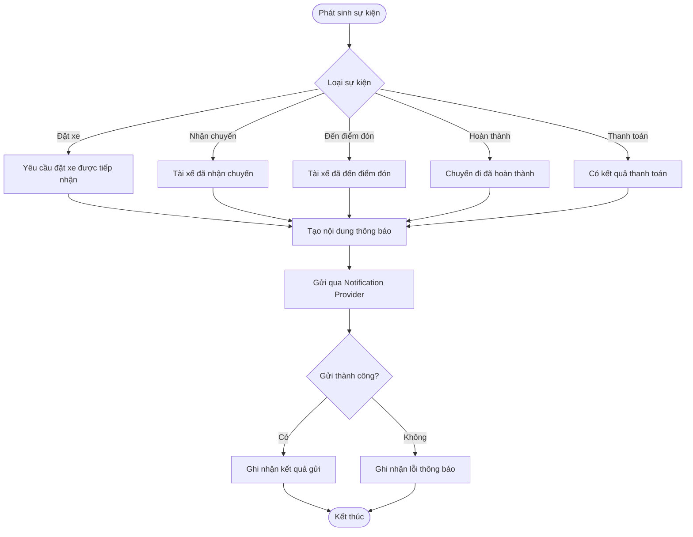

---

### 7.7. BP-07 – Quy trình xem lịch sử và đánh giá tài xế

**Business Requirements liên quan:** `BG01_QuanLyLichSuChuyenDi`, `BG01_DanhGiaTaiXe`

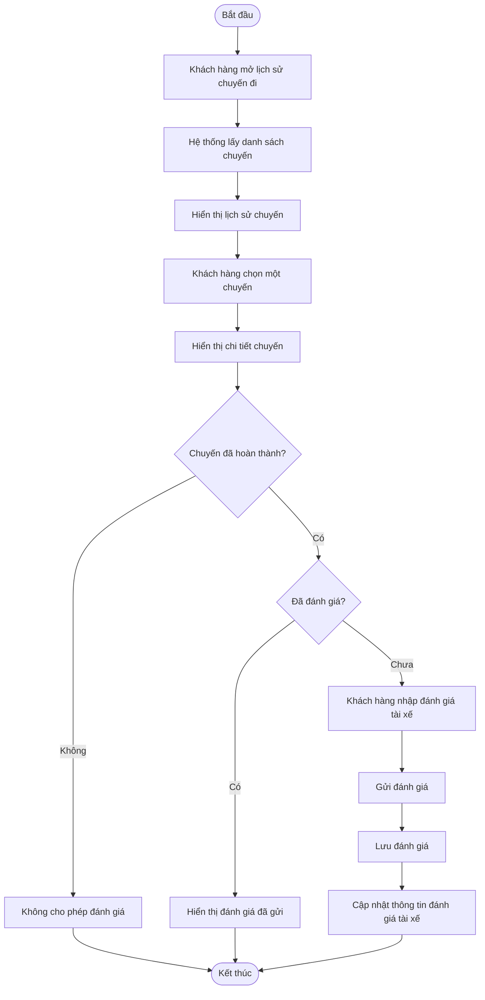

---

### 7.8. BP-08 – Quy trình quản lý và xử lý chuyến đi của nhân viên vận hành

**Business Requirements liên quan:** `BG05_QuanLyKhachHang`, `BG05_QuanLyTaiXe`, `BG05_QuanLyPhuongTien`, `BG05_GiamSatChuyenDi`, `BG05_XuLySuCoChuyenDi`, `BG05_TraCuuGiaoDich`


---

### 7.9. BP-09 – Quy trình báo cáo và giám sát hoạt động

**Business Requirements liên quan:** `BG05_BaoCaoHoatDong`, `BG06_LuuVetHoatDong`


---

### 7.10. Liên kết Business Process với Business Requirements

| Business Process | Nội dung chính                                 | Business Goal |
| ---------------- | ---------------------------------------------- | ------------- |
| **BP-01**        | Đăng ký và quản lý tài khoản khách hàng        | BG-01, BG-06  |
| **BP-02**        | Tạo yêu cầu đặt xe                             | BG-01         |
| **BP-03**        | Tìm và phân công tài xế                        | BG-02         |
| **BP-04**        | Thực hiện và theo dõi chuyến đi                | BG-01, BG-03  |
| **BP-05**        | Tính cước và thanh toán                        | BG-04         |
| **BP-06**        | Gửi thông báo                                  | BG-03         |
| **BP-07**        | Lịch sử chuyến và đánh giá tài xế              | BG-01         |
| **BP-08**        | Quản lý và xử lý chuyến của nhân viên vận hành | BG-05, BG-06  |
| **BP-09**        | Báo cáo và giám sát hoạt động                  | BG-05, BG-06  |

### 7.11. Luồng nghiệp vụ tổng thể

9 quy trình trên kết hợp thành luồng nghiệp vụ chính của CAB System:

**Đăng ký/Đăng nhập → Đặt xe → Tìm tài xế → Thực hiện chuyến → Tính cước & Thanh toán → Đánh giá → Quản lý & Báo cáo**

Trong đó, **Notification** hoạt động xuyên suốt quá trình để thông báo các sự kiện quan trọng cho Customer và Driver.


## 8. Thiết kế chức năng nghiệp vụ (System Requirements)

### 8.1. Mục đích

Dựa trên **9 quy trình nghiệp vụ (Business Process)** đã xác định ở mục 7, các quy trình được phân rã thành các chức năng nghiệp vụ cụ thể mà CAB System cần cung cấp.

Mỗi chức năng được ký hiệu bằng mã **SR (System Requirement)**.

Quy tắc đặt mã:

`SRxx_TenChucNang`

Trong đó:

* `SRxx`: mã chức năng nghiệp vụ.
* `TenChucNang`: tên ngắn gọn của chức năng.
* Mỗi SR phải có khả năng truy vết về Business Process và Business Goal tương ứng.

---

### 8.2. BP-01 – Đăng ký và quản lý tài khoản khách hàng

| Mã SR                          | Chức năng nghiệp vụ        | Mô tả                                                                                        | Actor                                            |
| ------------------------------ | -------------------------- | -------------------------------------------------------------------------------------------- | ------------------------------------------------ |
| **SR01_DangKyTaiKhoan**        | Đăng ký tài khoản          | Hệ thống cho phép khách hàng tạo tài khoản bằng các thông tin cần thiết.                     | Customer                                         |
| **SR02_DangNhap**              | Đăng nhập                  | Hệ thống xác thực thông tin đăng nhập và cho phép người dùng truy cập các chức năng phù hợp. | Customer, Driver, Operation Staff, Administrator |
| **SR03_DangXuat**              | Đăng xuất                  | Hệ thống cho phép người dùng kết thúc phiên làm việc.                                        | Người dùng đã đăng nhập                          |
| **SR04_XemThongTinCaNhan**     | Xem thông tin cá nhân      | Cho phép người dùng xem thông tin hồ sơ của mình.                                            | Customer, Driver                                 |
| **SR05_CapNhatThongTinCaNhan** | Cập nhật thông tin cá nhân | Cho phép người dùng cập nhật các thông tin cá nhân được phép thay đổi.                       | Customer, Driver                                 |

---

### 8.3. BP-02 – Tạo yêu cầu đặt xe

| Mã SR                         | Chức năng nghiệp vụ      | Mô tả                                                              | Actor    |
| ----------------------------- | ------------------------ | ------------------------------------------------------------------ | -------- |
| **SR06_NhapThongTinChuyenDi** | Nhập thông tin chuyến đi | Khách hàng nhập điểm đón và điểm đến cho chuyến đi.                | Customer |
| **SR07_ChonLoaiXe**           | Chọn loại xe             | Cho phép khách hàng lựa chọn loại xe/dịch vụ phù hợp.              | Customer |
| **SR08_XemThongTinDatXe**     | Xem thông tin đặt xe     | Hiển thị các thông tin của chuyến trước khi khách hàng xác nhận.   | Customer |
| **SR09_TaoYeuCauDatXe**       | Tạo yêu cầu đặt xe       | Tạo yêu cầu chuyến sau khi khách hàng xác nhận thông tin.          | Customer |
| **SR10_HuyYeuCauDatXe**       | Hủy yêu cầu đặt xe       | Cho phép khách hàng hủy yêu cầu đặt xe theo chính sách hủy chuyến. | Customer |

---

### 8.4. BP-03 – Tìm và phân công tài xế

| Mã SR                          | Chức năng nghiệp vụ        | Mô tả                                                                                                | Actor  |
| ------------------------------ | -------------------------- | ---------------------------------------------------------------------------------------------------- | ------ |
| **SR11_CapNhatTrangThaiTaiXe** | Cập nhật trạng thái tài xế | Cho phép tài xế chuyển trạng thái sẵn sàng hoặc không sẵn sàng nhận chuyến.                          | Driver |
| **SR12_CapNhatViTriTaiXe**     | Cập nhật vị trí tài xế     | Ghi nhận vị trí hiện tại của tài xế để phục vụ quá trình tìm tài xế.                                 | Driver |
| **SR13_TimTaiXePhuHop**        | Tìm tài xế phù hợp         | Tìm các tài xế phù hợp dựa trên vị trí, trạng thái sẵn sàng, loại xe và tiêu chí vận hành.           | System |
| **SR14_XepHangTaiXe**          | Xếp hạng tài xế            | Xếp thứ tự ưu tiên các tài xế phù hợp để lựa chọn tài xế nhận chuyến.                                | System |
| **SR15_GuiYeuCauNhanChuyen**   | Gửi yêu cầu nhận chuyến    | Gửi thông tin yêu cầu chuyến đến tài xế được lựa chọn.                                               | System |
| **SR16_PhanHoiYeuCauChuyen**   | Chấp nhận/Từ chối chuyến   | Cho phép tài xế chấp nhận hoặc từ chối yêu cầu chuyến.                                               | Driver |
| **SR17_PhanCongTaiXe**         | Phân công tài xế           | Gán tài xế cho chuyến khi tài xế chấp nhận yêu cầu.                                                  | System |
| **SR18_TimLaiTaiXe**           | Tìm lại tài xế             | Tiếp tục lựa chọn tài xế khác khi tài xế trước từ chối hoặc không phản hồi trong thời gian quy định. | System |
| **SR19_ThongBaoKhongCoTaiXe**  | Thông báo không có tài xế  | Thông báo cho khách hàng khi không tìm được tài xế phù hợp.                                          | System |

---

### 8.5. BP-04 – Thực hiện và theo dõi chuyến đi

| Mã SR                         | Chức năng nghiệp vụ           | Mô tả                                                           | Actor                             |
| ----------------------------- | ----------------------------- | --------------------------------------------------------------- | --------------------------------- |
| **SR20_XemThongTinTaiXe**     | Xem thông tin tài xế          | Cho phép khách hàng xem thông tin tài xế đã nhận chuyến.        | Customer                          |
| **SR21_XemThoiGianDuKien**    | Xem thời gian dự kiến đến     | Hiển thị ETA của tài xế đến điểm đón.                           | Customer                          |
| **SR22_XemTrangThaiChuyenDi** | Theo dõi trạng thái chuyến đi | Cho phép khách hàng theo dõi trạng thái hiện tại của chuyến.    | Customer                          |
| **SR23_XacNhanDaDenDiemDon**  | Xác nhận đã đến điểm đón      | Cho phép tài xế xác nhận đã đến vị trí đón khách.               | Driver                            |
| **SR24_XacNhanDaDonKhach**    | Xác nhận đã đón khách         | Cho phép tài xế xác nhận khách hàng đã lên xe.                  | Driver                            |
| **SR25_BatDauChuyenDi**       | Bắt đầu chuyến đi             | Chuyển chuyến sang trạng thái đang thực hiện.                   | Driver                            |
| **SR26_HoanThanhChuyenDi**    | Hoàn thành chuyến đi          | Cho phép tài xế xác nhận chuyến đã hoàn thành tại điểm đến.     | Driver                            |
| **SR27_HuyChuyenDi**          | Hủy chuyến đi                 | Cho phép hủy chuyến theo quyền và chính sách hủy được quy định. | Customer, Driver, Operation Staff |

---

### 8.6. BP-05 – Tính cước và thanh toán

| Mã SR                            | Chức năng nghiệp vụ         | Mô tả                                                                        | Actor                      |
| -------------------------------- | --------------------------- | ---------------------------------------------------------------------------- | -------------------------- |
| **SR28_TinhCuocChuyenDi**        | Tính cước chuyến đi         | Hệ thống tính số tiền phải trả dựa trên loại dịch vụ và thông tin chuyến đi. | System                     |
| **SR29_XemChiTietCuoc**          | Xem chi tiết cước           | Hiển thị số tiền khách hàng cần thanh toán sau chuyến.                       | Customer                   |
| **SR30_ChonPhuongThucThanhToan** | Chọn phương thức thanh toán | Cho phép khách hàng lựa chọn tiền mặt hoặc thanh toán điện tử.               | Customer                   |
| **SR31_ThanhToanTienMat**        | Thanh toán tiền mặt         | Ghi nhận chuyến được thanh toán bằng tiền mặt.                               | Customer, Driver           |
| **SR32_ThanhToanDienTu**         | Thanh toán điện tử          | Gửi yêu cầu thanh toán đến Payment Provider và tiếp nhận kết quả giao dịch.  | Customer, Payment Provider |
| **SR33_XuLyThanhToanThatBai**    | Xử lý thanh toán thất bại   | Thông báo giao dịch thất bại và cho phép thực hiện lại theo chính sách.      | Customer, System           |
| **SR34_LuuThongTinGiaoDich**     | Lưu thông tin giao dịch     | Lưu kết quả và thông tin cần thiết của giao dịch phục vụ tra cứu.            | System                     |

---

### 8.7. BP-06 – Gửi thông báo

| Mã SR                              | Chức năng nghiệp vụ           | Mô tả                                                       | Actor  |
| ---------------------------------- | ----------------------------- | ----------------------------------------------------------- | ------ |
| **SR35_ThongBaoTiepNhanDatXe**     | Thông báo tiếp nhận đặt xe    | Thông báo cho khách hàng khi yêu cầu đặt xe được tiếp nhận. | System |
| **SR36_ThongBaoTaiXeNhanChuyen**   | Thông báo tài xế nhận chuyến  | Thông báo cho khách hàng khi đã có tài xế nhận chuyến.      | System |
| **SR37_ThongBaoTaiXeDenDiemDon**   | Thông báo tài xế đến điểm đón | Thông báo cho khách hàng khi tài xế xác nhận đã đến.        | System |
| **SR38_ThongBaoHoanThanhChuyen**   | Thông báo hoàn thành chuyến   | Gửi thông báo khi chuyến đi hoàn thành.                     | System |
| **SR39_ThongBaoKetQuaThanhToan**   | Thông báo kết quả thanh toán  | Thông báo kết quả thanh toán thành công hoặc thất bại.      | System |
| **SR40_ThongBaoChuyenMoiChoTaiXe** | Thông báo chuyến mới          | Gửi thông báo cho tài xế khi có yêu cầu chuyến phù hợp.     | System |

---

### 8.8. BP-07 – Lịch sử chuyến đi và đánh giá tài xế

| Mã SR                       | Chức năng nghiệp vụ    | Mô tả                                                          | Actor    |
| --------------------------- | ---------------------- | -------------------------------------------------------------- | -------- |
| **SR41_XemLichSuChuyenDi**  | Xem lịch sử chuyến đi  | Cho phép khách hàng xem danh sách các chuyến đã thực hiện.     | Customer |
| **SR42_XemChiTietChuyenDi** | Xem chi tiết chuyến đi | Hiển thị thông tin chi tiết của một chuyến trong lịch sử.      | Customer |
| **SR43_DanhGiaTaiXe**       | Đánh giá tài xế        | Cho phép khách hàng đánh giá tài xế sau khi chuyến hoàn thành. | Customer |
| **SR44_XemDanhGiaChuyenDi** | Xem đánh giá chuyến đi | Cho phép xem lại đánh giá đã gửi cho chuyến đi.                | Customer |

---

### 8.9. BP-08 – Quản lý và vận hành hệ thống

| Mã SR                            | Chức năng nghiệp vụ          | Mô tả                                                                                | Actor           |
| -------------------------------- | ---------------------------- | ------------------------------------------------------------------------------------ | --------------- |
| **SR45_QuanLyKhachHang**         | Quản lý khách hàng           | Cho phép nhân viên có quyền tra cứu và quản lý thông tin khách hàng.                 | Operation Staff |
| **SR46_QuanLyTaiXe**             | Quản lý tài xế               | Cho phép quản lý hồ sơ, trạng thái và thông tin tài xế.                              | Operation Staff |
| **SR47_QuanLyPhuongTien**        | Quản lý phương tiện          | Cho phép quản lý thông tin phương tiện của tài xế.                                   | Operation Staff |
| **SR48_TheoDoiChuyenDangDienRa** | Theo dõi chuyến đang diễn ra | Hiển thị danh sách và trạng thái các chuyến đang hoạt động.                          | Operation Staff |
| **SR49_XemChiTietChuyenVanHanh** | Xem chi tiết chuyến          | Cho phép nhân viên vận hành xem thông tin chi tiết của chuyến.                       | Operation Staff |
| **SR50_XuLySuCoChuyenDi**        | Xử lý sự cố chuyến đi        | Hỗ trợ nhân viên vận hành xử lý các chuyến gặp lỗi hoặc bất thường.                  | Operation Staff |
| **SR51_TraCuuLichSuGiaoDich**    | Tra cứu lịch sử giao dịch    | Cho phép nhân viên có quyền tra cứu các giao dịch đã phát sinh.                      | Operation Staff |
| **SR52_QuanLyTaiKhoanHeThong**   | Quản lý tài khoản hệ thống   | Cho phép quản trị viên quản lý tài khoản người dùng và nhân viên.                    | Administrator   |
| **SR53_QuanLyPhanQuyen**         | Quản lý phân quyền           | Cho phép quản trị viên thiết lập và kiểm soát quyền truy cập các chức năng nhạy cảm. | Administrator   |
| **SR54_XemNhatKyHeThong**        | Xem nhật ký hệ thống         | Cho phép người có quyền tra cứu các thao tác quan trọng đã được ghi nhận.            | Administrator   |

---

### 8.10. BP-09 – Báo cáo và giám sát hoạt động

| Mã SR                         | Chức năng nghiệp vụ       | Mô tả                                                                | Actor                       |
| ----------------------------- | ------------------------- | -------------------------------------------------------------------- | --------------------------- |
| **SR55_ThongKeSoLuongChuyen** | Thống kê số lượng chuyến  | Tổng hợp số lượng chuyến theo khoảng thời gian được lựa chọn.        | Management, Operation Staff |
| **SR56_ThongKeDoanhThu**      | Thống kê doanh thu        | Tổng hợp doanh thu từ các chuyến đã hoàn thành.                      | Management                  |
| **SR57_ThongKeTyLeHoanThanh** | Thống kê tỷ lệ hoàn thành | Tính và hiển thị tỷ lệ các chuyến hoàn thành.                        | Management, Operation Staff |
| **SR58_ThongKeTyLeHuy**       | Thống kê tỷ lệ hủy        | Tính và hiển thị tỷ lệ chuyến bị hủy.                                | Management, Operation Staff |
| **SR59_ThongKeHieuQuaTaiXe**  | Thống kê hiệu quả tài xế  | Tổng hợp dữ liệu hoạt động để hỗ trợ đánh giá hiệu quả của tài xế.   | Management, Operation Staff |
| **SR60_XemBaoCaoTongHop**     | Xem báo cáo tổng hợp      | Cung cấp báo cáo tổng hợp các chỉ số hoạt động chính của CAB System. | Management                  |

---

### 8.11. Tổng hợp phân rã Business Process – System Requirement

| Business Process | Nhóm chức năng               | System Requirements |
| ---------------- | ---------------------------- | ------------------- |
| **BP-01**        | Tài khoản và xác thực        | SR01 – SR05         |
| **BP-02**        | Đặt xe                       | SR06 – SR10         |
| **BP-03**        | Tìm và phân công tài xế      | SR11 – SR19         |
| **BP-04**        | Thực hiện và theo dõi chuyến | SR20 – SR27         |
| **BP-05**        | Tính cước và thanh toán      | SR28 – SR34         |
| **BP-06**        | Thông báo                    | SR35 – SR40         |
| **BP-07**        | Lịch sử và đánh giá          | SR41 – SR44         |
| **BP-08**        | Quản lý và vận hành          | SR45 – SR54         |
| **BP-09**        | Báo cáo và thống kê          | SR55 – SR60         |

---

### 8.12. Cấu trúc phân rã chức năng CAB System

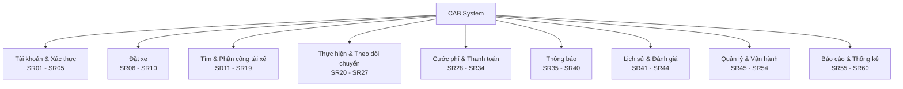

### 8.13. Traceability tổng thể

Các yêu cầu của CAB System được phân rã theo chuỗi:

**Business Goal (BG) → Business Requirement → Business Process (BP) → System Requirement (SR)**

Ví dụ:

`BG-02 Tự động hóa tìm và phân công tài xế`

→ `BG02_TimTaiXePhuHop`

→ `BP-03 Tìm và phân công tài xế`

→ `SR13_TimTaiXePhuHop`

→ `SR14_XepHangTaiXe`

→ `SR15_GuiYeuCauNhanChuyen`

→ `SR16_PhanHoiYeuCauChuyen`

→ `SR17_PhanCongTaiXe`

→ `SR18_TimLaiTaiXe`

Qua cách phân rã này, mỗi chức năng của CAB System đều có thể truy vết ngược về quy trình nghiệp vụ và mục tiêu nghiệp vụ ban đầu.


## 9. Quy định nghiệp vụ và các ngoại lệ

### 9.1. Quy định nghiệp vụ

Các quy định nghiệp vụ của CAB System được xác định như sau:

| Mã        | Quy định nghiệp vụ                                                                                                     |
| --------- | ---------------------------------------------------------------------------------------------------------------------- |
| **BR-01** | Khách hàng và tài xế phải đăng nhập trước khi sử dụng các chức năng yêu cầu tài khoản.                                 |
| **BR-02** | Một khách hàng chỉ được có một chuyến đang hoạt động tại cùng một thời điểm.                                           |
| **BR-03** | Tài xế chỉ được nhận chuyến khi đang ở trạng thái **Available**.                                                       |
| **BR-04** | Tài xế đang thực hiện một chuyến không được nhận thêm chuyến mới.                                                      |
| **BR-05** | Hệ thống chỉ tìm các tài xế phù hợp về trạng thái hoạt động, vị trí và loại phương tiện.                               |
| **BR-06** | Khi tài xế từ chối hoặc không phản hồi trong thời gian quy định, hệ thống phải tiếp tục tìm tài xế khác.               |
| **BR-07** | Khi không còn tài xế phù hợp, hệ thống phải thông báo cho khách hàng rằng không thể tìm được tài xế.                   |
| **BR-08** | Chuyến đi chỉ được bắt đầu sau khi đã có tài xế được phân công.                                                        |
| **BR-09** | Trạng thái chuyến đi phải được cập nhật theo đúng trình tự nghiệp vụ.                                                  |
| **BR-10** | Cước chuyến đi chỉ được tính chính thức khi chuyến đã hoàn thành.                                                      |
| **BR-11** | Khách hàng có thể lựa chọn thanh toán bằng tiền mặt hoặc thanh toán điện tử trong phạm vi hệ thống hỗ trợ.             |
| **BR-12** | CAB System không được lưu trực tiếp các thông tin nhạy cảm như số thẻ hoặc thông tin tài khoản thanh toán.             |
| **BR-13** | Khi thanh toán điện tử thất bại, khách hàng được phép thử lại theo chính sách của doanh nghiệp.                        |
| **BR-14** | Khách hàng chỉ được đánh giá tài xế sau khi chuyến đi hoàn thành.                                                      |
| **BR-15** | Mỗi chuyến đi chỉ được ghi nhận một đánh giá chính thức từ khách hàng.                                                 |
| **BR-16** | Các chức năng quản trị nhạy cảm chỉ được thực hiện bởi người dùng có quyền phù hợp.                                    |
| **BR-17** | Các thao tác quan trọng như cập nhật quyền, xử lý sự cố, điều chỉnh dữ liệu phải được ghi nhận trong nhật ký hệ thống. |
| **BR-18** | Báo cáo chỉ được tạo từ dữ liệu hợp lệ đã được lưu trong hệ thống.                                                     |

---

### 9.2. Quy định trạng thái chuyến đi

Chuyến đi được quản lý theo các trạng thái chính:

```text
CREATED
→ SEARCHING_DRIVER
→ DRIVER_ASSIGNED
→ DRIVER_ARRIVED
→ PASSENGER_PICKED_UP
→ IN_PROGRESS
→ COMPLETED
```

Ngoài ra, chuyến đi có thể chuyển sang:

```text
CANCELLED
```

trong các trường hợp được phép theo chính sách hủy chuyến.

---

### 9.3. Các ngoại lệ nghiệp vụ

| Mã        | Ngoại lệ                                      | Xử lý                                                                                    |
| --------- | --------------------------------------------- | ---------------------------------------------------------------------------------------- |
| **EX-01** | Thông tin đăng nhập không hợp lệ              | Thông báo đăng nhập thất bại và yêu cầu người dùng nhập lại.                             |
| **EX-02** | Thông tin đặt xe thiếu hoặc không hợp lệ      | Không tạo chuyến và yêu cầu khách hàng chỉnh sửa.                                        |
| **EX-03** | Không tìm được tài xế                         | Thông báo cho khách hàng và kết thúc quá trình tìm tài xế.                               |
| **EX-04** | Tài xế không phản hồi                         | Hệ thống tự động chuyển sang tài xế tiếp theo.                                           |
| **EX-05** | Tài xế từ chối chuyến                         | Tiếp tục tìm tài xế khác mà không yêu cầu khách hàng đặt lại chuyến.                     |
| **EX-06** | Khách hàng hủy chuyến                         | Cập nhật trạng thái chuyến thành `CANCELLED` nếu thỏa chính sách hủy.                    |
| **EX-07** | Tài xế hủy chuyến                             | Hệ thống xử lý theo chính sách và có thể tìm tài xế thay thế nếu phù hợp.                |
| **EX-08** | Thanh toán điện tử thất bại                   | Thông báo cho khách hàng và cho phép thử lại hoặc chọn phương thức khác nếu được hỗ trợ. |
| **EX-09** | Payment Provider không phản hồi               | Giao dịch được ghi nhận ở trạng thái chờ hoặc thất bại theo chính sách xử lý.            |
| **EX-10** | Notification Provider gặp lỗi                 | Lỗi thông báo không được phép làm dừng quy trình đặt xe hoặc thực hiện chuyến.           |
| **EX-11** | Mất kết nối khi tài xế đang thực hiện chuyến  | Giữ trạng thái chuyến gần nhất và thực hiện đồng bộ lại khi kết nối được khôi phục.      |
| **EX-12** | Người dùng không có quyền thực hiện chức năng | Từ chối thao tác và ghi nhận nhật ký nếu cần.                                            |

---

## 10. Yêu cầu phi chức năng

### 10.1. Performance

| Mã         | Yêu cầu phi chức năng                                                                                                                               |
| ---------- | --------------------------------------------------------------------------------------------------------------------------------------------------- |
| **NFR-01** | Hệ thống phải phản hồi các thao tác thông thường như đăng nhập, xem hồ sơ và tạo yêu cầu đặt xe trong thời gian phù hợp với trải nghiệm người dùng. |
| **NFR-02** | Quá trình tìm tài xế phải được thực hiện nhanh để hạn chế thời gian chờ của khách hàng.                                                             |
| **NFR-03** | Hệ thống phải có khả năng xử lý nhiều yêu cầu đặt xe đồng thời trong giờ cao điểm.                                                                  |

---

### 10.2. Availability và Reliability

| Mã         | Yêu cầu phi chức năng                                                                                         |
| ---------- | ------------------------------------------------------------------------------------------------------------- |
| **NFR-04** | CAB System phải duy trì hoạt động ổn định trong thời gian nhu cầu tăng cao.                                   |
| **NFR-05** | Lỗi ở Payment Service không được làm toàn bộ hệ thống đặt xe ngừng hoạt động.                                 |
| **NFR-06** | Lỗi ở Notification Service không được làm gián đoạn quy trình đặt xe hoặc thực hiện chuyến.                   |
| **NFR-07** | Dữ liệu quan trọng về chuyến đi và giao dịch phải được lưu giữ nhất quán để hạn chế mất dữ liệu khi có sự cố. |

---

### 10.3. Scalability

| Mã         | Yêu cầu phi chức năng                                                                                        |
| ---------- | ------------------------------------------------------------------------------------------------------------ |
| **NFR-08** | Các thành phần có tải lớn như Booking, Driver Matching và Notification phải có khả năng mở rộng độc lập.     |
| **NFR-09** | Hệ thống phải hỗ trợ tăng số lượng khách hàng, tài xế và chuyến đi mà không phải thay đổi toàn bộ kiến trúc. |

---

### 10.4. Security

| Mã         | Yêu cầu phi chức năng                                                                                                   |
| ---------- | ----------------------------------------------------------------------------------------------------------------------- |
| **NFR-10** | Người dùng phải được xác thực trước khi truy cập các chức năng yêu cầu tài khoản.                                       |
| **NFR-11** | Hệ thống phải áp dụng phân quyền cho các chức năng của Operation Staff và Administrator.                                |
| **NFR-12** | Thông tin cá nhân, dữ liệu vị trí, phương tiện và giao dịch phải được bảo vệ trong quá trình lưu trữ và truyền dữ liệu. |
| **NFR-13** | Không lưu trực tiếp thông tin nhạy cảm của thẻ hoặc tài khoản thanh toán.                                               |
| **NFR-14** | Các thao tác quản trị quan trọng phải được ghi nhận để hỗ trợ kiểm tra và truy vết.                                     |

---

### 10.5. Maintainability và Extensibility

| Mã         | Yêu cầu phi chức năng                                                                                                             |
| ---------- | --------------------------------------------------------------------------------------------------------------------------------- |
| **NFR-15** | Hệ thống phải được thiết kế theo hướng module hóa để có thể sửa đổi từng thành phần mà hạn chế ảnh hưởng đến các thành phần khác. |
| **NFR-16** | Có thể bổ sung Payment Provider mới trong tương lai mà không cần xây dựng lại toàn bộ hệ thống.                                   |
| **NFR-17** | Có thể bổ sung Notification Provider hoặc kênh thông báo mới trong tương lai.                                                     |
| **NFR-18** | Có thể bổ sung loại dịch vụ hoặc loại xe mới mà hạn chế thay đổi các module hiện có.                                              |

---

### 10.6. Usability

| Mã         | Yêu cầu phi chức năng                                                                    |
| ---------- | ---------------------------------------------------------------------------------------- |
| **NFR-19** | Giao diện khách hàng và tài xế phải đơn giản, dễ thao tác trên thiết bị di động.         |
| **NFR-20** | Trạng thái chuyến đi và trạng thái thanh toán phải được hiển thị rõ ràng cho người dùng. |
| **NFR-21** | Các thông báo lỗi phải dễ hiểu và cung cấp hướng xử lý phù hợp.                          |

---

## 11. Xác định thực thể và mô hình ERD

### 11.1. Danh sách thực thể

| Mã      | Thực thể           | Mô tả                                                      |
| ------- | ------------------ | ---------------------------------------------------------- |
| **E01** | **User**           | Lưu thông tin tài khoản chung của người dùng hệ thống.     |
| **E02** | **Customer**       | Lưu thông tin khách hàng.                                  |
| **E03** | **Driver**         | Lưu thông tin tài xế.                                      |
| **E04** | **Vehicle**        | Lưu thông tin phương tiện của tài xế.                      |
| **E05** | **Trip**           | Lưu thông tin chuyến đi.                                   |
| **E06** | **DriverLocation** | Lưu vị trí của tài xế phục vụ việc tìm tài xế và theo dõi. |
| **E07** | **Payment**        | Lưu thông tin giao dịch thanh toán của chuyến đi.          |
| **E08** | **Rating**         | Lưu đánh giá của khách hàng dành cho tài xế.               |
| **E09** | **Notification**   | Lưu thông tin các thông báo được gửi trong hệ thống.       |
| **E10** | **VehicleType**    | Lưu loại xe hoặc loại dịch vụ được hỗ trợ.                 |
| **E11** | **Role**           | Lưu thông tin vai trò dùng cho phân quyền.                 |
| **E12** | **AuditLog**       | Lưu các thao tác quan trọng phục vụ kiểm tra và truy vết.  |

---

### 11.2. Thuộc tính chính của các thực thể

#### User

* `user_id` – PK
* `full_name`
* `phone`
* `email`
* `password_hash`
* `status`
* `role_id`
* `created_at`

#### Customer

* `customer_id` – PK
* `user_id` – FK
* `rating`
* `created_at`

#### Driver

* `driver_id` – PK
* `user_id` – FK
* `driver_status`
* `average_rating`
* `created_at`

#### Vehicle

* `vehicle_id` – PK
* `driver_id` – FK
* `vehicle_type_id` – FK
* `license_plate`
* `brand`
* `model`
* `status`

#### VehicleType

* `vehicle_type_id` – PK
* `type_name`
* `base_fare`
* `price_per_km`
* `status`

#### Trip

* `trip_id` – PK
* `customer_id` – FK
* `driver_id` – FK
* `vehicle_id` – FK
* `pickup_address`
* `destination_address`
* `pickup_latitude`
* `pickup_longitude`
* `destination_latitude`
* `destination_longitude`
* `trip_status`
* `estimated_fare`
* `final_fare`
* `created_at`
* `started_at`
* `completed_at`

#### DriverLocation

* `location_id` – PK
* `driver_id` – FK
* `latitude`
* `longitude`
* `recorded_at`

#### Payment

* `payment_id` – PK
* `trip_id` – FK
* `payment_method`
* `amount`
* `payment_status`
* `provider_reference`
* `created_at`

#### Rating

* `rating_id` – PK
* `trip_id` – FK
* `customer_id` – FK
* `driver_id` – FK
* `score`
* `comment`
* `created_at`

#### Notification

* `notification_id` – PK
* `user_id` – FK
* `trip_id` – FK
* `notification_type`
* `content`
* `status`
* `created_at`

#### Role

* `role_id` – PK
* `role_name`
* `description`

#### AuditLog

* `log_id` – PK
* `user_id` – FK
* `action`
* `entity_type`
* `entity_id`
* `created_at`

---

### 11.3. Quan hệ giữa các thực thể

| Quan hệ                 | Cardinality |
| ----------------------- | ----------- |
| Role – User             | 1 : N       |
| User – Customer         | 1 : 0..1    |
| User – Driver           | 1 : 0..1    |
| Driver – Vehicle        | 1 : N       |
| VehicleType – Vehicle   | 1 : N       |
| Customer – Trip         | 1 : N       |
| Driver – Trip           | 1 : N       |
| Vehicle – Trip          | 1 : N       |
| Driver – DriverLocation | 1 : N       |
| Trip – Payment          | 1 : N       |
| Trip – Rating           | 1 : 0..1    |
| Customer – Rating       | 1 : N       |
| Driver – Rating         | 1 : N       |
| User – Notification     | 1 : N       |
| Trip – Notification     | 1 : N       |
| User – AuditLog         | 1 : N       |

---

### 11.4. Mô hình ERD

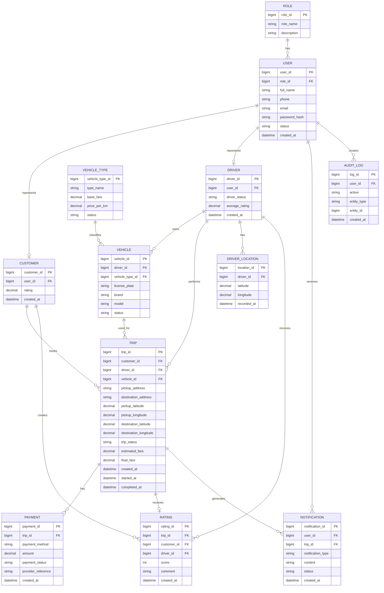

---

## 12. Thiết kế Use Case

### 12.1. Các Actor chính

| Actor                     | Vai trò                                                                          |
| ------------------------- | -------------------------------------------------------------------------------- |
| **Customer**              | Đặt xe, theo dõi chuyến, thanh toán, xem lịch sử và đánh giá tài xế.             |
| **Driver**                | Quản lý trạng thái, nhận chuyến, cập nhật trạng thái chuyến và thực hiện chuyến. |
| **Operation Staff**       | Quản lý và giám sát khách hàng, tài xế, phương tiện, chuyến và giao dịch.        |
| **Administrator**         | Quản lý tài khoản, phân quyền và nhật ký hệ thống.                               |
| **Management**            | Xem báo cáo và thống kê hoạt động.                                               |
| **Payment Provider**      | Xử lý thanh toán điện tử.                                                        |
| **Notification Provider** | Gửi thông báo cho người dùng.                                                    |

---

### 12.2. Danh sách Use Case chính

| Mã UC    | Use Case                      | Actor chính                                      |
| -------- | ----------------------------- | ------------------------------------------------ |
| **UC01** | Đăng ký tài khoản             | Customer                                         |
| **UC02** | Đăng nhập                     | Customer, Driver, Operation Staff, Administrator |
| **UC03** | Quản lý thông tin cá nhân     | Customer, Driver                                 |
| **UC04** | Tạo yêu cầu đặt xe            | Customer                                         |
| **UC05** | Hủy chuyến                    | Customer, Driver                                 |
| **UC06** | Cập nhật trạng thái hoạt động | Driver                                           |
| **UC07** | Cập nhật vị trí tài xế        | Driver                                           |
| **UC08** | Tìm và phân công tài xế       | System                                           |
| **UC09** | Chấp nhận/Từ chối chuyến      | Driver                                           |
| **UC10** | Theo dõi chuyến đi            | Customer                                         |
| **UC11** | Cập nhật trạng thái chuyến    | Driver                                           |
| **UC12** | Hoàn thành chuyến             | Driver                                           |
| **UC13** | Tính cước chuyến đi           | System                                           |
| **UC14** | Thanh toán chuyến đi          | Customer                                         |
| **UC15** | Xem lịch sử chuyến đi         | Customer                                         |
| **UC16** | Đánh giá tài xế               | Customer                                         |
| **UC17** | Quản lý khách hàng            | Operation Staff                                  |
| **UC18** | Quản lý tài xế                | Operation Staff                                  |
| **UC19** | Quản lý phương tiện           | Operation Staff                                  |
| **UC20** | Theo dõi chuyến đang diễn ra  | Operation Staff                                  |
| **UC21** | Xử lý sự cố chuyến đi         | Operation Staff                                  |
| **UC22** | Tra cứu giao dịch             | Operation Staff                                  |
| **UC23** | Quản lý tài khoản hệ thống    | Administrator                                    |
| **UC24** | Quản lý phân quyền            | Administrator                                    |
| **UC25** | Xem nhật ký hệ thống          | Administrator                                    |
| **UC26** | Xem báo cáo hoạt động         | Management                                       |
| **UC27** | Gửi thông báo                 | Notification Provider                            |
| **UC28** | Xử lý thanh toán điện tử      | Payment Provider                                 |

---

### 12.3. Sơ đồ Use Case tổng thể

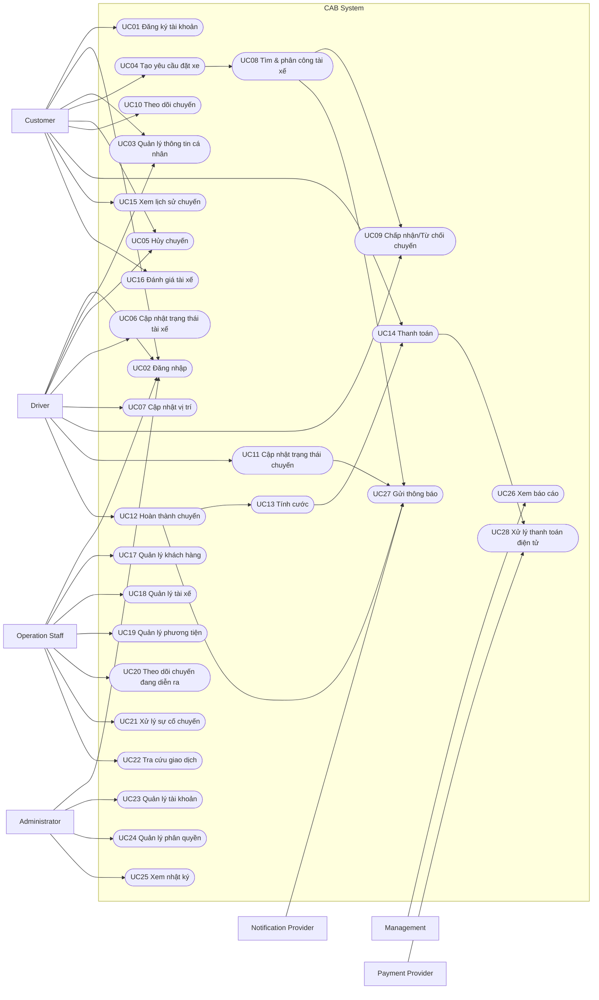

---

### 12.4. Traceability SR – Use Case

| Nhóm SR     | Use Case tương ứng |
| ----------- | ------------------ |
| SR01 – SR05 | UC01 – UC03        |
| SR06 – SR10 | UC04 – UC05        |
| SR11 – SR19 | UC06 – UC09        |
| SR20 – SR27 | UC10 – UC12        |
| SR28 – SR34 | UC13 – UC14        |
| SR35 – SR40 | UC27               |
| SR41 – SR44 | UC15 – UC16        |
| SR45 – SR54 | UC17 – UC25        |
| SR55 – SR60 | UC26               |

---

### 12.5. Chuỗi truy vết yêu cầu

```text
Business Goal
      ↓
Business Requirement
      ↓
Business Process
      ↓
System Requirement (SR)
      ↓
Business Rule / Exception
      ↓
Use Case
      ↓
Entity / Database
```

Cấu trúc này đảm bảo các chức năng trong CAB System đều có thể truy vết ngược về mục tiêu nghiệp vụ ban đầu và thuận tiện cho các bước đặc tả Use Case, thiết kế hệ thống và kiểm thử sau này.


## 13. Acceptance Criteria

### 13.1. Mục đích

Acceptance Criteria (AC) xác định các điều kiện cần được đáp ứng để một chức năng của CAB System được xem là hoàn thành và đáp ứng đúng yêu cầu nghiệp vụ.

Mỗi Acceptance Criteria được liên kết với **System Requirement (SR)** và **Use Case (UC)** tương ứng.

Quy tắc đặt mã:

`ACxx_TenTieuChi`

Trong đó:

* `ACxx`: mã Acceptance Criteria.
* `TenTieuChi`: tên ngắn gọn của tiêu chí chấp nhận.
* Mỗi AC phải có điều kiện kiểm chứng rõ ràng.

---

### 13.2. Acceptance Criteria – Tài khoản và xác thực

| Mã AC                      | SR / UC liên quan | Acceptance Criteria                                                                                                                          |
| -------------------------- | ----------------- | -------------------------------------------------------------------------------------------------------------------------------------------- |
| **AC01_DangKyThanhCong**   | SR01 / UC01       | Khi khách hàng nhập đầy đủ thông tin hợp lệ và xác nhận đăng ký, hệ thống phải tạo tài khoản thành công và thông báo kết quả cho khách hàng. |
| **AC02_DangKyKhongHopLe**  | SR01 / UC01       | Khi thông tin đăng ký thiếu hoặc không hợp lệ, hệ thống không được tạo tài khoản và phải hiển thị thông báo lỗi phù hợp.                     |
| **AC03_DangNhapThanhCong** | SR02 / UC02       | Khi người dùng nhập đúng thông tin xác thực, hệ thống phải cho phép đăng nhập và cung cấp các chức năng phù hợp với vai trò.                 |
| **AC04_DangNhapThatBai**   | SR02 / UC02       | Khi thông tin xác thực không đúng, hệ thống phải từ chối đăng nhập và hiển thị thông báo phù hợp.                                            |
| **AC05_CapNhatHoSo**       | SR04-SR05 / UC03  | Người dùng đã đăng nhập phải có thể xem và cập nhật các thông tin cá nhân được phép thay đổi.                                                |

---

### 13.3. Acceptance Criteria – Đặt xe

| Mã AC                       | SR / UC liên quan | Acceptance Criteria                                                                                                        |
| --------------------------- | ----------------- | -------------------------------------------------------------------------------------------------------------------------- |
| **AC06_NhapThongTinChuyen** | SR06 / UC04       | Khách hàng phải nhập được điểm đón và điểm đến trước khi tạo yêu cầu đặt xe.                                               |
| **AC07_ChonLoaiXe**         | SR07 / UC04       | Hệ thống phải hiển thị các loại xe đang được hỗ trợ và cho phép khách hàng chọn một loại xe phù hợp.                       |
| **AC08_TaoYeuCauDatXe**     | SR08-SR09 / UC04  | Khi thông tin chuyến hợp lệ và khách hàng xác nhận, hệ thống phải tạo chuyến và chuyển trạng thái sang `SEARCHING_DRIVER`. |
| **AC09_HuyDatXe**           | SR10 / UC05       | Khách hàng phải có thể hủy chuyến nếu chuyến vẫn nằm trong trạng thái được phép hủy theo chính sách.                       |

---

### 13.4. Acceptance Criteria – Tìm và phân công tài xế

| Mã AC                          | SR / UC liên quan | Acceptance Criteria                                                                                                        |
| ------------------------------ | ----------------- | -------------------------------------------------------------------------------------------------------------------------- |
| **AC10_CapNhatTrangThaiTaiXe** | SR11 / UC06       | Tài xế phải có thể chuyển giữa trạng thái sẵn sàng và không sẵn sàng nhận chuyến.                                          |
| **AC11_CapNhatViTriTaiXe**     | SR12 / UC07       | Khi tài xế đang hoạt động, hệ thống phải ghi nhận được vị trí tài xế phục vụ quá trình tìm chuyến.                         |
| **AC12_TimTaiXePhuHop**        | SR13-SR14 / UC08  | Khi có yêu cầu đặt xe, hệ thống chỉ lựa chọn tài xế đang sẵn sàng, có phương tiện phù hợp và nằm trong phạm vi tìm kiếm.   |
| **AC13_GuiYeuCauChoTaiXe**     | SR15 / UC08       | Hệ thống phải gửi yêu cầu chuyến đến tài xế được ưu tiên và cung cấp thông tin cần thiết để tài xế quyết định nhận chuyến. |
| **AC14_TaiXeNhanChuyen**       | SR16-SR17 / UC09  | Khi tài xế chấp nhận chuyến, hệ thống phải gán tài xế cho chuyến và chuyển trạng thái chuyến sang `DRIVER_ASSIGNED`.       |
| **AC15_TaiXeTuChoi**           | SR16-SR18 / UC09  | Khi tài xế từ chối, hệ thống phải tự động tìm tài xế tiếp theo mà không yêu cầu khách hàng tạo lại chuyến.                 |
| **AC16_TaiXeKhongPhanHoi**     | SR18 / UC08       | Nếu tài xế không phản hồi trong thời gian quy định, hệ thống phải chuyển sang tìm tài xế tiếp theo.                        |
| **AC17_KhongTimDuocTaiXe**     | SR19 / UC08       | Khi không còn tài xế phù hợp, hệ thống phải dừng quá trình tìm kiếm và thông báo rõ cho khách hàng.                        |

---

### 13.5. Acceptance Criteria – Thực hiện và theo dõi chuyến

| Mã AC                           | SR / UC liên quan | Acceptance Criteria                                                                                                    |
| ------------------------------- | ----------------- | ---------------------------------------------------------------------------------------------------------------------- |
| **AC18_HienThiThongTinTaiXe**   | SR20 / UC10       | Sau khi tài xế nhận chuyến, khách hàng phải xem được thông tin tài xế và phương tiện được phân công.                   |
| **AC19_HienThiETA**             | SR21 / UC10       | Hệ thống phải hiển thị thời gian dự kiến tài xế đến điểm đón khi có đủ dữ liệu vị trí.                                 |
| **AC20_TheoDoiTrangThaiChuyen** | SR22 / UC10       | Khách hàng phải xem được trạng thái hiện tại của chuyến trong quá trình thực hiện.                                     |
| **AC21_TaiXeDenDiemDon**        | SR23 / UC11       | Khi tài xế xác nhận đã đến điểm đón, chuyến phải được cập nhật sang trạng thái `DRIVER_ARRIVED`.                       |
| **AC22_DonKhach**               | SR24 / UC11       | Khi tài xế xác nhận đã đón khách, hệ thống phải chuyển chuyến sang trạng thái `PASSENGER_PICKED_UP`.                   |
| **AC23_BatDauChuyen**           | SR25 / UC11       | Chuyến chỉ được chuyển sang `IN_PROGRESS` sau khi khách hàng đã được xác nhận đón.                                     |
| **AC24_HoanThanhChuyen**        | SR26 / UC12       | Khi tài xế xác nhận đến điểm đến, hệ thống phải chuyển chuyến sang `COMPLETED` và bắt đầu quá trình tính cước.         |
| **AC25_HuyChuyen**              | SR27 / UC05       | Khi chuyến bị hủy hợp lệ, trạng thái chuyến phải được chuyển sang `CANCELLED` và các bên liên quan phải được cập nhật. |

---

### 13.6. Acceptance Criteria – Tính cước và thanh toán

| Mã AC                             | SR / UC liên quan | Acceptance Criteria                                                                                                                    |
| --------------------------------- | ----------------- | -------------------------------------------------------------------------------------------------------------------------------------- |
| **AC26_TinhCuoc**                 | SR28 / UC13       | Sau khi chuyến hoàn thành, hệ thống phải xác định số tiền phải trả dựa trên loại dịch vụ và thông tin chuyến đi.                       |
| **AC27_HienThiCuoc**              | SR29 / UC13       | Khách hàng phải xem được số tiền cần thanh toán sau khi hệ thống hoàn tất tính cước.                                                   |
| **AC28_ChonThanhToan**            | SR30 / UC14       | Khách hàng phải có thể lựa chọn phương thức thanh toán được hệ thống hỗ trợ.                                                           |
| **AC29_ThanhToanTienMat**         | SR31 / UC14       | Khi chọn tiền mặt, hệ thống phải ghi nhận phương thức thanh toán của chuyến là tiền mặt.                                               |
| **AC30_ThanhToanDienTuThanhCong** | SR32 / UC14, UC28 | Khi Payment Provider xác nhận giao dịch thành công, hệ thống phải ghi nhận thanh toán thành công và lưu thông tin giao dịch cần thiết. |
| **AC31_ThanhToanDienTuThatBai**   | SR33 / UC14, UC28 | Khi Payment Provider trả kết quả thất bại, hệ thống phải thông báo cho khách hàng và cho phép xử lý lại theo chính sách.               |
| **AC32_BaoVeThongTinThanhToan**   | SR32-SR34 / UC14  | CAB System không được lưu trực tiếp số thẻ hoặc thông tin thanh toán nhạy cảm của khách hàng.                                          |

---

### 13.7. Acceptance Criteria – Thông báo

| Mã AC                               | SR / UC liên quan | Acceptance Criteria                                                                                               |
| ----------------------------------- | ----------------- | ----------------------------------------------------------------------------------------------------------------- |
| **AC33_ThongBaoTiepNhanDatXe**      | SR35 / UC27       | Khách hàng phải nhận được thông báo khi yêu cầu đặt xe được hệ thống tiếp nhận.                                   |
| **AC34_ThongBaoTaiXeNhanChuyen**    | SR36 / UC27       | Khách hàng phải nhận được thông báo khi có tài xế chấp nhận chuyến.                                               |
| **AC35_ThongBaoTaiXeDen**           | SR37 / UC27       | Khách hàng phải nhận được thông báo khi tài xế xác nhận đã đến điểm đón.                                          |
| **AC36_ThongBaoHoanThanh**          | SR38 / UC27       | Hệ thống phải gửi thông báo khi chuyến được hoàn thành.                                                           |
| **AC37_ThongBaoThanhToan**          | SR39 / UC27       | Khách hàng phải được thông báo kết quả thanh toán điện tử.                                                        |
| **AC38_LoiThongBaoKhongDungChuyen** | SR35-SR40 / UC27  | Khi Notification Provider gặp lỗi, lỗi thông báo không được làm gián đoạn quy trình đặt xe hoặc thực hiện chuyến. |

---

### 13.8. Acceptance Criteria – Lịch sử và đánh giá

| Mã AC                        | SR / UC liên quan | Acceptance Criteria                                                                             |
| ---------------------------- | ----------------- | ----------------------------------------------------------------------------------------------- |
| **AC39_XemLichSuChuyen**     | SR41 / UC15       | Khách hàng đã đăng nhập phải xem được danh sách các chuyến đi của chính mình.                   |
| **AC40_XemChiTietChuyen**    | SR42 / UC15       | Khi chọn một chuyến trong lịch sử, hệ thống phải hiển thị các thông tin chi tiết của chuyến đó. |
| **AC41_DanhGiaTaiXe**        | SR43 / UC16       | Khách hàng chỉ được đánh giá tài xế sau khi chuyến đã hoàn thành.                               |
| **AC42_MotDanhGiaMoiChuyen** | SR43-SR44 / UC16  | Mỗi chuyến chỉ được ghi nhận một đánh giá chính thức từ khách hàng.                             |

---

### 13.9. Acceptance Criteria – Quản lý và vận hành

| Mã AC                            | SR / UC liên quan     | Acceptance Criteria                                                                                       |
| -------------------------------- | --------------------- | --------------------------------------------------------------------------------------------------------- |
| **AC43_QuanLyKhachHang**         | SR45 / UC17           | Operation Staff có quyền phù hợp phải tra cứu được thông tin khách hàng cần thiết cho hoạt động vận hành. |
| **AC44_QuanLyTaiXe**             | SR46 / UC18           | Operation Staff phải tra cứu và quản lý được hồ sơ, trạng thái tài xế theo quyền được cấp.                |
| **AC45_QuanLyPhuongTien**        | SR47 / UC19           | Operation Staff phải xem và quản lý được phương tiện gắn với tài xế.                                      |
| **AC46_TheoDoiChuyenDangDienRa** | SR48-SR49 / UC20      | Operation Staff phải xem được danh sách và trạng thái của các chuyến đang diễn ra.                        |
| **AC47_XuLySuCo**                | SR50 / UC21           | Operation Staff có quyền phải có thể ghi nhận và xử lý các trường hợp chuyến gặp lỗi hoặc bất thường.     |
| **AC48_TraCuuGiaoDich**          | SR51 / UC22           | Người có quyền phải tra cứu được lịch sử giao dịch theo thông tin tìm kiếm phù hợp.                       |
| **AC49_PhanQuyenQuanTri**        | SR52-SR53 / UC23-UC24 | Các chức năng nhạy cảm chỉ được thực hiện bởi tài khoản có quyền phù hợp.                                 |
| **AC50_LuuVetThaoTac**           | SR54 / UC25           | Các thao tác quản trị quan trọng phải được lưu lại để có thể truy vết khi cần thiết.                      |

---

### 13.10. Acceptance Criteria – Báo cáo

| Mã AC                     | SR / UC liên quan | Acceptance Criteria                                                                                     |
| ------------------------- | ----------------- | ------------------------------------------------------------------------------------------------------- |
| **AC51_ThongKeSoChuyen**  | SR55 / UC26       | Hệ thống phải tổng hợp được số chuyến theo khoảng thời gian được lựa chọn.                              |
| **AC52_ThongKeDoanhThu**  | SR56 / UC26       | Hệ thống phải tổng hợp được doanh thu từ các chuyến hợp lệ đã hoàn thành.                               |
| **AC53_ThongKeHoanThanh** | SR57 / UC26       | Hệ thống phải tính được tỷ lệ chuyến hoàn thành trên dữ liệu trong khoảng thời gian báo cáo.            |
| **AC54_ThongKeHuy**       | SR58 / UC26       | Hệ thống phải tính được tỷ lệ chuyến bị hủy.                                                            |
| **AC55_HieuQuaTaiXe**     | SR59 / UC26       | Báo cáo phải cung cấp dữ liệu cần thiết để đánh giá hiệu quả hoạt động của tài xế.                      |
| **AC56_BaoCaoTongHop**    | SR60 / UC26       | Management phải xem được báo cáo tổng hợp các chỉ số hoạt động chính trong phạm vi thời gian được chọn. |

---

### 13.11. Acceptance Criteria cho yêu cầu phi chức năng quan trọng

| Mã AC                              | NFR liên quan  | Acceptance Criteria                                                                                                                           |
| ---------------------------------- | -------------- | --------------------------------------------------------------------------------------------------------------------------------------------- |
| **AC57_BaoMatTruyCap**             | NFR-10, NFR-11 | Người dùng chưa xác thực hoặc không đủ quyền không được truy cập chức năng được bảo vệ.                                                       |
| **AC58_BaoVeDuLieu**               | NFR-12, NFR-13 | Dữ liệu cá nhân, vị trí và giao dịch phải được bảo vệ; dữ liệu thanh toán nhạy cảm không được lưu trực tiếp trong CAB System.                 |
| **AC59_DocLapPaymentService**      | NFR-05         | Khi Payment Service gặp lỗi, các chức năng đặt xe và theo dõi chuyến vẫn phải tiếp tục hoạt động.                                             |
| **AC60_DocLapNotificationService** | NFR-06         | Khi Notification Service gặp lỗi, trạng thái và quy trình chuyến đi vẫn phải được xử lý bình thường.                                          |
| **AC61_KhaNangMoRong**             | NFR-08, NFR-09 | Việc tăng tải ở một module chính phải có thể được xử lý mà không bắt buộc mở rộng toàn bộ hệ thống cùng lúc.                                  |
| **AC62_KhaNangMoRongTichHop**      | NFR-15-NFR-18  | Kiến trúc phải cho phép bổ sung Payment Provider, Notification Provider hoặc loại dịch vụ mới mà hạn chế thay đổi các module không liên quan. |

---

### 13.12. Ma trận tổng hợp Acceptance Criteria

| Nhóm chức năng                  | SR            | Use Case        | Acceptance Criteria |
| ------------------------------- | ------------- | --------------- | ------------------- |
| **Tài khoản & Xác thực**        | SR01-SR05     | UC01-UC03       | AC01-AC05           |
| **Đặt xe**                      | SR06-SR10     | UC04-UC05       | AC06-AC09           |
| **Tìm & Phân công tài xế**      | SR11-SR19     | UC06-UC09       | AC10-AC17           |
| **Thực hiện & Theo dõi chuyến** | SR20-SR27     | UC10-UC12       | AC18-AC25           |
| **Cước phí & Thanh toán**       | SR28-SR34     | UC13-UC14, UC28 | AC26-AC32           |
| **Thông báo**                   | SR35-SR40     | UC27            | AC33-AC38           |
| **Lịch sử & Đánh giá**          | SR41-SR44     | UC15-UC16       | AC39-AC42           |
| **Quản lý & Vận hành**          | SR45-SR54     | UC17-UC25       | AC43-AC50           |
| **Báo cáo & Thống kê**          | SR55-SR60     | UC26            | AC51-AC56           |
| **Phi chức năng**               | NFR-05-NFR-18 | Toàn hệ thống   | AC57-AC62           |

---

### 13.13. Traceability tổng thể

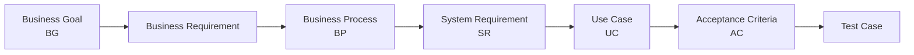

Acceptance Criteria là cơ sở để nhóm phát triển xác định một chức năng đã hoàn thành hay chưa và là đầu vào trực tiếp cho quá trình xây dựng **Test Case** ở giai đoạn kiểm thử.


## 14. Requirements Traceability Matrix – RTM

### 14.1. Mục đích

Bảng truy vết yêu cầu (Requirements Traceability Matrix - RTM) được sử dụng để theo dõi mối quan hệ giữa mục tiêu nghiệp vụ, yêu cầu nghiệp vụ, quy trình nghiệp vụ, chức năng hệ thống, Use Case và Acceptance Criteria.

Bảng này giúp đảm bảo rằng:

* Mỗi Business Goal đều được triển khai thành các yêu cầu cụ thể.
* Mỗi Business Requirement đều được thể hiện trong ít nhất một Business Process.
* Mỗi Business Process đều được phân rã thành các System Requirement.
* Mỗi System Requirement đều được ánh xạ tới Use Case và Acceptance Criteria tương ứng.
* Không có chức năng nào được phát triển mà không có nguồn gốc từ yêu cầu nghiệp vụ.

---

### 14.2. Requirements Traceability Matrix

| Business Goal | Business Requirement          | Business Process | System Requirement             | Use Case      | Acceptance Criteria |
| ------------- | ----------------------------- | ---------------- | ------------------------------ | ------------- | ------------------- |
| **BG-01**     | BG01_QuanLyTaiKhoanKhachHang  | BP-01            | SR01_DangKyTaiKhoan            | UC01          | AC01, AC02          |
| **BG-01**     | BG01_QuanLyTaiKhoanKhachHang  | BP-01            | SR02_DangNhap                  | UC02          | AC03, AC04          |
| **BG-01**     | BG01_QuanLyTaiKhoanKhachHang  | BP-01            | SR04_XemThongTinCaNhan         | UC03          | AC05                |
| **BG-01**     | BG01_QuanLyTaiKhoanKhachHang  | BP-01            | SR05_CapNhatThongTinCaNhan     | UC03          | AC05                |
| **BG-01**     | BG01_TaoYeuCauDatXe           | BP-02            | SR06_NhapThongTinChuyenDi      | UC04          | AC06                |
| **BG-01**     | BG01_TaoYeuCauDatXe           | BP-02            | SR07_ChonLoaiXe                | UC04          | AC07                |
| **BG-01**     | BG01_TaoYeuCauDatXe           | BP-02            | SR08_XemThongTinDatXe          | UC04          | AC08                |
| **BG-01**     | BG01_TaoYeuCauDatXe           | BP-02            | SR09_TaoYeuCauDatXe            | UC04          | AC08                |
| **BG-01**     | BG01_QuanLyChuyenDi           | BP-02/BP-04      | SR10_HuyYeuCauDatXe            | UC05          | AC09                |
| **BG-01**     | BG01_QuanLyChuyenDi           | BP-04            | SR22_XemTrangThaiChuyenDi      | UC10          | AC20                |
| **BG-01**     | BG01_QuanLyChuyenDi           | BP-04            | SR23_XacNhanDaDenDiemDon       | UC11          | AC21                |
| **BG-01**     | BG01_QuanLyChuyenDi           | BP-04            | SR24_XacNhanDaDonKhach         | UC11          | AC22                |
| **BG-01**     | BG01_QuanLyChuyenDi           | BP-04            | SR25_BatDauChuyenDi            | UC11          | AC23                |
| **BG-01**     | BG01_QuanLyChuyenDi           | BP-04            | SR26_HoanThanhChuyenDi         | UC12          | AC24                |
| **BG-01**     | BG01_QuanLyChuyenDi           | BP-04            | SR27_HuyChuyenDi               | UC05          | AC25                |
| **BG-01**     | BG01_QuanLyLichSuChuyenDi     | BP-07            | SR41_XemLichSuChuyenDi         | UC15          | AC39                |
| **BG-01**     | BG01_QuanLyLichSuChuyenDi     | BP-07            | SR42_XemChiTietChuyenDi        | UC15          | AC40                |
| **BG-01**     | BG01_DanhGiaTaiXe             | BP-07            | SR43_DanhGiaTaiXe              | UC16          | AC41, AC42          |
| **BG-01**     | BG01_DanhGiaTaiXe             | BP-07            | SR44_XemDanhGiaChuyenDi        | UC16          | AC42                |
| **BG-02**     | BG02_QuanLyTrangThaiTaiXe     | BP-03            | SR11_CapNhatTrangThaiTaiXe     | UC06          | AC10                |
| **BG-02**     | BG02_TheoDoiViTriTaiXe        | BP-03            | SR12_CapNhatViTriTaiXe         | UC07          | AC11                |
| **BG-02**     | BG02_TimTaiXePhuHop           | BP-03            | SR13_TimTaiXePhuHop            | UC08          | AC12                |
| **BG-02**     | BG02_TimTaiXePhuHop           | BP-03            | SR14_XepHangTaiXe              | UC08          | AC12                |
| **BG-02**     | BG02_PhanCongTaiXe            | BP-03            | SR15_GuiYeuCauNhanChuyen       | UC08          | AC13                |
| **BG-02**     | BG02_PhanCongTaiXe            | BP-03            | SR16_PhanHoiYeuCauChuyen       | UC09          | AC14, AC15          |
| **BG-02**     | BG02_PhanCongTaiXe            | BP-03            | SR17_PhanCongTaiXe             | UC08/UC09     | AC14                |
| **BG-02**     | BG02_TimLaiTaiXe              | BP-03            | SR18_TimLaiTaiXe               | UC08          | AC15, AC16          |
| **BG-02**     | BG02_XuLyKhongCoTaiXe         | BP-03            | SR19_ThongBaoKhongCoTaiXe      | UC08          | AC17                |
| **BG-03**     | BG03_HienThiThongTinTaiXe     | BP-04            | SR20_XemThongTinTaiXe          | UC10          | AC18                |
| **BG-03**     | BG03_HienThiThoiGianDuKien    | BP-04            | SR21_XemThoiGianDuKien         | UC10          | AC19                |
| **BG-03**     | BG03_TheoDoiTrangThaiChuyenDi | BP-04            | SR22_XemTrangThaiChuyenDi      | UC10          | AC20                |
| **BG-03**     | BG03_ThongBaoSuKienChuyenDi   | BP-06            | SR35_ThongBaoTiepNhanDatXe     | UC27          | AC33                |
| **BG-03**     | BG03_ThongBaoSuKienChuyenDi   | BP-06            | SR36_ThongBaoTaiXeNhanChuyen   | UC27          | AC34                |
| **BG-03**     | BG03_ThongBaoSuKienChuyenDi   | BP-06            | SR37_ThongBaoTaiXeDenDiemDon   | UC27          | AC35                |
| **BG-03**     | BG03_ThongBaoSuKienChuyenDi   | BP-06            | SR38_ThongBaoHoanThanhChuyen   | UC27          | AC36                |
| **BG-03**     | BG03_ThongBaoSuKienChuyenDi   | BP-06            | SR39_ThongBaoKetQuaThanhToan   | UC27          | AC37                |
| **BG-03**     | BG03_ThongBaoSuKienChuyenDi   | BP-06            | SR40_ThongBaoChuyenMoiChoTaiXe | UC27          | AC38                |
| **BG-04**     | BG04_TinhCuocChuyenDi         | BP-05            | SR28_TinhCuocChuyenDi          | UC13          | AC26                |
| **BG-04**     | BG04_TinhCuocChuyenDi         | BP-05            | SR29_XemChiTietCuoc            | UC13          | AC27                |
| **BG-04**     | BG04_ThanhToanTienMat         | BP-05            | SR30_ChonPhuongThucThanhToan   | UC14          | AC28                |
| **BG-04**     | BG04_ThanhToanTienMat         | BP-05            | SR31_ThanhToanTienMat          | UC14          | AC29                |
| **BG-04**     | BG04_ThanhToanDienTu          | BP-05            | SR32_ThanhToanDienTu           | UC14, UC28    | AC30                |
| **BG-04**     | BG04_XuLyThanhToanThatBai     | BP-05            | SR33_XuLyThanhToanThatBai      | UC14, UC28    | AC31                |
| **BG-04**     | BG04_LuuLichSuGiaoDich        | BP-05            | SR34_LuuThongTinGiaoDich       | UC14          | AC30, AC31          |
| **BG-04**     | BG04_BaoVeThongTinThanhToan   | BP-05            | SR32-SR34                      | UC14          | AC32                |
| **BG-05**     | BG05_QuanLyKhachHang          | BP-08            | SR45_QuanLyKhachHang           | UC17          | AC43                |
| **BG-05**     | BG05_QuanLyTaiXe              | BP-08            | SR46_QuanLyTaiXe               | UC18          | AC44                |
| **BG-05**     | BG05_QuanLyPhuongTien         | BP-08            | SR47_QuanLyPhuongTien          | UC19          | AC45                |
| **BG-05**     | BG05_GiamSatChuyenDi          | BP-08            | SR48_TheoDoiChuyenDangDienRa   | UC20          | AC46                |
| **BG-05**     | BG05_GiamSatChuyenDi          | BP-08            | SR49_XemChiTietChuyenVanHanh   | UC20          | AC46                |
| **BG-05**     | BG05_XuLySuCoChuyenDi         | BP-08            | SR50_XuLySuCoChuyenDi          | UC21          | AC47                |
| **BG-05**     | BG05_TraCuuGiaoDich           | BP-08            | SR51_TraCuuLichSuGiaoDich      | UC22          | AC48                |
| **BG-05**     | BG05_BaoCaoHoatDong           | BP-09            | SR55_ThongKeSoLuongChuyen      | UC26          | AC51                |
| **BG-05**     | BG05_BaoCaoHoatDong           | BP-09            | SR56_ThongKeDoanhThu           | UC26          | AC52                |
| **BG-05**     | BG05_BaoCaoHoatDong           | BP-09            | SR57_ThongKeTyLeHoanThanh      | UC26          | AC53                |
| **BG-05**     | BG05_BaoCaoHoatDong           | BP-09            | SR58_ThongKeTyLeHuy            | UC26          | AC54                |
| **BG-05**     | BG05_BaoCaoHoatDong           | BP-09            | SR59_ThongKeHieuQuaTaiXe       | UC26          | AC55                |
| **BG-05**     | BG05_BaoCaoHoatDong           | BP-09            | SR60_XemBaoCaoTongHop          | UC26          | AC56                |
| **BG-06**     | BG06_XacThucNguoiDung         | BP-01            | SR02_DangNhap                  | UC02          | AC03, AC04, AC57    |
| **BG-06**     | BG06_PhanQuyenQuanTri         | BP-08            | SR52_QuanLyTaiKhoanHeThong     | UC23          | AC49                |
| **BG-06**     | BG06_PhanQuyenQuanTri         | BP-08            | SR53_QuanLyPhanQuyen           | UC24          | AC49, AC57          |
| **BG-06**     | BG06_LuuVetHoatDong           | BP-08/BP-09      | SR54_XemNhatKyHeThong          | UC25          | AC50                |
| **BG-06**     | BG06_BaoVeDuLieu              | Toàn hệ thống    | NFR-12, NFR-13                 | Toàn hệ thống | AC58                |
| **BG-06**     | BG06_DamBaoTinhSanSang        | Toàn hệ thống    | NFR-05, NFR-06                 | Toàn hệ thống | AC59, AC60          |
| **BG-06**     | BG06_HoTroMoRongHeThong       | Toàn hệ thống    | NFR-08, NFR-09                 | Toàn hệ thống | AC61                |
| **BG-06**     | BG06_HoTroMoRongTichHop       | Toàn hệ thống    | NFR-15-NFR-18                  | Toàn hệ thống | AC62                |

---

### 14.3. Bảng truy vết tổng hợp theo Business Goal

| Business Goal | Business Process                   | SR chính                        | Use Case chính                  | AC                              |
| ------------- | ---------------------------------- | ------------------------------- | ------------------------------- | ------------------------------- |
| **BG-01**     | BP-01, BP-02, BP-04, BP-07         | SR01-SR10, SR20-SR27, SR41-SR44 | UC01-UC05, UC10-UC12, UC15-UC16 | AC01-AC09, AC18-AC25, AC39-AC42 |
| **BG-02**     | BP-03                              | SR11-SR19                       | UC06-UC09                       | AC10-AC17                       |
| **BG-03**     | BP-04, BP-06                       | SR20-SR22, SR35-SR40            | UC10, UC27                      | AC18-AC20, AC33-AC38            |
| **BG-04**     | BP-05                              | SR28-SR34                       | UC13, UC14, UC28                | AC26-AC32                       |
| **BG-05**     | BP-08, BP-09                       | SR45-SR60                       | UC17-UC22, UC26                 | AC43-AC56                       |
| **BG-06**     | BP-01, BP-08, BP-09, toàn hệ thống | SR02, SR52-SR54, NFR-05-NFR-18  | UC02, UC23-UC25                 | AC49-AC50, AC57-AC62            |

---

### 14.4. Sơ đồ truy vết yêu cầu

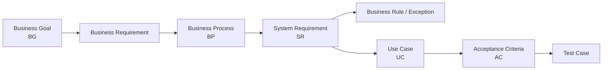

---


