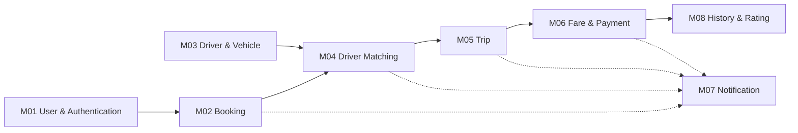
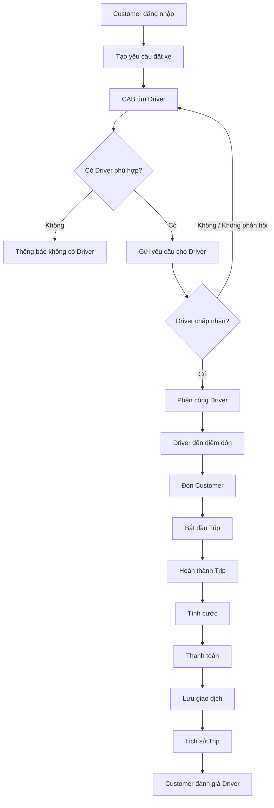
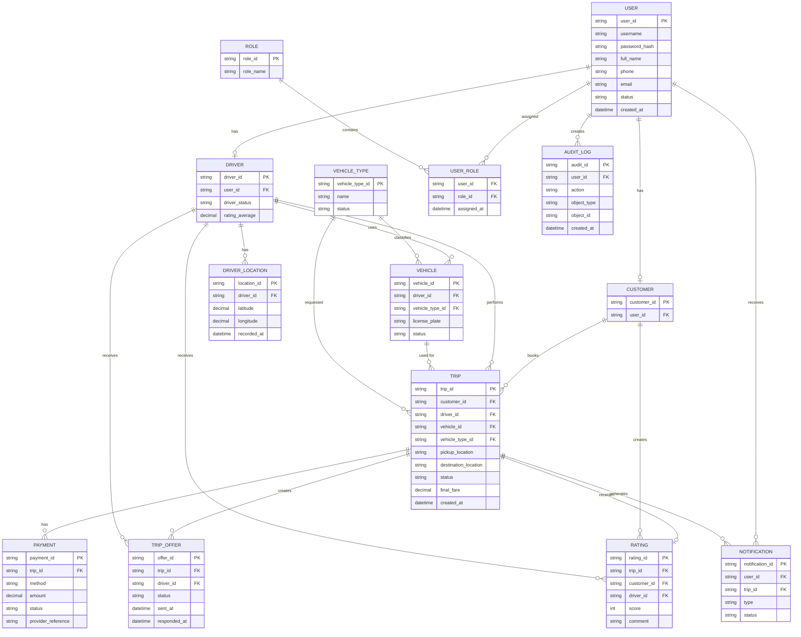
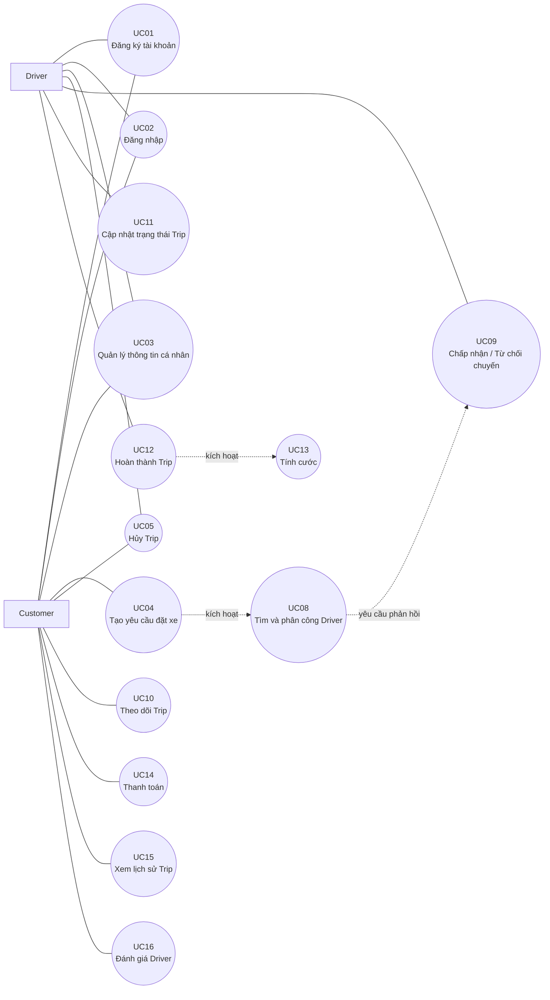
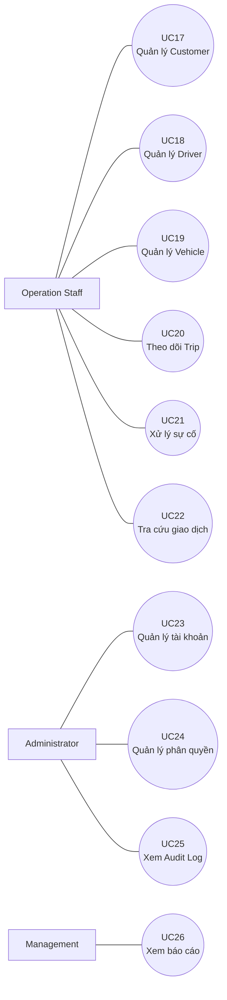
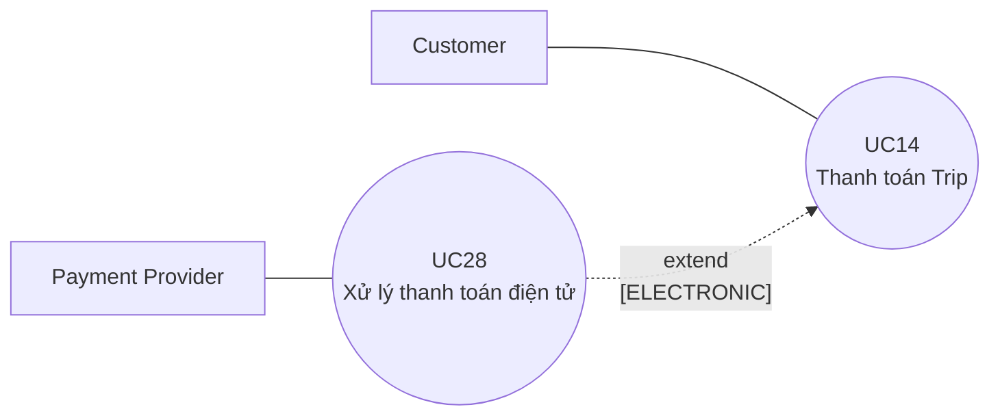
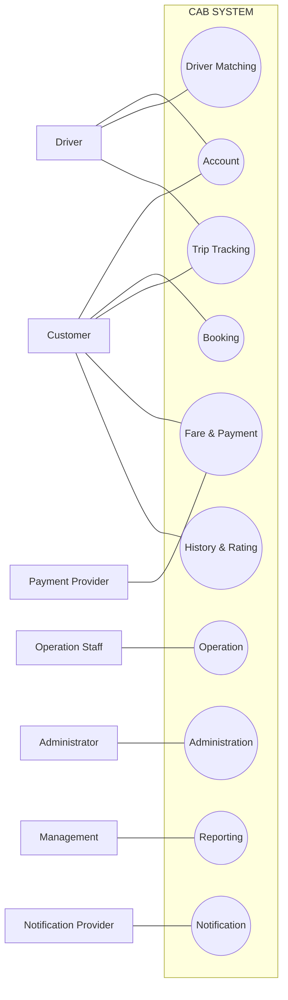
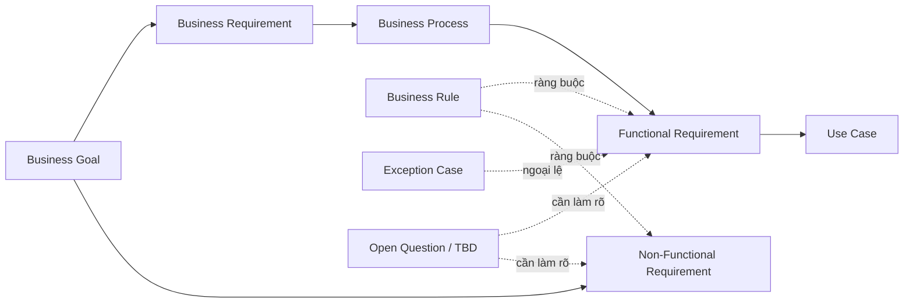

## 1. STAKEHOLDERS

Stakeholders là các cá nhân, nhóm hoặc tổ chức có liên quan đến việc sử dụng, vận hành, quản lý hoặc phát triển **CAB System**.

| STT | Stakeholder               | Vai trò chính                                                        |
| --: | ------------------------- | -------------------------------------------------------------------- |
|   1 | **Customer**              | Đặt xe, theo dõi chuyến, thanh toán, xem lịch sử và đánh giá Driver. |
|   2 | **Driver**                | Cập nhật trạng thái/vị trí, nhận chuyến và thực hiện Trip.           |
|   3 | **Operation Staff**       | Quản lý Customer, Driver, Vehicle, Trip và hỗ trợ xử lý sự cố.       |
|   4 | **Administrator**         | Quản lý tài khoản, phân quyền và nhật ký hệ thống.                   |
|   5 | **Management**            | Theo dõi hoạt động và báo cáo của CAB System.                        |
|   6 | **Payment Provider**      | Cung cấp dịch vụ xử lý thanh toán điện tử.                           |
|   7 | **Notification Provider** | Cung cấp dịch vụ gửi thông báo cho Customer và Driver.               |
|   8 | **Business Analyst**      | Thu thập, phân tích và quản lý yêu cầu.                              |
|   9 | **Development Team**      | Thiết kế, phát triển và triển khai hệ thống.                         |
|  10 | **QA / Tester**           | Kiểm thử và xác nhận hệ thống đáp ứng yêu cầu.                       |

---

## 2. STAKEHOLDER MATRIX

Stakeholders được phân loại theo **Influence** (mức độ ảnh hưởng) và **Interest** (mức độ quan tâm).

| Stakeholder           | Influence | Interest | Nhóm quản lý   |
| --------------------- | :-------: | :------: | -------------- |
| Customer              |    Low    |   High   | Keep Informed  |
| Driver                |    Low    |   High   | Keep Informed  |
| Operation Staff       |    High   |   High   | Manage Closely |
| Administrator         |    High   |   High   | Manage Closely |
| Management            |    High   |   High   | Manage Closely |
| Payment Provider      |    High   |    Low   | Keep Satisfied |
| Notification Provider |    High   |    Low   | Keep Satisfied |
| Business Analyst      |    High   |   High   | Manage Closely |
| Development Team      |    High   |   High   | Manage Closely |
| QA / Tester           |    Low    |   High   | Keep Informed  |

**Chiến lược quản lý:**

* **Manage Closely:** thường xuyên trao đổi và tham gia xác nhận yêu cầu.
* **Keep Satisfied:** duy trì phối hợp và đảm bảo yêu cầu tích hợp.
* **Keep Informed:** cập nhật thông tin và thu thập phản hồi.

---

## 3. BUSINESS GOALS

Business Goals xác định các mục tiêu mà Công ty ABC mong muốn đạt được thông qua CAB System.

| Mã        | Business Goal               | Mô tả                                                                       |
| --------- | --------------------------- | --------------------------------------------------------------------------- |
| **BG-01** | Nền tảng đặt xe trực tuyến  | Hỗ trợ quy trình từ Customer tạo yêu cầu đến hoàn thành Trip.               |
| **BG-02** | Tự động phân công Driver    | Tự động tìm và phân công Driver phù hợp, giảm xử lý thủ công.               |
| **BG-03** | Theo dõi chuyến đi          | Cho phép Customer theo dõi quá trình đặt xe, Driver và trạng thái Trip.     |
| **BG-04** | Quản lý cước và thanh toán  | Quản lý tập trung cước phí, phương thức thanh toán và giao dịch.            |
| **BG-05** | Quản lý và vận hành         | Hỗ trợ quản lý Customer, Driver, Vehicle, Trip, giao dịch và báo cáo.       |
| **BG-06** | Ổn định, bảo mật và mở rộng | Đảm bảo CAB System an toàn, ổn định và có khả năng mở rộng trong tương lai. |

### Mức độ ưu tiên

| Business Goal | Ưu tiên     |
| ------------- | ----------- |
| BG-01         | Must Have   |
| BG-02         | Must Have   |
| BG-03         | Must Have   |
| BG-04         | Must Have   |
| BG-05         | Should Have |
| BG-06         | Should Have |

---

## 4. SYSTEM SCOPE

CAB System MVP dự kiến phát triển trong **7 tuần**, ưu tiên hoàn thiện quy trình đặt xe cốt lõi.

### 4.1. In Scope

* Đăng ký, đăng nhập, đăng xuất và quản lý hồ sơ.
* Tạo và hủy yêu cầu đặt xe.
* Quản lý Driver và Vehicle.
* Cập nhật trạng thái và vị trí Driver.
* Tự động tìm và phân công Driver.
* Theo dõi và cập nhật trạng thái Trip.
* Xem lịch sử Trip và đánh giá Driver.
* Quản lý Customer, Driver, Vehicle và Trip.
* Quản lý tài khoản, phân quyền và Audit Log.

### 4.2. Limited Scope

* Tính cước và thanh toán.
* Thanh toán tiền mặt và một Payment Provider chính.
* Một giải pháp Notification chính.
* Báo cáo và thống kê cơ bản.

### 4.3. Out of Scope

* AI/Machine Learning nâng cao cho Driver Matching.
* Dynamic/Surge Pricing phức tạp.
* Business Intelligence nâng cao.
* Loyalty/Reward và khuyến mãi phức tạp.
* Tích hợp đồng thời nhiều Payment Provider.
* Tích hợp đồng thời nhiều Notification Provider.
* Các dịch vụ vận chuyển mới ngoài phạm vi MVP.

### 4.4. Luồng nghiệp vụ chính

```text
Đăng ký/Đăng nhập
        ↓
     Đặt xe
        ↓
   Tìm Driver
        ↓
 Driver nhận chuyến
        ↓
 Thực hiện Trip
        ↓
   Hoàn thành
        ↓
 Tính cước/Thanh toán
        ↓
 Lịch sử/Đánh giá
```

Các chính sách chưa được ABC xác nhận như công thức tính cước, thời gian phản hồi Driver và chính sách hủy chuyến được quản lý tại **Mục 13 – Open Questions / TBD**.

---

## 5. ACTORS

Actor là người dùng hoặc hệ thống bên ngoài có tương tác trực tiếp với CAB System.

| Mã         | Actor                 | Chức năng chính                                                                |
| ---------- | --------------------- | ------------------------------------------------------------------------------ |
| **ACT-01** | Customer              | Quản lý tài khoản, đặt xe, theo dõi Trip, thanh toán, xem lịch sử và đánh giá. |
| **ACT-02** | Driver                | Quản lý thông tin, cập nhật trạng thái/vị trí, nhận và thực hiện Trip.         |
| **ACT-03** | Operation Staff       | Quản lý và giám sát hoạt động vận hành.                                        |
| **ACT-04** | Administrator         | Quản lý tài khoản, phân quyền và Audit Log.                                    |
| **ACT-05** | Management            | Theo dõi báo cáo và thống kê hoạt động.                                        |
| **ACT-06** | Payment Provider      | Xử lý giao dịch thanh toán điện tử.                                            |
| **ACT-07** | Notification Provider | Cung cấp dịch vụ gửi thông báo.                                                |

> Business Analyst, Development Team và QA / Tester là Stakeholders của dự án nhưng không phải Actor nghiệp vụ của CAB System.

---

## 6. MVP MODULES

CAB System được chia thành các module để kiểm soát phạm vi phát triển trong 7 tuần.

| Mã      | Module                           | Business Goal | Scope    |
| ------- | -------------------------------- | ------------- | -------- |
| **M01** | User & Authentication            | BG-01, BG-06  | In Scope |
| **M02** | Booking Management               | BG-01         | In Scope |
| **M03** | Driver & Vehicle Management      | BG-01, BG-02  | In Scope |
| **M04** | Driver Matching & Dispatch       | BG-02         | In Scope |
| **M05** | Trip Management & Tracking       | BG-01, BG-03  | In Scope |
| **M06** | Fare & Payment                   | BG-04         | Limited  |
| **M07** | Notification                     | BG-03         | Limited  |
| **M08** | Trip History & Rating            | BG-01, BG-03  | In Scope |
| **M09** | Operation & Administration       | BG-05, BG-06  | In Scope |
| **M10** | Reporting & Analytics            | BG-05         | Limited  |
| **M11** | Advanced Services & Integrations | BG-06         | Post-MVP |

### Quan hệ giữa các module chính



Luồng chính của MVP là:

**M01 → M02 → M04 → M05 → M06 → M08**

Trong đó **M03** cung cấp dữ liệu Driver/Vehicle cho Matching và **M07** hỗ trợ Notification xuyên suốt quá trình.

---
## 7. BUSINESS REQUIREMENTS

Business Requirements mô tả các yêu cầu nghiệp vụ cần được CAB System đáp ứng để thực hiện các Business Goals đã xác định.

### 7.1. BG-01 – Nền tảng đặt xe trực tuyến

| Business Requirement             | Mô tả                                                                                       |
| -------------------------------- | ------------------------------------------------------------------------------------------- |
| **BG01_QuanLyTaiKhoanKhachHang** | Hệ thống phải hỗ trợ Customer đăng ký, đăng nhập và quản lý thông tin tài khoản.            |
| **BG01_TaoYeuCauDatXe**          | Customer có thể nhập điểm đón, điểm đến, chọn loại xe và tạo yêu cầu đặt xe.                |
| **BG01_QuanLyChuyenDi**          | Hệ thống phải quản lý Trip từ khi Customer tạo yêu cầu đến khi Trip hoàn thành hoặc bị hủy. |
| **BG01_QuanLyLichSuChuyenDi**    | Customer có thể xem lại danh sách và thông tin các Trip trước đó.                           |
| **BG01_DanhGiaTaiXe**            | Customer có thể đánh giá Driver sau khi Trip hoàn thành.                                    |

### 7.2. BG-02 – Tự động tìm và phân công Driver

| Business Requirement          | Mô tả                                                                                               |
| ----------------------------- | --------------------------------------------------------------------------------------------------- |
| **BG02_QuanLyTrangThaiTaiXe** | Hệ thống phải quản lý trạng thái hoạt động và khả năng nhận chuyến của Driver.                      |
| **BG02_TheoDoiViTriTaiXe**    | Hệ thống phải tiếp nhận và lưu thông tin vị trí Driver phục vụ quá trình Matching và theo dõi Trip. |
| **BG02_TimTaiXePhuHop**       | Hệ thống phải tự động tìm Driver phù hợp với yêu cầu đặt xe.                                        |
| **BG02_PhanCongTaiXe**        | Hệ thống phải phân công Driver sau khi Driver chấp nhận yêu cầu chuyến.                             |
| **BG02_TimLaiTaiXe**          | Khi Driver từ chối hoặc không phản hồi, hệ thống phải tiếp tục tìm Driver khác phù hợp.             |
| **BG02_XuLyKhongCoTaiXe**     | Khi không tìm được Driver phù hợp, hệ thống phải cập nhật kết quả và thông báo cho Customer.        |

### 7.3. BG-03 – Theo dõi chuyến đi và trải nghiệm Customer

| Business Requirement              | Mô tả                                                                                             |
| --------------------------------- | ------------------------------------------------------------------------------------------------- |
| **BG03_TheoDoiTrangThaiDatXe**    | Customer có thể theo dõi trạng thái của yêu cầu đặt xe trong quá trình tìm và phân công Driver.   |
| **BG03_HienThiThongTinTaiXe**     | Sau khi phân công thành công, Customer có thể xem thông tin Driver và Vehicle liên quan đến Trip. |
| **BG03_HienThiThoiGianDuKien**    | Hệ thống phải cung cấp thời gian dự kiến của Driver đến điểm đón khi có dữ liệu phù hợp.          |
| **BG03_TheoDoiTrangThaiChuyenDi** | Customer có thể theo dõi trạng thái Trip trong quá trình thực hiện.                               |
| **BG03_ThongBaoSuKienChuyenDi**   | Hệ thống phải gửi các thông báo cần thiết khi xảy ra các sự kiện quan trọng của Trip.             |

### 7.4. BG-04 – Quản lý cước phí và thanh toán

| Business Requirement            | Mô tả                                                                                        |
| ------------------------------- | -------------------------------------------------------------------------------------------- |
| **BG04_TinhCuocChuyenDi**       | Hệ thống phải tính cước Trip sau khi hoàn thành theo chính sách tính cước được ABC quy định. |
| **BG04_ThanhToanTienMat**       | Hệ thống phải hỗ trợ ghi nhận thanh toán bằng tiền mặt.                                      |
| **BG04_ThanhToanDienTu**        | Hệ thống phải hỗ trợ thanh toán điện tử thông qua Payment Provider.                          |
| **BG04_BaoVeThongTinThanhToan** | CAB System không được lưu trực tiếp các thông tin thanh toán nhạy cảm của Customer.          |
| **BG04_XuLyThanhToanThatBai**   | Hệ thống phải ghi nhận và xử lý trường hợp thanh toán điện tử thất bại theo chính sách.      |
| **BG04_LuuLichSuGiaoDich**      | Hệ thống phải lưu thông tin giao dịch phục vụ tra cứu và quản lý.                            |

> **Lưu ý:** Công thức tính cước và chính sách Retry thanh toán chưa được xác định và được quản lý tại Mục 13 – Open Questions / TBD.

### 7.5. BG-05 – Quản lý và vận hành dịch vụ

| Business Requirement      | Mô tả                                                                                       |
| ------------------------- | ------------------------------------------------------------------------------------------- |
| **BG05_QuanLyKhachHang**  | Operation Staff có thể tra cứu và quản lý thông tin Customer phục vụ vận hành.              |
| **BG05_QuanLyTaiXe**      | Operation Staff có thể tra cứu và quản lý thông tin Driver.                                 |
| **BG05_QuanLyPhuongTien** | Operation Staff có thể quản lý thông tin Vehicle của Driver.                                |
| **BG05_GiamSatChuyenDi**  | Operation Staff có thể theo dõi các Trip đang diễn ra và trạng thái liên quan.              |
| **BG05_XuLySuCoChuyenDi** | Operation Staff có thể hỗ trợ xử lý các sự cố phát sinh trong quá trình vận hành Trip.      |
| **BG05_TraCuuGiaoDich**   | Operation Staff có thể tra cứu lịch sử giao dịch thanh toán.                                |
| **BG05_BaoCaoHoatDong**   | Management có thể xem các báo cáo cơ bản về Trip, doanh thu, hủy chuyến và hiệu quả Driver. |

### 7.6. BG-06 – Ổn định, bảo mật và mở rộng

| Business Requirement        | Mô tả                                                                                                             |
| --------------------------- | ----------------------------------------------------------------------------------------------------------------- |
| **BG06_XacThucNguoiDung**   | Hệ thống phải xác thực người dùng trước khi cho phép truy cập các chức năng yêu cầu tài khoản.                    |
| **BG06_PhanQuyenQuanTri**   | Các chức năng quản trị và vận hành phải được giới hạn theo quyền của người dùng.                                  |
| **BG06_BaoVeDuLieu**        | Hệ thống phải bảo vệ dữ liệu cá nhân, Driver, Vehicle, vị trí, Trip và giao dịch.                                 |
| **BG06_LuuVetHoatDong**     | Các thao tác quan trọng phải được ghi nhận trong Audit Log để phục vụ kiểm tra và truy vết.                       |
| **BG06_DamBaoTinhSanSang**  | Lỗi của Payment Provider hoặc Notification Provider không được làm dừng toàn bộ nghiệp vụ cốt lõi.                |
| **BG06_HoTroMoRongHeThong** | Kiến trúc phải cho phép mở rộng các thành phần có tải lớn khi số lượng người dùng và Trip tăng.                   |
| **BG06_HoTroMoRongTichHop** | Hệ thống phải thuận lợi cho việc bổ sung Payment Provider, Notification Provider và loại dịch vụ trong tương lai. |

### 7.7. Tổng hợp Business Requirements

| Business Goal |  Số BR |
| ------------- | -----: |
| BG-01         |      5 |
| BG-02         |      6 |
| BG-03         |      5 |
| BG-04         |      6 |
| BG-05         |      7 |
| BG-06         |      7 |
| **Tổng cộng** | **36** |

Như vậy, CAB System có **36 Business Requirements**, được truy vết trực tiếp từ **6 Business Goals**.


---
## 8. BUSINESS PROCESS MODELING

Business Process mô tả các quy trình nghiệp vụ chính của CAB System và là cơ sở để xác định Functional Requirements.

### 8.1. Danh sách Business Process

| Mã        | Business Process                | Actor chính                    | Business Requirements liên quan                                                                                                                                             | Kết quả                                                                     |
| --------- | ------------------------------- | ------------------------------ | --------------------------------------------------------------------------------------------------------------------------------------------------------------------------- | --------------------------------------------------------------------------- |
| **BP-01** | Đăng ký và quản lý tài khoản    | Customer, Driver               | BG01_QuanLyTaiKhoanKhachHang, BG06_XacThucNguoiDung                                                                                                                         | Người dùng có thể truy cập và quản lý tài khoản.                            |
| **BP-02** | Tạo yêu cầu đặt xe              | Customer                       | BG01_TaoYeuCauDatXe, BG01_QuanLyChuyenDi, BG03_TheoDoiTrangThaiDatXe                                                                                                        | Yêu cầu đặt xe được tạo và chuyển sang tìm Driver.                          |
| **BP-03** | Tìm và phân công Driver         | Driver, CAB System             | BG02_QuanLyTrangThaiTaiXe, BG02_TheoDoiViTriTaiXe, BG02_TimTaiXePhuHop, BG02_PhanCongTaiXe, BG02_TimLaiTaiXe, BG02_XuLyKhongCoTaiXe                                         | Driver phù hợp được phân công hoặc Customer được thông báo không có Driver. |
| **BP-04** | Thực hiện và theo dõi Trip      | Customer, Driver               | BG01_QuanLyChuyenDi, BG03_HienThiThongTinTaiXe, BG03_HienThiThoiGianDuKien, BG03_TheoDoiTrangThaiChuyenDi                                                                   | Trip được theo dõi từ khi Driver nhận chuyến đến khi hoàn thành/hủy.        |
| **BP-05** | Tính cước và thanh toán         | Customer, Payment Provider     | BG04_TinhCuocChuyenDi, BG04_ThanhToanTienMat, BG04_ThanhToanDienTu, BG04_BaoVeThongTinThanhToan, BG04_XuLyThanhToanThatBai, BG04_LuuLichSuGiaoDich                          | Cước được xác định và giao dịch được ghi nhận.                              |
| **BP-06** | Gửi thông báo                   | Notification Provider          | BG03_ThongBaoSuKienChuyenDi                                                                                                                                                 | Customer và Driver nhận thông báo về các sự kiện cần thiết.                 |
| **BP-07** | Lịch sử Trip và đánh giá Driver | Customer                       | BG01_QuanLyLichSuChuyenDi, BG01_DanhGiaTaiXe                                                                                                                                | Customer xem lại Trip và có thể đánh giá Driver sau khi hoàn thành.         |
| **BP-08** | Quản lý và xử lý vận hành       | Operation Staff, Administrator | BG05_QuanLyKhachHang, BG05_QuanLyTaiXe, BG05_QuanLyPhuongTien, BG05_GiamSatChuyenDi, BG05_XuLySuCoChuyenDi, BG05_TraCuuGiaoDich, BG06_PhanQuyenQuanTri, BG06_LuuVetHoatDong | Dữ liệu vận hành được quản lý, giám sát và truy vết.                        |
| **BP-09** | Báo cáo và giám sát hoạt động   | Management                     | BG05_BaoCaoHoatDong, BG06_LuuVetHoatDong                                                                                                                                    | Management có thể theo dõi các chỉ số và báo cáo cơ bản.                    |

---

### 8.2. BP-01 – Đăng ký và quản lý tài khoản

**Luồng chính:**

1. Người dùng nhập thông tin đăng ký.
2. CAB System kiểm tra dữ liệu.
3. Hệ thống tạo tài khoản hợp lệ.
4. Người dùng đăng nhập.
5. Hệ thống xác thực thông tin đăng nhập.
6. Người dùng có thể xem và cập nhật thông tin cá nhân.
7. Người dùng đăng xuất khi kết thúc phiên.

**Ngoại lệ chính:** thông tin đăng ký hoặc đăng nhập không hợp lệ.

---

### 8.3. BP-02 – Tạo yêu cầu đặt xe

**Luồng chính:**

1. Customer nhập điểm đón và điểm đến.
2. Customer chọn loại xe.
3. Hệ thống hiển thị thông tin đặt xe.
4. Customer xác nhận yêu cầu.
5. CAB System tạo Trip.
6. Trip chuyển sang trạng thái tìm Driver.

**Ngoại lệ chính:** thông tin đặt xe không hợp lệ hoặc Customer hủy yêu cầu theo chính sách.

---

### 8.4. BP-03 – Tìm và phân công Driver

**Luồng chính:**

1. CAB System lấy danh sách Driver có khả năng nhận chuyến.
2. Hệ thống sử dụng trạng thái, vị trí và tiêu chí phù hợp để tìm Driver.
3. Các Driver phù hợp được xếp thứ tự ưu tiên.
4. Hệ thống gửi yêu cầu chuyến cho Driver được chọn.
5. Driver chấp nhận hoặc từ chối.
6. Nếu Driver chấp nhận, hệ thống phân công Driver cho Trip.
7. Nếu Driver từ chối hoặc không phản hồi, hệ thống tìm Driver tiếp theo.
8. Nếu không còn Driver phù hợp, hệ thống thông báo cho Customer.

> Tiêu chí ưu tiên Driver và thời gian chờ phản hồi hiện là **TBD**.

---

### 8.5. BP-04 – Thực hiện và theo dõi Trip

Sau khi Driver được phân công, CAB System quản lý vòng đời Trip theo trình tự nghiệp vụ:

```text
DRIVER_ASSIGNED
      ↓
DRIVER_ARRIVED
      ↓
PASSENGER_PICKED_UP
      ↓
IN_PROGRESS
      ↓
COMPLETED
```

Trip có thể chuyển sang `CANCELLED` nếu đáp ứng điều kiện hủy theo chính sách.

**Luồng chính:**

1. Customer xem thông tin Driver, Vehicle và thời gian dự kiến.
2. Driver di chuyển đến điểm đón.
3. Driver xác nhận đã đến điểm đón.
4. Driver xác nhận đã đón Customer.
5. Driver bắt đầu Trip.
6. Customer theo dõi trạng thái Trip.
7. Driver hoàn thành Trip.
8. CAB System cập nhật trạng thái `COMPLETED`.

---

### 8.6. BP-05 – Tính cước và thanh toán

**Luồng chính:**

1. Trip được hoàn thành.
2. CAB System tính cước theo chính sách của ABC.
3. Customer xem chi tiết cước.
4. Customer chọn phương thức thanh toán.
5. Với tiền mặt, hệ thống ghi nhận kết quả thanh toán.
6. Với thanh toán điện tử, yêu cầu được gửi tới Payment Provider.
7. CAB System nhận kết quả từ Payment Provider.
8. Thông tin giao dịch được lưu lại.

**Ngoại lệ chính:** thanh toán thất bại hoặc Payment Provider không phản hồi.

> Công thức tính cước, Retry và Timeout của Payment Provider là **TBD**.

---

### 8.7. BP-06 – Gửi thông báo

CAB System gửi thông báo tại các sự kiện quan trọng, bao gồm:

* Yêu cầu đặt xe được tiếp nhận.
* Driver nhận chuyến.
* Driver đến điểm đón.
* Trip hoàn thành.
* Có kết quả thanh toán.
* Có chuyến mới dành cho Driver.

Nếu Notification Provider gặp lỗi, nghiệp vụ đặt xe và thực hiện Trip vẫn phải tiếp tục hoạt động.

---

### 8.8. BP-07 – Lịch sử Trip và đánh giá Driver

**Luồng chính:**

1. Customer truy cập lịch sử Trip.
2. Hệ thống hiển thị các Trip trước đó.
3. Customer chọn một Trip để xem chi tiết.
4. Với Trip đã hoàn thành, Customer có thể đánh giá Driver.
5. CAB System lưu Rating.
6. Customer có thể xem lại Rating của Trip.

Mỗi Trip chỉ có tối đa một đánh giá chính thức.

---

### 8.9. BP-08 – Quản lý và xử lý vận hành

Operation Staff thực hiện các nghiệp vụ:

* Quản lý Customer.
* Quản lý Driver.
* Quản lý Vehicle.
* Theo dõi Trip đang diễn ra.
* Xem chi tiết Trip phục vụ vận hành.
* Hỗ trợ xử lý sự cố Trip.
* Tra cứu lịch sử giao dịch.

Administrator thực hiện:

* Quản lý tài khoản hệ thống.
* Quản lý quyền truy cập.
* Theo dõi Audit Log.

Các chức năng phải được giới hạn theo quyền của người dùng.

---

### 8.10. BP-09 – Báo cáo và giám sát hoạt động

Management có thể theo dõi các báo cáo cơ bản:

* Số lượng Trip.
* Doanh thu.
* Tỷ lệ Trip hoàn thành.
* Tỷ lệ Trip bị hủy.
* Hiệu quả hoạt động của Driver.
* Báo cáo tổng hợp.

Phạm vi và chi tiết báo cáo trong MVP được xác định tại **TBD-14**.

---

### 8.11. Quy trình nghiệp vụ CAB tổng thể



### 8.12. Quan hệ Business Process

Luồng nghiệp vụ cốt lõi của CAB System:

**BP-01 → BP-02 → BP-03 → BP-04 → BP-05 → BP-07**

Trong đó:

* **BP-06** hỗ trợ gửi Notification xuyên suốt BP-02 đến BP-05.
* **BP-08** hỗ trợ quản lý và giám sát hoạt động hệ thống.
* **BP-09** sử dụng dữ liệu phát sinh từ các quy trình để tạo báo cáo.


---
## 9. FUNCTIONAL REQUIREMENTS

Functional Requirements (FR) mô tả các chức năng cụ thể mà CAB System phải cung cấp để thực hiện các Business Process.

### 9.1. BP-01 – Đăng ký và quản lý tài khoản

| Mã       | Functional Requirement     | Mô tả                                                                             |
| -------- | -------------------------- | --------------------------------------------------------------------------------- |
| **FR01** | Đăng ký tài khoản          | Hệ thống cho phép người dùng đăng ký tài khoản bằng các thông tin bắt buộc.       |
| **FR02** | Đăng nhập                  | Hệ thống xác thực thông tin đăng nhập và tạo phiên làm việc khi thông tin hợp lệ. |
| **FR03** | Đăng xuất                  | Hệ thống cho phép người dùng kết thúc phiên làm việc hiện tại.                    |
| **FR04** | Xem thông tin cá nhân      | Người dùng có thể xem thông tin hồ sơ của mình.                                   |
| **FR05** | Cập nhật thông tin cá nhân | Người dùng có thể cập nhật các thông tin cá nhân được phép thay đổi.              |

---

### 9.2. BP-02 – Tạo yêu cầu đặt xe

| Mã       | Functional Requirement   | Mô tả                                                                              |
| -------- | ------------------------ | ---------------------------------------------------------------------------------- |
| **FR06** | Nhập thông tin chuyến đi | Customer nhập điểm đón và điểm đến của Trip.                                       |
| **FR07** | Chọn loại xe             | Customer lựa chọn loại Vehicle phù hợp với nhu cầu đặt xe.                         |
| **FR08** | Xem thông tin đặt xe     | Hệ thống hiển thị thông tin yêu cầu để Customer kiểm tra trước khi xác nhận.       |
| **FR09** | Tạo yêu cầu đặt xe       | Hệ thống tạo Trip sau khi Customer xác nhận thông tin hợp lệ.                      |
| **FR10** | Hủy yêu cầu đặt xe       | Customer có thể yêu cầu hủy Trip khi trạng thái hiện tại cho phép theo chính sách. |

---

### 9.3. BP-03 – Tìm và phân công Driver

| Mã       | Functional Requirement     | Mô tả                                                                           |
| -------- | -------------------------- | ------------------------------------------------------------------------------- |
| **FR11** | Cập nhật trạng thái Driver | Driver có thể cập nhật trạng thái hoạt động và khả năng nhận chuyến.            |
| **FR12** | Cập nhật vị trí Driver     | CAB System tiếp nhận và cập nhật vị trí của Driver.                             |
| **FR13** | Tìm Driver phù hợp         | Hệ thống tìm các Driver đáp ứng điều kiện của yêu cầu đặt xe.                   |
| **FR14** | Xếp hạng Driver            | Hệ thống sắp xếp các Driver phù hợp theo tiêu chí ưu tiên được quy định.        |
| **FR15** | Gửi yêu cầu nhận chuyến    | Hệ thống gửi yêu cầu chuyến đến Driver được lựa chọn.                           |
| **FR16** | Phản hồi yêu cầu chuyến    | Driver có thể chấp nhận hoặc từ chối yêu cầu chuyến.                            |
| **FR17** | Phân công Driver           | Hệ thống liên kết Driver với Trip sau khi Driver chấp nhận chuyến.              |
| **FR18** | Tìm lại Driver             | Hệ thống tiếp tục tìm Driver khác khi Driver trước từ chối hoặc không phản hồi. |
| **FR19** | Thông báo không có Driver  | Hệ thống thông báo cho Customer khi không tìm được Driver phù hợp.              |

> Tiêu chí xếp hạng Driver và thời gian phản hồi Driver được quản lý tại **TBD-02** và **TBD-03**.

---

### 9.4. BP-04 – Thực hiện và theo dõi Trip

| Mã       | Functional Requirement   | Mô tả                                                                                      |
| -------- | ------------------------ | ------------------------------------------------------------------------------------------ |
| **FR20** | Xem thông tin Driver     | Customer có thể xem thông tin Driver và Vehicle được phân công.                            |
| **FR21** | Xem thời gian dự kiến    | Customer có thể xem thời gian dự kiến Driver đến điểm đón khi hệ thống có dữ liệu phù hợp. |
| **FR22** | Xem trạng thái Trip      | Customer có thể theo dõi trạng thái hiện tại của Trip.                                     |
| **FR23** | Xác nhận đã đến điểm đón | Driver cập nhật trạng thái khi đã đến điểm đón Customer.                                   |
| **FR24** | Xác nhận đã đón Customer | Driver xác nhận Customer đã được đón.                                                      |
| **FR25** | Bắt đầu Trip             | Driver cập nhật trạng thái Trip khi bắt đầu thực hiện chuyến.                              |
| **FR26** | Hoàn thành Trip          | Driver xác nhận Trip đã hoàn thành.                                                        |
| **FR27** | Hủy Trip                 | Customer hoặc Driver có thể yêu cầu hủy Trip nếu đáp ứng điều kiện theo chính sách.        |

Trạng thái Trip phải tuân theo vòng đời nghiệp vụ hợp lệ:

```text id="8mwqco"
CREATED
   ↓
SEARCHING_DRIVER
   ↓
DRIVER_ASSIGNED
   ↓
DRIVER_ARRIVED
   ↓
PASSENGER_PICKED_UP
   ↓
IN_PROGRESS
   ↓
COMPLETED
```

`CANCELLED` có thể phát sinh tại các trạng thái được chính sách hủy chuyến cho phép.

---

### 9.5. BP-05 – Tính cước và thanh toán

| Mã       | Functional Requirement      | Mô tả                                                                              |
| -------- | --------------------------- | ---------------------------------------------------------------------------------- |
| **FR28** | Tính cước Trip              | Hệ thống tính cước cuối cùng sau khi Trip hoàn thành theo chính sách của ABC.      |
| **FR29** | Xem chi tiết cước           | Customer có thể xem thông tin cước của Trip.                                       |
| **FR30** | Chọn phương thức thanh toán | Customer lựa chọn phương thức thanh toán được hỗ trợ.                              |
| **FR31** | Thanh toán tiền mặt         | Hệ thống hỗ trợ ghi nhận kết quả thanh toán bằng tiền mặt.                         |
| **FR32** | Thanh toán điện tử          | Hệ thống gửi yêu cầu thanh toán điện tử tới Payment Provider và tiếp nhận kết quả. |
| **FR33** | Xử lý thanh toán thất bại   | Hệ thống ghi nhận và xử lý giao dịch thất bại theo chính sách thanh toán.          |
| **FR34** | Lưu thông tin giao dịch     | Hệ thống lưu thông tin cần thiết của các giao dịch để phục vụ tra cứu và quản lý.  |

CAB System **không lưu trực tiếp dữ liệu thanh toán nhạy cảm** như số thẻ đầy đủ, mã bảo mật hoặc thông tin xác thực thanh toán.

---

### 9.6. BP-06 – Gửi thông báo

| Mã       | Functional Requirement          | Mô tả                                                                            |
| -------- | ------------------------------- | -------------------------------------------------------------------------------- |
| **FR35** | Thông báo tiếp nhận đặt xe      | Hệ thống thông báo cho Customer khi yêu cầu đặt xe được tiếp nhận.               |
| **FR36** | Thông báo Driver nhận chuyến    | Hệ thống thông báo cho Customer khi Driver chấp nhận và được phân công cho Trip. |
| **FR37** | Thông báo Driver đến điểm đón   | Hệ thống thông báo cho Customer khi Driver xác nhận đã đến điểm đón.             |
| **FR38** | Thông báo hoàn thành Trip       | Hệ thống thông báo cho Customer khi Trip hoàn thành.                             |
| **FR39** | Thông báo kết quả thanh toán    | Hệ thống thông báo cho Customer về kết quả xử lý thanh toán.                     |
| **FR40** | Thông báo chuyến mới cho Driver | Hệ thống gửi thông báo cho Driver khi có yêu cầu chuyến mới.                     |

Lỗi Notification Provider không được làm gián đoạn quy trình đặt xe, Matching hoặc thực hiện Trip.

---

### 9.7. BP-07 – Lịch sử Trip và đánh giá Driver

| Mã       | Functional Requirement | Mô tả                                                              |
| -------- | ---------------------- | ------------------------------------------------------------------ |
| **FR41** | Xem lịch sử Trip       | Customer có thể xem danh sách các Trip trước đây của mình.         |
| **FR42** | Xem chi tiết Trip      | Customer có thể xem thông tin chi tiết của một Trip trong lịch sử. |
| **FR43** | Đánh giá Driver        | Customer có thể gửi đánh giá Driver sau khi Trip hoàn thành.       |
| **FR44** | Xem đánh giá Trip      | Customer có thể xem lại đánh giá đã thực hiện cho Trip.            |

Mỗi Trip chỉ có tối đa **một Rating chính thức**.

---

### 9.8. BP-08 – Quản lý và xử lý vận hành

| Mã       | Functional Requirement     | Mô tả                                                                           |
| -------- | -------------------------- | ------------------------------------------------------------------------------- |
| **FR45** | Quản lý Customer           | Operation Staff có thể tra cứu và quản lý thông tin Customer phục vụ vận hành.  |
| **FR46** | Quản lý Driver             | Operation Staff có thể tra cứu và quản lý thông tin Driver.                     |
| **FR47** | Quản lý Vehicle            | Operation Staff có thể quản lý thông tin Vehicle của Driver.                    |
| **FR48** | Theo dõi Trip đang diễn ra | Operation Staff có thể xem danh sách và trạng thái các Trip đang hoạt động.     |
| **FR49** | Xem chi tiết Trip vận hành | Operation Staff có thể xem chi tiết Trip để phục vụ giám sát và hỗ trợ.         |
| **FR50** | Xử lý sự cố Trip           | Operation Staff có thể ghi nhận và hỗ trợ xử lý các sự cố liên quan đến Trip.   |
| **FR51** | Tra cứu lịch sử giao dịch  | Operation Staff có thể tra cứu thông tin các giao dịch đã được ghi nhận.        |
| **FR52** | Quản lý tài khoản hệ thống | Administrator có thể quản lý tài khoản người dùng thuộc phạm vi được cấp quyền. |
| **FR53** | Quản lý phân quyền         | Administrator có thể quản lý quyền truy cập các chức năng quản trị và vận hành. |
| **FR54** | Xem Audit Log              | Administrator có thể tra cứu các thao tác quan trọng đã được hệ thống ghi nhận. |

---

### 9.9. BP-09 – Báo cáo và giám sát hoạt động

| Mã       | Functional Requirement    | Mô tả                                                                           |
| -------- | ------------------------- | ------------------------------------------------------------------------------- |
| **FR55** | Thống kê số lượng Trip    | Hệ thống thống kê số lượng Trip từ dữ liệu hợp lệ.                              |
| **FR56** | Thống kê doanh thu        | Hệ thống tổng hợp doanh thu từ các giao dịch hợp lệ.                            |
| **FR57** | Thống kê tỷ lệ hoàn thành | Hệ thống thống kê tỷ lệ Trip hoàn thành.                                        |
| **FR58** | Thống kê tỷ lệ hủy        | Hệ thống thống kê tỷ lệ Trip bị hủy.                                            |
| **FR59** | Thống kê hiệu quả Driver  | Hệ thống cung cấp các thông tin cơ bản phục vụ đánh giá hoạt động Driver.       |
| **FR60** | Xem báo cáo tổng hợp      | Management có thể xem báo cáo tổng hợp từ các số liệu hoạt động của CAB System. |

Chi tiết chỉ số và phạm vi báo cáo của MVP được xác định tại **TBD-14**.

---

### 9.10. Tổng hợp Functional Requirements

| Business Process | Functional Requirements | Số lượng |
| ---------------- | ----------------------- | -------: |
| BP-01            | FR01–FR05               |        5 |
| BP-02            | FR06–FR10               |        5 |
| BP-03            | FR11–FR19               |        9 |
| BP-04            | FR20–FR27               |        8 |
| BP-05            | FR28–FR34               |        7 |
| BP-06            | FR35–FR40               |        6 |
| BP-07            | FR41–FR44               |        4 |
| BP-08            | FR45–FR54               |       10 |
| BP-09            | FR55–FR60               |        6 |
| **Tổng cộng**    | **FR01–FR60**           |   **60** |

CAB System có tổng cộng **60 Functional Requirements**, được phân rã từ **9 Business Processes**.


---
## 10. BUSINESS RULES

Business Rules (BR) xác định các quy tắc và ràng buộc nghiệp vụ mà CAB System phải tuân thủ trong quá trình hoạt động.

| Mã        | Business Rule                    | Quy định                                                                                                         |
| --------- | -------------------------------- | ---------------------------------------------------------------------------------------------------------------- |
| **BR-01** | Xác thực người dùng              | Người dùng phải được xác thực trước khi sử dụng các chức năng yêu cầu tài khoản.                                 |
| **BR-02** | Trip đang hoạt động của Customer | Một Customer chỉ được có tối đa một Trip đang hoạt động tại cùng một thời điểm.                                  |
| **BR-03** | Điều kiện nhận chuyến của Driver | Driver chỉ được tham gia nhận chuyến khi đang ở trạng thái sẵn sàng nhận chuyến.                                 |
| **BR-04** | Driver đang thực hiện Trip       | Driver đang thực hiện một Trip không được nhận Trip mới.                                                         |
| **BR-05** | Driver phù hợp                   | Driver được lựa chọn phải đáp ứng các điều kiện phù hợp với yêu cầu Trip.                                        |
| **BR-06** | Tìm Driver tiếp theo             | Khi Driver từ chối hoặc không phản hồi trong thời gian quy định, hệ thống phải tiếp tục tìm Driver phù hợp khác. |
| **BR-07** | Không tìm được Driver            | Customer phải được thông báo khi hệ thống không tìm được Driver phù hợp.                                         |
| **BR-08** | Điều kiện thực hiện Trip         | Trip chỉ được thực hiện sau khi có Driver được phân công hợp lệ.                                                 |
| **BR-09** | Vòng đời Trip                    | Trạng thái Trip phải chuyển đổi theo trình tự nghiệp vụ hợp lệ.                                                  |
| **BR-10** | Tính cước cuối cùng              | Cước cuối cùng chỉ được xác định sau khi Trip hoàn thành.                                                        |
| **BR-11** | Phương thức thanh toán           | Customer chỉ được lựa chọn các phương thức thanh toán được CAB System hỗ trợ trong phạm vi MVP.                  |
| **BR-12** | Dữ liệu thanh toán nhạy cảm      | CAB System không được lưu trực tiếp thông tin thanh toán nhạy cảm của Customer.                                  |
| **BR-13** | Thanh toán thất bại              | Giao dịch điện tử thất bại phải được ghi nhận và xử lý theo chính sách thanh toán.                               |
| **BR-14** | Điều kiện đánh giá               | Customer chỉ được đánh giá Driver sau khi Trip hoàn thành.                                                       |
| **BR-15** | Số lượng Rating                  | Mỗi Trip chỉ có tối đa một Rating chính thức.                                                                    |
| **BR-16** | Phân quyền quản trị              | Chức năng vận hành và quản trị chỉ được thực hiện bởi người dùng có quyền phù hợp.                               |
| **BR-17** | Audit Log                        | Các thao tác quan trọng của hệ thống phải được ghi nhận để phục vụ kiểm tra và truy vết.                         |
| **BR-18** | Dữ liệu báo cáo                  | Báo cáo và thống kê phải được tạo từ dữ liệu hợp lệ được CAB System ghi nhận.                                    |

### 10.1. Quy tắc trạng thái Trip

Vòng đời chuẩn của một Trip:

```text
CREATED
   ↓
SEARCHING_DRIVER
   ↓
DRIVER_ASSIGNED
   ↓
DRIVER_ARRIVED
   ↓
PASSENGER_PICKED_UP
   ↓
IN_PROGRESS
   ↓
COMPLETED
```

`CANCELLED` là trạng thái kết thúc có thể phát sinh khi Trip đáp ứng điều kiện hủy theo chính sách của ABC.

Hệ thống không được cho phép chuyển trạng thái không hợp lệ, ví dụ:

```text
CREATED → COMPLETED        ❌
SEARCHING_DRIVER → IN_PROGRESS  ❌
DRIVER_ASSIGNED → COMPLETED     ❌
```

### 10.2. Các Business Rule phụ thuộc TBD

Một số Business Rules đã xác định nguyên tắc nhưng chưa thể quy định giá trị chi tiết:

| Business Rule | Nội dung chưa xác định                                                |
| ------------- | --------------------------------------------------------------------- |
| BR-05, BR-06  | Tiêu chí ưu tiên Driver và thời gian phản hồi Driver.                 |
| BR-09         | Trạng thái nào cho phép Customer/Driver hủy Trip.                     |
| BR-10         | Công thức và các thành phần tính cước.                                |
| BR-13         | Số lần Retry, Timeout và cách xử lý trạng thái Payment chưa xác định. |
| BR-17         | Thời gian lưu trữ Audit Log.                                          |

Các nội dung này được quản lý tại **Mục 13 – Open Questions / TBD** và không được tự giả định khi chưa có xác nhận của ABC.


---
## 11. NON-FUNCTIONAL REQUIREMENTS

Non-Functional Requirements (NFR) mô tả các yêu cầu về hiệu năng, độ ổn định, khả năng mở rộng, bảo mật, khả năng bảo trì và tính dễ sử dụng của CAB System.

### 11.1. Performance

| Mã         | Non-Functional Requirement | Mô tả                                                                                                                                           |
| ---------- | -------------------------- | ----------------------------------------------------------------------------------------------------------------------------------------------- |
| **NFR-01** | Thời gian phản hồi         | Các chức năng thông thường của CAB System phải có thời gian phản hồi phù hợp với hoạt động đặt xe trực tuyến. Ngưỡng cụ thể: **TBD**.           |
| **NFR-02** | Hiệu suất Driver Matching  | Quá trình tìm và phân công Driver phải được xử lý đủ nhanh để hạn chế thời gian chờ của Customer. Thời gian tối đa: **TBD**.                    |
| **NFR-03** | Xử lý yêu cầu đồng thời    | Hệ thống phải có khả năng xử lý đồng thời các yêu cầu từ Customer, Driver, Operation Staff và các hệ thống tích hợp. Mức tải mục tiêu: **TBD**. |

---

### 11.2. Availability & Reliability

| Mã         | Non-Functional Requirement        | Mô tả                                                                                                                     |
| ---------- | --------------------------------- | ------------------------------------------------------------------------------------------------------------------------- |
| **NFR-04** | Ổn định khi tải tăng              | Các chức năng cốt lõi như Booking, Driver Matching và Trip Tracking phải duy trì hoạt động ổn định khi tải hệ thống tăng. |
| **NFR-05** | Độc lập với Payment Provider      | Sự cố của Payment Provider không được làm dừng chức năng đặt xe hoặc thực hiện Trip.                                      |
| **NFR-06** | Độc lập với Notification Provider | Sự cố Notification Provider không được làm dừng Booking, Driver Matching hoặc quá trình thực hiện Trip.                   |
| **NFR-07** | Tính nhất quán dữ liệu            | Dữ liệu về Driver, Trip, phân công Driver, Payment, Rating và Audit Log phải duy trì trạng thái nhất quán.                |

---

### 11.3. Scalability

| Mã         | Non-Functional Requirement | Mô tả                                                                                                                                              |
| ---------- | -------------------------- | -------------------------------------------------------------------------------------------------------------------------------------------------- |
| **NFR-08** | Mở rộng thành phần tải lớn | Các thành phần có tải lớn như Booking, Driver Matching, Trip và Notification phải có khả năng mở rộng độc lập khi cần thiết.                       |
| **NFR-09** | Tăng quy mô hệ thống       | CAB System phải có khả năng hỗ trợ sự gia tăng Customer, Driver, Trip, giao dịch và yêu cầu đồng thời mà không phải thiết kế lại toàn bộ hệ thống. |

---

### 11.4. Security

| Mã         | Non-Functional Requirement | Mô tả                                                                                                                                    |
| ---------- | -------------------------- | ---------------------------------------------------------------------------------------------------------------------------------------- |
| **NFR-10** | Xác thực người dùng        | Customer, Driver và người dùng nội bộ phải được xác thực trước khi truy cập các chức năng yêu cầu tài khoản.                             |
| **NFR-11** | Phân quyền truy cập        | Người dùng chỉ được truy cập các chức năng và dữ liệu phù hợp với quyền được cấp.                                                        |
| **NFR-12** | Bảo vệ dữ liệu             | Dữ liệu cá nhân, Driver, Vehicle, vị trí, Trip và giao dịch phải được bảo vệ khi lưu trữ, truyền tải và trao đổi với hệ thống bên ngoài. |
| **NFR-13** | Bảo vệ dữ liệu thanh toán  | CAB System không được lưu trực tiếp số thẻ đầy đủ, mã bảo mật, mật khẩu thanh toán hoặc thông tin xác thực thanh toán nhạy cảm.          |
| **NFR-14** | Audit thao tác quan trọng  | Các thao tác quan trọng phải được ghi nhận tối thiểu người thực hiện, hành động, đối tượng và thời điểm để hỗ trợ kiểm tra và truy vết.  |

---

### 11.5. Maintainability & Extensibility

| Mã         | Non-Functional Requirement    | Mô tả                                                                                                                                                   |
| ---------- | ----------------------------- | ------------------------------------------------------------------------------------------------------------------------------------------------------- |
| **NFR-15** | Thiết kế theo module          | Hệ thống phải được tổ chức theo các module có mức phụ thuộc hợp lý để thuận tiện bảo trì, kiểm thử và triển khai từng phần.                             |
| **NFR-16** | Mở rộng Payment Provider      | Kiến trúc phải cho phép bổ sung hoặc thay đổi Payment Provider trong tương lai mà hạn chế ảnh hưởng đến các module khác.                                |
| **NFR-17** | Mở rộng Notification Provider | Kiến trúc phải cho phép bổ sung Notification Provider hoặc kênh thông báo mới trong tương lai.                                                          |
| **NFR-18** | Mở rộng loại dịch vụ          | Hệ thống phải hỗ trợ khả năng bổ sung loại Vehicle, loại dịch vụ, phương thức thanh toán và tích hợp mới mà không phải thiết kế lại toàn bộ CAB System. |

---

### 11.6. Usability

| Mã         | Non-Functional Requirement  | Mô tả                                                                                                                                 |
| ---------- | --------------------------- | ------------------------------------------------------------------------------------------------------------------------------------- |
| **NFR-19** | Giao diện dễ sử dụng        | Các chức năng cốt lõi phải được trình bày rõ ràng và thuận tiện cho Customer, Driver và người dùng nội bộ.                            |
| **NFR-20** | Hiển thị trạng thái rõ ràng | Trạng thái Booking, Driver Matching, Trip và Payment phải được thể hiện rõ để người dùng hiểu trạng thái hiện tại.                    |
| **NFR-21** | Thông báo lỗi dễ hiểu       | Khi thao tác không thành công, hệ thống phải cung cấp thông báo phù hợp để người dùng hiểu vấn đề và có thể thực hiện bước tiếp theo. |

---

### 11.7. Tổng hợp Non-Functional Requirements

| Nhóm                            | NFR                 | Số lượng |
| ------------------------------- | ------------------- | -------: |
| Performance                     | NFR-01 – NFR-03     |        3 |
| Availability & Reliability      | NFR-04 – NFR-07     |        4 |
| Scalability                     | NFR-08 – NFR-09     |        2 |
| Security                        | NFR-10 – NFR-14     |        5 |
| Maintainability & Extensibility | NFR-15 – NFR-18     |        4 |
| Usability                       | NFR-19 – NFR-21     |        3 |
| **Tổng cộng**                   | **NFR-01 – NFR-21** |   **21** |

### 11.8. Các chỉ số NFR cần xác nhận

Các yêu cầu sau chưa có giá trị định lượng từ ABC và **không được tự giả định**:

| Nội dung                         | Trạng thái |
| -------------------------------- | ---------- |
| Thời gian phản hồi tối đa        | TBD        |
| Thời gian Driver Matching tối đa | TBD        |
| Số lượng người dùng đồng thời    | TBD        |
| Số yêu cầu đặt xe đồng thời      | TBD        |
| Mức Availability mục tiêu        | TBD        |
| Quy mô dữ liệu mục tiêu          | TBD        |
| Thời gian lưu Audit Log          | TBD        |

Các nội dung cần xác nhận sẽ được quản lý tập trung tại **Mục 13 – Open Questions / TBD**.


---
## 12. EXCEPTION CASES

Exception Cases (EX) mô tả các tình huống bất thường có thể phát sinh trong quá trình sử dụng CAB System và cách hệ thống cần xử lý.

| Mã        | Exception Case                  | Xử lý của hệ thống                                                                                                                       | Liên quan                                             |
| --------- | ------------------------------- | ---------------------------------------------------------------------------------------------------------------------------------------- | ----------------------------------------------------- |
| **EX-01** | Đăng nhập không hợp lệ          | Từ chối đăng nhập, không tạo phiên làm việc, hiển thị thông báo và cho phép người dùng thử lại.                                          | BP-01, FR02, BR-01, NFR-10, NFR-21                    |
| **EX-02** | Thông tin đặt xe không hợp lệ   | Không tạo Trip, thông báo dữ liệu không hợp lệ và cho phép Customer chỉnh sửa.                                                           | BP-02, FR06, FR07, FR09, NFR-21                       |
| **EX-03** | Không tìm được Driver phù hợp   | Không phân công Driver không phù hợp, kết thúc quá trình Matching hiện tại và thông báo cho Customer.                                    | BP-03, FR13, FR19, BR-05, BR-07                       |
| **EX-04** | Driver không phản hồi           | Không phân công Driver đó và tiếp tục tìm Driver phù hợp tiếp theo.                                                                      | BP-03, FR15, FR18, BR-06                              |
| **EX-05** | Driver từ chối chuyến           | Ghi nhận phản hồi, không phân công Driver và tiếp tục tìm Driver khác.                                                                   | BP-03, FR16, FR18, BR-06                              |
| **EX-06** | Customer hủy Trip               | Kiểm tra trạng thái hiện tại; nếu được phép thì cập nhật `CANCELLED`, giải phóng Driver nếu cần và thông báo các bên liên quan.          | BP-02, BP-04, FR10, FR27, BR-09                       |
| **EX-07** | Driver hủy Trip                 | Kiểm tra điều kiện hủy, ghi nhận sự kiện và xử lý Trip theo chính sách của ABC.                                                          | BP-03, BP-04, FR18, FR27, BR-09                       |
| **EX-08** | Thanh toán điện tử thất bại     | Không đánh dấu thanh toán thành công, ghi nhận giao dịch thất bại và thông báo cho Customer.                                             | BP-05, FR32, FR33, FR34, BR-13, NFR-05                |
| **EX-09** | Payment Provider không phản hồi | Không giả định giao dịch thành công; ghi nhận trạng thái phù hợp và xử lý tiếp theo theo chính sách thanh toán.                          | BP-05, FR32, FR33, FR34, NFR-05, NFR-07               |
| **EX-10** | Notification Provider gặp lỗi   | Ghi nhận lỗi; lỗi Notification không được làm dừng các nghiệp vụ cốt lõi của CAB System.                                                 | BP-06, FR35–FR40, NFR-06, NFR-17                      |
| **EX-11** | Mất kết nối trong Trip          | Giữ trạng thái nghiệp vụ quan trọng gần nhất và đồng bộ lại khi kết nối được khôi phục, tránh tạo Trip hoặc chuyển trạng thái trùng lặp. | BP-04, FR22–FR27, BR-09, NFR-07                       |
| **EX-12** | Người dùng không có quyền       | Từ chối thao tác, không thay đổi dữ liệu và ghi Audit Log đối với thao tác quan trọng khi cần thiết.                                     | BP-08, BP-09, FR45–FR60, BR-16, BR-17, NFR-11, NFR-14 |

### 12.1. Chi tiết các Exception Case quan trọng

#### EX-03 – Không tìm được Driver phù hợp

**Điều kiện:** CAB System đã thực hiện quá trình tìm Driver nhưng không còn Driver đáp ứng điều kiện.

**Xử lý:**

1. Dừng quá trình Matching hiện tại.
2. Không phân công Driver không đáp ứng điều kiện.
3. Cập nhật trạng thái yêu cầu đặt xe phù hợp.
4. Thông báo cho Customer rằng hiện không tìm được Driver.

---

#### EX-04 – Driver không phản hồi

**Điều kiện:** Driver không phản hồi yêu cầu chuyến trong khoảng thời gian cho phép.

**Xử lý:**

1. Ghi nhận Driver không phản hồi.
2. Không phân công Driver đó.
3. Tiếp tục tìm Driver tiếp theo.
4. Không yêu cầu Customer tạo lại Booking.

> Thời gian phản hồi Driver: **TBD-03**.

---

#### EX-06 – Customer hủy Trip

**Xử lý:**

1. CAB System kiểm tra trạng thái hiện tại của Trip.
2. Kiểm tra Trip có được phép hủy hay không.
3. Nếu hợp lệ, cập nhật trạng thái `CANCELLED`.
4. Cập nhật trạng thái Driver nếu Driver đã được phân công.
5. Thông báo cho các bên liên quan.
6. Nếu không được phép hủy, từ chối yêu cầu và thông báo lý do.

> Các trạng thái cho phép hủy và phí hủy nếu có: **TBD-04**.

---

#### EX-07 – Driver hủy Trip

**Xử lý:**

1. CAB System kiểm tra điều kiện hủy.
2. Ghi nhận yêu cầu hủy của Driver.
3. Cập nhật trạng thái Driver và Trip phù hợp.
4. Thông báo cho Customer.
5. Hệ thống tìm Driver thay thế hoặc kết thúc Trip theo chính sách.

> Quy định Driver hủy và việc tìm Driver thay thế: **TBD-05**.

---

#### EX-08 – Thanh toán điện tử thất bại

**Xử lý:**

1. Không đánh dấu Payment là thành công.
2. Ghi nhận kết quả thất bại.
3. Lưu thông tin giao dịch cần thiết.
4. Thông báo kết quả cho Customer.
5. Cho phép Retry hoặc lựa chọn phương thức khác nếu chính sách cho phép.

> Chính sách Retry: **TBD-07**.

---

#### EX-09 – Payment Provider không phản hồi

CAB System **không được tự động xem giao dịch là thành công** khi chưa nhận được kết quả xác nhận từ Payment Provider.

Payment có thể được giữ ở trạng thái chờ hoặc xử lý theo chính sách thanh toán sau khi Timeout.

> Timeout Payment Provider: **TBD-08**.
> Quy định trạng thái giao dịch Pending: **TBD-09**.

---

#### EX-10 – Notification Provider gặp lỗi

Nếu Notification Provider gặp sự cố:

1. CAB System ghi nhận lỗi gửi Notification.
2. Các nghiệp vụ Booking, Matching, Trip và Payment vẫn tiếp tục.
3. Có thể thực hiện gửi lại nếu chính sách cho phép.

Notification là chức năng hỗ trợ và không được trở thành điểm lỗi làm dừng toàn bộ CAB System.

---

#### EX-11 – Mất kết nối trong Trip

Khi Customer hoặc Driver mất kết nối:

1. Hệ thống giữ trạng thái nghiệp vụ quan trọng gần nhất.
2. Không tạo Trip mới do Retry từ phía Client.
3. Khi kết nối trở lại, Client đồng bộ trạng thái với Server.
4. Không cho phép chuyển trạng thái Trip không hợp lệ.

> Cơ chế Offline, đồng bộ và xử lý xung đột: **TBD-06**.

---

### 12.2. Nguyên tắc xử lý Exception

CAB System phải tuân thủ các nguyên tắc:

* Không làm mất dữ liệu nghiệp vụ quan trọng.
* Không tự giả định giao dịch thanh toán thành công.
* Không phân công Driver không đáp ứng điều kiện.
* Không cho phép chuyển trạng thái Trip không hợp lệ.
* Lỗi Payment hoặc Notification Provider không được làm dừng toàn bộ hệ thống.
* Thông báo lỗi phải đủ rõ để người dùng biết kết quả thao tác.
* Các thao tác quan trọng phải được Audit khi cần thiết.

Các chính sách chưa được ABC xác nhận không được tự giả định mà phải được quản lý dưới dạng **TBD**.


---
## 13. OPEN QUESTIONS / TBD

Open Questions / TBD (To Be Determined) ghi nhận các nội dung nghiệp vụ hoặc kỹ thuật chưa được ABC xác định đầy đủ tại thời điểm xây dựng SRS.

Các nội dung này cần được xác nhận trước khi triển khai chi tiết các chức năng liên quan.

| Mã         | Nội dung cần xác nhận        | Câu hỏi cần làm rõ                                                                       | Ảnh hưởng                  |
| ---------- | ---------------------------- | ---------------------------------------------------------------------------------------- | -------------------------- |
| **TBD-01** | Công thức tính cước          | Cước Trip được tính dựa trên những thành phần và quy tắc nào?                            | FR28, FR29, BR-10          |
| **TBD-02** | Tiêu chí ưu tiên Driver      | Driver được xếp hạng dựa trên vị trí, trạng thái và các tiêu chí nào khác?               | FR13, FR14, BR-05          |
| **TBD-03** | Thời gian Driver phản hồi    | Driver có tối đa bao lâu để chấp nhận hoặc từ chối yêu cầu chuyến?                       | FR15, FR18, BR-06, EX-04   |
| **TBD-04** | Chính sách Customer hủy Trip | Customer được hủy ở những trạng thái nào và có áp dụng phí hủy hay không?                | FR10, FR27, BR-09, EX-06   |
| **TBD-05** | Chính sách Driver hủy Trip   | Driver được phép hủy trong trường hợp nào và hệ thống có phải tìm Driver thay thế không? | FR18, FR27, BR-09, EX-07   |
| **TBD-06** | Xử lý mất kết nối            | CAB System xử lý Offline, đồng bộ lại và xung đột dữ liệu như thế nào?                   | FR22–FR27, NFR-07, EX-11   |
| **TBD-07** | Retry thanh toán             | Khi thanh toán thất bại, hệ thống cho phép Retry trong những điều kiện nào?              | FR32, FR33, BR-13, EX-08   |
| **TBD-08** | Timeout Payment Provider     | CAB System phải chờ Payment Provider trong bao lâu trước khi xem là Timeout?             | FR32, FR33, EX-09          |
| **TBD-09** | Payment Pending              | Khi chưa xác định được kết quả thanh toán, Payment được quản lý và đối soát như thế nào? | FR33, FR34, NFR-07, EX-09  |
| **TBD-10** | Thời gian lưu dữ liệu        | Trip, Payment, Rating, vị trí Driver và Audit Log phải được lưu trong bao lâu?           | FR34, FR54, NFR-12, NFR-14 |
| **TBD-11** | Chính sách lưu vị trí Driver | Khi nào được lưu vị trí Driver, tần suất cập nhật và thời gian lưu là bao lâu?           | FR12, NFR-12               |
| **TBD-12** | ETA                          | ETA được tính bằng cơ chế nào và yêu cầu độ chính xác ở mức nào?                         | FR21                       |
| **TBD-13** | Loại Vehicle trong MVP       | Những loại Vehicle nào được hỗ trợ trong phiên bản MVP?                                  | FR07, NFR-18               |
| **TBD-14** | Phạm vi báo cáo MVP          | Management cần những chỉ số, bộ lọc và khoảng thời gian báo cáo nào?                     | FR55–FR60                  |
| **TBD-15** | Kênh Notification MVP        | MVP sử dụng Push Notification, SMS, Email hay kênh nào khác?                             | FR35–FR40, NFR-17          |

### 13.1. Các chỉ số NFR cần xác nhận

Ngoài các TBD nghiệp vụ trên, ABC cần xác định các chỉ số kỹ thuật sau:

| Nội dung                               | Trạng thái |
| -------------------------------------- | ---------- |
| Thời gian phản hồi tối đa của hệ thống | **TBD**    |
| Thời gian Driver Matching tối đa       | **TBD**    |
| Số lượng người dùng đồng thời          | **TBD**    |
| Số lượng Booking đồng thời             | **TBD**    |
| Mức Availability mục tiêu              | **TBD**    |
| Quy mô dữ liệu mục tiêu                | **TBD**    |
| Thời gian lưu Audit Log                | **TBD**    |

### 13.2. Nguyên tắc quản lý TBD

* Không tự đặt giá trị cho các yêu cầu chưa được ABC xác nhận.
* Mỗi TBD phải được liên kết với FR, BR, NFR hoặc Exception Case chịu ảnh hưởng.
* Khi ABC xác nhận, nội dung tương ứng phải được cập nhật lại trong SRS.
* Các TBD ảnh hưởng trực tiếp đến MVP cần được ưu tiên làm rõ trước khi triển khai chức năng tương ứng.
* TBD đã được giải quyết phải được cập nhật thành yêu cầu hoặc quy tắc chính thức thay vì tiếp tục giữ trạng thái TBD.

**Tổng số Open Questions / TBD hiện tại: 15.**


---
## 14. ENTITY MODEL

Entity Model mô tả các thực thể dữ liệu chính của CAB System và mối quan hệ giữa chúng.

### 14.1. Danh sách Entity

| Mã      | Entity         | Mô tả                                                                          |
| ------- | -------------- | ------------------------------------------------------------------------------ |
| **E01** | User           | Lưu thông tin tài khoản dùng chung của người dùng hệ thống.                    |
| **E02** | Customer       | Lưu thông tin nghiệp vụ của Customer.                                          |
| **E03** | Driver         | Lưu thông tin nghiệp vụ và trạng thái của Driver.                              |
| **E04** | Vehicle        | Lưu thông tin phương tiện của Driver.                                          |
| **E05** | Trip           | Lưu toàn bộ vòng đời của một yêu cầu đặt xe/chuyến đi.                         |
| **E06** | DriverLocation | Lưu thông tin vị trí Driver phục vụ Matching và Trip Tracking.                 |
| **E07** | Payment        | Lưu thông tin giao dịch thanh toán của Trip.                                   |
| **E08** | Rating         | Lưu đánh giá Driver của Customer sau Trip.                                     |
| **E09** | Notification   | Lưu thông tin Notification phát sinh trong hệ thống.                           |
| **E10** | VehicleType    | Lưu các loại Vehicle được CAB System hỗ trợ.                                   |
| **E11** | Role           | Lưu vai trò dùng cho phân quyền.                                               |
| **E12** | AuditLog       | Lưu vết các thao tác quan trọng.                                               |
| **E13** | UserRole       | Liên kết User với Role để hỗ trợ phân quyền linh hoạt.                         |
| **E14** | TripOffer      | Lưu các lần CAB System gửi yêu cầu chuyến đến Driver trong quá trình Matching. |

---

### 14.2. E01 – User

| Thuộc tính    | Kiểu gợi ý  | Mô tả                                   |
| ------------- | ----------- | --------------------------------------- |
| user_id       | UUID / ID   | Khóa chính.                             |
| username      | String      | Tên đăng nhập hoặc định danh tài khoản. |
| password_hash | String      | Mật khẩu đã được mã hóa/băm.            |
| full_name     | String      | Họ tên người dùng.                      |
| phone         | String      | Số điện thoại.                          |
| email         | String      | Email nếu có.                           |
| status        | Enum/String | Trạng thái tài khoản.                   |
| created_at    | Datetime    | Thời điểm tạo tài khoản.                |
| updated_at    | Datetime    | Thời điểm cập nhật gần nhất.            |

Không lưu mật khẩu dưới dạng văn bản thuần.

---

### 14.3. E02 – Customer

| Thuộc tính  | Kiểu gợi ý | Mô tả                         |
| ----------- | ---------- | ----------------------------- |
| customer_id | UUID / ID  | Khóa chính.                   |
| user_id     | FK         | Liên kết User.                |
| created_at  | Datetime   | Thời điểm tạo hồ sơ Customer. |

Thông tin đăng nhập và thông tin cá nhân dùng chung được quản lý tại `User`.

---

### 14.4. E03 – Driver

| Thuộc tính     | Kiểu gợi ý  | Mô tả                                        |
| -------------- | ----------- | -------------------------------------------- |
| driver_id      | UUID / ID   | Khóa chính.                                  |
| user_id        | FK          | Liên kết tài khoản User.                     |
| driver_status  | Enum/String | Trạng thái hoạt động hiện tại của Driver.    |
| rating_average | Decimal     | Điểm đánh giá tổng hợp nếu hệ thống sử dụng. |
| created_at     | Datetime    | Thời điểm tạo hồ sơ Driver.                  |

Các giá trị chi tiết của `driver_status` phải phù hợp với quy trình Driver và không nên cố định thêm khi chưa có quy định nghiệp vụ chính thức.

---

### 14.5. E04 – Vehicle

| Thuộc tính      | Kiểu gợi ý  | Mô tả                               |
| --------------- | ----------- | ----------------------------------- |
| vehicle_id      | UUID / ID   | Khóa chính.                         |
| driver_id       | FK          | Driver sở hữu hoặc sử dụng Vehicle. |
| vehicle_type_id | FK          | Loại Vehicle.                       |
| license_plate   | String      | Biển số phương tiện.                |
| brand           | String      | Hãng xe nếu cần quản lý.            |
| model           | String      | Mẫu xe nếu cần quản lý.             |
| status          | Enum/String | Trạng thái Vehicle.                 |

---

### 14.6. E05 – Trip

`Trip` đại diện cho cả yêu cầu đặt xe và chuyến đi, bắt đầu từ lúc Customer gửi Booking cho đến khi hoàn thành hoặc bị hủy.

| Thuộc tính           | Kiểu gợi ý         | Mô tả                                   |
| -------------------- | ------------------ | --------------------------------------- |
| trip_id              | UUID / ID          | Khóa chính.                             |
| customer_id          | FK                 | Customer đặt Trip.                      |
| driver_id            | FK, Nullable       | Driver được phân công.                  |
| vehicle_id           | FK, Nullable       | Vehicle thực hiện Trip.                 |
| vehicle_type_id      | FK                 | Loại Vehicle Customer yêu cầu.          |
| pickup_location      | Location           | Điểm đón.                               |
| destination_location | Location           | Điểm đến.                               |
| status               | Enum/String        | Trạng thái hiện tại của Trip.           |
| estimated_arrival    | Datetime/Duration  | ETA nếu có.                             |
| final_fare           | Decimal, Nullable  | Cước cuối cùng sau khi Trip hoàn thành. |
| created_at           | Datetime           | Thời điểm tạo Trip.                     |
| completed_at         | Datetime, Nullable | Thời điểm hoàn thành.                   |
| cancelled_at         | Datetime, Nullable | Thời điểm hủy.                          |

Các trạng thái chính:

```text
CREATED
SEARCHING_DRIVER
DRIVER_ASSIGNED
DRIVER_ARRIVED
PASSENGER_PICKED_UP
IN_PROGRESS
COMPLETED
CANCELLED
```

Việc cho phép chuyển sang `CANCELLED` phụ thuộc chính sách hủy Trip tại **TBD-04** và **TBD-05**.

---

### 14.7. E06 – DriverLocation

| Thuộc tính  | Kiểu gợi ý | Mô tả                      |
| ----------- | ---------- | -------------------------- |
| location_id | UUID / ID  | Khóa chính.                |
| driver_id   | FK         | Driver gửi vị trí.         |
| latitude    | Decimal    | Vĩ độ.                     |
| longitude   | Decimal    | Kinh độ.                   |
| recorded_at | Datetime   | Thời điểm ghi nhận vị trí. |

Tần suất cập nhật và thời gian lưu vị trí Driver phụ thuộc **TBD-11**.

---

### 14.8. E07 – Payment

| Thuộc tính         | Kiểu gợi ý       | Mô tả                              |
| ------------------ | ---------------- | ---------------------------------- |
| payment_id         | UUID / ID        | Khóa chính.                        |
| trip_id            | FK               | Trip được thanh toán.              |
| method             | Enum/String      | Phương thức thanh toán.            |
| amount             | Decimal          | Số tiền thanh toán.                |
| status             | Enum/String      | Trạng thái giao dịch.              |
| provider_reference | String, Nullable | Mã tham chiếu từ Payment Provider. |
| created_at         | Datetime         | Thời điểm tạo giao dịch.           |
| updated_at         | Datetime         | Thời điểm cập nhật kết quả.        |

Một Trip có thể có **nhiều Payment record** nếu có nhiều lần xử lý hoặc Retry.

CAB System **không lưu**:

* Số thẻ đầy đủ.
* CVV/CVC.
* Mật khẩu thanh toán.
* Thông tin xác thực thanh toán nhạy cảm.

---

### 14.9. E08 – Rating

| Thuộc tính  | Kiểu gợi ý       | Mô tả                        |
| ----------- | ---------------- | ---------------------------- |
| rating_id   | UUID / ID        | Khóa chính.                  |
| trip_id     | FK, Unique       | Trip được đánh giá.          |
| customer_id | FK               | Customer thực hiện đánh giá. |
| driver_id   | FK               | Driver được đánh giá.        |
| score       | Number           | Điểm đánh giá.               |
| comment     | String, Nullable | Nhận xét nếu có.             |
| created_at  | Datetime         | Thời điểm đánh giá.          |

Theo **BR-14** và **BR-15**:

* Chỉ Trip đã `COMPLETED` mới được Rating.
* Mỗi Trip có tối đa một Rating chính thức.

---

### 14.10. E09 – Notification

| Thuộc tính         | Kiểu gợi ý       | Mô tả                                   |
| ------------------ | ---------------- | --------------------------------------- |
| notification_id    | UUID / ID        | Khóa chính.                             |
| user_id            | FK               | Người nhận.                             |
| trip_id            | FK, Nullable     | Trip liên quan nếu có.                  |
| type               | String           | Loại Notification.                      |
| content            | String           | Nội dung thông báo.                     |
| status             | String           | Trạng thái gửi.                         |
| provider_reference | String, Nullable | Mã tham chiếu từ Notification Provider. |
| created_at         | Datetime         | Thời điểm tạo.                          |

---

### 14.11. E10 – VehicleType

| Thuộc tính      | Kiểu gợi ý | Mô tả              |
| --------------- | ---------- | ------------------ |
| vehicle_type_id | ID         | Khóa chính.        |
| name            | String     | Tên loại Vehicle.  |
| status          | String     | Trạng thái hỗ trợ. |

Các loại Vehicle cụ thể trong MVP được xác định tại **TBD-13**.

---

### 14.12. E11 – Role

| Thuộc tính  | Kiểu gợi ý | Mô tả                |
| ----------- | ---------- | -------------------- |
| role_id     | ID         | Khóa chính.          |
| role_name   | String     | Tên Role.            |
| description | String     | Mô tả quyền/vai trò. |

Ví dụ Role nghiệp vụ có thể bao gồm:

* Customer
* Driver
* Operation Staff
* Administrator
* Management

---

### 14.13. E12 – AuditLog

| Thuộc tính  | Kiểu gợi ý   | Mô tả                       |
| ----------- | ------------ | --------------------------- |
| audit_id    | UUID / ID    | Khóa chính.                 |
| user_id     | FK, Nullable | Người thực hiện.            |
| action      | String       | Hành động được thực hiện.   |
| object_type | String       | Loại đối tượng bị tác động. |
| object_id   | String       | Định danh đối tượng.        |
| created_at  | Datetime     | Thời điểm thực hiện.        |

Audit Log phải hỗ trợ tối thiểu:

**Ai → thực hiện hành động gì → trên đối tượng nào → vào thời điểm nào.**

Người dùng thông thường không được tự ý sửa hoặc xóa Audit Log.

---

### 14.14. E13 – UserRole

`UserRole` hỗ trợ một User có thể được gán một hoặc nhiều Role nếu cần.

| Thuộc tính  | Kiểu gợi ý | Mô tả                 |
| ----------- | ---------- | --------------------- |
| user_id     | FK         | User được phân quyền. |
| role_id     | FK         | Role được gán.        |
| assigned_at | Datetime   | Thời điểm gán Role.   |

Khóa chính có thể sử dụng:

```text
(user_id, role_id)
```

---

### 14.15. E14 – TripOffer

`TripOffer` lưu lịch sử các lần CAB System gửi yêu cầu chuyến cho Driver trong quá trình Matching.

| Thuộc tính   | Kiểu gợi ý         | Mô tả                           |
| ------------ | ------------------ | ------------------------------- |
| offer_id     | UUID / ID          | Khóa chính.                     |
| trip_id      | FK                 | Trip cần Driver.                |
| driver_id    | FK                 | Driver nhận yêu cầu.            |
| status       | String             | Trạng thái phản hồi của Driver. |
| sent_at      | Datetime           | Thời điểm gửi yêu cầu.          |
| responded_at | Datetime, Nullable | Thời điểm Driver phản hồi.      |

Entity này hỗ trợ trực tiếp:

* FR15 – Gửi yêu cầu nhận chuyến.
* FR16 – Driver phản hồi.
* FR18 – Tìm lại Driver.
* BR-06 – Tìm Driver tiếp theo.
* EX-04 – Driver không phản hồi.
* EX-05 – Driver từ chối.

Thời gian chờ phản hồi Driver được xác định tại **TBD-03**.

---

### 14.16. Quan hệ giữa các Entity

| Quan hệ                 | Cardinality | Ý nghĩa                                                    |
| ----------------------- | ----------- | ---------------------------------------------------------- |
| User – Customer         | 1 : 0..1    | User có thể có hồ sơ Customer.                             |
| User – Driver           | 1 : 0..1    | User có thể có hồ sơ Driver.                               |
| User – Role             | N : N       | User được gán Role thông qua UserRole.                     |
| Driver – Vehicle        | 1 : N       | Driver có thể có một hoặc nhiều Vehicle.                   |
| VehicleType – Vehicle   | 1 : N       | Một loại Vehicle áp dụng cho nhiều Vehicle.                |
| Customer – Trip         | 1 : N       | Customer có nhiều Trip theo thời gian.                     |
| Driver – Trip           | 1 : N       | Driver có thể thực hiện nhiều Trip theo thời gian.         |
| Vehicle – Trip          | 1 : N       | Vehicle có thể được sử dụng cho nhiều Trip theo thời gian. |
| VehicleType – Trip      | 1 : N       | Một VehicleType có thể được yêu cầu bởi nhiều Trip.        |
| Driver – DriverLocation | 1 : N       | Driver có nhiều bản ghi vị trí.                            |
| Trip – TripOffer        | 1 : N       | Một Trip có thể được gửi đến nhiều Driver trong Matching.  |
| Driver – TripOffer      | 1 : N       | Driver có thể nhận nhiều yêu cầu chuyến theo thời gian.    |
| Trip – Payment          | 1 : 0..N    | Trip có thể phát sinh nhiều giao dịch thanh toán.          |
| Trip – Rating           | 1 : 0..1    | Trip có tối đa một Rating.                                 |
| User – Notification     | 1 : N       | User có thể nhận nhiều Notification.                       |
| Trip – Notification     | 1 : 0..N    | Trip có thể phát sinh nhiều Notification.                  |
| User – AuditLog         | 1 : N       | User có thể phát sinh nhiều Audit Log.                     |

---

### 14.17. ERD tổng thể



### 14.18. Lưu ý thiết kế dữ liệu

* `Trip` được sử dụng cho cả Booking và quá trình thực hiện chuyến, không cần tạo thêm Entity Booking riêng trong MVP.
* `TripOffer` lưu các lần Matching để không mất lịch sử Driver từ chối hoặc không phản hồi.
* `UserRole` hỗ trợ Role-Based Access Control linh hoạt hơn việc chỉ lưu một `role_id` trong User.
* Một Trip có thể có nhiều Payment record do giao dịch thất bại hoặc Retry.
* Một Trip chỉ có tối đa một Rating chính thức.
* Payment Provider và Notification Provider là **External Actors**, không phải Entity nghiệp vụ nội bộ.
* CAB System không được lưu dữ liệu Payment nhạy cảm.
* Các chính sách lưu vị trí, lưu dữ liệu và trạng thái chi tiết chưa được xác nhận phải tiếp tục quản lý dưới dạng TBD.


---
## 15. USE CASES

Use Case mô tả các chức năng mà Actor thực hiện hoặc tương tác với CAB System. Các Use Case được xây dựng dựa trên Functional Requirements tại Mục 9.

### 15.1. Danh sách Use Case

| Mã       | Use Case                      | Actor chính                                                  | FR liên quan |
| -------- | ----------------------------- | ------------------------------------------------------------ | ------------ |
| **UC01** | Đăng ký tài khoản             | Customer, Driver                                             | FR01         |
| **UC02** | Đăng nhập                     | Customer, Driver, Operation Staff, Administrator, Management | FR02         |
| **UC03** | Quản lý thông tin cá nhân     | Customer, Driver                                             | FR04, FR05   |
| **UC04** | Tạo yêu cầu đặt xe            | Customer                                                     | FR06–FR09    |
| **UC05** | Hủy Trip                      | Customer, Driver                                             | FR10, FR27   |
| **UC06** | Cập nhật trạng thái hoạt động | Driver                                                       | FR11         |
| **UC07** | Cập nhật vị trí Driver        | Driver                                                       | FR12         |
| **UC08** | Tìm và phân công Driver       | — *(xử lý nội bộ)*                                           | FR13–FR18    |
| **UC09** | Chấp nhận / Từ chối chuyến    | Driver                                                       | FR16         |
| **UC10** | Theo dõi Trip                 | Customer                                                     | FR20–FR22    |
| **UC11** | Cập nhật trạng thái Trip      | Driver                                                       | FR23–FR25    |
| **UC12** | Hoàn thành Trip               | Driver                                                       | FR26         |
| **UC13** | Tính cước Trip                | — *(xử lý nội bộ)*                                           | FR28         |
| **UC14** | Thanh toán Trip               | Customer                                                     | FR29–FR34    |
| **UC15** | Xem lịch sử Trip              | Customer                                                     | FR41, FR42   |
| **UC16** | Đánh giá Driver               | Customer                                                     | FR43, FR44   |
| **UC17** | Quản lý Customer              | Operation Staff                                              | FR45         |
| **UC18** | Quản lý Driver                | Operation Staff                                              | FR46         |
| **UC19** | Quản lý Vehicle               | Operation Staff                                              | FR47         |
| **UC20** | Theo dõi Trip đang diễn ra    | Operation Staff                                              | FR48, FR49   |
| **UC21** | Xử lý sự cố Trip              | Operation Staff                                              | FR50         |
| **UC22** | Tra cứu giao dịch             | Operation Staff                                              | FR51         |
| **UC23** | Quản lý tài khoản hệ thống    | Administrator                                                | FR52         |
| **UC24** | Quản lý phân quyền            | Administrator                                                | FR53         |
| **UC25** | Xem Audit Log                 | Administrator                                                | FR54         |
| **UC26** | Xem báo cáo hoạt động         | Management                                                   | FR55–FR60    |
| **UC27** | Gửi Notification              | Notification Provider                                        | FR35–FR40    |
| **UC28** | Xử lý thanh toán điện tử      | Payment Provider                                             | FR32, FR33   |

> **FR03 – Đăng xuất** được xem là chức năng quản lý phiên dùng chung sau khi người dùng đã đăng nhập, nên không cần tạo một Use Case nghiệp vụ riêng.

---

### 15.2. Quan hệ giữa các Use Case chính

Một số quan hệ quan trọng:

* **UC04 – Tạo yêu cầu đặt xe** kích hoạt **UC08 – Tìm và phân công Driver** sau khi Booking hợp lệ được tạo.
* **UC08 – Tìm và phân công Driver** tương tác với **UC09 – Chấp nhận / Từ chối chuyến**.
* Sau khi Driver được phân công, Customer sử dụng **UC10 – Theo dõi Trip**.
* Driver sử dụng **UC11 – Cập nhật trạng thái Trip** trong quá trình thực hiện.
* **UC12 – Hoàn thành Trip** kích hoạt **UC13 – Tính cước Trip**.
* **UC14 – Thanh toán Trip** sử dụng **UC28 – Xử lý thanh toán điện tử** khi Customer chọn phương thức thanh toán điện tử.
* **UC27 – Gửi Notification** hỗ trợ các sự kiện quan trọng của Booking, Matching, Trip và Payment.

Đối với thanh toán điện tử, quan hệ UML được biểu diễn:

```text id="p6sttd"
UC28 <<extend>> UC14
[phương thức thanh toán = ELECTRONIC]
```

Không bắt buộc UC14 luôn thực hiện UC28 vì Customer có thể lựa chọn thanh toán tiền mặt.

---

### 15.3. Use Case Diagram – Customer và Driver



> `UC06 – Cập nhật trạng thái hoạt động` và `UC07 – Cập nhật vị trí Driver` thuộc Driver nhưng được tách khỏi sơ đồ trên để tránh sơ đồ quá dày.

---

### 15.4. Use Case Diagram – Operation & Administration



---

### 15.5. External System Use Cases

#### Payment Provider

Payment Provider tham gia khi Customer sử dụng thanh toán điện tử.



Payment Provider không tham gia vào thanh toán tiền mặt.

#### Notification Provider


Notification Provider hỗ trợ việc gửi các Notification được quy định tại FR35–FR40.

---

### 15.6. Use Case Diagram tổng thể



Sơ đồ tổng thể chỉ thể hiện **nhóm chức năng chính**; danh sách UC01–UC28 ở Mục 15.1 là nguồn tham chiếu chi tiết.

---

### 15.7. Mapping Functional Requirement → Use Case

| Functional Requirement | Use Case                |
| ---------------------- | ----------------------- |
| FR01                   | UC01                    |
| FR02                   | UC02                    |
| FR03                   | Chức năng quản lý phiên |
| FR04–FR05              | UC03                    |
| FR06–FR09              | UC04                    |
| FR10                   | UC05                    |
| FR11                   | UC06                    |
| FR12                   | UC07                    |
| FR13–FR15              | UC08                    |
| FR16                   | UC08, UC09              |
| FR17–FR18              | UC08                    |
| FR19                   | UC08                    |
| FR20–FR22              | UC10                    |
| FR23–FR25              | UC11                    |
| FR26                   | UC12                    |
| FR27                   | UC05                    |
| FR28                   | UC13                    |
| FR29–FR31              | UC14                    |
| FR32–FR33              | UC14, UC28              |
| FR34                   | UC14                    |
| FR35–FR40              | UC27                    |
| FR41–FR42              | UC15                    |
| FR43–FR44              | UC16                    |
| FR45                   | UC17                    |
| FR46                   | UC18                    |
| FR47                   | UC19                    |
| FR48–FR49              | UC20                    |
| FR50                   | UC21                    |
| FR51                   | UC22                    |
| FR52                   | UC23                    |
| FR53                   | UC24                    |
| FR54                   | UC25                    |
| FR55–FR60              | UC26                    |

### 15.8. Tổng hợp Use Case

| Nhóm               | Use Case         |
| ------------------ | ---------------- |
| Account            | UC01–UC03        |
| Booking & Matching | UC04–UC09        |
| Trip               | UC10–UC13        |
| Payment            | UC14, UC28       |
| History & Rating   | UC15–UC16        |
| Operation          | UC17–UC22        |
| Administration     | UC23–UC25        |
| Reporting          | UC26             |
| Notification       | UC27             |
| **Tổng cộng**      | **28 Use Cases** |

CAB System có **28 Use Cases**, được truy vết từ các Functional Requirements và Actor đã xác định.


---
## 16. REQUIREMENTS TRACEABILITY MATRIX

Requirements Traceability Matrix (RTM) được sử dụng để đảm bảo các yêu cầu của CAB System có thể được truy vết từ mục tiêu nghiệp vụ đến chức năng hệ thống.

CAB System sử dụng hai luồng truy vết chính:

```text
Business Goal
      ↓
Business Requirement
      ↓
Business Process
      ↓
Functional Requirement
      ↓
Use Case
```

Đối với Non-Functional Requirements:

```text
Business Goal
      ↓
Non-Functional Requirement
```

Business Rules, Exception Cases và TBD đóng vai trò ràng buộc hoặc bổ sung cho FR/NFR tương ứng.

---

### 16.1. Traceability – BG-01

| Business Requirement             | Business Process | Functional Requirement | Use Case              |
| -------------------------------- | ---------------- | ---------------------- | --------------------- |
| **BG01_QuanLyTaiKhoanKhachHang** | BP-01            | FR01–FR05              | UC01–UC03             |
| **BG01_TaoYeuCauDatXe**          | BP-02            | FR06–FR10              | UC04, UC05            |
| **BG01_QuanLyChuyenDi**          | BP-02, BP-04     | FR09, FR10, FR22–FR27  | UC04, UC05, UC10–UC12 |
| **BG01_QuanLyLichSuChuyenDi**    | BP-07            | FR41, FR42             | UC15                  |
| **BG01_DanhGiaTaiXe**            | BP-07            | FR43, FR44             | UC16                  |

---

### 16.2. Traceability – BG-02

| Business Requirement          | Business Process | Functional Requirement | Use Case   |
| ----------------------------- | ---------------- | ---------------------- | ---------- |
| **BG02_QuanLyTrangThaiTaiXe** | BP-03            | FR11                   | UC06       |
| **BG02_TheoDoiViTriTaiXe**    | BP-03            | FR12                   | UC07       |
| **BG02_TimTaiXePhuHop**       | BP-03            | FR13, FR14             | UC08       |
| **BG02_PhanCongTaiXe**        | BP-03            | FR15–FR17              | UC08, UC09 |
| **BG02_TimLaiTaiXe**          | BP-03            | FR18                   | UC08       |
| **BG02_XuLyKhongCoTaiXe**     | BP-03            | FR19                   | UC08       |

---

### 16.3. Traceability – BG-03

| Business Requirement              | Business Process | Functional Requirement | Use Case        |
| --------------------------------- | ---------------- | ---------------------- | --------------- |
| **BG03_TheoDoiTrangThaiDatXe**    | BP-02, BP-03     | FR08, FR09, FR19       | UC04, UC08      |
| **BG03_HienThiThongTinTaiXe**     | BP-04            | FR20                   | UC10            |
| **BG03_HienThiThoiGianDuKien**    | BP-04            | FR21                   | UC10            |
| **BG03_TheoDoiTrangThaiChuyenDi** | BP-04            | FR22–FR27              | UC05, UC10–UC12 |
| **BG03_ThongBaoSuKienChuyenDi**   | BP-06            | FR35–FR40              | UC27            |

---

### 16.4. Traceability – BG-04

| Business Requirement            | Business Process | Functional Requirement | Use Case   |
| ------------------------------- | ---------------- | ---------------------- | ---------- |
| **BG04_TinhCuocChuyenDi**       | BP-05            | FR28, FR29             | UC13, UC14 |
| **BG04_ThanhToanTienMat**       | BP-05            | FR30, FR31             | UC14       |
| **BG04_ThanhToanDienTu**        | BP-05            | FR30, FR32             | UC14, UC28 |
| **BG04_BaoVeThongTinThanhToan** | BP-05            | FR32                   | UC14, UC28 |
| **BG04_XuLyThanhToanThatBai**   | BP-05            | FR33                   | UC14, UC28 |
| **BG04_LuuLichSuGiaoDich**      | BP-05            | FR34                   | UC14       |

---

### 16.5. Traceability – BG-05

| Business Requirement      | Business Process | Functional Requirement | Use Case |
| ------------------------- | ---------------- | ---------------------- | -------- |
| **BG05_QuanLyKhachHang**  | BP-08            | FR45                   | UC17     |
| **BG05_QuanLyTaiXe**      | BP-08            | FR46                   | UC18     |
| **BG05_QuanLyPhuongTien** | BP-08            | FR47                   | UC19     |
| **BG05_GiamSatChuyenDi**  | BP-08            | FR48, FR49             | UC20     |
| **BG05_XuLySuCoChuyenDi** | BP-08            | FR50                   | UC21     |
| **BG05_TraCuuGiaoDich**   | BP-08            | FR51                   | UC22     |
| **BG05_BaoCaoHoatDong**   | BP-09            | FR55–FR60              | UC26     |

---

### 16.6. Traceability – BG-06

BG-06 chủ yếu được thực hiện thông qua các yêu cầu về Authentication, Authorization, Audit, Availability, Scalability và Extensibility.

| Business Requirement        | Business Process / Nhóm    | Functional Requirement / NFR | Use Case              |
| --------------------------- | -------------------------- | ---------------------------- | --------------------- |
| **BG06_XacThucNguoiDung**   | BP-01                      | FR02, NFR-10                 | UC02                  |
| **BG06_PhanQuyenQuanTri**   | BP-08                      | FR52, FR53, NFR-11           | UC23, UC24            |
| **BG06_BaoVeDuLieu**        | Security                   | NFR-12, NFR-13               | Áp dụng toàn hệ thống |
| **BG06_LuuVetHoatDong**     | BP-08                      | FR54, NFR-14                 | UC25                  |
| **BG06_DamBaoTinhSanSang**  | Availability & Reliability | NFR-04–NFR-07                | Áp dụng toàn hệ thống |
| **BG06_HoTroMoRongHeThong** | Scalability                | NFR-08, NFR-09, NFR-15       | Áp dụng kiến trúc     |
| **BG06_HoTroMoRongTichHop** | Extensibility              | NFR-16–NFR-18                | Áp dụng tích hợp      |

---

### 16.7. Traceability của Non-Functional Requirements

NFR không nhất thiết tương ứng với một Use Case riêng vì chúng quy định **chất lượng và ràng buộc của hệ thống**.

| NFR        | Business Goal chính | Phạm vi áp dụng                        |
| ---------- | ------------------- | -------------------------------------- |
| **NFR-01** | BG-01, BG-03        | Các chức năng tương tác với người dùng |
| **NFR-02** | BG-02               | Driver Matching                        |
| **NFR-03** | BG-06               | Toàn hệ thống                          |
| **NFR-04** | BG-06               | Booking, Matching, Trip                |
| **NFR-05** | BG-04, BG-06        | Payment Integration                    |
| **NFR-06** | BG-03, BG-06        | Notification Integration               |
| **NFR-07** | BG-01, BG-04, BG-06 | Dữ liệu nghiệp vụ                      |
| **NFR-08** | BG-06               | Các module tải lớn                     |
| **NFR-09** | BG-06               | Toàn hệ thống                          |
| **NFR-10** | BG-06               | Authentication                         |
| **NFR-11** | BG-05, BG-06        | Operation & Administration             |
| **NFR-12** | BG-06               | Dữ liệu hệ thống                       |
| **NFR-13** | BG-04, BG-06        | Payment                                |
| **NFR-14** | BG-05, BG-06        | Audit                                  |
| **NFR-15** | BG-06               | Kiến trúc hệ thống                     |
| **NFR-16** | BG-04, BG-06        | Payment Integration                    |
| **NFR-17** | BG-03, BG-06        | Notification Integration               |
| **NFR-18** | BG-06               | Service Extensibility                  |
| **NFR-19** | BG-01, BG-03        | User Interface                         |
| **NFR-20** | BG-03               | Booking, Trip, Payment                 |
| **NFR-21** | BG-01, BG-03        | Các chức năng tương tác người dùng     |

---

### 16.8. Traceability Business Rules

| Business Rule | FR/NFR liên quan  |
| ------------- | ----------------- |
| **BR-01**     | FR02, NFR-10      |
| **BR-02**     | FR09              |
| **BR-03**     | FR11, FR13        |
| **BR-04**     | FR11, FR13, FR17  |
| **BR-05**     | FR13, FR14        |
| **BR-06**     | FR15, FR16, FR18  |
| **BR-07**     | FR19              |
| **BR-08**     | FR17, FR25        |
| **BR-09**     | FR22–FR27         |
| **BR-10**     | FR28              |
| **BR-11**     | FR30–FR32         |
| **BR-12**     | FR32, NFR-13      |
| **BR-13**     | FR32–FR34         |
| **BR-14**     | FR43              |
| **BR-15**     | FR43, FR44        |
| **BR-16**     | FR45–FR54, NFR-11 |
| **BR-17**     | FR54, NFR-14      |
| **BR-18**     | FR55–FR60         |

---

### 16.9. Traceability Exception Cases

| Exception | FR chính         | BR/NFR liên quan             |
| --------- | ---------------- | ---------------------------- |
| **EX-01** | FR02             | BR-01, NFR-10, NFR-21        |
| **EX-02** | FR06, FR07, FR09 | NFR-21                       |
| **EX-03** | FR13, FR19       | BR-05, BR-07                 |
| **EX-04** | FR15, FR18       | BR-06                        |
| **EX-05** | FR16, FR18       | BR-06                        |
| **EX-06** | FR10, FR27       | BR-09                        |
| **EX-07** | FR18, FR27       | BR-09                        |
| **EX-08** | FR32–FR34        | BR-13, NFR-05                |
| **EX-09** | FR32–FR34        | NFR-05, NFR-07               |
| **EX-10** | FR35–FR40        | NFR-06, NFR-17               |
| **EX-11** | FR22–FR27        | BR-09, NFR-07                |
| **EX-12** | FR45–FR60        | BR-16, BR-17, NFR-11, NFR-14 |

---

### 16.10. Traceability TBD

| TBD        | Yêu cầu chịu ảnh hưởng     |
| ---------- | -------------------------- |
| **TBD-01** | FR28, FR29, BR-10          |
| **TBD-02** | FR13, FR14, BR-05          |
| **TBD-03** | FR15, FR18, BR-06, EX-04   |
| **TBD-04** | FR10, FR27, BR-09, EX-06   |
| **TBD-05** | FR18, FR27, BR-09, EX-07   |
| **TBD-06** | FR22–FR27, NFR-07, EX-11   |
| **TBD-07** | FR32, FR33, BR-13, EX-08   |
| **TBD-08** | FR32, FR33, EX-09          |
| **TBD-09** | FR33, FR34, NFR-07, EX-09  |
| **TBD-10** | FR34, FR54, NFR-12, NFR-14 |
| **TBD-11** | FR12, NFR-12               |
| **TBD-12** | FR21                       |
| **TBD-13** | FR07, NFR-18               |
| **TBD-14** | FR55–FR60                  |
| **TBD-15** | FR35–FR40, NFR-17          |

---

### 16.11. Tổng hợp Requirements

| Loại                        | Số lượng |
| --------------------------- | -------: |
| Business Goals              |    **6** |
| Business Requirements       |   **36** |
| Business Processes          |    **9** |
| Functional Requirements     |   **60** |
| Business Rules              |   **18** |
| Non-Functional Requirements |   **21** |
| Exception Cases             |   **12** |
| Open Questions / TBD        |   **15** |
| Entities                    |   **14** |
| Use Cases                   |   **28** |

### 16.12. Chuỗi truy vết tổng thể



RTM đảm bảo các yêu cầu chính của CAB System có thể được truy vết từ **Business Goal → Business Requirement → Business Process → Functional Requirement → Use Case**, đồng thời quản lý riêng các **NFR, Business Rules, Exception Cases và TBD**.
