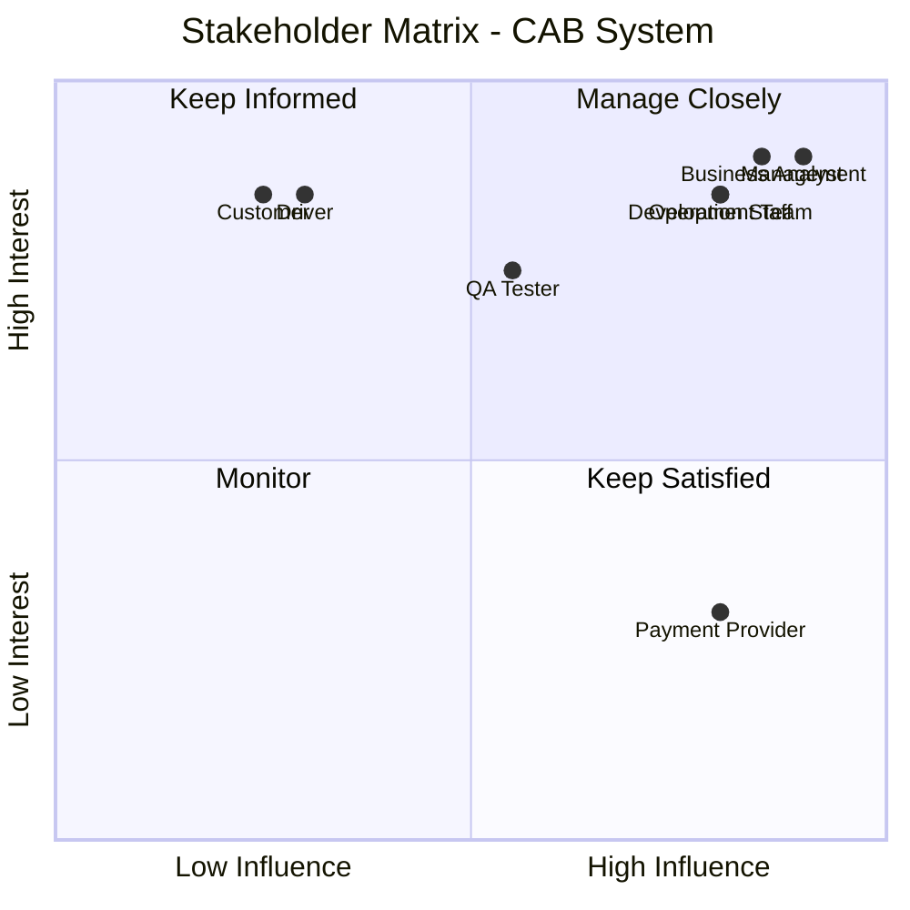
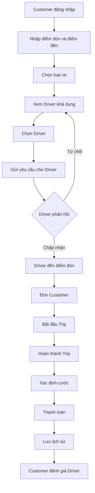
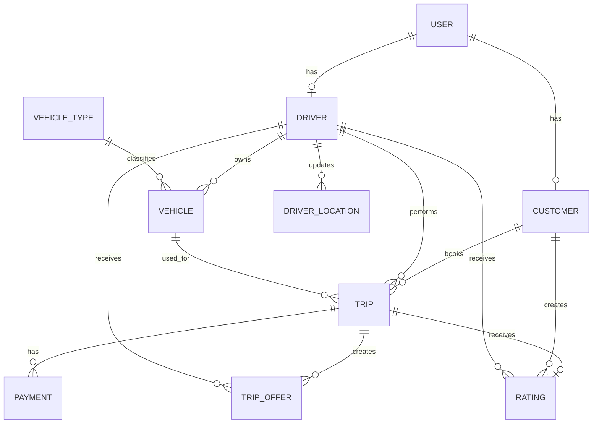
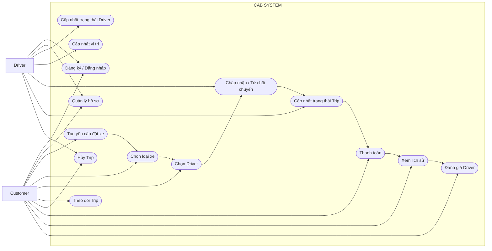

# CAB SYSTEM

---

# B1. XÁC ĐỊNH STAKEHOLDER

Stakeholder là các cá nhân, nhóm hoặc tổ chức có liên quan đến việc sử dụng, vận hành, quản lý và phát triển CAB System.

| STT | Stakeholder | Vai trò |
|---:|---|---|
| 1 | Customer | Đăng ký tài khoản, đặt xe, lựa chọn loại xe, lựa chọn Driver khả dụng, theo dõi chuyến đi, thanh toán và đánh giá Driver. |
| 2 | Driver | Quản lý thông tin cá nhân, phương tiện, trạng thái hoạt động, vị trí, tiếp nhận và thực hiện chuyến đi. |
| 3 | Operation Staff | Theo dõi hoạt động của Customer, Driver và Trip; hỗ trợ xử lý sự cố khi cần. |
| 4 | Management | Theo dõi tình hình vận hành và đánh giá kết quả của hệ thống. |
| 5 | Business Analyst | Thu thập, phân tích, mô hình hóa và quản lý yêu cầu. |
| 6 | Development Team | Thiết kế, lập trình và triển khai CAB System. |
| 7 | QA / Tester | Kiểm thử và xác nhận hệ thống đáp ứng yêu cầu. |
| 8 | Payment Provider | Hỗ trợ xử lý thanh toán điện tử trong trường hợp được sử dụng. |

---

# B2. STAKEHOLDER MATRIX

## 2.1. Stakeholder Matrix

| Stakeholder | Influence | Interest | Chiến lược quản lý |
|---|---|---|---|
| Customer | Low | High | Keep Informed |
| Driver | Low | High | Keep Informed |
| Operation Staff | High | High | Manage Closely |
| Management | High | High | Manage Closely |
| Business Analyst | High | High | Manage Closely |
| Development Team | High | High | Manage Closely |
| QA / Tester | Medium | High | Keep Informed |
| Payment Provider | High | Low | Keep Satisfied |

## 2.2. Mermaid Stakeholder Matrix



---

# B3. CHUYỂN YÊU CẦU KHÁCH HÀNG THÀNH MỤC TIÊU NGHIỆP VỤ

> Quy ước mã: `BR-Gxx` được sử dụng cho Business Goal để tránh trùng với Business Requirement ở B5.

| Mã | Mục tiêu nghiệp vụ | Mô tả |
|---|---|---|
| BR-G01 | Xây dựng nền tảng đặt xe trực tuyến | Cho phép Customer thực hiện quy trình đặt xe trực tiếp trên hệ thống. |
| BR-G02 | Đơn giản hóa việc lựa chọn và phân công Driver | Cho phép Customer lựa chọn Driver đang khả dụng mà chưa cần thuật toán tối ưu Driver tốt nhất trong MVP. |
| BR-G03 | Theo dõi quá trình thực hiện chuyến đi | Customer có thể biết Driver và trạng thái hiện tại của Trip. |
| BR-G04 | Quản lý cước phí và thanh toán | Ghi nhận cước và hỗ trợ phương thức thanh toán trong phạm vi MVP. |
| BR-G05 | Quản lý Customer và Driver | Tập trung dữ liệu Customer, Driver, Vehicle và các Trip liên quan. |
| BR-G06 | Đảm bảo hệ thống MVP hoạt động ổn định | Ưu tiên quy trình nghiệp vụ hoạt động đúng, an toàn và dễ mở rộng thay vì tối ưu nâng cao. |

---

# B4. GIỚI HẠN PHẠM VI MVP

CAB System được giới hạn thành **2 module nghiệp vụ chính** để phù hợp với giai đoạn MVP.

## 4.1. Module M01 – Quản lý khách hàng

Bao gồm:

- Đăng ký và đăng nhập.
- Xem/cập nhật hồ sơ Customer.
- Nhập điểm đón và điểm đến.
- Lựa chọn loại xe.
- Xem các Driver đang khả dụng.
- Lựa chọn Driver.
- Tạo yêu cầu đặt xe.
- Theo dõi trạng thái Trip.
- Hủy Trip.
- Thanh toán.
- Xem lịch sử Trip.
- Đánh giá Driver.

## 4.2. Module M02 – Quản lý tài xế

Bao gồm:

- Đăng ký/đăng nhập Driver.
- Quản lý hồ sơ Driver.
- Quản lý Vehicle.
- Cập nhật trạng thái hoạt động.
- Cập nhật vị trí.
- Nhận yêu cầu chuyến.
- Chấp nhận hoặc từ chối chuyến.
- Cập nhật trạng thái Trip.
- Hoàn thành Trip.

## 4.3. Giới hạn MVP

Trong giai đoạn MVP:

- Không yêu cầu AI/ML để tìm Driver tốt nhất.
- Không yêu cầu thuật toán xếp hạng Driver phức tạp.
- Chỉ cần xác định Driver đang `AVAILABLE`.
- Customer có thể lựa chọn Driver khả dụng.
- Chỉ cần bảo đảm quy trình đặt xe có thể hoạt động từ đầu đến cuối.
- Chưa triển khai Dynamic Pricing.
- Chưa triển khai Loyalty/Reward.
- Chưa triển khai Business Intelligence nâng cao.
- Chưa hỗ trợ nhiều Payment Provider cùng lúc.

### Luồng MVP

```text
Đăng nhập
   ↓
Nhập thông tin chuyến
   ↓
Chọn loại xe
   ↓
Xem Driver khả dụng
   ↓
Chọn Driver
   ↓
Driver chấp nhận
   ↓
Thực hiện Trip
   ↓
Hoàn thành
   ↓
Thanh toán
   ↓
Đánh giá
```

---

# B5. BUSINESS REQUIREMENTS

Có **9 Business Requirements chính** trong phạm vi MVP.

| Mã | Business Requirement | Mô tả |
|---|---|---|
| BR-01 | Quản lý tài khoản Customer | Hệ thống phải hỗ trợ Customer đăng ký, đăng nhập và quản lý thông tin cá nhân. |
| BR-02 | Quản lý Driver | Hệ thống phải quản lý thông tin Driver, trạng thái hoạt động và vị trí hiện tại. |
| BR-03 | Tạo yêu cầu đặt xe | Customer phải có thể nhập thông tin và tạo yêu cầu đặt xe. |
| BR-04 | Lựa chọn loại xe | Customer phải có thể lựa chọn loại Vehicle phù hợp trước khi đặt xe. |
| BR-05 | Lựa chọn Driver | Customer phải có thể xem và lựa chọn một Driver đang khả dụng trong phạm vi MVP. |
| BR-06 | Driver phản hồi chuyến | Driver phải có thể chấp nhận hoặc từ chối yêu cầu chuyến được gửi đến. |
| BR-07 | Quản lý Trip | Hệ thống phải quản lý trạng thái Trip từ khi Driver nhận chuyến đến khi hoàn thành hoặc bị hủy. |
| BR-08 | Quản lý cước và thanh toán | Hệ thống phải ghi nhận cước và hỗ trợ thanh toán cho Trip hoàn thành. |
| BR-09 | Lịch sử và đánh giá | Customer phải có thể xem lịch sử Trip và đánh giá Driver sau chuyến hoàn thành. |

---

# B6. MÔ HÌNH HÓA NGHIỆP VỤ

Mỗi Business Requirement chính được ánh xạ thành một Business Process.

| Mã | Business Process | BR | Luồng chính |
|---|---|---|---|
| BP-01 | Quản lý tài khoản Customer | BR-01 | Đăng ký → Đăng nhập → Xem/Cập nhật hồ sơ |
| BP-02 | Quản lý Driver | BR-02 | Đăng nhập → Cập nhật trạng thái → Cập nhật vị trí |
| BP-03 | Tạo yêu cầu đặt xe | BR-03 | Nhập điểm đón → Nhập điểm đến → Xác nhận |
| BP-04 | Lựa chọn loại xe | BR-04 | Xem loại xe → Chọn loại xe |
| BP-05 | Lựa chọn Driver | BR-05 | Xem Driver khả dụng → Chọn Driver → Gửi yêu cầu |
| BP-06 | Driver phản hồi chuyến | BR-06 | Nhận yêu cầu → Chấp nhận/Từ chối |
| BP-07 | Thực hiện Trip | BR-07 | Driver đến → Đón khách → Bắt đầu → Hoàn thành |
| BP-08 | Thanh toán | BR-08 | Xác định cước → Chọn phương thức → Thanh toán |
| BP-09 | Lịch sử và đánh giá | BR-09 | Xem lịch sử → Xem chi tiết → Đánh giá |

## 6.1. Quy trình nghiệp vụ tổng thể



---

# B7. FUNCTIONAL REQUIREMENTS

## BP-01 – Quản lý tài khoản Customer

| Mã | Functional Requirement |
|---|---|
| FR01 | Hệ thống cho phép Customer đăng ký tài khoản. |
| FR02 | Hệ thống cho phép Customer đăng nhập. |
| FR03 | Hệ thống cho phép Customer đăng xuất. |
| FR04 | Customer có thể xem thông tin cá nhân. |
| FR05 | Customer có thể cập nhật các thông tin cá nhân được phép. |

## BP-02 – Quản lý Driver

| Mã | Functional Requirement |
|---|---|
| FR06 | Driver có thể đăng nhập hệ thống. |
| FR07 | Driver có thể xem/cập nhật thông tin cá nhân được phép. |
| FR08 | Driver có thể cập nhật trạng thái `AVAILABLE/UNAVAILABLE`. |
| FR09 | Driver có thể cập nhật vị trí hiện tại. |
| FR10 | Driver có thể xem thông tin Vehicle của mình. |

## BP-03 – Tạo yêu cầu đặt xe

| Mã | Functional Requirement |
|---|---|
| FR11 | Customer có thể nhập điểm đón. |
| FR12 | Customer có thể nhập điểm đến. |
| FR13 | Customer có thể xem lại thông tin chuyến trước khi xác nhận. |
| FR14 | Customer có thể tạo yêu cầu đặt xe. |
| FR15 | Customer có thể hủy yêu cầu đặt xe khi được phép. |

## BP-04 – Lựa chọn loại xe

| Mã | Functional Requirement |
|---|---|
| FR16 | Hệ thống hiển thị danh sách loại Vehicle được hỗ trợ. |
| FR17 | Customer có thể lựa chọn một loại Vehicle cho Trip. |

## BP-05 – Lựa chọn Driver

| Mã | Functional Requirement |
|---|---|
| FR18 | Hệ thống hiển thị danh sách Driver đang `AVAILABLE`. |
| FR19 | Customer có thể xem thông tin cơ bản của Driver. |
| FR20 | Customer có thể lựa chọn một Driver khả dụng. |
| FR21 | Hệ thống gửi yêu cầu chuyến cho Driver được chọn. |

## BP-06 – Driver phản hồi chuyến

| Mã | Functional Requirement |
|---|---|
| FR22 | Driver có thể xem yêu cầu chuyến được gửi đến. |
| FR23 | Driver có thể chấp nhận yêu cầu chuyến. |
| FR24 | Driver có thể từ chối yêu cầu chuyến. |
| FR25 | Nếu Driver từ chối, Customer có thể lựa chọn Driver khác. |

## BP-07 – Quản lý Trip

| Mã | Functional Requirement |
|---|---|
| FR26 | Customer có thể xem Driver được phân công cho Trip. |
| FR27 | Customer có thể xem trạng thái hiện tại của Trip. |
| FR28 | Driver có thể xác nhận đã đến điểm đón. |
| FR29 | Driver có thể xác nhận đã đón Customer. |
| FR30 | Driver có thể bắt đầu Trip. |
| FR31 | Driver có thể hoàn thành Trip. |
| FR32 | Customer hoặc Driver có thể hủy Trip theo chính sách. |

## BP-08 – Thanh toán

| Mã | Functional Requirement |
|---|---|
| FR33 | Hệ thống ghi nhận cước cuối cùng khi Trip hoàn thành. |
| FR34 | Customer có thể xem cước Trip. |
| FR35 | Customer có thể lựa chọn phương thức thanh toán. |
| FR36 | Hệ thống hỗ trợ thanh toán tiền mặt. |
| FR37 | Hệ thống hỗ trợ thanh toán điện tử trong phạm vi MVP. |
| FR38 | Hệ thống lưu kết quả giao dịch. |

## BP-09 – Lịch sử và đánh giá

| Mã | Functional Requirement |
|---|---|
| FR39 | Customer có thể xem lịch sử Trip. |
| FR40 | Customer có thể xem chi tiết Trip đã thực hiện. |
| FR41 | Customer có thể đánh giá Driver sau khi Trip hoàn thành. |
| FR42 | Customer có thể xem Rating đã gửi. |

---

# B8. BUSINESS RULES

| Mã | Business Rule |
|---|---|
| RULE-01 | Người dùng phải đăng nhập trước khi sử dụng các chức năng yêu cầu xác thực. |
| RULE-02 | Mỗi Customer chỉ được có một Trip đang hoạt động tại một thời điểm. |
| RULE-03 | Chỉ Driver ở trạng thái `AVAILABLE` mới xuất hiện trong danh sách lựa chọn. |
| RULE-04 | Driver đang thực hiện Trip không được nhận Trip mới. |
| RULE-05 | Driver được Customer lựa chọn phải phù hợp với loại Vehicle đã chọn. |
| RULE-06 | Một yêu cầu Trip chỉ được gửi cho Driver hợp lệ. |
| RULE-07 | Nếu Driver từ chối yêu cầu, Customer được phép lựa chọn Driver khác. |
| RULE-08 | Trip chỉ được bắt đầu sau khi Driver đã chấp nhận chuyến. |
| RULE-09 | Trạng thái Trip phải thay đổi theo đúng trình tự nghiệp vụ. |
| RULE-10 | Cước cuối cùng chỉ được ghi nhận sau khi Trip hoàn thành. |
| RULE-11 | Chỉ sử dụng phương thức thanh toán được CAB System hỗ trợ. |
| RULE-12 | Hệ thống không lưu thông tin thanh toán nhạy cảm. |
| RULE-13 | Chỉ Customer của Trip mới được đánh giá Driver của Trip đó. |
| RULE-14 | Chỉ được đánh giá Driver sau khi Trip hoàn thành. |
| RULE-15 | Mỗi Trip chỉ có tối đa một Rating chính thức. |

## Vòng đời Trip

```text
CREATED
   ↓
DRIVER_SELECTED
   ↓
DRIVER_ASSIGNED
   ↓
DRIVER_ARRIVED
   ↓
PASSENGER_PICKED_UP
   ↓
IN_PROGRESS
   ↓
COMPLETED
```

`CANCELLED` được sử dụng khi Trip bị hủy theo chính sách.

---

# B9. NON-FUNCTIONAL REQUIREMENTS

| Mã | Nhóm | Yêu cầu |
|---|---|---|
| NFR-01 | Performance | Các thao tác thông thường phải có thời gian phản hồi phù hợp với trải nghiệm người dùng. |
| NFR-02 | Performance | Việc tải danh sách Driver khả dụng phải đáp ứng đủ nhanh cho luồng đặt xe. |
| NFR-03 | Availability | Hệ thống phải duy trì hoạt động ổn định trong quá trình đặt và thực hiện Trip. |
| NFR-04 | Reliability | Dữ liệu trạng thái Trip phải nhất quán giữa Customer và Driver. |
| NFR-05 | Security | Người dùng phải được xác thực trước khi truy cập dữ liệu cá nhân. |
| NFR-06 | Security | Customer chỉ được truy cập Trip của mình. |
| NFR-07 | Security | Driver chỉ được cập nhật Trip được giao cho mình. |
| NFR-08 | Security | Thông tin thanh toán nhạy cảm không được lưu trực tiếp. |
| NFR-09 | Scalability | Hệ thống phải có khả năng mở rộng số lượng Customer và Driver trong tương lai. |
| NFR-10 | Maintainability | Hai module Customer và Driver phải được thiết kế rõ ràng, hạn chế phụ thuộc không cần thiết. |
| NFR-11 | Usability | Giao diện phải dễ hiểu và hiển thị rõ trạng thái Trip. |
| NFR-12 | Extensibility | Có thể bổ sung thuật toán Matching nâng cao sau MVP mà không thay đổi toàn bộ hệ thống. |

> Các giá trị định lượng như thời gian phản hồi tối đa, số lượng người dùng đồng thời và mức availability sẽ được xác định sau (`TBD`).

---

# B10. ENTITY MODEL VÀ ERD

## 10.1. Entity

| Entity | Mô tả |
|---|---|
| User | Thông tin tài khoản chung. |
| Customer | Thông tin Customer. |
| Driver | Thông tin Driver. |
| Vehicle | Phương tiện của Driver. |
| VehicleType | Loại phương tiện. |
| DriverLocation | Vị trí hiện tại/lịch sử vị trí của Driver. |
| Trip | Thông tin chuyến đi. |
| TripOffer | Yêu cầu chuyến được gửi cho Driver. |
| Payment | Giao dịch thanh toán. |
| Rating | Đánh giá Driver. |

## 10.2. ERD



---

# B11. THIẾT KẾ USE CASE

## 11.1. Danh sách Use Case

| Mã | Use Case | Actor |
|---|---|---|
| UC01 | Đăng ký tài khoản | Customer |
| UC02 | Đăng nhập | Customer, Driver |
| UC03 | Quản lý thông tin cá nhân | Customer, Driver |
| UC04 | Tạo yêu cầu đặt xe | Customer |
| UC05 | Chọn loại xe | Customer |
| UC06 | Chọn Driver | Customer |
| UC07 | Chấp nhận/Từ chối chuyến | Driver |
| UC08 | Cập nhật trạng thái hoạt động | Driver |
| UC09 | Cập nhật vị trí | Driver |
| UC10 | Theo dõi Trip | Customer |
| UC11 | Cập nhật trạng thái Trip | Driver |
| UC12 | Hủy Trip | Customer, Driver |
| UC13 | Thanh toán | Customer |
| UC14 | Xem lịch sử Trip | Customer |
| UC15 | Đánh giá Driver | Customer |

## 11.2. Use Case Diagram



---

# B12. ACCEPTANCE CRITERIA

| AC | FR | Tiêu chí chấp nhận |
|---|---|---|
| AC01 | FR01 | Khi Customer nhập dữ liệu đăng ký hợp lệ, hệ thống tạo tài khoản thành công. |
| AC02 | FR02 | Với thông tin đăng nhập hợp lệ, Customer đăng nhập thành công. |
| AC03 | FR03 | Khi đăng xuất, phiên đăng nhập hiện tại không còn được sử dụng. |
| AC04 | FR04 | Customer xem được thông tin hồ sơ của chính mình. |
| AC05 | FR05 | Thông tin được phép chỉnh sửa được lưu thành công. |
| AC06 | FR06 | Driver đăng nhập thành công bằng tài khoản hợp lệ. |
| AC07 | FR07 | Driver xem/cập nhật được thông tin cá nhân được phép. |
| AC08 | FR08 | Driver chuyển được giữa trạng thái AVAILABLE và UNAVAILABLE khi hợp lệ. |
| AC09 | FR09 | Vị trí mới của Driver được hệ thống ghi nhận. |
| AC10 | FR10 | Driver xem được thông tin Vehicle của mình. |
| AC11 | FR11 | Customer nhập được điểm đón hợp lệ. |
| AC12 | FR12 | Customer nhập được điểm đến hợp lệ. |
| AC13 | FR13 | Hệ thống hiển thị lại đúng thông tin Trip trước khi xác nhận. |
| AC14 | FR14 | Khi thông tin hợp lệ, hệ thống tạo Trip mới thành công. |
| AC15 | FR15 | Customer có thể hủy yêu cầu khi trạng thái cho phép. |
| AC16 | FR16 | Hệ thống hiển thị các Vehicle Type được hỗ trợ. |
| AC17 | FR17 | Vehicle Type Customer chọn được lưu vào Trip. |
| AC18 | FR18 | Danh sách chỉ hiển thị Driver đang AVAILABLE và phù hợp loại xe. |
| AC19 | FR19 | Customer xem được thông tin cơ bản cần thiết của Driver. |
| AC20 | FR20 | Customer chọn được một Driver hợp lệ. |
| AC21 | FR21 | Sau khi chọn Driver, hệ thống tạo và gửi yêu cầu chuyến. |
| AC22 | FR22 | Driver xem được thông tin yêu cầu chuyến được gửi cho mình. |
| AC23 | FR23 | Khi Driver chấp nhận, Driver được gán cho Trip. |
| AC24 | FR24 | Khi Driver từ chối, Trip không được gán cho Driver đó. |
| AC25 | FR25 | Sau khi Driver từ chối, Customer có thể chọn Driver khác. |
| AC26 | FR26 | Customer xem được thông tin Driver đã nhận Trip. |
| AC27 | FR27 | Customer xem được đúng trạng thái Trip hiện tại. |
| AC28 | FR28 | Driver cập nhật thành công trạng thái đã đến điểm đón. |
| AC29 | FR29 | Driver cập nhật thành công trạng thái đã đón Customer. |
| AC30 | FR30 | Trip chuyển sang IN_PROGRESS khi Driver bắt đầu chuyến hợp lệ. |
| AC31 | FR31 | Trip chuyển sang COMPLETED khi Driver hoàn thành chuyến hợp lệ. |
| AC32 | FR32 | Trip chuyển sang CANCELLED khi yêu cầu hủy hợp lệ. |
| AC33 | FR33 | Cước cuối được ghi nhận sau khi Trip hoàn thành. |
| AC34 | FR34 | Customer xem được cước của Trip. |
| AC35 | FR35 | Customer lựa chọn được phương thức thanh toán được hỗ trợ. |
| AC36 | FR36 | Hệ thống ghi nhận được thanh toán tiền mặt. |
| AC37 | FR37 | Hệ thống xử lý được thanh toán điện tử trong phạm vi MVP. |
| AC38 | FR38 | Kết quả giao dịch được lưu và liên kết đúng Trip. |
| AC39 | FR39 | Customer xem được danh sách các Trip trước đây. |
| AC40 | FR40 | Customer xem được chi tiết một Trip trong lịch sử. |
| AC41 | FR41 | Customer chỉ đánh giá được Driver sau Trip hoàn thành. |
| AC42 | FR42 | Customer xem được Rating đã gửi cho Trip. |

---

# B13. REQUIREMENTS TRACEABILITY MATRIX

| Business Goal | Business Requirement | BP | FR | UC | AC |
|---|---|---|---|---|---|
| BR-G01, BR-G05 | BR-01 Quản lý tài khoản Customer | BP-01 | FR01–FR05 | UC01–UC03 | AC01–AC05 |
| BR-G05, BR-G06 | BR-02 Quản lý Driver | BP-02 | FR06–FR10 | UC02, UC03, UC08, UC09 | AC06–AC10 |
| BR-G01 | BR-03 Tạo yêu cầu đặt xe | BP-03 | FR11–FR15 | UC04, UC12 | AC11–AC15 |
| BR-G01 | BR-04 Lựa chọn loại xe | BP-04 | FR16–FR17 | UC05 | AC16–AC17 |
| BR-G02 | BR-05 Lựa chọn Driver | BP-05 | FR18–FR21 | UC06 | AC18–AC21 |
| BR-G02 | BR-06 Driver phản hồi chuyến | BP-06 | FR22–FR25 | UC07 | AC22–AC25 |
| BR-G03 | BR-07 Quản lý Trip | BP-07 | FR26–FR32 | UC10–UC12 | AC26–AC32 |
| BR-G04 | BR-08 Cước và thanh toán | BP-08 | FR33–FR38 | UC13 | AC33–AC38 |
| BR-G01, BR-G03 | BR-09 Lịch sử và đánh giá | BP-09 | FR39–FR42 | UC14–UC15 | AC39–AC42 |

---

# B14. TEST CASE

Test Case chưa thực hiện trong giai đoạn hiện tại.

Test Case sẽ được xây dựng ở giai đoạn kiểm thử dựa trên:

- Functional Requirements.
- Business Rules.
- Acceptance Criteria.
- Exception Case.
- Use Case Specification.

Chuỗi truy vết dự kiến:

```text
Business Goal
      ↓
Business Requirement
      ↓
Business Process
      ↓
Functional Requirement
      ↓
Use Case
      ↓
Acceptance Criteria
      ↓
Test Case
```
