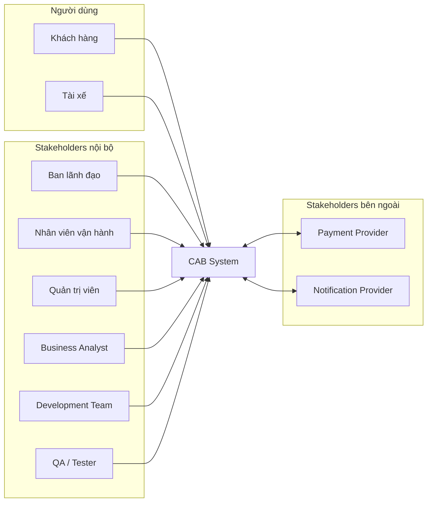
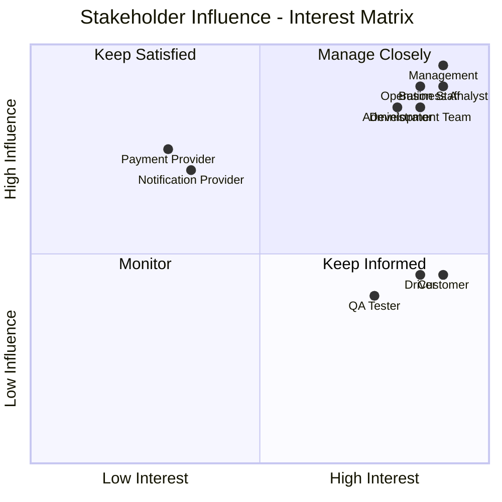
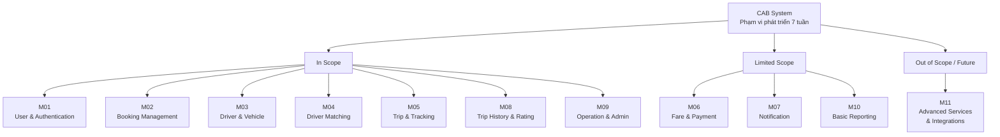

## 3. Stakeholders

### 3.1. Danh sách Stakeholders và vai trò

Các bên liên quan đến quá trình xây dựng, vận hành và sử dụng CAB System được xác định như sau:

| STT | Stakeholder | Vai trò / Mối quan tâm |
|---|---|---|
| 1 | **Khách hàng (Customer/Passenger)** | Sử dụng hệ thống để đặt xe, theo dõi chuyến đi, thanh toán, xem lịch sử chuyến và đánh giá tài xế. Quan tâm đến tính thuận tiện, chính xác và an toàn của dịch vụ. |
| 2 | **Tài xế (Driver)** | Cập nhật hồ sơ, phương tiện, trạng thái hoạt động và vị trí; nhận hoặc từ chối yêu cầu chuyến; thực hiện và cập nhật trạng thái chuyến đi. |
| 3 | **Nhân viên vận hành (Operation Staff)** | Quản lý khách hàng, tài xế, phương tiện và chuyến đi; giám sát hoạt động và hỗ trợ xử lý các trường hợp bất thường hoặc chuyến đi gặp sự cố. |
| 4 | **Quản trị viên (Administrator)** | Quản lý tài khoản, phân quyền, kiểm soát quyền truy cập, theo dõi nhật ký và thực hiện các chức năng quản trị hệ thống. |
| 5 | **Ban lãnh đạo Công ty ABC (Management)** | Đưa ra mục tiêu và định hướng của dự án; theo dõi số lượng chuyến, doanh thu, tỷ lệ hoàn thành, tỷ lệ hủy và hiệu quả hoạt động của tài xế. |
| 6 | **Nhà cung cấp thanh toán (Payment Provider)** | Cung cấp dịch vụ thanh toán điện tử, xử lý giao dịch và trả kết quả thanh toán cho CAB System mà không yêu cầu hệ thống lưu trực tiếp thông tin thanh toán nhạy cảm. |
| 7 | **Nhà cung cấp thông báo (Notification Provider)** | Cung cấp dịch vụ gửi thông báo cho khách hàng và tài xế thông qua các kênh như Push Notification, SMS hoặc Email. |
| 8 | **Business Analyst (BA)** | Thu thập, phân tích và làm rõ yêu cầu; xác định phạm vi, quy trình nghiệp vụ, quy tắc nghiệp vụ, ngoại lệ và các vấn đề cần xác nhận với khách hàng. |
| 9 | **Nhóm phát triển (Development Team)** | Thiết kế kiến trúc, xây dựng, tích hợp và triển khai CAB System dựa trên các yêu cầu đã được thống nhất. |
| 10 | **Nhóm kiểm thử (QA/Tester)** | Kiểm thử chức năng, tích hợp, hiệu năng, bảo mật và độ ổn định nhằm đảm bảo hệ thống đáp ứng các yêu cầu đã xác định. |

---

### 3.2. Stakeholder Matrix

Stakeholders được đánh giá dựa trên hai tiêu chí:

- **Influence:** Mức độ ảnh hưởng của Stakeholder đến dự án và các quyết định của hệ thống.
- **Interest:** Mức độ quan tâm và mức độ chịu ảnh hưởng bởi kết quả của dự án.

| Stakeholder | Influence | Interest | Nhóm quản lý | Cách tương tác |
|---|---|---|---|---|
| **Ban lãnh đạo Công ty ABC** | High | High | Manage Closely | Thường xuyên trao đổi, báo cáo tiến độ và xác nhận các quyết định nghiệp vụ quan trọng. |
| **Nhân viên vận hành** | High | High | Manage Closely | Phỏng vấn và trao đổi thường xuyên để xác nhận quy trình vận hành và các trường hợp ngoại lệ. |
| **Quản trị viên** | High | High | Manage Closely | Làm rõ các yêu cầu về quản trị, phân quyền, bảo mật và kiểm soát hệ thống. |
| **Business Analyst** | High | High | Manage Closely | Phối hợp với các bên để thu thập, phân tích, quản lý và xác nhận yêu cầu. |
| **Development Team** | High | High | Manage Closely | Phối hợp với BA để đánh giá tính khả thi và triển khai các yêu cầu đã được xác nhận. |
| **Payment Provider** | High | Low | Keep Satisfied | Làm rõ API, quy trình thanh toán, bảo mật và xử lý các giao dịch thất bại. |
| **Notification Provider** | High | Low | Keep Satisfied | Làm rõ API, kênh thông báo và cơ chế tích hợp. |
| **Khách hàng** | Low | High | Keep Informed | Thu thập nhu cầu và phản hồi về đặt xe, theo dõi chuyến và thanh toán. |
| **Tài xế** | Low | High | Keep Informed | Thu thập yêu cầu và phản hồi về nhận chuyến, vị trí và trạng thái chuyến. |
| **QA/Tester** | Low | High | Keep Informed | Cập nhật thay đổi yêu cầu và phối hợp xây dựng các trường hợp kiểm thử. |

---

### 3.3. Phân loại Stakeholders theo Influence – Interest Matrix

| | **Interest thấp (Low)** | **Interest cao (High)** |
|---|---|---|
| **Influence cao (High)** | **Keep Satisfied:** Payment Provider, Notification Provider | **Manage Closely:** Management, Operation Staff, Administrator, BA, Development Team |
| **Influence thấp (Low)** | **Monitor:** Các bên hỗ trợ khác nếu phát sinh | **Keep Informed:** Customer, Driver, QA/Tester |

---

### 3.4. Sơ đồ Stakeholders

---

### 3.5. Sơ đồ Stakeholder Matrix

---

## 4. Business Goals

### 4.1. Mục tiêu nghiệp vụ

Từ các yêu cầu quan trọng của Công ty ABC, các mục tiêu nghiệp vụ chính của CAB System được xác định như sau:

| Mã | Business Goal | Mô tả |
|---|---|---|
| **BG-01** | **Xây dựng nền tảng đặt xe trực tuyến toàn diện** | Hỗ trợ toàn bộ quy trình từ khi khách hàng tạo yêu cầu đặt xe, tìm tài xế, thực hiện chuyến, tính cước, thanh toán đến đánh giá sau chuyến. |
| **BG-02** | **Tự động hóa quá trình tìm và phân công tài xế** | Tự động xác định và ưu tiên tài xế phù hợp dựa trên vị trí và trạng thái sẵn sàng; tiếp tục tìm tài xế khác khi tài xế trước từ chối hoặc không phản hồi. |
| **BG-03** | **Nâng cao trải nghiệm đặt xe và theo dõi chuyến đi** | Cho phép khách hàng theo dõi tài xế, ETA và trạng thái chuyến; đồng thời nhận thông báo tại các thời điểm quan trọng. |
| **BG-04** | **Quản lý tập trung cước phí và thanh toán** | Hỗ trợ tính cước, quản lý giao dịch, thanh toán tiền mặt và thanh toán điện tử thông qua nhà cung cấp bên ngoài. |
| **BG-05** | **Nâng cao hiệu quả quản lý và vận hành dịch vụ** | Quản lý tập trung khách hàng, tài xế, phương tiện, chuyến đi và giao dịch; hỗ trợ giám sát, xử lý sự cố và báo cáo hoạt động. |
| **BG-06** | **Xây dựng nền tảng ổn định, bảo mật và có khả năng mở rộng lâu dài** | Đảm bảo hệ thống có thể phục vụ số lượng lớn người dùng, bảo vệ dữ liệu, hạn chế ảnh hưởng khi một thành phần gặp lỗi và hỗ trợ mở rộng trong tương lai. |

---

### 4.2. Chuyển đổi yêu cầu khách hàng thành Business Goals

| Yêu cầu quan trọng của khách hàng | Business Goal |
|---|---|
| Xây dựng nền tảng hỗ trợ đầy đủ quy trình đặt và thực hiện chuyến xe. | **BG-01** |
| Giảm việc phân công thủ công và tự động tìm tài xế phù hợp. | **BG-02** |
| Cho phép khách hàng theo dõi tài xế, ETA, trạng thái chuyến và nhận thông báo. | **BG-03** |
| Quản lý tập trung tính cước, giao dịch và thanh toán. | **BG-04** |
| Hỗ trợ quản lý, giám sát, xử lý sự cố và báo cáo kinh doanh. | **BG-05** |
| Đảm bảo hệ thống ổn định, bảo mật và có khả năng mở rộng. | **BG-06** |

---

### 4.3. Liên kết Business Goals với Stakeholders

| Business Goal | Stakeholders liên quan chính |
|---|---|
| **BG-01** | Customer, Driver, Operation Staff, Management |
| **BG-02** | Customer, Driver, Operation Staff |
| **BG-03** | Customer, Driver, Notification Provider |
| **BG-04** | Customer, Operation Staff, Payment Provider |
| **BG-05** | Operation Staff, Administrator, Management |
| **BG-06** | Administrator, Management, Development Team |

---

### 4.4. Ưu tiên Business Goals

| Business Goal | Mức ưu tiên | Lý do |
|---|---|---|
| **BG-01** | **Must Have** | Là mục tiêu cốt lõi để hình thành quy trình đặt xe hoàn chỉnh. |
| **BG-02** | **Must Have** | Giải quyết hạn chế phân công tài xế thủ công của hệ thống hiện tại. |
| **BG-03** | **Must Have** | Đảm bảo khách hàng và tài xế có thể theo dõi và phối hợp trong chuyến đi. |
| **BG-04** | **Must Have** | Tính cước và thanh toán cần thiết để hoàn thành chuyến đi. |
| **BG-05** | **Should Have** | Cần thiết cho vận hành, nhưng báo cáo nâng cao có thể phát triển sau. |
| **BG-06** | **Should Have** | Cần thiết về kiến trúc, bảo mật và khả năng phát triển lâu dài. |

---

## 5. Phạm vi phát triển hệ thống

### 5.1. Xác định phạm vi

Dựa trên các Business Goals và thời gian phát triển **7 tuần**, CAB System tập trung vào các module cốt lõi để hoàn thành quy trình đặt xe.

Các chức năng có độ phức tạp cao được giới hạn hoặc chuyển sang phiên bản tiếp theo nhằm đảm bảo tính khả thi của dự án.

---

### 5.2. Phạm vi các Module

| Mã | Module | BG liên quan | Phạm vi | Nội dung triển khai |
|---|---|---|---|---|
| **M01** | **User & Authentication** | BG-01, BG-06 | **In Scope** | Đăng ký, đăng nhập, cập nhật hồ sơ, xác thực và phân quyền cơ bản. |
| **M02** | **Booking Management** | BG-01 | **In Scope** | Nhập điểm đón, điểm đến, chọn loại xe và tạo yêu cầu đặt xe. |
| **M03** | **Driver & Vehicle Management** | BG-01, BG-02 | **In Scope** | Quản lý hồ sơ tài xế, phương tiện, trạng thái hoạt động và vị trí. |
| **M04** | **Driver Matching & Dispatch** | BG-02 | **In Scope** | Tìm tài xế khả dụng gần khách hàng và tìm tài xế khác khi tài xế trước từ chối hoặc không phản hồi. |
| **M05** | **Trip Management & Tracking** | BG-01, BG-03 | **In Scope** | Quản lý trạng thái chuyến từ lúc tìm tài xế đến khi hoàn thành hoặc hủy. |
| **M06** | **Fare & Payment** | BG-04 | **Limited Scope** | Tính cước cơ bản, thanh toán tiền mặt và tích hợp **01 Payment Provider**. |
| **M07** | **Notification** | BG-03 | **Limited Scope** | Thông báo các sự kiện quan trọng của chuyến qua **01 kênh thông báo chính**. |
| **M08** | **Trip History & Rating** | BG-01, BG-03 | **In Scope** | Xem lịch sử chuyến và đánh giá tài xế sau chuyến. |
| **M09** | **Operation & Administration** | BG-05, BG-06 | **In Scope** | Quản lý Customer, Driver, Vehicle, Trip; theo dõi chuyến và phân quyền quản trị cơ bản. |
| **M10** | **Reporting & Analytics** | BG-05 | **Limited Scope** | Báo cáo cơ bản về số chuyến, doanh thu, tỷ lệ hoàn thành, tỷ lệ hủy và hiệu quả tài xế. |
| **M11** | **Advanced Services & Integrations** | BG-06 | **Out of Scope** | Các dịch vụ và tích hợp nâng cao được phát triển trong phiên bản sau. |

---

### 5.3. Phân loại phạm vi

#### 5.3.1. In Scope

Các module ưu tiên phát triển:

- **M01 – User & Authentication**
- **M02 – Booking Management**
- **M03 – Driver & Vehicle Management**
- **M04 – Driver Matching & Dispatch**
- **M05 – Trip Management & Tracking**
- **M08 – Trip History & Rating**
- **M09 – Operation & Administration**

Luồng nghiệp vụ chính:

**Đặt xe → Tìm tài xế → Tài xế nhận chuyến → Thực hiện chuyến → Hoàn thành chuyến.**

#### 5.3.2. Limited Scope

- **M06 – Fare & Payment:** tính cước cơ bản, tiền mặt và **01 Payment Provider**.
- **M07 – Notification:** triển khai **01 kênh thông báo chính**.
- **M10 – Reporting & Analytics:** chỉ triển khai báo cáo cơ bản.

#### 5.3.3. Out of Scope

Các chức năng chưa triển khai trong phiên bản 7 tuần:

- Nhiều Payment Provider.
- Nhiều Notification Provider/kênh thông báo.
- AI/ML nâng cao cho Driver Matching.
- Dynamic Pricing/Surge Pricing phức tạp.
- Advanced Analytics và Business Intelligence.
- Các loại dịch vụ vận chuyển mới.
- Các tích hợp bên thứ ba nâng cao.

---

### 5.4. Liên kết Business Goals với Module

| Business Goal | Module đáp ứng |
|---|---|
| **BG-01** | M01, M02, M03, M05, M08 |
| **BG-02** | M03, M04 |
| **BG-03** | M05, M07, M08 |
| **BG-04** | M06 |
| **BG-05** | M09, M10 |
| **BG-06** | M01, M09, M11 |

---

### 5.5. Sơ đồ phạm vi Module

---

### 5.6. Kết luận phạm vi

Trong thời gian phát triển **7 tuần**, dự án ưu tiên hoàn thiện các chức năng cần thiết để thực hiện luồng đặt xe cốt lõi.

Các chức năng thanh toán, thông báo và báo cáo được giới hạn ở mức cơ bản để đảm bảo tính khả thi. Các chức năng nâng cao được đưa ra ngoài phạm vi phiên bản đầu tiên nhưng hệ thống cần được thiết kế để có thể mở rộng trong tương lai.

