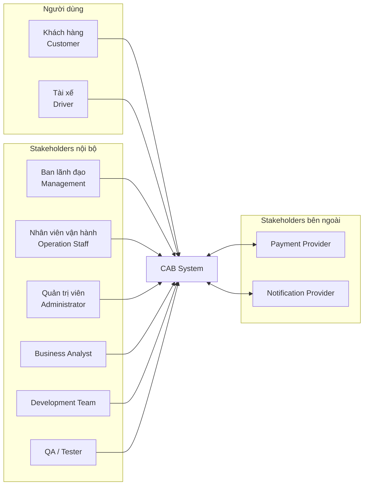
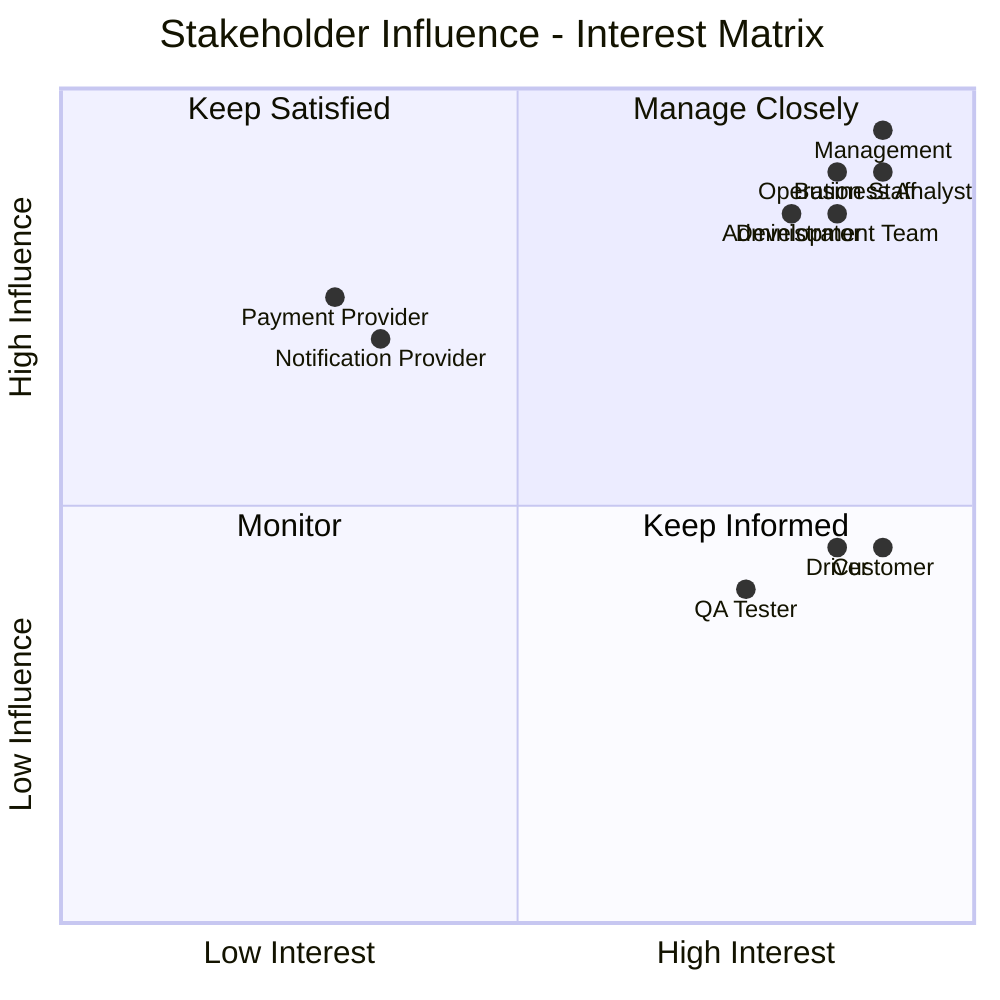
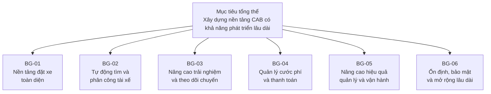
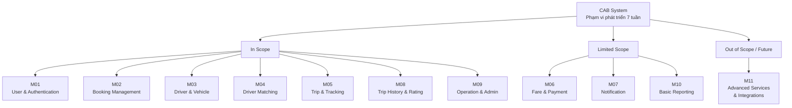

## 2. Stakeholders

### 2.1. Danh sách Stakeholders và vai trò

Các bên liên quan đến quá trình xây dựng, vận hành và sử dụng CAB System được xác định như sau:

| STT | Stakeholder                                        | Vai trò / Mối quan tâm                                                                                                                                               |
| --- | -------------------------------------------------- | -------------------------------------------------------------------------------------------------------------------------------------------------------------------- |
| 1   | **Khách hàng (Customer/Passenger)**                | Sử dụng hệ thống để đặt xe, theo dõi chuyến đi, thanh toán, xem lịch sử chuyến và đánh giá tài xế. Quan tâm đến tính thuận tiện, chính xác và an toàn của dịch vụ.   |
| 2   | **Tài xế (Driver)**                                | Cập nhật hồ sơ, phương tiện, trạng thái hoạt động và vị trí; nhận hoặc từ chối yêu cầu chuyến; thực hiện và cập nhật trạng thái chuyến đi.                           |
| 3   | **Nhân viên vận hành (Operation Staff)**           | Quản lý khách hàng, tài xế, phương tiện và chuyến đi; giám sát hoạt động và hỗ trợ xử lý các trường hợp bất thường hoặc chuyến đi gặp sự cố.                         |
| 4   | **Quản trị viên (Administrator)**                  | Quản lý tài khoản, phân quyền, kiểm soát quyền truy cập, theo dõi nhật ký và thực hiện các chức năng quản trị hệ thống.                                              |
| 5   | **Ban lãnh đạo Công ty ABC (Management)**          | Đưa ra mục tiêu và định hướng của dự án; theo dõi số lượng chuyến, doanh thu, tỷ lệ hoàn thành, tỷ lệ hủy và hiệu quả hoạt động của tài xế.                          |
| 6   | **Nhà cung cấp thanh toán (Payment Provider)**     | Cung cấp dịch vụ thanh toán điện tử, xử lý giao dịch và trả kết quả thanh toán cho CAB System mà không yêu cầu hệ thống lưu trực tiếp thông tin thanh toán nhạy cảm. |
| 7   | **Nhà cung cấp thông báo (Notification Provider)** | Cung cấp dịch vụ gửi thông báo cho khách hàng và tài xế thông qua các kênh như Push Notification, SMS hoặc Email.                                                    |
| 8   | **Business Analyst (BA)**                          | Thu thập, phân tích và làm rõ yêu cầu; xác định phạm vi, quy trình nghiệp vụ, quy tắc nghiệp vụ, ngoại lệ và các vấn đề cần xác nhận với khách hàng.                 |
| 9   | **Nhóm phát triển (Development Team)**             | Thiết kế kiến trúc, xây dựng, tích hợp và triển khai CAB System dựa trên các yêu cầu đã được thống nhất.                                                             |
| 10  | **Nhóm kiểm thử (QA/Tester)**                      | Kiểm thử chức năng, tích hợp, hiệu năng, bảo mật và độ ổn định nhằm đảm bảo hệ thống đáp ứng các yêu cầu đã xác định.                                                |

---

### 2.2. Stakeholder Matrix

Stakeholders được đánh giá dựa trên hai tiêu chí:

* **Influence:** Mức độ ảnh hưởng của Stakeholder đến dự án và các quyết định của hệ thống.
* **Interest:** Mức độ quan tâm và mức độ chịu ảnh hưởng bởi kết quả của dự án.

Sử dụng hai mức **High/Low** để phân loại thống nhất theo Influence – Interest Matrix.

| Stakeholder                  | Influence | Interest | Nhóm quản lý   | Cách tương tác                                                                                         |
| ---------------------------- | --------- | -------- | -------------- | ------------------------------------------------------------------------------------------------------ |
| **Ban lãnh đạo Công ty ABC** | High      | High     | Manage Closely | Thường xuyên trao đổi, báo cáo tiến độ và xác nhận các quyết định nghiệp vụ quan trọng.                |
| **Nhân viên vận hành**       | High      | High     | Manage Closely | Phỏng vấn và trao đổi thường xuyên để xác nhận quy trình vận hành và các trường hợp ngoại lệ.          |
| **Quản trị viên**            | High      | High     | Manage Closely | Làm rõ các yêu cầu về quản trị, phân quyền, bảo mật và kiểm soát hệ thống.                             |
| **Business Analyst**         | High      | High     | Manage Closely | Phối hợp với các bên để thu thập, phân tích, quản lý và xác nhận yêu cầu.                              |
| **Development Team**         | High      | High     | Manage Closely | Phối hợp với BA để đánh giá tính khả thi và triển khai các yêu cầu đã được xác nhận.                   |
| **Payment Provider**         | High      | Low      | Keep Satisfied | Làm rõ API, quy trình thanh toán, bảo mật và xử lý các giao dịch thất bại.                             |
| **Notification Provider**    | High      | Low      | Keep Satisfied | Làm rõ API, kênh thông báo và cơ chế tích hợp để hỗ trợ khả năng mở rộng.                              |
| **Khách hàng**               | Low       | High     | Keep Informed  | Thu thập nhu cầu và phản hồi liên quan đến đặt xe, theo dõi chuyến, thanh toán và trải nghiệm sử dụng. |
| **Tài xế**                   | Low       | High     | Keep Informed  | Thu thập yêu cầu và phản hồi về nhận chuyến, vị trí, trạng thái chuyến và quản lý phương tiện.         |
| **QA/Tester**                | Low       | High     | Keep Informed  | Cập nhật thay đổi yêu cầu và phối hợp xây dựng các trường hợp kiểm thử phù hợp.                        |

---

### 2.3. Phân loại Stakeholders theo Influence – Interest Matrix

|                          | **Interest thấp (Low)**                                     | **Interest cao (High)**                                                              |
| ------------------------ | ----------------------------------------------------------- | ------------------------------------------------------------------------------------ |
| **Influence cao (High)** | **Keep Satisfied**: Payment Provider, Notification Provider | **Manage Closely**: Management, Operation Staff, Administrator, BA, Development Team |
| **Influence thấp (Low)** | **Monitor**: Các bên hỗ trợ khác nếu phát sinh              | **Keep Informed**: Customer, Driver, QA/Tester                                       |

#### Ý nghĩa các nhóm

* **Manage Closely:** Có mức độ ảnh hưởng và quan tâm cao. Cần được phối hợp và trao đổi thường xuyên trong quá trình phát triển dự án.
* **Keep Satisfied:** Có khả năng ảnh hưởng đến hệ thống nhưng không trực tiếp tham gia vào toàn bộ hoạt động của dự án.
* **Keep Informed:** Chịu ảnh hưởng trực tiếp từ sản phẩm và cần được cập nhật cũng như thu thập phản hồi thường xuyên.
* **Monitor:** Có mức độ ảnh hưởng và quan tâm thấp, chỉ cần theo dõi và trao đổi khi cần thiết.

---

### 2.4. Sơ đồ Stakeholders của CAB System



---

### 2.5. Sơ đồ Stakeholder Matrix



---

## 3. Business Goals

### 3.1. Mục tiêu nghiệp vụ

Từ các yêu cầu quan trọng của Công ty ABC, các mục tiêu nghiệp vụ chính của CAB System được xác định như sau:

| Mã        | Business Goal                                                             | Mô tả                                                                                                                                                                                                                                  |
| --------- | ------------------------------------------------------------------------- | -------------------------------------------------------------------------------------------------------------------------------------------------------------------------------------------------------------------------------------- |
| **BG-01** | **Xây dựng nền tảng đặt xe trực tuyến toàn diện**                         | Xây dựng CAB System hỗ trợ toàn bộ quy trình từ khi khách hàng tạo yêu cầu đặt xe, tìm và phân công tài xế, thực hiện chuyến đi, tính cước, thanh toán đến đánh giá sau chuyến.                                                        |
| **BG-02** | **Tự động hóa quá trình tìm và phân công tài xế**                         | Giảm việc phân công tài xế thủ công bằng cách tự động xác định và ưu tiên tài xế phù hợp dựa trên vị trí, trạng thái sẵn sàng và các tiêu chí vận hành; tự động tiếp tục tìm tài xế khác khi tài xế trước từ chối hoặc không phản hồi. |
| **BG-03** | **Nâng cao trải nghiệm đặt xe và theo dõi chuyến đi**                     | Cho phép khách hàng theo dõi quá trình tìm tài xế, tài xế nhận chuyến, thời gian dự kiến tài xế đến và trạng thái chuyến đi; đồng thời cung cấp các thông báo cần thiết trong quá trình sử dụng dịch vụ.                               |
| **BG-04** | **Quản lý tập trung cước phí và thanh toán**                              | Hỗ trợ xác định giá cước, quản lý giao dịch, thanh toán bằng tiền mặt hoặc phương thức điện tử thông qua nhà cung cấp bên ngoài và đảm bảo an toàn thông tin thanh toán.                                                               |
| **BG-05** | **Nâng cao hiệu quả quản lý và vận hành dịch vụ**                         | Quản lý tập trung khách hàng, tài xế, phương tiện, chuyến đi và giao dịch; hỗ trợ nhân viên vận hành giám sát, xử lý sự cố và cung cấp dữ liệu báo cáo phục vụ hoạt động quản lý và ra quyết định.                                     |
| **BG-06** | **Xây dựng nền tảng CAB ổn định, bảo mật và có khả năng mở rộng lâu dài** | Đảm bảo hệ thống có thể phục vụ số lượng lớn khách hàng và tài xế, hạn chế ảnh hưởng khi một thành phần gặp lỗi, bảo vệ dữ liệu quan trọng và hỗ trợ mở rộng thêm dịch vụ hoặc tích hợp mới trong tương lai.                           |

---

### 3.2. Chuyển đổi yêu cầu khách hàng thành Business Goals

| Yêu cầu quan trọng của khách hàng                                                                                    | Business Goal |
| -------------------------------------------------------------------------------------------------------------------- | ------------- |
| Xây dựng một nền tảng CAB hỗ trợ đầy đủ quy trình đặt và thực hiện chuyến xe.                                        | **BG-01**     |
| Giảm việc phân công tài xế thủ công và tự động tìm tài xế phù hợp cho khách hàng.                                    | **BG-02**     |
| Khách hàng cần biết tài xế, ETA, trạng thái chuyến và nhận thông báo trong quá trình sử dụng dịch vụ.                | **BG-03**     |
| Quản lý tập trung việc tính cước, giao dịch và hỗ trợ nhiều phương thức thanh toán.                                  | **BG-04**     |
| Nhân viên vận hành cần quản lý, giám sát hoạt động; ban lãnh đạo cần dữ liệu và báo cáo kinh doanh.                  | **BG-05**     |
| Hệ thống cần hoạt động ổn định khi tải cao, bảo mật dữ liệu và có kiến trúc linh hoạt để phát triển trong tương lai. | **BG-06**     |

---

### 3.3. Liên kết Business Goals với Stakeholders

| Business Goal | Stakeholders liên quan chính                  |
| ------------- | --------------------------------------------- |
| **BG-01**     | Customer, Driver, Operation Staff, Management |
| **BG-02**     | Customer, Driver, Operation Staff             |
| **BG-03**     | Customer, Driver, Notification Provider       |
| **BG-04**     | Customer, Operation Staff, Payment Provider   |
| **BG-05**     | Operation Staff, Administrator, Management    |
| **BG-06**     | Administrator, Management, Development Team   |

---

### 3.4. Sơ đồ Business Goals



---

### 3.5. Ưu tiên Business Goals

Do thời gian xây dựng và triển khai sản phẩm là **7 tuần**, các Business Goals được ưu tiên như sau:

| Business Goal | Mức ưu tiên     | Lý do                                                                                                                                                              |
| ------------- | --------------- | ------------------------------------------------------------------------------------------------------------------------------------------------------------------ |
| **BG-01**     | **Must Have**   | Là mục tiêu cốt lõi của CAB System và tạo ra quy trình đặt xe hoàn chỉnh.                                                                                          |
| **BG-02**     | **Must Have**   | Giải quyết trực tiếp hạn chế lớn của hệ thống hiện tại là phân công tài xế thủ công.                                                                               |
| **BG-03**     | **Must Have**   | Cần thiết để khách hàng và tài xế có thể theo dõi và phối hợp trong quá trình thực hiện chuyến.                                                                    |
| **BG-04**     | **Must Have**   | Thanh toán và tính cước là một phần bắt buộc để hoàn thành quy trình chuyến đi.                                                                                    |
| **BG-05**     | **Should Have** | Quan trọng đối với quản lý và vận hành nhưng một số chức năng báo cáo nâng cao có thể triển khai sau các chức năng cốt lõi.                                        |
| **BG-06**     | **Should Have** | Kiến trúc, bảo mật và khả năng mở rộng cần được xem xét ngay từ đầu, trong khi một số khả năng mở rộng nâng cao có thể tiếp tục hoàn thiện sau phiên bản đầu tiên. |


## 4. Phạm vi phát triển hệ thống

### 4.1. Xác định phạm vi

Dựa trên các Business Goals đã xác định và giới hạn thời gian phát triển **7 tuần**, CAB System tập trung triển khai các module cốt lõi cần thiết để hoàn thành quy trình đặt xe.

Một số module có phạm vi lớn sẽ được giới hạn ở các chức năng cần thiết trong phiên bản đầu tiên. Các chức năng nâng cao và khả năng mở rộng sẽ được xem xét trong các phiên bản tiếp theo.

### 4.2. Phạm vi các Module

| Mã      | Module                               | Business Goal liên quan | Phạm vi           | Nội dung triển khai                                                                                                                   |
| ------- | ------------------------------------ | ----------------------- | ----------------- | ------------------------------------------------------------------------------------------------------------------------------------- |
| **M01** | **User & Authentication**            | BG-01, BG-06            | **In Scope**      | Đăng ký, đăng nhập, cập nhật hồ sơ và xác thực người dùng; hỗ trợ Customer, Driver và nhân viên quản trị/vận hành.                    |
| **M02** | **Booking Management**               | BG-01                   | **In Scope**      | Nhập điểm đón, điểm đến, chọn loại xe, tạo yêu cầu đặt xe và quản lý yêu cầu đặt xe.                                                  |
| **M03** | **Driver & Vehicle Management**      | BG-01, BG-02            | **In Scope**      | Quản lý hồ sơ tài xế, thông tin phương tiện, trạng thái hoạt động và vị trí tài xế.                                                   |
| **M04** | **Driver Matching & Dispatch**       | BG-02                   | **In Scope**      | Tìm và ưu tiên tài xế khả dụng gần khách hàng; tiếp tục tìm tài xế khác khi tài xế trước từ chối hoặc không phản hồi.                 |
| **M05** | **Trip Management & Tracking**       | BG-01, BG-03            | **In Scope**      | Quản lý và theo dõi các trạng thái của chuyến từ khi tìm tài xế đến khi hoàn thành hoặc hủy chuyến.                                   |
| **M06** | **Fare & Payment**                   | BG-04                   | **Limited Scope** | Tính cước cơ bản; hỗ trợ tiền mặt và tích hợp **01 nhà cung cấp thanh toán điện tử**.                                                 |
| **M07** | **Notification**                     | BG-03                   | **Limited Scope** | Gửi thông báo cho Customer và Driver tại các sự kiện quan trọng; phiên bản đầu chỉ triển khai **01 kênh thông báo chính**.            |
| **M08** | **Trip History & Rating**            | BG-01, BG-03            | **In Scope**      | Cho phép khách hàng xem lịch sử chuyến đi và đánh giá tài xế sau khi chuyến hoàn thành.                                               |
| **M09** | **Operation & Administration**       | BG-05, BG-06            | **In Scope**      | Quản lý Customer, Driver, Vehicle và Trip; theo dõi chuyến đang diễn ra, phân quyền cơ bản và hỗ trợ xử lý sự cố.                     |
| **M10** | **Reporting & Analytics**            | BG-05                   | **Limited Scope** | Cung cấp báo cáo cơ bản về số chuyến, doanh thu, tỷ lệ hoàn thành, tỷ lệ hủy và hiệu quả hoạt động của tài xế.                        |
| **M11** | **Advanced Services & Integrations** | BG-06                   | **Out of Scope**  | Các loại dịch vụ nâng cao, nhiều Payment Provider, nhiều Notification Provider và các tích hợp mở rộng được để lại cho phiên bản sau. |

---

### 4.3. Phân loại phạm vi

#### In Scope

Các module được ưu tiên phát triển đầy đủ trong phạm vi dự án:

* **M01 – User & Authentication**
* **M02 – Booking Management**
* **M03 – Driver & Vehicle Management**
* **M04 – Driver Matching & Dispatch**
* **M05 – Trip Management & Tracking**
* **M08 – Trip History & Rating**
* **M09 – Operation & Administration**

Đây là các module cần thiết để đảm bảo CAB System có thể thực hiện hoàn chỉnh quy trình nghiệp vụ chính:

**Đặt xe → Tìm tài xế → Nhận chuyến → Thực hiện chuyến → Hoàn thành chuyến.**

#### Limited Scope

Do giới hạn thời gian phát triển **7 tuần**, các module sau chỉ triển khai các chức năng cần thiết:

* **M06 – Fare & Payment:** chỉ triển khai cách tính cước cơ bản, thanh toán tiền mặt và **01 Payment Provider**.
* **M07 – Notification:** chỉ triển khai **01 kênh thông báo chính**.
* **M10 – Reporting & Analytics:** chỉ cung cấp các báo cáo và thống kê cơ bản theo yêu cầu nghiệp vụ.

#### Out of Scope

Các chức năng sau chưa triển khai trong phiên bản hiện tại:

* Tích hợp nhiều Payment Provider.
* Tích hợp đồng thời nhiều kênh Notification.
* Thuật toán AI/ML nâng cao để phân công tài xế.
* Dynamic Pricing hoặc Surge Pricing phức tạp.
* Advanced Analytics và Business Intelligence.
* Các loại dịch vụ vận chuyển mới ngoài phạm vi dịch vụ ban đầu.
* Các tích hợp bên thứ ba khác chưa cần thiết cho phiên bản đầu tiên.

Các chức năng trên có thể được bổ sung trong các phiên bản tiếp theo nhờ kiến trúc hệ thống có khả năng mở rộng.

---

### 4.4. Liên kết Business Goals với Module

| Business Goal                                                                 | Module đáp ứng          |
| ----------------------------------------------------------------------------- | ----------------------- |
| **BG-01 – Xây dựng nền tảng đặt xe trực tuyến toàn diện**                     | M01, M02, M03, M05, M08 |
| **BG-02 – Tự động hóa quá trình tìm và phân công tài xế**                     | M03, M04                |
| **BG-03 – Nâng cao trải nghiệm đặt xe và theo dõi chuyến đi**                 | M05, M07, M08           |
| **BG-04 – Quản lý tập trung cước phí và thanh toán**                          | M06                     |
| **BG-05 – Nâng cao hiệu quả quản lý và vận hành dịch vụ**                     | M09, M10                |
| **BG-06 – Xây dựng nền tảng ổn định, bảo mật và có khả năng mở rộng lâu dài** | M01, M09, M11           |

---

### 4.5. Sơ đồ phạm vi Module



### 4.6. Kết luận phạm vi

Trong thời gian phát triển **7 tuần**, dự án ưu tiên hoàn thiện luồng nghiệp vụ đặt xe cốt lõi và các chức năng cần thiết cho Customer, Driver và Operation Staff.

Các chức năng thanh toán, thông báo và báo cáo được triển khai ở mức cơ bản nhằm đảm bảo tính khả thi của dự án. Các chức năng nâng cao được đưa ra ngoài phạm vi phiên bản đầu tiên nhưng kiến trúc hệ thống cần được thiết kế để có thể bổ sung trong tương lai.


```
```
