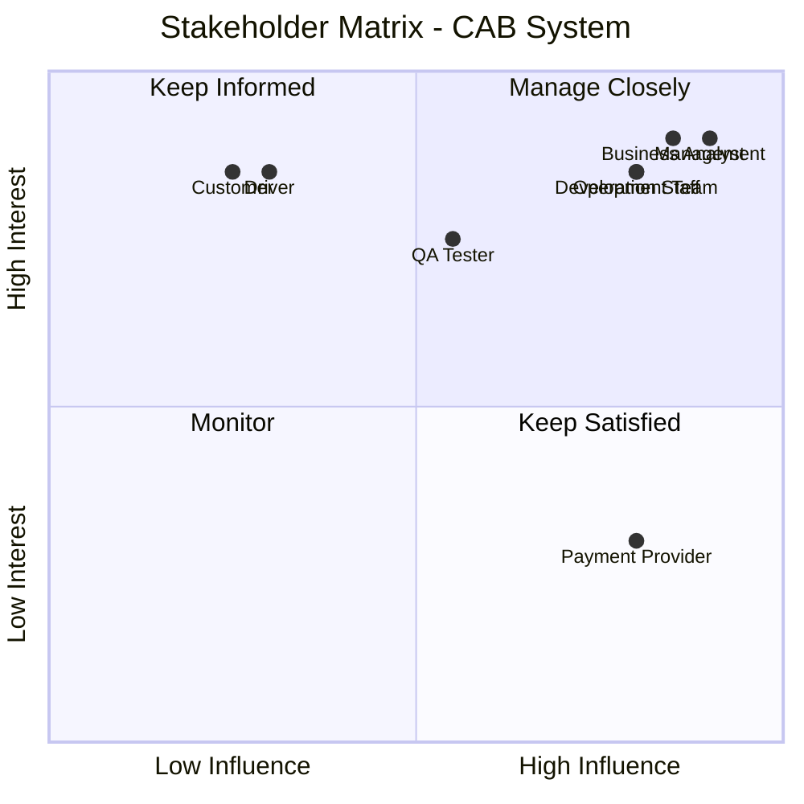
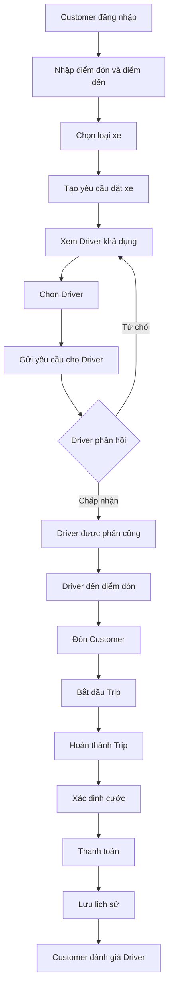
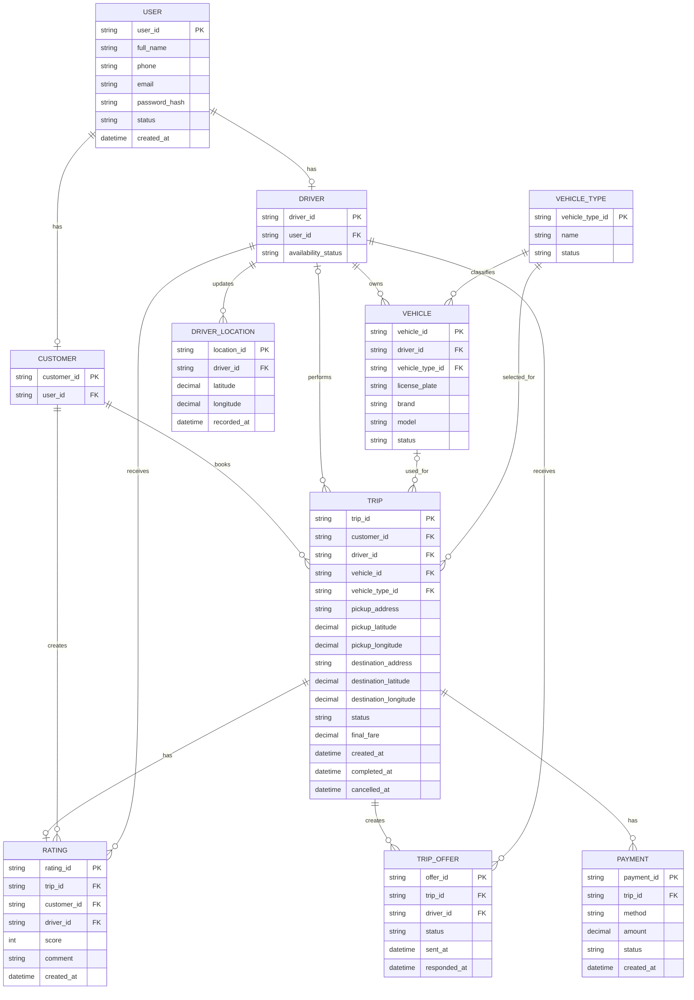
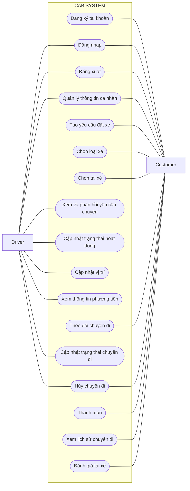

# CAB SYSTEM

---

# B1. XÁC ĐỊNH STAKEHOLDER


| STT | Stakeholder | Vai trò |
|---:|---|---|
| 1 | Customer | Đăng ký tài khoản, đặt xe, lựa chọn loại xe, lựa chọn Driver khả dụng, theo dõi chuyến đi, thanh toán và đánh giá Driver. |
| 2 | Driver | Quản lý thông tin cá nhân, phương tiện, trạng thái hoạt động, vị trí, tiếp nhận và thực hiện chuyến đi. |
| 3 | Operation Staff | Theo dõi hoạt động của Customer, Driver và Trip; hỗ trợ xử lý sự cố khi cần. |
| 4 | Management | Theo dõi tình hình vận hành và đánh giá kết quả của hệ thống. |
| 5 | Business Analyst | Thu thập, phân tích, mô hình hóa và quản lý yêu cầu. |
| 6 | Development Team | Thiết kế, lập trình và triển khai CAB System. |
| 7 | QA / Tester | Kiểm thử và xác nhận hệ thống đáp ứng yêu cầu. |
| 8 | Payment Provider | Hỗ trợ xử lý thanh toán điện tử trong trường hợp được sử dụng. |

---

# B2. STAKEHOLDER MATRIX

## 2.1. Stakeholder Matrix

| Stakeholder | Influence | Interest | Chiến lược quản lý |
|---|---|---|---|
| Customer | Low | High | Keep Informed |
| Driver | Low | High | Keep Informed |
| Operation Staff | High | High | Manage Closely |
| Management | High | High | Manage Closely |
| Business Analyst | High | High | Manage Closely |
| Development Team | High | High | Manage Closely |
| QA / Tester | Medium | High | Keep Informed |
| Payment Provider | High | Low | Keep Satisfied |

## 2.2. Stakeholder Matrix Diagram



---

# B3. CHUYỂN ĐỔI YÊU CẦU KHÁCH HÀNG THÀNH MỤC TIÊU NGHIỆP VỤ

| Mã | Mục tiêu nghiệp vụ | Mô tả |
|---|---|---|
| BR-G01 | Xây dựng nền tảng đặt xe trực tuyến | Xây dựng hệ thống hỗ trợ khách hàng thực hiện quy trình đặt xe trực tuyến thuận tiện và tập trung. |
| BR-G02 | Cải thiện quy trình tìm và phân công tài xế | Hỗ trợ kết nối khách hàng với tài xế phù hợp và giảm sự phụ thuộc vào việc phân công thủ công. |
| BR-G03 | Theo dõi quá trình thực hiện chuyến đi | Giúp khách hàng và tài xế theo dõi thông tin và trạng thái của chuyến đi trong suốt quá trình thực hiện. |
| BR-G04 | Quản lý cước phí và thanh toán | Hỗ trợ ghi nhận cước phí, phương thức thanh toán và kết quả giao dịch của chuyến đi. |
| BR-G05 | Quản lý tập trung thông tin khách hàng và tài xế | Quản lý tập trung thông tin khách hàng, tài xế, phương tiện và dữ liệu chuyến đi liên quan. |
| BR-G06 | Xây dựng hệ thống ổn định và có khả năng mở rộng | Đảm bảo hệ thống hoạt động ổn định và có khả năng mở rộng, bổ sung các chức năng trong tương lai. |

---

# B4. GIỚI HẠN PHẠM VI MVP

CAB System được giới hạn thành **2 module nghiệp vụ chính** trong giai đoạn MVP:

1. Quản lý khách hàng.
2. Quản lý tài xế.

## 4.1. Module M01 – Quản lý khách hàng

Bao gồm:

- Đăng ký tài khoản.
- Đăng nhập và đăng xuất.
- Xem/cập nhật hồ sơ Customer.
- Nhập điểm đón và điểm đến.
- Lựa chọn loại xe.
- Xem Driver đang khả dụng.
- Lựa chọn Driver.
- Tạo yêu cầu đặt xe.
- Theo dõi trạng thái Trip.
- Hủy Trip.
- Thanh toán.
- Xem lịch sử Trip.
- Đánh giá Driver.

## 4.2. Module M02 – Quản lý tài xế

Bao gồm:

- Đăng nhập Driver.
- Xem/cập nhật hồ sơ Driver.
- Xem thông tin Vehicle.
- Cập nhật trạng thái hoạt động.
- Cập nhật vị trí.
- Xem yêu cầu chuyến.
- Chấp nhận hoặc từ chối yêu cầu chuyến.
- Cập nhật trạng thái Trip.
- Hoàn thành Trip.
- Hủy Trip khi được phép.

> Trong phạm vi MVP, tài khoản Driver được hệ thống chuẩn bị trước. Chức năng tự đăng ký tài khoản Driver chưa được triển khai.

## 4.3. Ngoài phạm vi MVP

Trong giai đoạn MVP:

- Không yêu cầu AI/ML để tìm Driver tốt nhất.
- Không yêu cầu thuật toán xếp hạng Driver phức tạp.
- Chỉ cần xác định Driver đang `AVAILABLE`.
- Customer có thể lựa chọn Driver khả dụng.
- Chỉ cần bảo đảm quy trình đặt xe hoạt động từ đầu đến cuối.
- Chưa triển khai Dynamic Pricing.
- Chưa triển khai Loyalty/Reward.
- Chưa triển khai Business Intelligence nâng cao.
- Chưa hỗ trợ nhiều Payment Provider cùng lúc.
- Chưa triển khai chức năng quản trị nâng cao.
- Chưa triển khai module Notification độc lập trong giai đoạn MVP.
- Các chức năng quản trị của Operation Staff chưa được triển khai trong phạm vi MVP hiện tại.

## 4.4. Luồng nghiệp vụ MVP

```text
Customer đăng nhập
        ↓
Nhập điểm đón và điểm đến
        ↓
Chọn loại xe
        ↓
Tạo yêu cầu đặt xe
        ↓
Xem Driver khả dụng
        ↓
Chọn Driver
        ↓
Driver nhận yêu cầu
        ↓
Driver chấp nhận / từ chối
        ↓
Thực hiện Trip
        ↓
Hoàn thành Trip
        ↓
Thanh toán
        ↓
Xem lịch sử / Đánh giá
```

---

# B5. BUSINESS REQUIREMENTS

Có **9 Business Requirements chính** trong phạm vi MVP.

| Mã | Business Requirement | Mô tả |
|---|---|---|
| BR-01 | Quản lý tài khoản Customer | Hệ thống phải hỗ trợ Customer đăng ký, đăng nhập, đăng xuất và quản lý thông tin cá nhân. |
| BR-02 | Quản lý Driver | Hệ thống phải hỗ trợ Driver đăng nhập, quản lý thông tin cá nhân, trạng thái hoạt động, Vehicle và vị trí hiện tại. |
| BR-03 | Tạo yêu cầu đặt xe | Customer phải có thể nhập thông tin và tạo yêu cầu đặt xe. |
| BR-04 | Lựa chọn loại xe | Customer phải có thể xem và lựa chọn loại Vehicle phù hợp trước khi đặt xe. |
| BR-05 | Lựa chọn Driver | Customer phải có thể xem và lựa chọn một Driver đang khả dụng, phù hợp với loại Vehicle đã chọn. |
| BR-06 | Driver phản hồi chuyến | Driver phải có thể xem, chấp nhận hoặc từ chối yêu cầu chuyến được gửi đến. |
| BR-07 | Quản lý Trip | Hệ thống phải quản lý trạng thái Trip từ khi Driver nhận chuyến đến khi hoàn thành hoặc bị hủy. |
| BR-08 | Quản lý cước và thanh toán | Hệ thống phải ghi nhận cước và hỗ trợ thanh toán cho Trip hoàn thành. |
| BR-09 | Lịch sử và đánh giá | Customer phải có thể xem lịch sử Trip, chi tiết Trip và đánh giá Driver sau Trip hoàn thành. |

---

# B6. MÔ HÌNH HÓA NGHIỆP VỤ

Mỗi Business Requirement chính được ánh xạ thành một Business Process.

| Mã | Business Process | BR | Luồng chính |
|---|---|---|---|
| BP-01 | Quản lý tài khoản Customer | BR-01 | Đăng ký → Đăng nhập → Xem/Cập nhật hồ sơ → Đăng xuất |
| BP-02 | Quản lý Driver | BR-02 | Đăng nhập → Xem/Cập nhật hồ sơ → Xem Vehicle → Cập nhật trạng thái/vị trí |
| BP-03 | Tạo yêu cầu đặt xe | BR-03 | Nhập điểm đón → Nhập điểm đến → Xem lại → Tạo Trip |
| BP-04 | Lựa chọn loại xe | BR-04 | Xem loại xe → Chọn loại xe |
| BP-05 | Lựa chọn Driver | BR-05 | Xem Driver khả dụng → Xem thông tin → Chọn Driver → Gửi yêu cầu |
| BP-06 | Driver phản hồi chuyến | BR-06 | Xem yêu cầu → Chấp nhận/Từ chối |
| BP-07 | Thực hiện Trip | BR-07 | Driver đến → Đón khách → Bắt đầu → Hoàn thành/Hủy |
| BP-08 | Thanh toán | BR-08 | Xác định cước → Chọn phương thức → Thanh toán → Lưu giao dịch |
| BP-09 | Lịch sử và đánh giá | BR-09 | Xem lịch sử → Xem chi tiết → Đánh giá |

## 6.1. Quy trình nghiệp vụ tổng thể



---

# B7. FUNCTIONAL REQUIREMENTS

## BP-01 – Quản lý tài khoản Customer

| Mã | Functional Requirement |
|---|---|
| FR01 | Hệ thống cho phép Customer đăng ký tài khoản. |
| FR02 | Hệ thống cho phép Customer đăng nhập. |
| FR03 | Hệ thống cho phép Customer đăng xuất. |
| FR04 | Customer có thể xem thông tin cá nhân của mình. |
| FR05 | Customer có thể cập nhật các thông tin cá nhân được phép. |

## BP-02 – Quản lý Driver

| Mã | Functional Requirement |
|---|---|
| FR06 | Driver có thể đăng nhập hệ thống bằng tài khoản hợp lệ. |
| FR07 | Driver có thể xem và cập nhật các thông tin cá nhân được phép. |
| FR08 | Driver có thể cập nhật trạng thái `AVAILABLE` hoặc `UNAVAILABLE`. |
| FR09 | Driver có thể cập nhật vị trí hiện tại. |
| FR10 | Driver có thể xem thông tin Vehicle của mình. |

## BP-03 – Tạo yêu cầu đặt xe

| Mã | Functional Requirement |
|---|---|
| FR11 | Customer có thể nhập điểm đón. |
| FR12 | Customer có thể nhập điểm đến. |
| FR13 | Customer có thể xem lại thông tin chuyến trước khi xác nhận. |
| FR14 | Customer có thể tạo yêu cầu đặt xe. |
| FR15 | Customer có thể hủy yêu cầu đặt xe khi trạng thái cho phép. |

## BP-04 – Lựa chọn loại xe

| Mã | Functional Requirement |
|---|---|
| FR16 | Hệ thống hiển thị danh sách Vehicle Type được hỗ trợ. |
| FR17 | Customer có thể lựa chọn một Vehicle Type cho Trip. |

## BP-05 – Lựa chọn Driver

| Mã | Functional Requirement |
|---|---|
| FR18 | Hệ thống hiển thị các Driver đang `AVAILABLE` và phù hợp với Vehicle Type đã chọn. |
| FR19 | Customer có thể xem thông tin cơ bản của Driver. |
| FR20 | Customer có thể lựa chọn một Driver khả dụng. |
| FR21 | Hệ thống gửi yêu cầu chuyến đến Driver được Customer lựa chọn. |

## BP-06 – Driver phản hồi chuyến

| Mã | Functional Requirement |
|---|---|
| FR22 | Driver có thể xem yêu cầu chuyến được gửi đến mình. |
| FR23 | Driver có thể chấp nhận yêu cầu chuyến. |
| FR24 | Driver có thể từ chối yêu cầu chuyến. |
| FR25 | Nếu Driver từ chối, Customer có thể lựa chọn Driver khác. |

## BP-07 – Quản lý Trip

| Mã | Functional Requirement |
|---|---|
| FR26 | Customer có thể xem thông tin Driver đã chấp nhận Trip. |
| FR27 | Customer có thể xem trạng thái hiện tại của Trip. |
| FR28 | Driver có thể xác nhận đã đến điểm đón. |
| FR29 | Driver có thể xác nhận đã đón Customer. |
| FR30 | Driver có thể bắt đầu Trip. |
| FR31 | Driver có thể hoàn thành Trip. |
| FR32 | Customer hoặc Driver có thể hủy Trip khi trạng thái và chính sách cho phép. |

## BP-08 – Thanh toán

| Mã | Functional Requirement |
|---|---|
| FR33 | Hệ thống ghi nhận cước cuối cùng sau khi Trip hoàn thành. |
| FR34 | Customer có thể xem cước của Trip. |
| FR35 | Customer có thể lựa chọn phương thức thanh toán được hỗ trợ. |
| FR36 | Hệ thống hỗ trợ ghi nhận thanh toán bằng tiền mặt. |
| FR37 | Hệ thống hỗ trợ thanh toán điện tử trong phạm vi MVP. |
| FR38 | Hệ thống lưu kết quả giao dịch và liên kết với Trip. |

## BP-09 – Lịch sử và đánh giá

| Mã | Functional Requirement |
|---|---|
| FR39 | Customer có thể xem lịch sử Trip của mình. |
| FR40 | Customer có thể xem chi tiết một Trip đã thực hiện. |
| FR41 | Customer có thể đánh giá Driver sau khi Trip hoàn thành. |
| FR42 | Customer có thể xem Rating đã gửi cho Trip. |

---

# B8. BUSINESS RULES

| Mã | Business Rule |
|---|---|
| RULE-01 | Người dùng phải đăng nhập trước khi sử dụng các chức năng yêu cầu xác thực. |
| RULE-02 | Mỗi Customer chỉ được có một Trip đang hoạt động tại một thời điểm. |
| RULE-03 | Chỉ Driver ở trạng thái `AVAILABLE` mới xuất hiện trong danh sách lựa chọn. |
| RULE-04 | Driver đang thực hiện Trip không được nhận Trip mới. |
| RULE-05 | Driver được Customer lựa chọn phải có Vehicle phù hợp với Vehicle Type đã chọn. |
| RULE-06 | Yêu cầu chuyến chỉ được gửi đến Driver hợp lệ và đang `AVAILABLE`. |
| RULE-07 | Nếu Driver từ chối yêu cầu, Customer được phép lựa chọn Driver khác. |
| RULE-08 | Trip chỉ được thực hiện sau khi Driver chấp nhận yêu cầu chuyến. |
| RULE-09 | Trạng thái Trip phải thay đổi theo đúng trình tự nghiệp vụ. |
| RULE-10 | Cước cuối cùng chỉ được ghi nhận sau khi Trip hoàn thành. |
| RULE-11 | Chỉ sử dụng phương thức thanh toán được CAB System hỗ trợ. |
| RULE-12 | Hệ thống không lưu trực tiếp thông tin thanh toán nhạy cảm. |
| RULE-13 | Chỉ Customer sở hữu Trip mới được đánh giá Driver của Trip đó. |
| RULE-14 | Chỉ được đánh giá Driver sau khi Trip hoàn thành. |
| RULE-15 | Mỗi Trip chỉ có tối đa một Rating chính thức. |

## 8.1. Vòng đời Trip

```text
CREATED
   ↓
DRIVER_SELECTED
   ↓
DRIVER_ASSIGNED
   ↓
DRIVER_ARRIVED
   ↓
PASSENGER_PICKED_UP
   ↓
IN_PROGRESS
   ↓
COMPLETED
```

`CANCELLED` được sử dụng khi Trip bị hủy tại trạng thái được chính sách cho phép.

---

# B9. NON-FUNCTIONAL REQUIREMENTS

| Mã | Nhóm | Yêu cầu |
|---|---|---|
| NFR-01 | Performance | Các thao tác thông thường phải có thời gian phản hồi phù hợp với trải nghiệm người dùng. |
| NFR-02 | Performance | Việc tải danh sách Driver khả dụng phải đáp ứng đủ nhanh cho luồng đặt xe. |
| NFR-03 | Availability | Hệ thống phải duy trì hoạt động ổn định trong quá trình đặt và thực hiện Trip. |
| NFR-04 | Reliability | Dữ liệu trạng thái Trip phải nhất quán giữa Customer và Driver. |
| NFR-05 | Security | Người dùng phải được xác thực trước khi truy cập dữ liệu cá nhân. |
| NFR-06 | Security | Customer chỉ được truy cập dữ liệu Trip của mình. |
| NFR-07 | Security | Driver chỉ được cập nhật Trip đã được phân công cho mình. |
| NFR-08 | Security | Thông tin thanh toán nhạy cảm không được lưu trực tiếp trong CAB System. |
| NFR-09 | Scalability | Hệ thống phải có khả năng mở rộng số lượng Customer và Driver trong tương lai. |
| NFR-10 | Maintainability | Hai module Customer và Driver phải được thiết kế rõ ràng và hạn chế phụ thuộc không cần thiết. |
| NFR-11 | Usability | Giao diện phải dễ hiểu và hiển thị rõ trạng thái Trip. |
| NFR-12 | Extensibility | Hệ thống có thể bổ sung thuật toán Driver Matching nâng cao sau MVP mà không phải thay đổi toàn bộ kiến trúc. |

> Các giá trị định lượng như thời gian phản hồi tối đa, số lượng người dùng đồng thời và mức độ availability chưa được xác định trong yêu cầu hiện tại và sẽ được xác định sau (`TBD`).

---

# B10. ENTITY MODEL VÀ ERD

## 10.1. Các thực thể

Dựa trên Business Requirements và Functional Requirements, CAB System gồm các thực thể chính:

| Entity | Mô tả |
|---|---|
| USER | Lưu thông tin tài khoản chung của người dùng. |
| CUSTOMER | Lưu thông tin của Customer. |
| DRIVER | Lưu thông tin và trạng thái hoạt động của Driver. |
| VEHICLE_TYPE | Lưu các loại Vehicle được CAB System hỗ trợ. |
| VEHICLE | Lưu thông tin phương tiện của Driver. |
| DRIVER_LOCATION | Lưu các vị trí được Driver cập nhật. |
| TRIP | Lưu thông tin chuyến đi. |
| TRIP_OFFER | Lưu yêu cầu Trip gửi đến Driver và kết quả phản hồi. |
| PAYMENT | Lưu thông tin giao dịch thanh toán của Trip. |
| RATING | Lưu đánh giá của Customer đối với Driver. |

## 10.2. ERD




## 10.3. Khóa chính và khóa ngoại

| Entity | Primary Key (PK) | Foreign Key (FK) |
|---|---|---|
| USER | user_id | — |
| CUSTOMER | customer_id | user_id |
| DRIVER | driver_id | user_id |
| VEHICLE_TYPE | vehicle_type_id | — |
| VEHICLE | vehicle_id | driver_id, vehicle_type_id |
| DRIVER_LOCATION | location_id | driver_id |
| TRIP | trip_id | customer_id, driver_id, vehicle_id, vehicle_type_id |
| TRIP_OFFER | offer_id | trip_id, driver_id |
| PAYMENT | payment_id | trip_id |
| RATING | rating_id | trip_id, customer_id, driver_id |

## 10.4. Các mối quan hệ

| Quan hệ | Loại | Mô tả |
|---|---|---|
| USER – CUSTOMER | 1 : 0..1 | Một User có thể có một hồ sơ Customer. |
| USER – DRIVER | 1 : 0..1 | Một User có thể có một hồ sơ Driver. |
| DRIVER – VEHICLE | 1 : N | Một Driver có thể có nhiều Vehicle. |
| VEHICLE_TYPE – VEHICLE | 1 : N | Một Vehicle Type có thể được nhiều Vehicle sử dụng. |
| DRIVER – DRIVER_LOCATION | 1 : N | Một Driver có thể có nhiều bản ghi vị trí. |
| CUSTOMER – TRIP | 1 : N | Một Customer có thể tạo nhiều Trip theo thời gian. |
| DRIVER – TRIP | 1 : N | Một Driver có thể thực hiện nhiều Trip; Trip có thể chưa có Driver khi mới tạo. |
| VEHICLE – TRIP | 1 : N | Một Vehicle có thể được sử dụng cho nhiều Trip theo thời gian. |
| VEHICLE_TYPE – TRIP | 1 : N | Một Vehicle Type có thể được lựa chọn bởi nhiều Trip. |
| TRIP – TRIP_OFFER | 1 : N | Một Trip có thể tạo nhiều TripOffer nếu Driver từ chối. |
| DRIVER – TRIP_OFFER | 1 : N | Một Driver có thể nhận nhiều TripOffer theo thời gian. |
| TRIP – PAYMENT | 1 : N | Một Trip có thể có nhiều bản ghi/thử thanh toán. |
| TRIP – RATING | 1 : 0..1 | Một Trip có tối đa một Rating chính thức. |
| CUSTOMER – RATING | 1 : N | Customer có thể tạo Rating cho nhiều Trip khác nhau. |
| DRIVER – RATING | 1 : N | Driver có thể nhận Rating từ nhiều Trip. |

## 10.5. Quy ước

- **PK (Primary Key):** Khóa chính, định danh duy nhất một bản ghi.
- **FK (Foreign Key):** Khóa ngoại, liên kết giữa các thực thể.
- **1:1:** Quan hệ một - một.
- **1:N:** Quan hệ một - nhiều.
- **0..1:** Có thể không có hoặc có tối đa một.
- **0..N:** Có thể không có hoặc có nhiều.

---

# B11. THIẾT KẾ USE CASE

## 11.1. Danh sách Use Case

| Mã | Use Case | Actor |
|---|---|---|
| UC01 | Đăng ký tài khoản | Customer |
| UC02 | Đăng nhập | Customer, Driver |
| UC03 | Đăng xuất | Customer, Driver |
| UC04 | Quản lý thông tin cá nhân | Customer, Driver |
| UC05 | Tạo yêu cầu đặt xe | Customer |
| UC06 | Chọn loại xe | Customer |
| UC07 | Chọn Driver | Customer |
| UC08 | Xem và phản hồi yêu cầu chuyến | Driver |
| UC09 | Cập nhật trạng thái hoạt động | Driver |
| UC10 | Cập nhật vị trí | Driver |
| UC11 | Xem thông tin Vehicle | Driver |
| UC12 | Theo dõi Trip | Customer |
| UC13 | Cập nhật trạng thái Trip | Driver |
| UC14 | Hủy Trip | Customer, Driver |
| UC15 | Thanh toán | Customer |
| UC16 | Xem lịch sử Trip | Customer |
| UC17 | Đánh giá Driver | Customer |

## 11.2. Use Case Diagram



---

---

# B12. ACCEPTANCE CRITERIA

| AC | FR | Tiêu chí chấp nhận |
|---|---|---|
| AC01 | FR01 | Khi Customer cung cấp dữ liệu đăng ký hợp lệ, hệ thống tạo tài khoản thành công. |
| AC02 | FR02 | Khi Customer cung cấp thông tin đăng nhập hợp lệ, hệ thống xác thực và cho phép truy cập. |
| AC03 | FR03 | Khi Customer đăng xuất, phiên đăng nhập hiện tại không còn được sử dụng. |
| AC04 | FR04 | Customer xem được thông tin hồ sơ của chính mình. |
| AC05 | FR05 | Customer cập nhật được các trường thông tin được phép và dữ liệu mới được lưu. |
| AC06 | FR06 | Driver đăng nhập thành công bằng tài khoản hợp lệ. |
| AC07 | FR07 | Driver xem và cập nhật được các thông tin cá nhân được phép. |
| AC08 | FR08 | Driver chuyển được trạng thái giữa AVAILABLE và UNAVAILABLE khi hợp lệ. |
| AC09 | FR09 | Vị trí mới của Driver được hệ thống ghi nhận. |
| AC10 | FR10 | Driver xem được thông tin Vehicle thuộc tài khoản của mình. |
| AC11 | FR11 | Customer nhập được điểm đón hợp lệ. |
| AC12 | FR12 | Customer nhập được điểm đến hợp lệ. |
| AC13 | FR13 | Hệ thống hiển thị đúng thông tin Trip trước khi Customer xác nhận. |
| AC14 | FR14 | Khi dữ liệu hợp lệ, hệ thống tạo Trip mới thành công. |
| AC15 | FR15 | Customer có thể hủy yêu cầu khi trạng thái Trip cho phép. |
| AC16 | FR16 | Hệ thống hiển thị danh sách Vehicle Type đang được hỗ trợ. |
| AC17 | FR17 | Vehicle Type Customer lựa chọn được liên kết đúng với Trip. |
| AC18 | FR18 | Danh sách chỉ hiển thị Driver AVAILABLE có Vehicle phù hợp với Vehicle Type đã chọn. |
| AC19 | FR19 | Customer xem được thông tin cơ bản của Driver. |
| AC20 | FR20 | Customer lựa chọn được một Driver hợp lệ từ danh sách. |
| AC21 | FR21 | Sau khi Customer chọn Driver, hệ thống tạo và gửi yêu cầu chuyến cho Driver đó. |
| AC22 | FR22 | Driver xem được yêu cầu chuyến được gửi đến mình. |
| AC23 | FR23 | Khi Driver chấp nhận, Driver được gán vào Trip. |
| AC24 | FR24 | Khi Driver từ chối, Driver đó không được gán vào Trip. |
| AC25 | FR25 | Sau khi Driver từ chối, Customer có thể lựa chọn Driver khác. |
| AC26 | FR26 | Customer xem được thông tin Driver đã chấp nhận Trip. |
| AC27 | FR27 | Customer xem được đúng trạng thái hiện tại của Trip. |
| AC28 | FR28 | Driver cập nhật thành công trạng thái DRIVER_ARRIVED. |
| AC29 | FR29 | Driver cập nhật thành công trạng thái PASSENGER_PICKED_UP. |
| AC30 | FR30 | Trip chuyển sang IN_PROGRESS khi Driver bắt đầu chuyến hợp lệ. |
| AC31 | FR31 | Trip chuyển sang COMPLETED khi Driver hoàn thành chuyến hợp lệ. |
| AC32 | FR32 | Trip chuyển sang CANCELLED khi yêu cầu hủy hợp lệ. |
| AC33 | FR33 | Cước cuối cùng được ghi nhận sau khi Trip hoàn thành. |
| AC34 | FR34 | Customer xem được cước của Trip. |
| AC35 | FR35 | Customer lựa chọn được một phương thức thanh toán được hỗ trợ. |
| AC36 | FR36 | Hệ thống ghi nhận được thanh toán bằng tiền mặt. |
| AC37 | FR37 | Hệ thống xử lý được thanh toán điện tử thông qua Payment Provider trong phạm vi MVP. |
| AC38 | FR38 | Kết quả giao dịch được lưu và liên kết đúng với Trip. |
| AC39 | FR39 | Customer xem được danh sách các Trip của mình. |
| AC40 | FR40 | Customer xem được chi tiết một Trip thuộc lịch sử của mình. |
| AC41 | FR41 | Customer chỉ có thể đánh giá Driver sau khi Trip hoàn thành. |
| AC42 | FR42 | Customer xem được Rating đã gửi cho Trip. |

---

# B13. REQUIREMENTS TRACEABILITY MATRIX

| Business Goal | Business Requirement | BP | FR | UC | AC |
|---|---|---|---|---|---|
| BR-G01, BR-G05 | BR-01 Quản lý tài khoản Customer | BP-01 | FR01–FR05 | UC01–UC04 | AC01–AC05 |
| BR-G05, BR-G06 | BR-02 Quản lý Driver | BP-02 | FR06–FR10 | UC02–UC04, UC09–UC11 | AC06–AC10 |
| BR-G01 | BR-03 Tạo yêu cầu đặt xe | BP-03 | FR11–FR15 | UC05, UC14 | AC11–AC15 |
| BR-G01 | BR-04 Lựa chọn loại xe | BP-04 | FR16–FR17 | UC06 | AC16–AC17 |
| BR-G02 | BR-05 Lựa chọn Driver | BP-05 | FR18–FR21 | UC07 | AC18–AC21 |
| BR-G02 | BR-06 Driver phản hồi chuyến | BP-06 | FR22–FR25 | UC08 | AC22–AC25 |
| BR-G03 | BR-07 Quản lý Trip | BP-07 | FR26–FR32 | UC12–UC14 | AC26–AC32 |
| BR-G04 | BR-08 Cước và thanh toán | BP-08 | FR33–FR38 | UC15 | AC33–AC38 |
| BR-G01, BR-G03 | BR-09 Lịch sử và đánh giá | BP-09 | FR39–FR42 | UC16–UC17 | AC39–AC42 |

---
