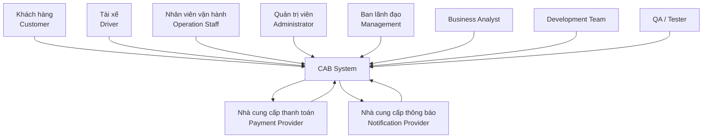
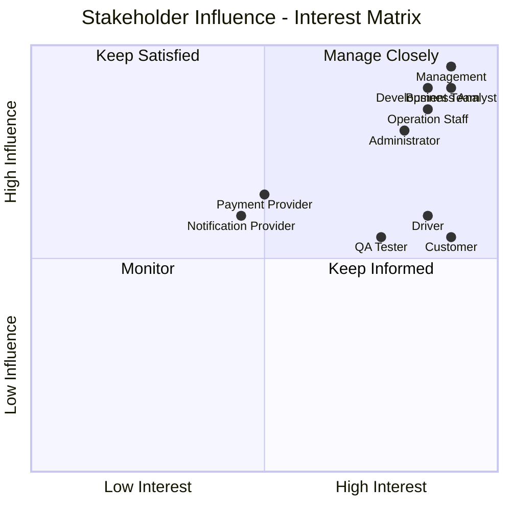

## 2. Stakeholders

### 2.1. Danh sách Stakeholders và vai trò

| STT | Stakeholder                                                | Vai trò / Mối quan tâm                                                                                                                           |
| --- | ---------------------------------------------------------- | ------------------------------------------------------------------------------------------------------------------------------------------------ |
| 1   | **Khách hàng (Customer/Passenger)**                        | Đăng ký, đăng nhập, đặt xe, lựa chọn loại xe, theo dõi chuyến đi, xem giá cước, thanh toán, xem lịch sử chuyến đi và đánh giá tài xế.            |
| 2   | **Tài xế (Driver)**                                        | Quản lý hồ sơ và phương tiện, cập nhật trạng thái hoạt động, nhận/từ chối chuyến, cập nhật vị trí và trạng thái chuyến đi.                       |
| 3   | **Nhân viên vận hành (Operation Staff)**                   | Quản lý khách hàng, tài xế, phương tiện và chuyến đi; giám sát các chuyến đang diễn ra và hỗ trợ xử lý sự cố.                                    |
| 4   | **Quản trị viên (Administrator)**                          | Quản lý tài khoản, phân quyền người dùng, kiểm soát các chức năng quản trị nhạy cảm và theo dõi nhật ký hệ thống.                                |
| 5   | **Ban lãnh đạo Công ty ABC (Management)**                  | Theo dõi hoạt động kinh doanh, doanh thu, số lượng chuyến, tỷ lệ hoàn thành, tỷ lệ hủy và hiệu quả hoạt động của tài xế.                         |
| 6   | **Nhà cung cấp thanh toán (Payment Provider)**             | Xử lý các giao dịch thanh toán điện tử và trả kết quả giao dịch cho CAB System.                                                                  |
| 7   | **Nhà cung cấp dịch vụ thông báo (Notification Provider)** | Cung cấp dịch vụ gửi thông báo như Push Notification, SMS hoặc Email cho khách hàng và tài xế.                                                   |
| 8   | **Business Analyst (BA)**                                  | Thu thập, phân tích, làm rõ và quản lý yêu cầu; xác định quy trình nghiệp vụ, quy tắc nghiệp vụ, trường hợp ngoại lệ và các vấn đề cần xác nhận. |
| 9   | **Nhóm phát triển (Development Team)**                     | Thiết kế kiến trúc, lập trình, tích hợp và triển khai CAB System dựa trên các yêu cầu đã được thống nhất.                                        |
| 10  | **Nhóm kiểm thử (QA/Tester)**                              | Kiểm thử chức năng, tích hợp, hiệu năng, bảo mật và độ ổn định của hệ thống trước khi triển khai.                                                |

---

### 2.2. Stakeholder Matrix

Stakeholders được đánh giá dựa trên hai tiêu chí:

* **Influence:** Mức độ ảnh hưởng của Stakeholder đến dự án.
* **Interest:** Mức độ quan tâm của Stakeholder đối với hệ thống CAB.

| Stakeholder                  | Influence | Interest | Nhóm quản lý   | Cách tương tác                                                                      |
| ---------------------------- | --------- | -------- | -------------- | ----------------------------------------------------------------------------------- |
| **Ban lãnh đạo Công ty ABC** | High      | High     | Manage Closely | Thường xuyên trao đổi, báo cáo tiến độ và xác nhận các yêu cầu quan trọng.          |
| **Nhân viên vận hành**       | High      | High     | Manage Closely | Phỏng vấn, xác nhận quy trình nghiệp vụ và kiểm thử các chức năng vận hành.         |
| **Quản trị viên**            | High      | High     | Manage Closely | Làm rõ yêu cầu phân quyền, bảo mật và quản trị hệ thống.                            |
| **Khách hàng**               | Medium    | High     | Keep Informed  | Thu thập nhu cầu sử dụng, phản hồi về đặt xe, thanh toán và trải nghiệm người dùng. |
| **Tài xế**                   | Medium    | High     | Keep Informed  | Thu thập yêu cầu về nhận chuyến, vị trí, trạng thái chuyến và quản lý phương tiện.  |
| **Payment Provider**         | Medium    | Medium   | Keep Satisfied | Làm rõ API, quy trình thanh toán, trạng thái giao dịch và xử lý giao dịch thất bại. |
| **Notification Provider**    | Medium    | Medium   | Keep Satisfied | Làm rõ API, loại thông báo và khả năng mở rộng các kênh thông báo.                  |
| **Business Analyst**         | High      | High     | Manage Closely | Là đầu mối phân tích, quản lý và xác nhận yêu cầu giữa các bên.                     |
| **Development Team**         | High      | High     | Manage Closely | Phối hợp với BA để phân tích tính khả thi kỹ thuật và triển khai hệ thống.          |
| **QA/Tester**                | Medium    | High     | Keep Informed  | Phối hợp xây dựng test case và xác nhận hệ thống đáp ứng đúng yêu cầu.              |

---

### 2.3. Phân loại Stakeholders theo Influence – Interest Matrix

|                                 | **Interest thấp**                       | **Interest cao**                                                   |
| ------------------------------- | --------------------------------------- | ------------------------------------------------------------------ |
| **Influence cao**               | **Keep Satisfied**                      | **Manage Closely**                                                 |
|                                 | Payment Provider, Notification Provider | Ban lãnh đạo, Operation Staff, Administrator, BA, Development Team |
| **Influence thấp / trung bình** | **Monitor**                             | **Keep Informed**                                                  |
|                                 | Các bên hỗ trợ khác nếu có              | Customer, Driver, QA/Tester                                        |

#### Ý nghĩa các nhóm

* **Manage Closely:** Các bên có ảnh hưởng và mức độ quan tâm cao, cần trao đổi và phối hợp thường xuyên.
* **Keep Satisfied:** Có khả năng ảnh hưởng đến hệ thống nhưng không tham gia trực tiếp vào mọi hoạt động.
* **Keep Informed:** Quan tâm nhiều đến sản phẩm và cần được cập nhật hoặc thu thập phản hồi thường xuyên.
* **Monitor:** Theo dõi khi cần thiết, không cần tương tác thường xuyên.

---

### 2.4. Sơ đồ Stakeholders của CAB System

---

### 2.5. Sơ đồ phân nhóm Stakeholder Matrix

---

### 2.6. Stakeholders chính của hệ thống

Các Stakeholders cần được ưu tiên trong quá trình phân tích yêu cầu gồm:

1. **Khách hàng** – người trực tiếp sử dụng dịch vụ đặt xe.
2. **Tài xế** – người nhận và thực hiện chuyến đi.
3. **Nhân viên vận hành** – quản lý và giám sát hoạt động của hệ thống.
4. **Quản trị viên** – quản lý tài khoản, phân quyền và bảo mật.
5. **Ban lãnh đạo** – xác định mục tiêu kinh doanh và yêu cầu tổng thể của dự án.

Các hệ thống bên ngoài gồm **Payment Provider** và **Notification Provider** là các Stakeholders quan trọng vì CAB System cần tích hợp với các dịch vụ này để thực hiện thanh toán và gửi thông báo.

---

## 3. Business Goals

Các yêu cầu quan trọng của khách hàng được chuyển đổi thành các mục tiêu nghiệp vụ (Business Goals) như sau:

| Mã | Business Goal | Mô tả |
|---|---|---|
| **BG-01** | Xây dựng nền tảng CAB phục vụ quy trình đặt xe toàn diện | Hệ thống hỗ trợ xuyên suốt quy trình từ khách hàng tạo yêu cầu đặt xe, tìm và phân công tài xế, thực hiện chuyến đi, tính cước, thanh toán đến đánh giá sau chuyến. |
| **BG-02** | Tự động hóa quá trình tìm và phân công tài xế | Hệ thống tự động tìm và ưu tiên tài xế phù hợp dựa trên vị trí, trạng thái sẵn sàng và các tiêu chí vận hành, đồng thời tự động tìm tài xế khác khi tài xế trước từ chối hoặc không phản hồi. |
| **BG-03** | Nâng cao trải nghiệm và khả năng theo dõi chuyến đi | Khách hàng có thể theo dõi trạng thái chuyến đi, tài xế được phân công, thời gian dự kiến tài xế đến và nhận thông báo về các sự kiện quan trọng của chuyến. |
| **BG-04** | Quản lý tập trung cước phí và thanh toán | Hệ thống hỗ trợ tính cước, quản lý giao dịch, thanh toán tiền mặt và thanh toán điện tử thông qua nhà cung cấp bên ngoài, đồng thời đảm bảo an toàn thông tin thanh toán. |
| **BG-05** | Nâng cao hiệu quả quản lý và vận hành | Cung cấp khả năng quản lý khách hàng, tài xế, phương tiện, chuyến đi và giao dịch; hỗ trợ nhân viên vận hành theo dõi và xử lý các trường hợp bất thường. |
| **BG-06** | Hỗ trợ giám sát và ra quyết định kinh doanh | Cung cấp báo cáo về số lượng chuyến, doanh thu, tỷ lệ hoàn thành, tỷ lệ hủy và hiệu quả hoạt động của tài xế để hỗ trợ ban lãnh đạo theo dõi hoạt động kinh doanh. |
| **BG-07** | Xây dựng nền tảng ổn định, bảo mật và có khả năng mở rộng | Hệ thống phải hoạt động ổn định khi nhu cầu tăng cao, bảo vệ dữ liệu người dùng và giao dịch, đồng thời cho phép các thành phần mở rộng độc lập mà không làm gián đoạn toàn bộ hệ thống. |
| **BG-08** | Đảm bảo khả năng phát triển và mở rộng lâu dài | Kiến trúc hệ thống phải linh hoạt để có thể bổ sung loại dịch vụ, phương thức thanh toán, kênh thông báo và thay đổi các thành phần kỹ thuật trong tương lai mà không cần xây dựng lại toàn bộ hệ thống. |
