## 1. STAKEHOLDERS

### 1.1. Mục đích

Stakeholders là các cá nhân, nhóm hoặc tổ chức có liên quan đến quá trình xây dựng, vận hành hoặc sử dụng **CAB System**.

Việc xác định Stakeholders giúp làm rõ:

* Những bên cung cấp và xác nhận yêu cầu.
* Những bên trực tiếp sử dụng hệ thống.
* Những bên tham gia vận hành và quản trị hệ thống.
* Những bên cung cấp dịch vụ tích hợp bên ngoài.
* Những bên tham gia phát triển và kiểm thử hệ thống.

---

### 1.2. Danh sách Stakeholders

| STT    | Stakeholder                                        | Loại       | Vai trò / Mối quan tâm                                                                                                                                                              |
| ------ | -------------------------------------------------- | ---------- | ----------------------------------------------------------------------------------------------------------------------------------------------------------------------------------- |
| **1**  | **Khách hàng (Customer/Passenger)**                | Người dùng | Sử dụng CAB System để đặt xe, theo dõi chuyến đi, thanh toán, xem lịch sử chuyến và đánh giá tài xế. Quan tâm đến sự thuận tiện, chính xác, an toàn và khả năng theo dõi chuyến đi. |
| **2**  | **Tài xế (Driver)**                                | Người dùng | Sử dụng hệ thống để quản lý hồ sơ và phương tiện, cập nhật trạng thái hoạt động và vị trí, nhận hoặc từ chối chuyến, thực hiện và cập nhật trạng thái chuyến đi.                    |
| **3**  | **Nhân viên vận hành (Operation Staff)**           | Nội bộ     | Theo dõi hoạt động của hệ thống; quản lý khách hàng, tài xế, phương tiện và chuyến đi; hỗ trợ xử lý các trường hợp bất thường hoặc sự cố.                                           |
| **4**  | **Quản trị viên (Administrator)**                  | Nội bộ     | Quản lý tài khoản hệ thống, phân quyền, kiểm soát quyền truy cập và theo dõi các thao tác quản trị quan trọng.                                                                      |
| **5**  | **Ban lãnh đạo Công ty ABC (Management)**          | Nội bộ     | Định hướng mục tiêu kinh doanh, theo dõi kết quả hoạt động và sử dụng các báo cáo như số chuyến, doanh thu, tỷ lệ hoàn thành, tỷ lệ hủy và hiệu quả tài xế.                         |
| **6**  | **Nhà cung cấp thanh toán (Payment Provider)**     | Bên ngoài  | Cung cấp dịch vụ xử lý thanh toán điện tử và trả kết quả giao dịch cho CAB System.                                                                                                  |
| **7**  | **Nhà cung cấp thông báo (Notification Provider)** | Bên ngoài  | Cung cấp dịch vụ gửi thông báo cho khách hàng và tài xế thông qua kênh thông báo được CAB System tích hợp.                                                                          |
| **8**  | **Business Analyst (BA)**                          | Nhóm dự án | Thu thập, phân tích, làm rõ và quản lý yêu cầu; xác định Business Goals, phạm vi, quy trình nghiệp vụ, quy tắc và các vấn đề cần xác nhận.                                          |
| **9**  | **Development Team**                               | Nhóm dự án | Thiết kế kiến trúc, xây dựng, tích hợp và triển khai CAB System dựa trên các yêu cầu đã được thống nhất.                                                                            |
| **10** | **QA / Tester**                                    | Nhóm dự án | Kiểm thử các chức năng và yêu cầu phi chức năng nhằm đảm bảo CAB System đáp ứng yêu cầu đã xác định.                                                                                |

---

### 1.3. Phân loại Stakeholders

Các Stakeholders của CAB System được chia thành bốn nhóm chính:

| Nhóm                           | Stakeholders                                  | Vai trò chính                                                    |
| ------------------------------ | --------------------------------------------- | ---------------------------------------------------------------- |
| **Người dùng hệ thống**        | Customer, Driver                              | Trực tiếp sử dụng CAB System để đặt xe và thực hiện chuyến đi.   |
| **Vận hành và quản lý nội bộ** | Operation Staff, Administrator, Management    | Vận hành, quản trị, giám sát và đánh giá hoạt động của hệ thống. |
| **Đối tác bên ngoài**          | Payment Provider, Notification Provider       | Cung cấp các dịch vụ bên ngoài được CAB System tích hợp.         |
| **Nhóm dự án**                 | Business Analyst, Development Team, QA/Tester | Phân tích yêu cầu, phát triển và kiểm thử hệ thống.              |

---

### 1.4. Stakeholders trực tiếp và gián tiếp

#### Stakeholders trực tiếp

Là những bên trực tiếp tương tác hoặc sử dụng kết quả từ CAB System:

* Customer
* Driver
* Operation Staff
* Administrator
* Management
* Payment Provider
* Notification Provider

#### Stakeholders gián tiếp

Là những bên tham gia xây dựng và đảm bảo chất lượng của hệ thống nhưng không phải người dùng nghiệp vụ của CAB System:

* Business Analyst
* Development Team
* QA / Tester

---

### 1.5. Sơ đồ tổng quan Stakeholders

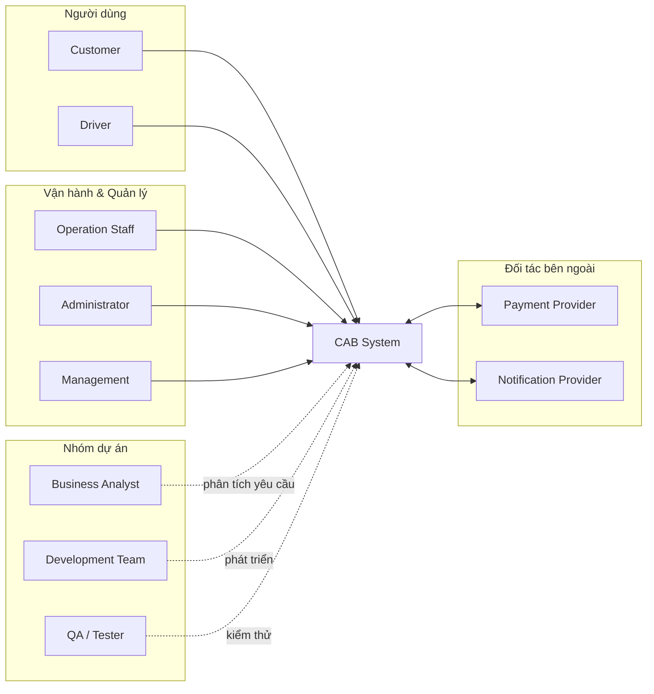

---

### 1.6. Kết luận

CAB System có **10 Stakeholders chính**, bao gồm người dùng, bộ phận vận hành và quản lý của Công ty ABC, các nhà cung cấp dịch vụ bên ngoài và nhóm phát triển dự án.

Việc xác định rõ từng Stakeholder là cơ sở để tiếp tục phân tích **Stakeholder Matrix, Business Goals, Actors, Business Requirements và các yêu cầu hệ thống** trong các phần tiếp theo.


## 2. STAKEHOLDER MATRIX

### 2.1. Mục đích

Stakeholder Matrix được sử dụng để đánh giá các bên liên quan dựa trên hai yếu tố:

* **Influence (Mức độ ảnh hưởng):** Khả năng Stakeholder tác động đến yêu cầu, phạm vi, quyết định hoặc quá trình triển khai CAB System.
* **Interest (Mức độ quan tâm):** Mức độ Stakeholder quan tâm đến hoạt động và kết quả của CAB System.

Dựa trên hai yếu tố này, Stakeholders được phân thành bốn nhóm quản lý:

* **Manage Closely:** Ảnh hưởng cao – Quan tâm cao.
* **Keep Satisfied:** Ảnh hưởng cao – Quan tâm thấp.
* **Keep Informed:** Ảnh hưởng thấp – Quan tâm cao.
* **Monitor:** Ảnh hưởng thấp – Quan tâm thấp.

---

### 2.2. Ma trận Influence – Interest

| Stakeholder               | Influence | Interest | Nhóm quản lý   | Cách thức quản lý                                                                                     |
| ------------------------- | --------- | -------- | -------------- | ----------------------------------------------------------------------------------------------------- |
| **Customer**              | Low       | High     | Keep Informed  | Thu thập phản hồi, thông báo các thay đổi quan trọng liên quan đến đặt xe, chuyến đi và thanh toán.   |
| **Driver**                | Low       | High     | Keep Informed  | Thu thập phản hồi về nhận chuyến, trạng thái hoạt động và quá trình thực hiện chuyến.                 |
| **Operation Staff**       | High      | High     | Manage Closely | Tham gia xác định và kiểm tra các yêu cầu liên quan đến vận hành, giám sát và xử lý sự cố.            |
| **Administrator**         | High      | High     | Manage Closely | Tham gia xác định yêu cầu quản trị tài khoản, phân quyền, bảo mật và nhật ký hệ thống.                |
| **Management**            | High      | High     | Manage Closely | Xác định mục tiêu kinh doanh, phạm vi ưu tiên và yêu cầu báo cáo của CAB System.                      |
| **Payment Provider**      | High      | Low      | Keep Satisfied | Duy trì tích hợp ổn định, tuân thủ yêu cầu giao tiếp và xử lý giao dịch của nhà cung cấp.             |
| **Notification Provider** | High      | Low      | Keep Satisfied | Duy trì tích hợp và đảm bảo khả năng gửi thông báo theo các sự kiện của hệ thống.                     |
| **Business Analyst**      | High      | High     | Manage Closely | Phân tích, quản lý và duy trì tính nhất quán của các yêu cầu trong toàn bộ dự án.                     |
| **Development Team**      | High      | High     | Manage Closely | Thường xuyên trao đổi về yêu cầu, phạm vi MVP, thiết kế và khả năng triển khai trong thời gian dự án. |
| **QA / Tester**           | Low       | High     | Keep Informed  | Cập nhật yêu cầu, Use Case và Acceptance Criteria để xây dựng và thực hiện kiểm thử.                  |

---

### 2.3. Phân nhóm Stakeholders

#### Manage Closely – High Influence / High Interest

Bao gồm:

* Management
* Operation Staff
* Administrator
* Business Analyst
* Development Team

Đây là nhóm cần được trao đổi và phối hợp thường xuyên vì có ảnh hưởng trực tiếp đến yêu cầu, phạm vi, thiết kế và quá trình triển khai CAB System.

#### Keep Satisfied – High Influence / Low Interest

Bao gồm:

* Payment Provider
* Notification Provider

Đây là các đối tác bên ngoài có ảnh hưởng đến những chức năng tích hợp của CAB System. Nhóm dự án cần đảm bảo các yêu cầu tích hợp được đáp ứng và duy trì quan hệ phối hợp phù hợp.

#### Keep Informed – Low Influence / High Interest

Bao gồm:

* Customer
* Driver
* QA / Tester

Customer và Driver là những người trực tiếp sử dụng các chức năng chính của hệ thống. QA / Tester cần được cập nhật đầy đủ yêu cầu để đảm bảo quá trình kiểm thử phù hợp với yêu cầu đã xác định.

#### Monitor – Low Influence / Low Interest

Trong phạm vi MVP hiện tại, chưa xác định Stakeholder chính nào thuộc nhóm này. Nếu xuất hiện các bên hỗ trợ khác trong quá trình triển khai, nhóm dự án có thể theo dõi và cập nhật vào nhóm này khi cần.

---

### 2.4. Stakeholder Matrix

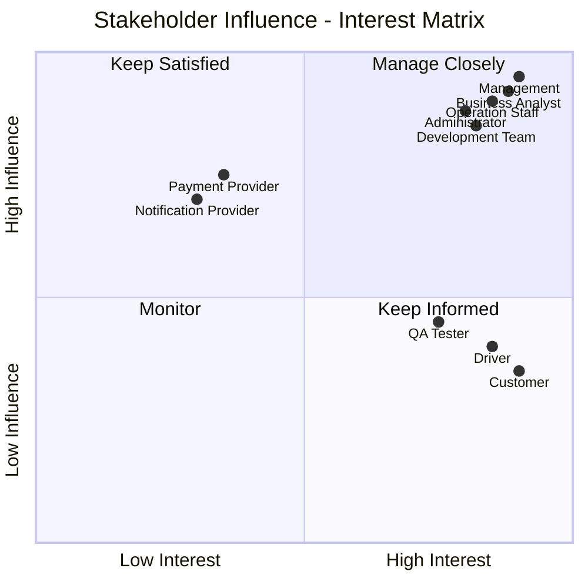

> **Lưu ý:** Các tọa độ trong sơ đồ chỉ được sử dụng để biểu diễn tương đối vị trí của Stakeholders theo mức độ Influence và Interest, không phải giá trị đo lường tuyệt đối.

---

### 2.5. Chiến lược quản lý Stakeholders

| Nhóm               | Chiến lược                                                                                                    |
| ------------------ | ------------------------------------------------------------------------------------------------------------- |
| **Manage Closely** | Thường xuyên trao đổi, tham gia vào các quyết định quan trọng và xác nhận các yêu cầu liên quan.              |
| **Keep Satisfied** | Duy trì phối hợp và đảm bảo các yêu cầu tích hợp hoặc phụ thuộc bên ngoài được đáp ứng.                       |
| **Keep Informed**  | Cập nhật thông tin cần thiết, thu thập phản hồi và ghi nhận các vấn đề trong quá trình sử dụng hoặc kiểm thử. |
| **Monitor**        | Theo dõi ở mức cần thiết và cập nhật mức độ tham gia khi có thay đổi về phạm vi hoặc yêu cầu.                 |

---

## 3. BUSINESS GOALS

### 3.1. Mục đích

Business Goals xác định các mục tiêu kinh doanh mà Công ty ABC mong muốn đạt được thông qua việc xây dựng **CAB System**.

Các Business Goals được xác định từ những hạn chế của hệ thống hiện tại và nhu cầu phát triển nền tảng đặt xe mới. Đây là cơ sở để xác định phạm vi hệ thống, các module MVP và các Business Requirements ở những phần tiếp theo.

---

### 3.2. Business Goals của CAB System

| Mã        | Business Goal                                                         | Mô tả                                                                                                                                                                                           |
| --------- | --------------------------------------------------------------------- | ----------------------------------------------------------------------------------------------------------------------------------------------------------------------------------------------- |
| **BG-01** | **Xây dựng nền tảng đặt xe trực tuyến toàn diện**                     | Xây dựng CAB System hỗ trợ quy trình đặt xe từ khi khách hàng tạo yêu cầu, tìm tài xế, thực hiện chuyến đi, hoàn thành chuyến đến thanh toán và đánh giá tài xế.                                |
| **BG-02** | **Tự động hóa quá trình tìm và phân công tài xế**                     | Giảm việc phân công tài xế thủ công bằng cách tự động tìm và ưu tiên tài xế phù hợp dựa trên vị trí, trạng thái sẵn sàng và các tiêu chí vận hành.                                              |
| **BG-03** | **Nâng cao trải nghiệm đặt xe và theo dõi chuyến đi**                 | Giúp khách hàng theo dõi quá trình đặt xe, thông tin tài xế, thời gian dự kiến đến và trạng thái chuyến đi; đồng thời nhận thông báo tại các thời điểm quan trọng.                              |
| **BG-04** | **Quản lý tập trung cước phí và thanh toán**                          | Tập trung thông tin về cước phí và giao dịch, đồng thời hỗ trợ thanh toán tiền mặt và thanh toán điện tử thông qua nhà cung cấp thanh toán bên ngoài.                                           |
| **BG-05** | **Nâng cao hiệu quả quản lý và vận hành dịch vụ**                     | Hỗ trợ Công ty ABC quản lý tập trung khách hàng, tài xế, phương tiện, chuyến đi và giao dịch; đồng thời cung cấp khả năng giám sát, xử lý sự cố và báo cáo hoạt động.                           |
| **BG-06** | **Xây dựng nền tảng ổn định, bảo mật và có khả năng mở rộng lâu dài** | Đảm bảo CAB System có khả năng phục vụ số lượng lớn người dùng và tài xế, bảo vệ dữ liệu, hạn chế ảnh hưởng khi một thành phần gặp lỗi và hỗ trợ mở rộng dịch vụ hoặc tích hợp trong tương lai. |

---

### 3.3. Chuyển đổi vấn đề hiện tại thành Business Goals

| Vấn đề / Nhu cầu của Công ty ABC                                                               | Business Goal |
| ---------------------------------------------------------------------------------------------- | ------------- |
| Quy trình đặt xe hiện tại còn phụ thuộc vào tổng đài hoặc ứng dụng đơn giản.                   | **BG-01**     |
| Việc tìm và phân công tài xế còn thực hiện thủ công.                                           | **BG-02**     |
| Khách hàng khó theo dõi quá trình tìm tài xế và trạng thái chuyến đi.                          | **BG-03**     |
| Thông tin cước phí, thanh toán và giao dịch chưa được quản lý tập trung.                       | **BG-04**     |
| Việc quản lý khách hàng, tài xế, phương tiện và chuyến đi còn hạn chế.                         | **BG-05**     |
| Hệ thống hiện tại khó mở rộng khi số lượng người dùng tăng hoặc khi cần bổ sung tính năng mới. | **BG-06**     |

---

### 3.4. Liên kết Business Goals với Stakeholders

| Business Goal | Stakeholders chính                            |
| ------------- | --------------------------------------------- |
| **BG-01**     | Customer, Driver, Operation Staff, Management |
| **BG-02**     | Customer, Driver, Operation Staff             |
| **BG-03**     | Customer, Driver, Notification Provider       |
| **BG-04**     | Customer, Operation Staff, Payment Provider   |
| **BG-05**     | Operation Staff, Administrator, Management    |
| **BG-06**     | Administrator, Management, Development Team   |

---

### 3.5. Mức độ ưu tiên Business Goals

Do thời gian triển khai CAB System dự kiến là **7 tuần**, các Business Goals được ưu tiên theo phương pháp MoSCoW.

| Business Goal | Mức ưu tiên     | Lý do                                                                                                                        |
| ------------- | --------------- | ---------------------------------------------------------------------------------------------------------------------------- |
| **BG-01**     | **Must Have**   | Là mục tiêu cốt lõi để CAB System có thể cung cấp dịch vụ đặt xe hoàn chỉnh.                                                 |
| **BG-02**     | **Must Have**   | Giải quyết trực tiếp hạn chế phân công tài xế thủ công của hệ thống hiện tại.                                                |
| **BG-03**     | **Must Have**   | Cần thiết để khách hàng có thể theo dõi và nắm được tình trạng chuyến đi.                                                    |
| **BG-04**     | **Must Have**   | Cần thiết để hoàn thiện quy trình chuyến đi và quản lý thông tin thanh toán tập trung.                                       |
| **BG-05**     | **Should Have** | Cần thiết cho hoạt động vận hành; một số chức năng báo cáo nâng cao có thể được giới hạn trong MVP.                          |
| **BG-06**     | **Should Have** | Là mục tiêu quan trọng về kiến trúc và phát triển lâu dài; các khả năng mở rộng nâng cao có thể tiếp tục phát triển sau MVP. |

---

### 3.6. Sơ đồ Business Goals

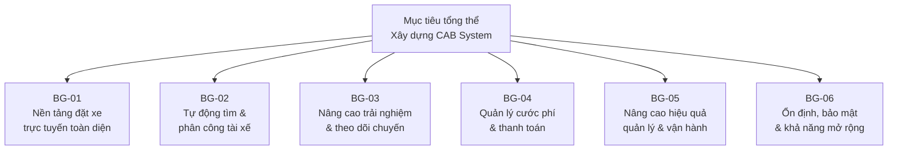

---

### 3.7. Quan hệ giữa các Business Goals

Các Business Goals không hoạt động độc lập mà hỗ trợ lẫn nhau trong quá trình hình thành CAB System.

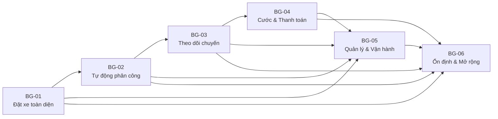

Trong đó:

* **BG-01** xác định dịch vụ cốt lõi của CAB System.
* **BG-02** hỗ trợ tự động hóa quá trình tìm và phân công tài xế.
* **BG-03** cải thiện khả năng theo dõi và trải nghiệm của khách hàng.
* **BG-04** hoàn thiện quy trình chuyến đi thông qua tính cước và thanh toán.
* **BG-05** hỗ trợ Công ty ABC quản lý và giám sát hoạt động.
* **BG-06** cung cấp nền tảng về bảo mật, tính ổn định và khả năng phát triển lâu dài.

---

## 4. SYSTEM SCOPE

### 4.1. Mục đích

System Scope xác định phạm vi phát triển của **CAB System**, làm rõ những chức năng thuộc phạm vi triển khai, những chức năng chỉ triển khai ở mức giới hạn trong MVP và những chức năng chưa được thực hiện trong giai đoạn hiện tại.

Do CAB System được dự kiến triển khai trong **7 tuần**, phạm vi được ưu tiên vào các chức năng cốt lõi để hình thành một quy trình đặt xe hoàn chỉnh:

**Đăng nhập/Đăng ký → Đặt xe → Tìm tài xế → Thực hiện chuyến → Thanh toán → Đánh giá**

Bên cạnh đó, hệ thống cung cấp các chức năng cần thiết cho nhân viên vận hành, quản trị viên và ban quản lý.

---

### 4.2. In Scope

Các chức năng sau thuộc phạm vi phát triển chính của CAB System.

#### 4.2.1. Tài khoản và xác thực

CAB System hỗ trợ:

* Đăng ký tài khoản khách hàng.
* Đăng nhập và đăng xuất hệ thống.
* Xem và cập nhật thông tin cá nhân được phép chỉnh sửa.
* Quản lý hồ sơ cơ bản của khách hàng và tài xế.
* Xác thực người dùng trước khi truy cập các chức năng yêu cầu tài khoản.
* Kiểm soát quyền truy cập đối với các chức năng quản trị.

#### 4.2.2. Đặt xe

Khách hàng có thể:

* Nhập điểm đón.
* Nhập điểm đến.
* Chọn loại phương tiện/dịch vụ được hệ thống hỗ trợ.
* Xem thông tin yêu cầu đặt xe.
* Xác nhận tạo yêu cầu đặt xe.
* Hủy yêu cầu/chuyến trong trường hợp được chính sách cho phép.

#### 4.2.3. Quản lý tài xế và phương tiện

CAB System hỗ trợ:

* Quản lý hồ sơ tài xế.
* Quản lý phương tiện gắn với tài xế.
* Quản lý loại phương tiện.
* Cập nhật trạng thái hoạt động của tài xế.
* Ghi nhận vị trí của tài xế để phục vụ quá trình tìm và phân công chuyến.

#### 4.2.4. Tìm và phân công tài xế

CAB System tự động hỗ trợ:

* Tìm các tài xế đang ở trạng thái sẵn sàng.
* Lọc tài xế theo vị trí, trạng thái và loại phương tiện phù hợp.
* Ưu tiên các tài xế phù hợp theo tiêu chí vận hành.
* Gửi yêu cầu nhận chuyến cho tài xế.
* Ghi nhận việc tài xế chấp nhận hoặc từ chối chuyến.
* Tiếp tục tìm tài xế khác khi tài xế từ chối hoặc không phản hồi theo thời gian quy định.
* Thông báo cho khách hàng khi không tìm được tài xế phù hợp.

> Tiêu chí ưu tiên tài xế và thời gian phản hồi cụ thể chưa được xác định và được quản lý tại **Mục 13 – Open Questions / TBD**.

#### 4.2.5. Thực hiện và theo dõi chuyến đi

CAB System hỗ trợ:

* Hiển thị thông tin tài xế sau khi chuyến được nhận.
* Hiển thị thời gian dự kiến tài xế đến điểm đón.
* Theo dõi trạng thái chuyến đi.
* Tài xế cập nhật các trạng thái quan trọng của chuyến.
* Ghi nhận thời điểm bắt đầu và hoàn thành chuyến.
* Hỗ trợ hủy chuyến theo chính sách của doanh nghiệp.

Luồng trạng thái chính:

```text
CREATED
   ↓
SEARCHING_DRIVER
   ↓
DRIVER_ASSIGNED
   ↓
DRIVER_ARRIVED
   ↓
PASSENGER_PICKED_UP
   ↓
IN_PROGRESS
   ↓
COMPLETED
```

Chuyến có thể chuyển sang trạng thái `CANCELLED` tại các thời điểm được chính sách hủy chuyến cho phép.

#### 4.2.6. Lịch sử chuyến đi và đánh giá

Khách hàng có thể:

* Xem danh sách chuyến đi trước đây.
* Xem thông tin chi tiết của từng chuyến.
* Đánh giá tài xế sau khi chuyến hoàn thành.
* Xem lại đánh giá đã thực hiện.

#### 4.2.7. Quản lý và vận hành

Operation Staff được cung cấp các chức năng phù hợp để:

* Quản lý và tra cứu khách hàng.
* Quản lý và tra cứu tài xế.
* Quản lý phương tiện.
* Theo dõi các chuyến đang diễn ra.
* Xem chi tiết chuyến đi.
* Ghi nhận và hỗ trợ xử lý sự cố.
* Tra cứu lịch sử giao dịch.

Administrator được cung cấp các chức năng để:

* Quản lý tài khoản hệ thống.
* Quản lý quyền truy cập.
* Theo dõi nhật ký các thao tác quản trị quan trọng.

---

### 4.3. Limited Scope

Một số chức năng cần thiết cho CAB System nhưng chỉ được triển khai ở mức cơ bản trong MVP do giới hạn thời gian 7 tuần.

#### 4.3.1. Cước phí và thanh toán

Trong MVP:

* Hệ thống tính cước chuyến đi theo chính sách tính cước được ABC xác nhận.
* Hiển thị cước phí cho khách hàng.
* Hỗ trợ thanh toán bằng tiền mặt.
* Hỗ trợ thanh toán điện tử thông qua **một Payment Provider chính**.
* Lưu kết quả và thông tin giao dịch cần thiết.
* Không lưu trực tiếp thông tin thẻ hoặc thông tin tài khoản thanh toán nhạy cảm.

> Công thức tính cước chi tiết chưa được xác định và được quản lý tại **Open Questions / TBD**.

#### 4.3.2. Notification

Trong MVP, hệ thống gửi các thông báo tại những sự kiện quan trọng như:

* Yêu cầu đặt xe được tiếp nhận.
* Tài xế chấp nhận chuyến.
* Tài xế đến điểm đón.
* Chuyến đi hoàn thành.
* Kết quả thanh toán.
* Có yêu cầu chuyến mới dành cho tài xế.

MVP chỉ yêu cầu tích hợp **một phương thức/Notification Provider chính**. Kiến trúc cần cho phép bổ sung các kênh thông báo khác trong tương lai.

#### 4.3.3. Báo cáo và thống kê

CAB System cung cấp các báo cáo cơ bản:

* Số lượng chuyến.
* Doanh thu.
* Tỷ lệ hoàn thành chuyến.
* Tỷ lệ hủy chuyến.
* Thông tin hỗ trợ đánh giá hiệu quả tài xế.
* Báo cáo tổng hợp hoạt động.

Các chức năng phân tích dữ liệu và Business Intelligence nâng cao không thuộc MVP.

---

### 4.4. Out of Scope

Các chức năng sau **không thuộc phạm vi phát triển của CAB System MVP hiện tại**:

* Thuật toán AI/Machine Learning nâng cao để dự đoán hoặc tối ưu phân công tài xế.
* Dynamic Pricing hoặc Surge Pricing phức tạp.
* Phân tích dữ liệu và Business Intelligence nâng cao.
* Tích hợp đồng thời nhiều Payment Provider.
* Tích hợp đồng thời nhiều Notification Provider hoặc nhiều kênh thông báo nâng cao.
* Các loại hình vận chuyển hoặc dịch vụ mới ngoài phạm vi MVP.
* Các chương trình thành viên, loyalty hoặc reward nâng cao.
* Hệ thống khuyến mãi phức tạp.
* Các tích hợp bên thứ ba nâng cao chưa được xác định trong yêu cầu MVP.

Các chức năng này có thể được xem xét trong các phiên bản phát triển sau.

---

### 4.5. Ranh giới hệ thống

CAB System chịu trách nhiệm quản lý nghiệp vụ đặt xe và dữ liệu liên quan trong phạm vi hệ thống.

Các dịch vụ thanh toán và gửi thông báo được thực hiện thông qua hệ thống bên ngoài.

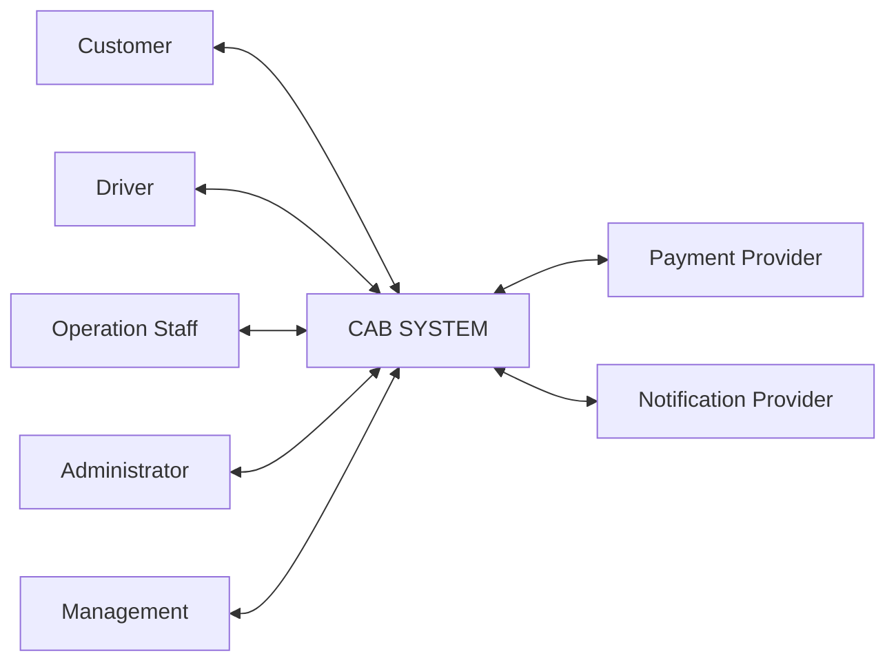

Trong đó:

* **CAB System** quản lý tài khoản, đặt xe, tài xế, phương tiện, chuyến đi, cước phí, lịch sử, vận hành và báo cáo.
* **Payment Provider** chịu trách nhiệm xử lý giao dịch thanh toán điện tử bên ngoài CAB System.
* **Notification Provider** chịu trách nhiệm cung cấp dịch vụ gửi thông báo.
* CAB System chỉ lưu các thông tin cần thiết về kết quả giao dịch và trạng thái thông báo.

---

### 4.6. Phân loại phạm vi

| Nhóm chức năng              | Phạm vi           | Ghi chú                       |
| --------------------------- | ----------------- | ----------------------------- |
| Tài khoản & Xác thực        | **In Scope**      | Chức năng cơ bản              |
| Đặt xe                      | **In Scope**      | Chức năng cốt lõi             |
| Tài xế & Phương tiện        | **In Scope**      | Phục vụ quá trình đặt xe      |
| Tìm & Phân công tài xế      | **In Scope**      | Tự động hóa ở mức MVP         |
| Thực hiện & Theo dõi chuyến | **In Scope**      | Chức năng cốt lõi             |
| Lịch sử & Đánh giá          | **In Scope**      | Sau chuyến đi                 |
| Quản lý & Vận hành          | **In Scope**      | Chức năng vận hành cơ bản     |
| Cước phí & Thanh toán       | **Limited Scope** | Tiền mặt + 1 Payment Provider |
| Notification                | **Limited Scope** | 1 Provider/kênh chính         |
| Báo cáo & Thống kê          | **Limited Scope** | Báo cáo cơ bản                |
| Dịch vụ & Tích hợp nâng cao | **Out of Scope**  | Xem xét sau MVP               |

---

### 4.7. Ràng buộc phạm vi

CAB System MVP được phát triển với các ràng buộc chính:

| Ràng buộc            | Mô tả                                                                             |
| -------------------- | --------------------------------------------------------------------------------- |
| **Thời gian**        | Phiên bản MVP dự kiến được phát triển trong **7 tuần**.                           |
| **Ưu tiên**          | Ưu tiên hoàn thiện luồng nghiệp vụ đặt xe cốt lõi trước các chức năng nâng cao.   |
| **Thanh toán**       | Chỉ tích hợp một Payment Provider chính trong MVP.                                |
| **Thông báo**        | Chỉ triển khai một giải pháp Notification chính trong MVP.                        |
| **Báo cáo**          | Chỉ cung cấp các báo cáo hoạt động cơ bản.                                        |
| **Khả năng mở rộng** | Kiến trúc cần hạn chế sự phụ thuộc giữa các thành phần để hỗ trợ mở rộng sau MVP. |

---

### 4.8. Luồng nghiệp vụ nằm trong phạm vi MVP

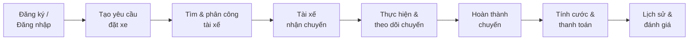

Luồng trên thể hiện phạm vi nghiệp vụ cốt lõi mà CAB System MVP cần hỗ trợ từ khi khách hàng truy cập hệ thống đến khi chuyến đi được hoàn thành, thanh toán và đánh giá.

---


## 5. ACTORS

### 5.1. Mục đích

Actor là cá nhân, nhóm người hoặc hệ thống bên ngoài có tương tác trực tiếp với **CAB System** để thực hiện một hoặc nhiều chức năng.

Việc xác định Actor giúp:

* Xác định ai trực tiếp sử dụng hệ thống.
* Xác định quyền và trách nhiệm của từng nhóm người dùng.
* Xác định các hệ thống bên ngoài cần tích hợp.
* Làm cơ sở xây dựng **Use Case Model**.

> Không phải mọi Stakeholder đều là Actor. Business Analyst, Development Team và QA/Tester là Stakeholders của dự án nhưng không phải Actor nghiệp vụ của CAB System.

---

### 5.2. Danh sách Actors

CAB System có **07 Actors chính**:

| Mã         | Actor                     | Loại               | Vai trò chính                                                                   |
| ---------- | ------------------------- | ------------------ | ------------------------------------------------------------------------------- |
| **ACT-01** | **Customer**              | Người dùng         | Đặt xe, theo dõi chuyến, thanh toán, xem lịch sử và đánh giá tài xế.            |
| **ACT-02** | **Driver**                | Người dùng         | Quản lý thông tin, cập nhật trạng thái/vị trí, nhận chuyến và thực hiện chuyến. |
| **ACT-03** | **Operation Staff**       | Nội bộ             | Quản lý và giám sát hoạt động vận hành của CAB System.                          |
| **ACT-04** | **Administrator**         | Nội bộ             | Quản lý tài khoản, phân quyền và nhật ký hệ thống.                              |
| **ACT-05** | **Management**            | Nội bộ             | Theo dõi các báo cáo và chỉ số hoạt động của CAB System.                        |
| **ACT-06** | **Payment Provider**      | Hệ thống bên ngoài | Xử lý các giao dịch thanh toán điện tử.                                         |
| **ACT-07** | **Notification Provider** | Hệ thống bên ngoài | Cung cấp dịch vụ gửi thông báo đến Customer và Driver.                          |

---

### 5.3. Mô tả chi tiết Actors

#### ACT-01 – Customer

**Customer** là khách hàng sử dụng CAB System để yêu cầu và sử dụng dịch vụ đặt xe.

Các tương tác chính:

* Đăng ký tài khoản.
* Đăng nhập/đăng xuất.
* Xem và cập nhật thông tin cá nhân.
* Nhập điểm đón và điểm đến.
* Chọn loại xe.
* Tạo yêu cầu đặt xe.
* Hủy chuyến theo chính sách.
* Xem thông tin tài xế.
* Theo dõi trạng thái chuyến đi.
* Xem cước phí.
* Chọn phương thức thanh toán.
* Thanh toán chuyến đi.
* Xem lịch sử chuyến đi.
* Đánh giá tài xế.

---

#### ACT-02 – Driver

**Driver** là tài xế cung cấp dịch vụ vận chuyển thông qua CAB System.

Các tương tác chính:

* Đăng nhập/đăng xuất.
* Xem và cập nhật thông tin cá nhân.
* Quản lý thông tin liên quan đến phương tiện trong phạm vi được phép.
* Cập nhật trạng thái hoạt động.
* Cập nhật vị trí.
* Nhận thông báo chuyến mới.
* Chấp nhận hoặc từ chối chuyến.
* Xác nhận đã đến điểm đón.
* Xác nhận đã đón khách.
* Bắt đầu chuyến đi.
* Hoàn thành chuyến đi.
* Hủy chuyến theo chính sách.

---

#### ACT-03 – Operation Staff

**Operation Staff** là nhân viên chịu trách nhiệm theo dõi và hỗ trợ hoạt động vận hành của CAB System.

Các tương tác chính:

* Đăng nhập hệ thống.
* Tra cứu và quản lý khách hàng theo quyền được cấp.
* Tra cứu và quản lý tài xế.
* Quản lý phương tiện.
* Theo dõi các chuyến đang diễn ra.
* Xem chi tiết chuyến đi.
* Ghi nhận và xử lý sự cố chuyến đi.
* Tra cứu lịch sử giao dịch.
* Theo dõi một số thông tin thống kê phục vụ vận hành.

---

#### ACT-04 – Administrator

**Administrator** chịu trách nhiệm quản trị và kiểm soát quyền truy cập trong CAB System.

Các tương tác chính:

* Đăng nhập hệ thống.
* Quản lý tài khoản hệ thống.
* Quản lý quyền truy cập.
* Kiểm soát các chức năng quản trị nhạy cảm.
* Xem nhật ký hoạt động quan trọng.

---

#### ACT-05 – Management

**Management** đại diện cho bộ phận quản lý của Công ty ABC sử dụng thông tin từ CAB System để theo dõi tình hình hoạt động.

Các tương tác chính:

* Xem báo cáo số lượng chuyến.
* Xem báo cáo doanh thu.
* Xem tỷ lệ chuyến hoàn thành.
* Xem tỷ lệ chuyến bị hủy.
* Theo dõi thông tin hỗ trợ đánh giá hiệu quả tài xế.
* Xem báo cáo hoạt động tổng hợp.

---

#### ACT-06 – Payment Provider

**Payment Provider** là hệ thống bên ngoài được CAB System tích hợp để xử lý thanh toán điện tử.

Các tương tác chính:

* Nhận yêu cầu thanh toán từ CAB System.
* Xử lý giao dịch thanh toán điện tử.
* Trả kết quả giao dịch cho CAB System.
* Cung cấp mã tham chiếu giao dịch khi phù hợp.

CAB System không lưu trực tiếp các thông tin thanh toán nhạy cảm như số thẻ hoặc thông tin tài khoản thanh toán của khách hàng.

---

#### ACT-07 – Notification Provider

**Notification Provider** là dịch vụ bên ngoài hỗ trợ CAB System gửi thông báo.

Các tương tác chính:

* Nhận yêu cầu gửi thông báo từ CAB System.
* Gửi thông báo đến người nhận.
* Trả kết quả xử lý thông báo cho CAB System khi dịch vụ hỗ trợ.

Các sự kiện thông báo chính trong MVP gồm:

* Yêu cầu đặt xe được tiếp nhận.
* Tài xế chấp nhận chuyến.
* Tài xế đến điểm đón.
* Chuyến đi hoàn thành.
* Kết quả thanh toán.
* Có chuyến mới dành cho tài xế.

---

### 5.4. Actor và chức năng chính

| Actor                     | Nhóm chức năng tương tác                                             |
| ------------------------- | -------------------------------------------------------------------- |
| **Customer**              | Tài khoản, đặt xe, theo dõi chuyến, thanh toán, lịch sử, đánh giá    |
| **Driver**                | Tài khoản, trạng thái, vị trí, nhận chuyến, thực hiện chuyến         |
| **Operation Staff**       | Quản lý khách hàng, tài xế, phương tiện, chuyến đi, sự cố, giao dịch |
| **Administrator**         | Tài khoản hệ thống, phân quyền, nhật ký                              |
| **Management**            | Báo cáo và thống kê                                                  |
| **Payment Provider**      | Thanh toán điện tử                                                   |
| **Notification Provider** | Gửi thông báo                                                        |

---

### 5.5. Phân biệt Stakeholder và Actor

Stakeholder và Actor có phạm vi khác nhau:

| Đối tượng             | Stakeholder | Actor | Giải thích                                                                       |
| --------------------- | :---------: | :---: | -------------------------------------------------------------------------------- |
| Customer              |      ✓      |   ✓   | Có lợi ích liên quan và trực tiếp sử dụng hệ thống.                              |
| Driver                |      ✓      |   ✓   | Có lợi ích liên quan và trực tiếp sử dụng hệ thống.                              |
| Operation Staff       |      ✓      |   ✓   | Trực tiếp vận hành CAB System.                                                   |
| Administrator         |      ✓      |   ✓   | Trực tiếp quản trị CAB System.                                                   |
| Management            |      ✓      |   ✓   | Trực tiếp xem các báo cáo của hệ thống.                                          |
| Payment Provider      |      ✓      |   ✓   | Hệ thống bên ngoài trực tiếp trao đổi dữ liệu thanh toán với CAB System.         |
| Notification Provider |      ✓      |   ✓   | Hệ thống bên ngoài trực tiếp trao đổi yêu cầu thông báo với CAB System.          |
| Business Analyst      |      ✓      |   ✗   | Tham gia phân tích yêu cầu nhưng không phải người dùng nghiệp vụ của CAB System. |
| Development Team      |      ✓      |   ✗   | Xây dựng hệ thống nhưng không phải Actor nghiệp vụ.                              |
| QA / Tester           |      ✓      |   ✗   | Kiểm thử hệ thống nhưng không phải Actor nghiệp vụ.                              |

---

### 5.6. Sơ đồ Actors của CAB System

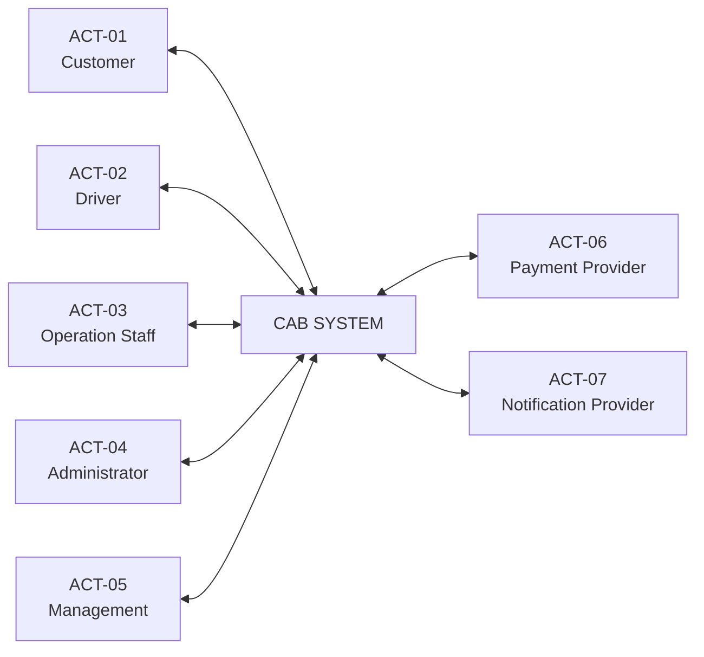

---

### 5.7. Actor không bao gồm CAB System

CAB System **không được xem là một Actor của chính nó**.

Các chức năng tự động như:

* Tìm tài xế phù hợp.
* Xếp hạng tài xế.
* Phân công tài xế.
* Tính cước chuyến đi.
* Lưu giao dịch.
* Ghi nhận nhật ký.

là các **Functional Requirements hoặc hành vi nội bộ của hệ thống**, không phải Actor.

Khi xây dựng Use Case Diagram, các hành vi này có thể được mô hình hóa dưới dạng Use Case được kích hoạt từ Use Case khác hoặc từ Actor bên ngoài phù hợp.

---


## 6. MVP MODULES

### 6.1. Mục đích

MVP Modules xác định các module chính cần được xây dựng trong phiên bản **Minimum Viable Product (MVP)** của CAB System.

Việc phân chia module nhằm:

* Tổ chức các chức năng theo từng nhóm nghiệp vụ.
* Xác định các thành phần cần ưu tiên trong thời gian triển khai 7 tuần.
* Liên kết các module với Business Goals.
* Kiểm soát phạm vi phát triển.
* Tạo cơ sở cho việc xác định Business Requirements và Functional Requirements.

---

### 6.2. Danh sách MVP Modules

CAB System được chia thành các module sau:

| Mã      | MVP Module                           | Business Goal | Scope         | Chức năng chính                                                                                 |
| ------- | ------------------------------------ | ------------- | ------------- | ----------------------------------------------------------------------------------------------- |
| **M01** | **User & Authentication**            | BG-01, BG-06  | In Scope      | Đăng ký, đăng nhập, đăng xuất, hồ sơ người dùng, xác thực và kiểm soát truy cập cơ bản.         |
| **M02** | **Booking Management**               | BG-01         | In Scope      | Nhập điểm đón/điểm đến, chọn loại xe, tạo và quản lý yêu cầu đặt xe.                            |
| **M03** | **Driver & Vehicle Management**      | BG-01, BG-02  | In Scope      | Quản lý tài xế, phương tiện, trạng thái hoạt động và vị trí tài xế.                             |
| **M04** | **Driver Matching & Dispatch**       | BG-02         | In Scope      | Tìm, lựa chọn và phân công tài xế phù hợp; tiếp tục tìm khi tài xế từ chối hoặc không phản hồi. |
| **M05** | **Trip Management & Tracking**       | BG-01, BG-03  | In Scope      | Quản lý trạng thái chuyến, thông tin tài xế, ETA và quá trình thực hiện chuyến.                 |
| **M06** | **Fare & Payment**                   | BG-04         | Limited Scope | Tính cước, thanh toán tiền mặt, thanh toán điện tử và lưu kết quả giao dịch.                    |
| **M07** | **Notification**                     | BG-03         | Limited Scope | Gửi thông báo tại các sự kiện quan trọng của quá trình đặt xe và chuyến đi.                     |
| **M08** | **Trip History & Rating**            | BG-01, BG-03  | In Scope      | Xem lịch sử, chi tiết chuyến và đánh giá tài xế sau chuyến.                                     |
| **M09** | **Operation & Administration**       | BG-05, BG-06  | In Scope      | Quản lý khách hàng, tài xế, phương tiện, chuyến, giao dịch, tài khoản, phân quyền và nhật ký.   |
| **M10** | **Reporting & Analytics**            | BG-05         | Limited Scope | Báo cáo cơ bản về số chuyến, doanh thu, tỷ lệ hoàn thành/hủy và hiệu quả tài xế.                |
| **M11** | **Advanced Services & Integrations** | BG-06         | Out of Scope  | Các dịch vụ, tích hợp và khả năng mở rộng nâng cao sau MVP.                                     |

---

### 6.3. Module cốt lõi của MVP

Các module **In Scope** tạo thành phần nghiệp vụ chính của CAB System:

#### M01 – User & Authentication

Quản lý tài khoản và xác thực người dùng.

Chức năng chính:

* Đăng ký tài khoản.
* Đăng nhập.
* Đăng xuất.
* Xem thông tin cá nhân.
* Cập nhật thông tin cá nhân.
* Xác thực người dùng.
* Kiểm soát truy cập cơ bản.

---

#### M02 – Booking Management

Quản lý quá trình khách hàng tạo yêu cầu đặt xe.

Chức năng chính:

* Nhập điểm đón.
* Nhập điểm đến.
* Chọn loại xe.
* Xem thông tin đặt xe.
* Xác nhận yêu cầu.
* Tạo yêu cầu đặt xe.
* Hủy yêu cầu theo chính sách.

---

#### M03 – Driver & Vehicle Management

Quản lý thông tin phục vụ quá trình tìm tài xế.

Chức năng chính:

* Quản lý hồ sơ tài xế.
* Quản lý phương tiện.
* Quản lý loại phương tiện.
* Cập nhật trạng thái hoạt động của tài xế.
* Ghi nhận vị trí tài xế.

---

#### M04 – Driver Matching & Dispatch

Tự động hóa quá trình tìm và phân công tài xế.

Chức năng chính:

* Xác định tài xế đang Available.
* Tìm tài xế phù hợp.
* Lọc theo vị trí và loại phương tiện.
* Ưu tiên tài xế theo tiêu chí vận hành.
* Gửi yêu cầu chuyến.
* Nhận phản hồi của tài xế.
* Phân công tài xế.
* Tìm tài xế tiếp theo khi cần.
* Xử lý trường hợp không tìm được tài xế.

Các tiêu chí ưu tiên và thời gian phản hồi cụ thể được xác định tại **Open Questions / TBD**.

---

#### M05 – Trip Management & Tracking

Quản lý quá trình thực hiện chuyến sau khi tài xế được phân công.

Chức năng chính:

* Hiển thị thông tin tài xế.
* Hiển thị ETA.
* Theo dõi trạng thái chuyến.
* Xác nhận tài xế đến điểm đón.
* Xác nhận đã đón khách.
* Bắt đầu chuyến.
* Hoàn thành chuyến.
* Hủy chuyến theo chính sách.

---

#### M08 – Trip History & Rating

Quản lý thông tin sau chuyến đi.

Chức năng chính:

* Xem lịch sử chuyến.
* Xem chi tiết chuyến.
* Đánh giá tài xế.
* Xem lại đánh giá.

---

#### M09 – Operation & Administration

Hỗ trợ hoạt động vận hành và quản trị CAB System.

Chức năng chính:

* Quản lý khách hàng.
* Quản lý tài xế.
* Quản lý phương tiện.
* Theo dõi chuyến đang diễn ra.
* Xem chi tiết chuyến.
* Xử lý sự cố.
* Tra cứu giao dịch.
* Quản lý tài khoản hệ thống.
* Quản lý phân quyền.
* Xem nhật ký hệ thống.

---

### 6.4. Module triển khai giới hạn trong MVP

#### M06 – Fare & Payment

Module được triển khai ở mức cơ bản:

* Tính cước chuyến đi.
* Hiển thị chi tiết cước.
* Chọn phương thức thanh toán.
* Thanh toán tiền mặt.
* Thanh toán điện tử.
* Tích hợp **một Payment Provider chính**.
* Xử lý kết quả thanh toán.
* Lưu thông tin giao dịch cần thiết.

CAB System không lưu trực tiếp thông tin thanh toán nhạy cảm của khách hàng.

---

#### M07 – Notification

Module hỗ trợ các thông báo chính:

* Tiếp nhận yêu cầu đặt xe.
* Tài xế nhận chuyến.
* Tài xế đến điểm đón.
* Hoàn thành chuyến.
* Kết quả thanh toán.
* Chuyến mới dành cho tài xế.

Trong MVP, hệ thống chỉ yêu cầu một giải pháp Notification chính nhưng kiến trúc cần hỗ trợ mở rộng trong tương lai.

---

#### M10 – Reporting & Analytics

Module cung cấp các báo cáo cơ bản:

* Số lượng chuyến.
* Doanh thu.
* Tỷ lệ hoàn thành.
* Tỷ lệ hủy.
* Hiệu quả hoạt động của tài xế.
* Báo cáo tổng hợp.

Các chức năng Business Intelligence hoặc phân tích nâng cao không thuộc MVP.

---

### 6.5. Module ngoài phạm vi MVP

#### M11 – Advanced Services & Integrations

M11 đại diện cho các khả năng được định hướng phát triển sau MVP, bao gồm:

* Tích hợp thêm Payment Provider.
* Tích hợp thêm Notification Provider hoặc kênh thông báo.
* Bổ sung loại dịch vụ hoặc phương tiện mới.
* Tích hợp các dịch vụ bên thứ ba mới.
* Các chức năng phân tích nâng cao.
* Các cơ chế điều phối hoặc định giá nâng cao.

M11 được xác định là **Out of Scope** và không phải module bắt buộc triển khai trong 7 tuần.

---

### 6.6. Mapping Business Goals – MVP Modules

| Business Goal                                    | MVP Modules liên quan   |
| ------------------------------------------------ | ----------------------- |
| **BG-01 – Nền tảng đặt xe trực tuyến toàn diện** | M01, M02, M03, M05, M08 |
| **BG-02 – Tự động tìm và phân công tài xế**      | M03, M04                |
| **BG-03 – Trải nghiệm và theo dõi chuyến đi**    | M05, M07, M08           |
| **BG-04 – Cước phí và thanh toán**               | M06                     |
| **BG-05 – Quản lý và vận hành**                  | M09, M10                |
| **BG-06 – Ổn định, bảo mật và mở rộng**          | M01, M09, M11           |

---

### 6.7. Mapping Actors – MVP Modules

| MVP Module                                 | Actors chính                                     |
| ------------------------------------------ | ------------------------------------------------ |
| **M01 – User & Authentication**            | Customer, Driver, Operation Staff, Administrator |
| **M02 – Booking Management**               | Customer                                         |
| **M03 – Driver & Vehicle Management**      | Driver, Operation Staff                          |
| **M04 – Driver Matching & Dispatch**       | Driver                                           |
| **M05 – Trip Management & Tracking**       | Customer, Driver                                 |
| **M06 – Fare & Payment**                   | Customer, Payment Provider                       |
| **M07 – Notification**                     | Customer, Driver, Notification Provider          |
| **M08 – Trip History & Rating**            | Customer                                         |
| **M09 – Operation & Administration**       | Operation Staff, Administrator                   |
| **M10 – Reporting & Analytics**            | Management, Operation Staff                      |
| **M11 – Advanced Services & Integrations** | Chưa xác định cụ thể trong MVP                   |

---

### 6.8. Quan hệ giữa các MVP Modules

Luồng nghiệp vụ chính giữa các module được mô tả như sau:

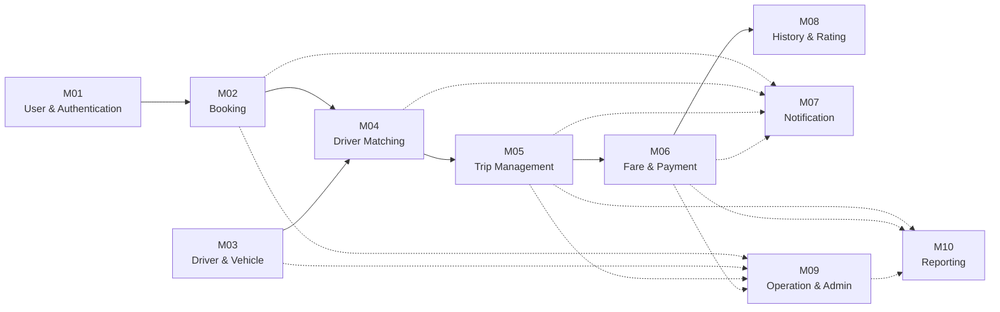

Trong đó:

* `M01 → M02 → M04 → M05 → M06 → M08` hình thành luồng dịch vụ đặt xe chính.
* **M03** cung cấp dữ liệu tài xế và phương tiện cho quá trình Matching.
* **M07** hỗ trợ gửi thông báo xuyên suốt quá trình đặt xe.
* **M09** hỗ trợ giám sát và quản trị hoạt động.
* **M10** tổng hợp dữ liệu phục vụ báo cáo.

---

### 6.9. Mức độ ưu tiên triển khai

| Ưu tiên                 | Modules                 |
| ----------------------- | ----------------------- |
| **Core MVP**            | M01, M02, M03, M04, M05 |
| **MVP Supporting**      | M06, M07, M08, M09      |
| **Basic / Limited MVP** | M10                     |
| **Post-MVP**            | M11                     |

Các module Core MVP cần được ưu tiên vì trực tiếp tạo thành quy trình:

**Customer tạo yêu cầu → hệ thống tìm Driver → Driver nhận chuyến → thực hiện chuyến → hoàn thành chuyến.**

---


## 7. BUSINESS REQUIREMENTS

### 7.1. Mục đích

Business Requirements mô tả các khả năng nghiệp vụ mà **CAB System** cần hỗ trợ để đạt được các Business Goals đã xác định.

Các Business Requirements được phân nhóm theo từng Business Goal và là cơ sở để xây dựng:

* Business Process.
* Functional Requirements.
* Business Rules.
* Use Cases.
* Acceptance Criteria.
* Requirements Traceability Matrix.

Quy tắc đặt mã:

`BGxx_TenBusiness`

Trong đó:

* `BGxx`: Business Goal mà yêu cầu hỗ trợ.
* `TenBusiness`: tên ngắn gọn của yêu cầu nghiệp vụ.

---

### 7.2. BG-01 – Xây dựng nền tảng đặt xe trực tuyến toàn diện

#### BG01_QuanLyTaiKhoanKhachHang

CAB System phải hỗ trợ khách hàng tạo và quản lý tài khoản để sử dụng các dịch vụ đặt xe.

Bao gồm:

* Đăng ký tài khoản.
* Đăng nhập và đăng xuất.
* Xem thông tin cá nhân.
* Cập nhật các thông tin cá nhân được phép chỉnh sửa.

---

#### BG01_TaoYeuCauDatXe

CAB System phải cho phép khách hàng tạo yêu cầu đặt xe.

Khách hàng có thể:

* Nhập điểm đón.
* Nhập điểm đến.
* Chọn loại xe.
* Kiểm tra thông tin đặt xe.
* Xác nhận tạo yêu cầu.

Sau khi yêu cầu hợp lệ được xác nhận, hệ thống chuyển sang quá trình tìm tài xế.

---

#### BG01_QuanLyChuyenDi

CAB System phải quản lý vòng đời của chuyến đi từ khi yêu cầu đặt xe được tạo đến khi chuyến hoàn thành hoặc bị hủy.

Hệ thống phải ghi nhận và quản lý trạng thái chuyến đi trong suốt quá trình thực hiện.

---

#### BG01_QuanLyLichSuChuyenDi

CAB System phải lưu và cung cấp lịch sử các chuyến đi của khách hàng.

Khách hàng có thể:

* Xem danh sách các chuyến trước đây.
* Chọn một chuyến để xem thông tin chi tiết.

---

#### BG01_DanhGiaTaiXe

CAB System phải cho phép khách hàng đánh giá tài xế sau khi chuyến đi được hoàn thành.

Đánh giá được liên kết với chuyến đi và tài xế tương ứng.

---

### 7.3. BG-02 – Tự động hóa quá trình tìm và phân công tài xế

#### BG02_QuanLyTrangThaiTaiXe

CAB System phải quản lý trạng thái hoạt động của tài xế để xác định khả năng nhận chuyến.

Tài xế chỉ được xem xét cho chuyến mới khi đang ở trạng thái phù hợp để nhận chuyến.

---

#### BG02_TheoDoiViTriTaiXe

CAB System phải ghi nhận vị trí của tài xế nhằm hỗ trợ quá trình tìm tài xế phù hợp cho yêu cầu đặt xe.

---

#### BG02_TimTaiXePhuHop

Khi có yêu cầu đặt xe, CAB System phải tìm các tài xế phù hợp dựa trên:

* Trạng thái hoạt động.
* Vị trí.
* Loại phương tiện.
* Các tiêu chí vận hành được Công ty ABC xác định.

> Tiêu chí và trọng số ưu tiên cụ thể được quản lý tại **Mục 13 – Open Questions / TBD**.

---

#### BG02_PhanCongTaiXe

CAB System phải hỗ trợ quá trình gửi yêu cầu chuyến và phân công tài xế.

Khi tài xế chấp nhận chuyến:

* Tài xế được gắn với chuyến đi.
* Trạng thái chuyến được cập nhật.
* Khách hàng được thông báo về tài xế đã nhận chuyến.

---

#### BG02_TimLaiTaiXe

Nếu tài xế được lựa chọn:

* Từ chối chuyến; hoặc
* Không phản hồi trong thời gian quy định,

CAB System phải tiếp tục tìm tài xế phù hợp tiếp theo mà không yêu cầu khách hàng tạo lại yêu cầu đặt xe.

> Thời gian chờ phản hồi của tài xế là **TBD**.

---

#### BG02_XuLyKhongCoTaiXe

Nếu không tìm được tài xế phù hợp, CAB System phải:

* Kết thúc quá trình tìm tài xế cho yêu cầu hiện tại.
* Cập nhật trạng thái phù hợp.
* Thông báo kết quả cho khách hàng.

---

### 7.4. BG-03 – Nâng cao trải nghiệm đặt xe và theo dõi chuyến đi

#### BG03_TheoDoiTrangThaiDatXe

CAB System phải cho phép khách hàng biết trạng thái của yêu cầu đặt xe trong quá trình tìm và phân công tài xế.

Ví dụ:

* Đang tìm tài xế.
* Đã tìm được tài xế.
* Không tìm được tài xế.

---

#### BG03_HienThiThongTinTaiXe

Sau khi tài xế chấp nhận chuyến, CAB System phải cung cấp cho khách hàng các thông tin tài xế cần thiết để nhận biết chuyến được phân công.

---

#### BG03_HienThiThoiGianDuKien

CAB System phải cung cấp thông tin thời gian dự kiến tài xế đến điểm đón khi dữ liệu cần thiết có sẵn.

---

#### BG03_TheoDoiTrangThaiChuyenDi

CAB System phải cho phép khách hàng theo dõi trạng thái hiện tại của chuyến đi.

Các trạng thái nghiệp vụ chính gồm:

```text
SEARCHING_DRIVER
        ↓
DRIVER_ASSIGNED
        ↓
DRIVER_ARRIVED
        ↓
PASSENGER_PICKED_UP
        ↓
IN_PROGRESS
        ↓
COMPLETED
```

Trạng thái `CANCELLED` được áp dụng theo chính sách hủy chuyến của Công ty ABC.

---

#### BG03_ThongBaoSuKienChuyenDi

CAB System phải hỗ trợ gửi thông báo cho Customer và Driver tại các sự kiện quan trọng.

Các sự kiện chính trong MVP gồm:

* Yêu cầu đặt xe được tiếp nhận.
* Tài xế chấp nhận chuyến.
* Tài xế đến điểm đón.
* Chuyến đi hoàn thành.
* Kết quả thanh toán.
* Tài xế nhận được yêu cầu chuyến mới.

---

### 7.5. BG-04 – Quản lý tập trung cước phí và thanh toán

#### BG04_TinhCuocChuyenDi

Sau khi chuyến đi hoàn thành, CAB System phải tính cước chuyến đi dựa trên thông tin chuyến và chính sách tính cước của Công ty ABC.

> Công thức tính cước cụ thể được quản lý tại **Open Questions / TBD**.

---

#### BG04_ThanhToanTienMat

CAB System phải hỗ trợ khách hàng lựa chọn thanh toán bằng tiền mặt.

Hệ thống phải ghi nhận phương thức và trạng thái thanh toán của chuyến.

---

#### BG04_ThanhToanDienTu

CAB System phải hỗ trợ thanh toán điện tử thông qua **Payment Provider** bên ngoài.

CAB System gửi yêu cầu thanh toán và tiếp nhận kết quả giao dịch từ Payment Provider.

---

#### BG04_BaoVeThongTinThanhToan

CAB System không được lưu trực tiếp các thông tin thanh toán nhạy cảm như:

* Số thẻ.
* Thông tin tài khoản thanh toán.
* Thông tin xác thực thanh toán nhạy cảm.

CAB System chỉ lưu các thông tin giao dịch cần thiết phục vụ quản lý và truy vết.

---

#### BG04_XuLyThanhToanThatBai

Khi thanh toán điện tử thất bại, CAB System phải:

* Ghi nhận kết quả thất bại.
* Thông báo cho khách hàng.
* Cho phép xử lý lại theo chính sách thanh toán được xác định.

---

#### BG04_LuuLichSuGiaoDich

CAB System phải lưu thông tin cần thiết của các giao dịch phát sinh để hỗ trợ:

* Tra cứu giao dịch.
* Theo dõi trạng thái thanh toán.
* Hỗ trợ vận hành.
* Báo cáo.

---

### 7.6. BG-05 – Nâng cao hiệu quả quản lý và vận hành dịch vụ

#### BG05_QuanLyKhachHang

CAB System phải cho phép Operation Staff có quyền phù hợp tra cứu và quản lý thông tin khách hàng cần thiết cho hoạt động vận hành.

---

#### BG05_QuanLyTaiXe

CAB System phải cho phép Operation Staff quản lý và tra cứu:

* Hồ sơ tài xế.
* Trạng thái hoạt động.
* Thông tin liên quan phục vụ vận hành.

---

#### BG05_QuanLyPhuongTien

CAB System phải hỗ trợ quản lý thông tin phương tiện được liên kết với tài xế.

---

#### BG05_GiamSatChuyenDi

CAB System phải cho phép Operation Staff theo dõi:

* Danh sách chuyến đang diễn ra.
* Trạng thái hiện tại của chuyến.
* Thông tin cần thiết phục vụ giám sát.

---

#### BG05_XuLySuCoChuyenDi

CAB System phải hỗ trợ Operation Staff ghi nhận và xử lý các trường hợp bất thường hoặc sự cố liên quan đến chuyến đi theo quyền được cấp.

---

#### BG05_TraCuuGiaoDich

CAB System phải cho phép người có quyền tra cứu lịch sử giao dịch phục vụ hoạt động vận hành và hỗ trợ khách hàng.

---

#### BG05_BaoCaoHoatDong

CAB System phải cung cấp các báo cáo hoạt động cơ bản, bao gồm:

* Số lượng chuyến.
* Doanh thu.
* Tỷ lệ chuyến hoàn thành.
* Tỷ lệ chuyến bị hủy.
* Thông tin hỗ trợ đánh giá hiệu quả tài xế.
* Báo cáo tổng hợp.

---

### 7.7. BG-06 – Xây dựng nền tảng ổn định, bảo mật và có khả năng mở rộng

#### BG06_XacThucNguoiDung

CAB System phải xác thực người dùng trước khi cho phép truy cập các chức năng yêu cầu tài khoản.

---

#### BG06_PhanQuyenQuanTri

CAB System phải kiểm soát quyền truy cập đối với các chức năng quản trị và vận hành nhạy cảm.

Chỉ người dùng có quyền phù hợp mới được phép thực hiện các chức năng tương ứng.

---

#### BG06_BaoVeDuLieu

CAB System phải bảo vệ các nhóm dữ liệu quan trọng, bao gồm:

* Thông tin cá nhân.
* Thông tin tài xế.
* Thông tin phương tiện.
* Dữ liệu vị trí.
* Thông tin chuyến đi.
* Thông tin giao dịch.

---

#### BG06_LuuVetHoatDong

CAB System phải ghi nhận các thao tác quan trọng nhằm hỗ trợ kiểm tra và truy vết khi cần thiết.

Các thao tác cần lưu vết bao gồm các hoạt động quản trị quan trọng, thay đổi quyền và xử lý dữ liệu nhạy cảm theo phạm vi được xác định.

---

#### BG06_DamBaoTinhSanSang

CAB System phải được thiết kế để lỗi của một dịch vụ hỗ trợ không làm gián đoạn toàn bộ hệ thống.

Ví dụ:

* Payment Provider gặp lỗi không được làm dừng chức năng đặt xe.
* Notification Provider gặp lỗi không được làm dừng quá trình thực hiện chuyến.

---

#### BG06_HoTroMoRongHeThong

CAB System phải có khả năng mở rộng khi số lượng:

* Customer tăng.
* Driver tăng.
* Chuyến đi tăng.
* Yêu cầu đồng thời tăng.

Các thành phần có tải lớn cần có khả năng được mở rộng mà hạn chế ảnh hưởng đến toàn bộ hệ thống.

---

#### BG06_HoTroMoRongTichHop

Kiến trúc CAB System phải hỗ trợ khả năng bổ sung trong tương lai như:

* Payment Provider mới.
* Notification Provider mới.
* Kênh thông báo mới.
* Loại phương tiện mới.
* Loại dịch vụ mới.
* Các tích hợp bên ngoài khác.

Việc bổ sung cần hạn chế thay đổi các module không liên quan.

---

### 7.8. Tổng hợp Business Requirements

| Business Goal | Business Requirements                                                                                                                                         | Số lượng |
| ------------- | ------------------------------------------------------------------------------------------------------------------------------------------------------------- | -------: |
| **BG-01**     | BG01_QuanLyTaiKhoanKhachHang, BG01_TaoYeuCauDatXe, BG01_QuanLyChuyenDi, BG01_QuanLyLichSuChuyenDi, BG01_DanhGiaTaiXe                                          |    **5** |
| **BG-02**     | BG02_QuanLyTrangThaiTaiXe, BG02_TheoDoiViTriTaiXe, BG02_TimTaiXePhuHop, BG02_PhanCongTaiXe, BG02_TimLaiTaiXe, BG02_XuLyKhongCoTaiXe                           |    **6** |
| **BG-03**     | BG03_TheoDoiTrangThaiDatXe, BG03_HienThiThongTinTaiXe, BG03_HienThiThoiGianDuKien, BG03_TheoDoiTrangThaiChuyenDi, BG03_ThongBaoSuKienChuyenDi                 |    **5** |
| **BG-04**     | BG04_TinhCuocChuyenDi, BG04_ThanhToanTienMat, BG04_ThanhToanDienTu, BG04_BaoVeThongTinThanhToan, BG04_XuLyThanhToanThatBai, BG04_LuuLichSuGiaoDich            |    **6** |
| **BG-05**     | BG05_QuanLyKhachHang, BG05_QuanLyTaiXe, BG05_QuanLyPhuongTien, BG05_GiamSatChuyenDi, BG05_XuLySuCoChuyenDi, BG05_TraCuuGiaoDich, BG05_BaoCaoHoatDong          |    **7** |
| **BG-06**     | BG06_XacThucNguoiDung, BG06_PhanQuyenQuanTri, BG06_BaoVeDuLieu, BG06_LuuVetHoatDong, BG06_DamBaoTinhSanSang, BG06_HoTroMoRongHeThong, BG06_HoTroMoRongTichHop |    **7** |
| **Tổng**      |                                                                                                                                                               |   **36** |

---

### 7.9. Mapping Business Requirements – MVP Modules

| Business Goal | Business Requirements         | Module chính             |
| ------------- | ----------------------------- | ------------------------ |
| **BG-01**     | Quản lý tài khoản khách hàng  | M01                      |
|               | Tạo yêu cầu đặt xe            | M02                      |
|               | Quản lý chuyến đi             | M02, M05                 |
|               | Quản lý lịch sử chuyến đi     | M08                      |
|               | Đánh giá tài xế               | M08                      |
| **BG-02**     | Quản lý trạng thái tài xế     | M03                      |
|               | Theo dõi vị trí tài xế        | M03                      |
|               | Tìm tài xế phù hợp            | M04                      |
|               | Phân công tài xế              | M04                      |
|               | Tìm lại tài xế                | M04                      |
|               | Xử lý không có tài xế         | M04                      |
| **BG-03**     | Theo dõi trạng thái đặt xe    | M02, M04                 |
|               | Hiển thị thông tin tài xế     | M05                      |
|               | Hiển thị thời gian dự kiến    | M05                      |
|               | Theo dõi trạng thái chuyến đi | M05                      |
|               | Thông báo sự kiện chuyến đi   | M07                      |
| **BG-04**     | Tính cước chuyến đi           | M06                      |
|               | Thanh toán tiền mặt           | M06                      |
|               | Thanh toán điện tử            | M06                      |
|               | Bảo vệ thông tin thanh toán   | M06                      |
|               | Xử lý thanh toán thất bại     | M06                      |
|               | Lưu lịch sử giao dịch         | M06                      |
| **BG-05**     | Quản lý khách hàng            | M09                      |
|               | Quản lý tài xế                | M09                      |
|               | Quản lý phương tiện           | M09                      |
|               | Giám sát chuyến đi            | M09                      |
|               | Xử lý sự cố chuyến đi         | M09                      |
|               | Tra cứu giao dịch             | M09                      |
|               | Báo cáo hoạt động             | M10                      |
| **BG-06**     | Xác thực người dùng           | M01                      |
|               | Phân quyền quản trị           | M09                      |
|               | Bảo vệ dữ liệu                | Toàn hệ thống            |
|               | Lưu vết hoạt động             | M09                      |
|               | Đảm bảo tính sẵn sàng         | Toàn hệ thống            |
|               | Hỗ trợ mở rộng hệ thống       | Toàn hệ thống            |
|               | Hỗ trợ mở rộng tích hợp       | M11 / Kiến trúc hệ thống |

---

### 7.10. Traceability Business Goal – Business Requirement

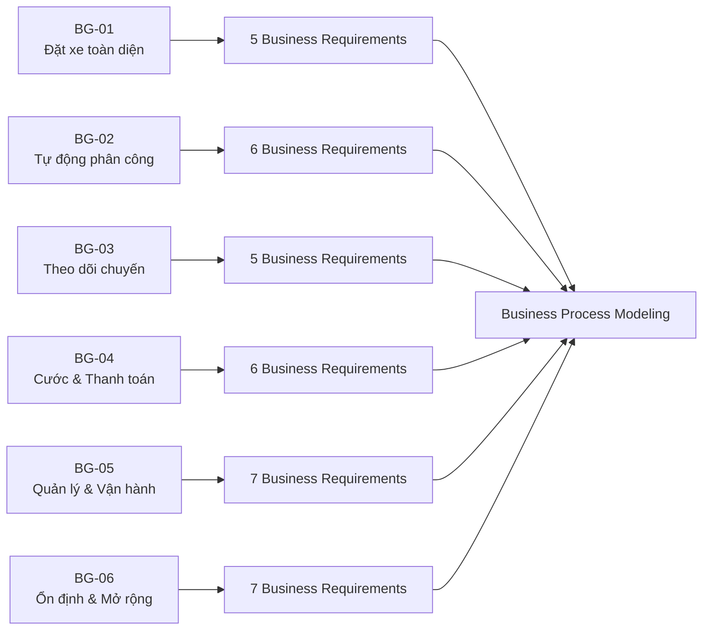

Chuỗi phân rã được sử dụng trong các phần tiếp theo:

```text
Business Goal
      ↓
Business Requirement
      ↓
Business Process
      ↓
Functional Requirement
      ↓
Use Case
      ↓
Acceptance Criteria
```

---


## 8. BUSINESS PROCESS MODELING

### 8.1. Mục đích

Business Process Modeling mô tả các quy trình nghiệp vụ chính của CAB System dựa trên các Business Requirements đã xác định.

Mỗi Business Process thể hiện:

* Mục tiêu của quy trình.
* Actor tham gia.
* Business Requirements liên quan.
* Luồng nghiệp vụ chính.
* Các trường hợp ngoại lệ chính.
* Kết quả của quy trình.

CAB System gồm **09 Business Processes chính**:

| Mã        | Business Process                  | Actor chính                    |
| --------- | --------------------------------- | ------------------------------ |
| **BP-01** | Đăng ký và quản lý tài khoản      | Customer                       |
| **BP-02** | Tạo yêu cầu đặt xe                | Customer                       |
| **BP-03** | Tìm và phân công tài xế           | Driver                         |
| **BP-04** | Thực hiện và theo dõi chuyến đi   | Customer, Driver               |
| **BP-05** | Tính cước và thanh toán           | Customer, Payment Provider     |
| **BP-06** | Gửi thông báo                     | Notification Provider          |
| **BP-07** | Lịch sử chuyến và đánh giá tài xế | Customer                       |
| **BP-08** | Quản lý và xử lý chuyến           | Operation Staff, Administrator |
| **BP-09** | Báo cáo và giám sát hoạt động     | Management, Operation Staff    |

---

### 8.2. BP-01 – Đăng ký và quản lý tài khoản

**Mục tiêu:**
Cho phép Customer tạo tài khoản, xác thực và quản lý thông tin cá nhân để sử dụng CAB System.

**Business Requirements liên quan:**

* `BG01_QuanLyTaiKhoanKhachHang`
* `BG06_XacThucNguoiDung`

**Luồng chính:**

1. Customer truy cập CAB System.
2. Customer chọn đăng ký tài khoản.
3. Customer nhập thông tin đăng ký.
4. Hệ thống kiểm tra tính hợp lệ của thông tin.
5. Nếu hợp lệ, hệ thống tạo tài khoản.
6. Customer thực hiện đăng nhập.
7. Hệ thống xác thực thông tin đăng nhập.
8. Nếu xác thực thành công, Customer được truy cập các chức năng phù hợp.
9. Customer có thể xem hoặc cập nhật thông tin cá nhân.
10. Hệ thống lưu các thay đổi hợp lệ.

**Ngoại lệ chính:**

* Thông tin đăng ký không hợp lệ → yêu cầu nhập lại.
* Thông tin đăng nhập không chính xác → từ chối đăng nhập và thông báo lỗi.

**Kết quả:**
Customer có tài khoản hợp lệ và có thể sử dụng CAB System.

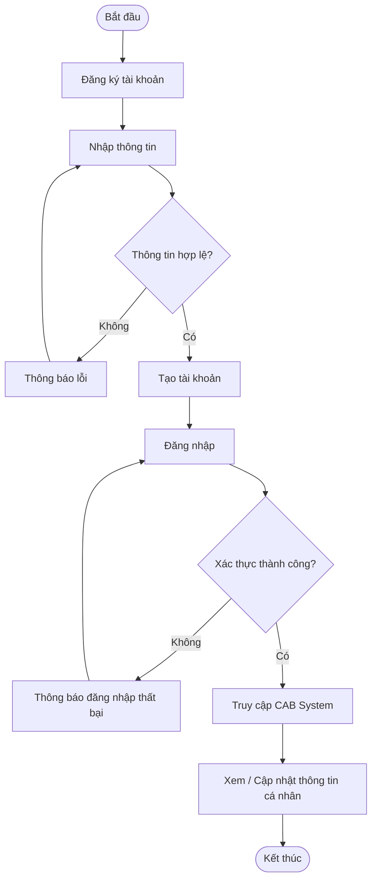

---

### 8.3. BP-02 – Tạo yêu cầu đặt xe

**Mục tiêu:**
Cho phép Customer nhập thông tin chuyến và tạo yêu cầu đặt xe.

**Business Requirements liên quan:**

* `BG01_TaoYeuCauDatXe`
* `BG01_QuanLyChuyenDi`
* `BG03_TheoDoiTrangThaiDatXe`

**Luồng chính:**

1. Customer chọn chức năng đặt xe.
2. Nhập điểm đón.
3. Nhập điểm đến.
4. Chọn loại xe.
5. Hệ thống kiểm tra thông tin chuyến.
6. Hệ thống hiển thị thông tin đặt xe.
7. Customer xác nhận.
8. Hệ thống tạo yêu cầu đặt xe.
9. Trạng thái yêu cầu chuyển sang `SEARCHING_DRIVER`.
10. Yêu cầu được chuyển sang BP-03 để tìm tài xế.

**Ngoại lệ chính:**

* Điểm đón hoặc điểm đến không hợp lệ → yêu cầu Customer chỉnh sửa.
* Customer không xác nhận → không tạo yêu cầu.
* Customer hủy yêu cầu → xử lý theo chính sách hủy chuyến.

**Kết quả:**
Một yêu cầu đặt xe hợp lệ được tạo và chuyển sang quá trình tìm tài xế.

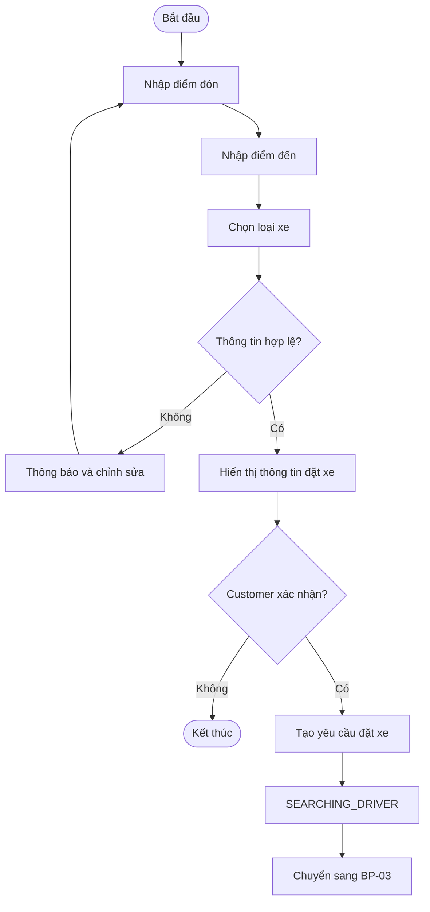

---

### 8.4. BP-03 – Tìm và phân công tài xế

**Mục tiêu:**
Tự động tìm và phân công Driver phù hợp cho yêu cầu đặt xe.

**Business Requirements liên quan:**

* `BG02_QuanLyTrangThaiTaiXe`
* `BG02_TheoDoiViTriTaiXe`
* `BG02_TimTaiXePhuHop`
* `BG02_PhanCongTaiXe`
* `BG02_TimLaiTaiXe`
* `BG02_XuLyKhongCoTaiXe`
* `BG03_TheoDoiTrangThaiDatXe`

**Luồng chính:**

1. Hệ thống nhận yêu cầu đặt xe.
2. Xác định các Driver có trạng thái phù hợp để nhận chuyến.
3. Lọc Driver dựa trên vị trí và loại phương tiện.
4. Sắp xếp Driver theo tiêu chí ưu tiên.
5. Chọn Driver phù hợp.
6. Gửi yêu cầu chuyến cho Driver.
7. Driver chấp nhận hoặc từ chối.
8. Nếu Driver chấp nhận, hệ thống phân công Driver cho chuyến.
9. Trạng thái chuyến chuyển thành `DRIVER_ASSIGNED`.
10. Customer được thông báo về Driver đã nhận chuyến.

**Ngoại lệ chính:**

* Driver từ chối → tiếp tục tìm Driver khác.
* Driver không phản hồi trong thời gian quy định → tiếp tục tìm Driver khác.
* Không còn Driver phù hợp → thông báo cho Customer.

> Thời gian phản hồi và tiêu chí ưu tiên Driver là **TBD**.

**Kết quả:**
Driver được phân công hoặc Customer được thông báo không tìm được Driver.

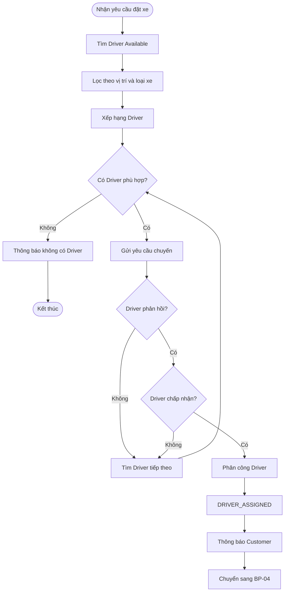

---

### 8.5. BP-04 – Thực hiện và theo dõi chuyến đi

**Mục tiêu:**
Quản lý quá trình thực hiện chuyến từ khi Driver nhận chuyến đến khi chuyến hoàn thành.

**Business Requirements liên quan:**

* `BG01_QuanLyChuyenDi`
* `BG03_HienThiThongTinTaiXe`
* `BG03_HienThiThoiGianDuKien`
* `BG03_TheoDoiTrangThaiChuyenDi`

**Luồng chính:**

1. Driver được phân công.
2. CAB System hiển thị thông tin Driver cho Customer.
3. Hệ thống hiển thị ETA.
4. Driver di chuyển đến điểm đón.
5. Driver xác nhận đã đến điểm đón.
6. Trạng thái chuyển thành `DRIVER_ARRIVED`.
7. Driver xác nhận đã đón Customer.
8. Trạng thái chuyển thành `PASSENGER_PICKED_UP`.
9. Driver bắt đầu chuyến.
10. Trạng thái chuyển thành `IN_PROGRESS`.
11. Customer theo dõi trạng thái chuyến.
12. Driver đến điểm đến.
13. Driver hoàn thành chuyến.
14. Trạng thái chuyển thành `COMPLETED`.
15. Chuyển sang BP-05 để tính cước và thanh toán.

**Ngoại lệ chính:**

* Customer hoặc Driver hủy chuyến → xử lý theo chính sách hủy chuyến.
* Mất kết nối → xử lý theo chính sách Offline/TBD.

**Kết quả:**
Chuyến đi được hoàn thành hoặc chuyển sang trạng thái hủy phù hợp.

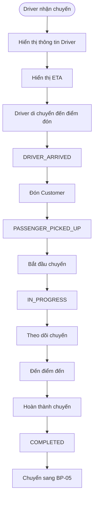

---

### 8.6. BP-05 – Tính cước và thanh toán

**Mục tiêu:**
Tính cước sau khi chuyến hoàn thành và hỗ trợ Customer thanh toán.

**Business Requirements liên quan:**

* `BG04_TinhCuocChuyenDi`
* `BG04_ThanhToanTienMat`
* `BG04_ThanhToanDienTu`
* `BG04_BaoVeThongTinThanhToan`
* `BG04_XuLyThanhToanThatBai`
* `BG04_LuuLichSuGiaoDich`

**Luồng chính:**

1. Chuyến chuyển sang `COMPLETED`.
2. Hệ thống lấy thông tin cần thiết của chuyến.
3. Tính cước theo chính sách của ABC.
4. Hiển thị cước cho Customer.
5. Customer chọn phương thức thanh toán.
6. Nếu thanh toán tiền mặt, hệ thống ghi nhận phương thức và kết quả.
7. Nếu thanh toán điện tử, CAB System gửi yêu cầu đến Payment Provider.
8. Payment Provider xử lý giao dịch.
9. CAB System nhận kết quả.
10. Lưu thông tin giao dịch cần thiết.
11. Thông báo kết quả thanh toán cho Customer.

**Ngoại lệ chính:**

* Thanh toán điện tử thất bại → thông báo Customer và xử lý lại theo chính sách.
* Payment Provider không phản hồi → xử lý trạng thái giao dịch theo chính sách.

> Công thức tính cước và chính sách retry thanh toán là **TBD**.

**Kết quả:**
Thông tin thanh toán của chuyến được ghi nhận.

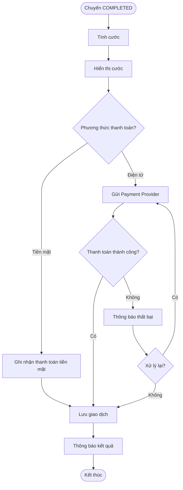

---

### 8.7. BP-06 – Gửi thông báo

**Mục tiêu:**
Gửi thông báo đến Customer hoặc Driver khi phát sinh các sự kiện quan trọng.

**Business Requirement liên quan:**

* `BG03_ThongBaoSuKienChuyenDi`

**Luồng chính:**

1. CAB System phát sinh sự kiện cần thông báo.
2. Xác định loại sự kiện.
3. Xác định người nhận.
4. Tạo nội dung thông báo.
5. Gửi yêu cầu đến Notification Provider.
6. Notification Provider xử lý yêu cầu.
7. CAB System ghi nhận kết quả gửi thông báo.

Các sự kiện chính gồm:

* Tiếp nhận yêu cầu đặt xe.
* Driver nhận chuyến.
* Driver đến điểm đón.
* Hoàn thành chuyến.
* Kết quả thanh toán.
* Chuyến mới dành cho Driver.

**Ngoại lệ chính:**

Notification Provider gặp lỗi → ghi nhận lỗi nhưng **không làm gián đoạn quá trình đặt xe hoặc thực hiện chuyến**.

**Kết quả:**
Thông báo được gửi hoặc lỗi gửi thông báo được ghi nhận.

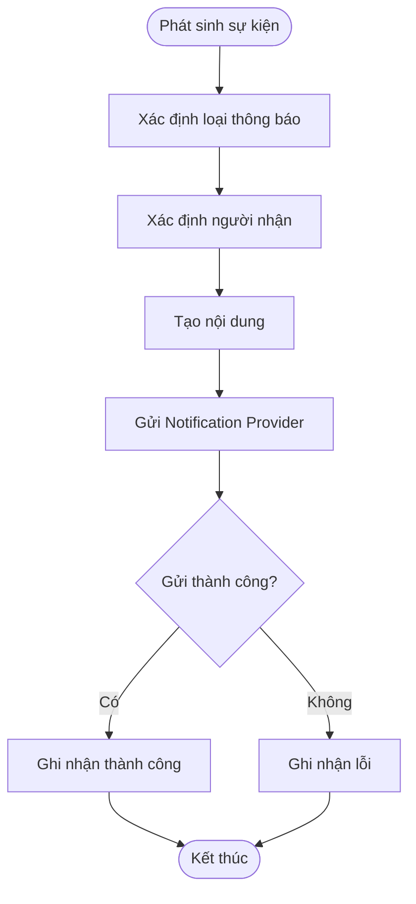

---

### 8.8. BP-07 – Lịch sử chuyến và đánh giá tài xế

**Mục tiêu:**
Cho phép Customer xem lại các chuyến đã thực hiện và đánh giá Driver.

**Business Requirements liên quan:**

* `BG01_QuanLyLichSuChuyenDi`
* `BG01_DanhGiaTaiXe`

**Luồng chính:**

1. Customer mở lịch sử chuyến.
2. Hệ thống hiển thị danh sách chuyến.
3. Customer chọn một chuyến.
4. Hệ thống hiển thị chi tiết.
5. Hệ thống kiểm tra chuyến đã hoàn thành hay chưa.
6. Nếu chuyến đã hoàn thành, kiểm tra đã được đánh giá chưa.
7. Nếu chưa, Customer nhập đánh giá.
8. Customer gửi đánh giá.
9. Hệ thống lưu đánh giá.
10. Thông tin đánh giá của Driver được cập nhật theo quy định.

**Ngoại lệ chính:**

* Chuyến chưa hoàn thành → không cho phép đánh giá.
* Chuyến đã có đánh giá chính thức → không tạo thêm đánh giá mới.

**Kết quả:**
Customer xem được lịch sử chuyến và có thể đánh giá Driver hợp lệ.

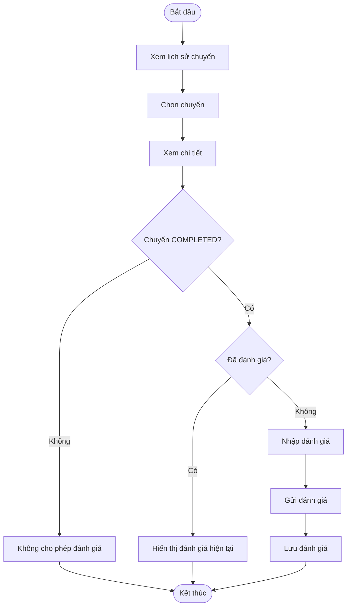

---

### 8.9. BP-08 – Quản lý và xử lý chuyến

**Mục tiêu:**
Hỗ trợ Operation Staff và Administrator quản lý, giám sát và xử lý các hoạt động của CAB System theo quyền được cấp.

**Business Requirements liên quan:**

* `BG05_QuanLyKhachHang`
* `BG05_QuanLyTaiXe`
* `BG05_QuanLyPhuongTien`
* `BG05_GiamSatChuyenDi`
* `BG05_XuLySuCoChuyenDi`
* `BG05_TraCuuGiaoDich`
* `BG06_PhanQuyenQuanTri`
* `BG06_LuuVetHoatDong`

**Luồng chính:**

1. Người dùng nội bộ đăng nhập.
2. CAB System xác thực tài khoản.
3. Hệ thống kiểm tra quyền.
4. Nếu có quyền, hiển thị chức năng tương ứng.
5. Người dùng chọn nghiệp vụ cần thực hiện:

   * Quản lý Customer.
   * Quản lý Driver.
   * Quản lý Vehicle.
   * Theo dõi Trip.
   * Xử lý sự cố.
   * Tra cứu giao dịch.
   * Quản lý tài khoản/phân quyền nếu có quyền Administrator.
6. Hệ thống thực hiện thao tác hợp lệ.
7. Các thao tác quan trọng được lưu vết.

**Ngoại lệ chính:**

* Xác thực thất bại → từ chối truy cập.
* Không có quyền → từ chối thao tác.
* Dữ liệu không hợp lệ → không thực hiện thay đổi.

**Kết quả:**
Hoạt động vận hành hoặc quản trị được thực hiện và lưu vết khi cần thiết.

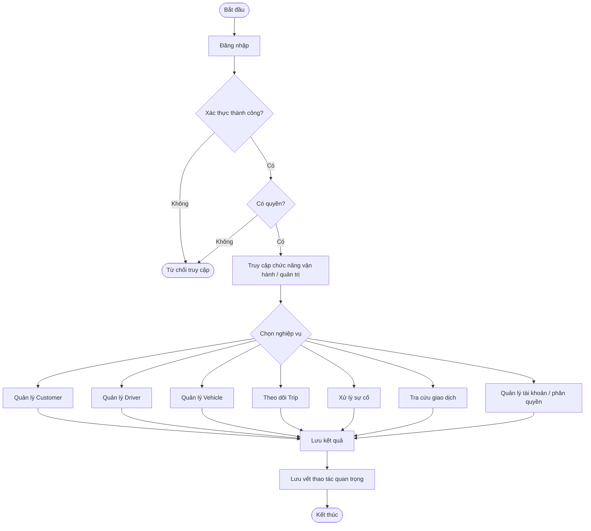

---

### 8.10. BP-09 – Báo cáo và giám sát hoạt động

**Mục tiêu:**
Cung cấp thông tin tổng hợp giúp Management và các bộ phận được cấp quyền theo dõi hoạt động của CAB System.

**Business Requirements liên quan:**

* `BG05_BaoCaoHoatDong`
* `BG06_LuuVetHoatDong`

**Luồng chính:**

1. Người dùng có quyền truy cập chức năng báo cáo.
2. Chọn khoảng thời gian hoặc điều kiện báo cáo.
3. CAB System lấy dữ liệu hợp lệ.
4. Hệ thống tổng hợp dữ liệu.
5. Hệ thống tạo các chỉ số:

   * Số lượng chuyến.
   * Doanh thu.
   * Tỷ lệ hoàn thành.
   * Tỷ lệ hủy.
   * Hiệu quả tài xế.
6. Hệ thống hiển thị báo cáo.
7. Người dùng xem kết quả.
8. Các thao tác quan trọng được ghi nhận khi cần thiết.

**Ngoại lệ chính:**

* Người dùng không có quyền → từ chối truy cập.
* Không có dữ liệu phù hợp → thông báo không có dữ liệu trong điều kiện đã chọn.

**Kết quả:**
Người dùng được cấp quyền xem báo cáo hoạt động của CAB System.

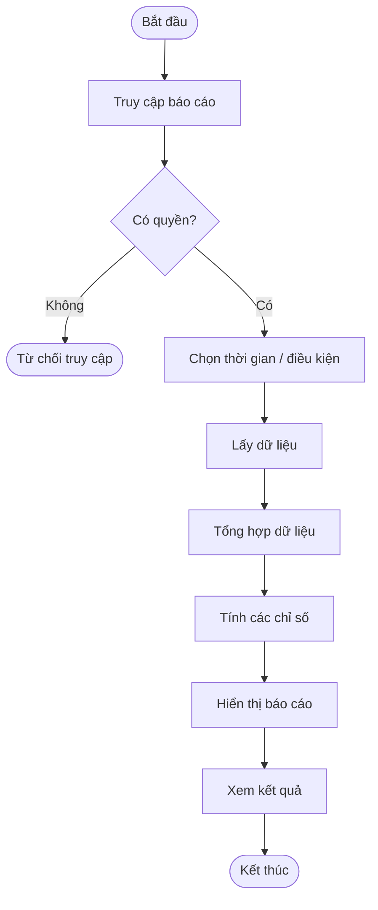

---

### 8.11. Liên kết Business Process với Business Requirements

| Business Process | Business Requirements chính                                                                                                                                                 |
| ---------------- | --------------------------------------------------------------------------------------------------------------------------------------------------------------------------- |
| **BP-01**        | BG01_QuanLyTaiKhoanKhachHang, BG06_XacThucNguoiDung                                                                                                                         |
| **BP-02**        | BG01_TaoYeuCauDatXe, BG01_QuanLyChuyenDi, BG03_TheoDoiTrangThaiDatXe                                                                                                        |
| **BP-03**        | BG02_QuanLyTrangThaiTaiXe, BG02_TheoDoiViTriTaiXe, BG02_TimTaiXePhuHop, BG02_PhanCongTaiXe, BG02_TimLaiTaiXe, BG02_XuLyKhongCoTaiXe, BG03_TheoDoiTrangThaiDatXe             |
| **BP-04**        | BG01_QuanLyChuyenDi, BG03_HienThiThongTinTaiXe, BG03_HienThiThoiGianDuKien, BG03_TheoDoiTrangThaiChuyenDi                                                                   |
| **BP-05**        | BG04_TinhCuocChuyenDi, BG04_ThanhToanTienMat, BG04_ThanhToanDienTu, BG04_BaoVeThongTinThanhToan, BG04_XuLyThanhToanThatBai, BG04_LuuLichSuGiaoDich                          |
| **BP-06**        | BG03_ThongBaoSuKienChuyenDi                                                                                                                                                 |
| **BP-07**        | BG01_QuanLyLichSuChuyenDi, BG01_DanhGiaTaiXe                                                                                                                                |
| **BP-08**        | BG05_QuanLyKhachHang, BG05_QuanLyTaiXe, BG05_QuanLyPhuongTien, BG05_GiamSatChuyenDi, BG05_XuLySuCoChuyenDi, BG05_TraCuuGiaoDich, BG06_PhanQuyenQuanTri, BG06_LuuVetHoatDong |
| **BP-09**        | BG05_BaoCaoHoatDong, BG06_LuuVetHoatDong                                                                                                                                    |

---

### 8.12. Liên kết Business Process với MVP Modules

| Business Process | MVP Module                                                          |
| ---------------- | ------------------------------------------------------------------- |
| **BP-01**        | M01 – User & Authentication                                         |
| **BP-02**        | M02 – Booking Management                                            |
| **BP-03**        | M03 – Driver & Vehicle Management, M04 – Driver Matching & Dispatch |
| **BP-04**        | M05 – Trip Management & Tracking                                    |
| **BP-05**        | M06 – Fare & Payment                                                |
| **BP-06**        | M07 – Notification                                                  |
| **BP-07**        | M08 – Trip History & Rating                                         |
| **BP-08**        | M09 – Operation & Administration                                    |
| **BP-09**        | M10 – Reporting & Analytics                                         |

---

### 8.13. Luồng nghiệp vụ tổng thể

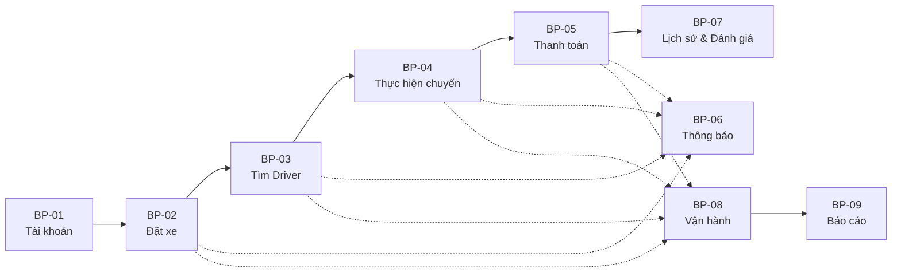

Luồng nghiệp vụ cốt lõi của CAB System là:

**Đăng ký/Đăng nhập → Đặt xe → Tìm và phân công tài xế → Thực hiện chuyến → Tính cước & Thanh toán → Lịch sử & Đánh giá**

Trong đó:

* **BP-06** là quy trình hỗ trợ thông báo xuyên suốt.
* **BP-08** hỗ trợ giám sát và vận hành.
* **BP-09** tổng hợp dữ liệu phục vụ quản lý.

---

### 8.14. Tổng hợp Business Processes

| Mã    | Business Process                  | Module   | Nhóm nghiệp vụ |
| ----- | --------------------------------- | -------- | -------------- |
| BP-01 | Đăng ký và quản lý tài khoản      | M01      | Tài khoản      |
| BP-02 | Tạo yêu cầu đặt xe                | M02      | Đặt xe         |
| BP-03 | Tìm và phân công tài xế           | M03, M04 | Điều phối      |
| BP-04 | Thực hiện và theo dõi chuyến đi   | M05      | Chuyến đi      |
| BP-05 | Tính cước và thanh toán           | M06      | Thanh toán     |
| BP-06 | Gửi thông báo                     | M07      | Hỗ trợ         |
| BP-07 | Lịch sử chuyến và đánh giá tài xế | M08      | Sau chuyến     |
| BP-08 | Quản lý và xử lý chuyến           | M09      | Vận hành       |
| BP-09 | Báo cáo và giám sát hoạt động     | M10      | Báo cáo        |

---

## 9. FUNCTIONAL REQUIREMENTS

### 9.1. Mục đích

Functional Requirements mô tả các chức năng cụ thể mà **CAB System phải cung cấp** để thực hiện các Business Processes và đáp ứng các Business Requirements đã xác định.

Quy tắc đặt mã:

`FRxx_TenChucNang`

Trong đó:

* `FR`: Functional Requirement.
* `xx`: số thứ tự của yêu cầu.
* `TenChucNang`: tên ngắn gọn của chức năng.

Các Functional Requirements được phân nhóm theo **BP-01 → BP-09**.

---

## 9.2. BP-01 – Đăng ký và quản lý tài khoản

### FR01_DangKyTaiKhoan

CAB System phải cho phép Customer đăng ký tài khoản bằng các thông tin cần thiết theo yêu cầu của hệ thống.

Hệ thống phải:

* Tiếp nhận thông tin đăng ký.
* Kiểm tra tính hợp lệ.
* Từ chối thông tin không hợp lệ.
* Tạo tài khoản khi thông tin hợp lệ.

---

### FR02_DangNhap

CAB System phải cho phép người dùng đăng nhập bằng thông tin xác thực hợp lệ.

Hệ thống phải:

* Kiểm tra thông tin đăng nhập.
* Xác định tài khoản tương ứng.
* Cho phép truy cập nếu xác thực thành công.
* Từ chối và thông báo lỗi nếu xác thực thất bại.

---

### FR03_DangXuat

CAB System phải cho phép người dùng đã đăng nhập kết thúc phiên làm việc.

Sau khi đăng xuất:

* Phiên đăng nhập hiện tại phải được kết thúc.
* Người dùng phải đăng nhập lại nếu muốn truy cập các chức năng yêu cầu xác thực.

---

### FR04_XemThongTinCaNhan

CAB System phải cho phép Customer và Driver đã đăng nhập xem thông tin cá nhân của mình.

---

### FR05_CapNhatThongTinCaNhan

CAB System phải cho phép Customer và Driver cập nhật các thông tin cá nhân được phép chỉnh sửa.

Hệ thống phải:

* Kiểm tra dữ liệu được nhập.
* Chỉ cho phép chỉnh sửa các trường được cấp quyền.
* Lưu thông tin mới khi dữ liệu hợp lệ.

---

## 9.3. BP-02 – Tạo yêu cầu đặt xe

### FR06_NhapThongTinChuyenDi

CAB System phải cho phép Customer nhập:

* Điểm đón.
* Điểm đến.

Hệ thống phải kiểm tra tính hợp lệ của thông tin trước khi tiếp tục.

---

### FR07_ChonLoaiXe

CAB System phải hiển thị các loại phương tiện/dịch vụ đang được hỗ trợ và cho phép Customer lựa chọn loại xe phù hợp.

---

### FR08_XemThongTinDatXe

Trước khi xác nhận đặt xe, CAB System phải hiển thị các thông tin chính của yêu cầu, bao gồm:

* Điểm đón.
* Điểm đến.
* Loại xe đã chọn.
* Các thông tin liên quan khác nếu có.

---

### FR09_TaoYeuCauDatXe

CAB System phải cho phép Customer xác nhận và tạo yêu cầu đặt xe.

Sau khi tạo thành công:

* Một Trip mới phải được ghi nhận.
* Trạng thái chuyển sang `SEARCHING_DRIVER`.
* Quá trình tìm tài xế được kích hoạt.

---

### FR10_HuyYeuCauDatXe

CAB System phải cho phép Customer hủy yêu cầu đặt xe trong những trạng thái được chính sách hủy chuyến cho phép.

> Điều kiện và chính sách hủy cụ thể là **TBD**.

---

## 9.4. BP-03 – Tìm và phân công tài xế

### FR11_CapNhatTrangThaiTaiXe

CAB System phải cho phép Driver cập nhật trạng thái hoạt động của mình.

Ví dụ:

* Available.
* Unavailable.
* On Trip.

Chỉ Driver ở trạng thái phù hợp mới được xét cho chuyến mới.

---

### FR12_CapNhatViTriTaiXe

CAB System phải nhận và lưu vị trí hiện tại của Driver nhằm hỗ trợ quá trình tìm và phân công tài xế.

Thông tin vị trí phải bao gồm:

* Latitude.
* Longitude.
* Thời điểm ghi nhận.

---

### FR13_TimTaiXePhuHop

Khi có yêu cầu đặt xe, CAB System phải xác định tập Driver phù hợp dựa trên:

* Trạng thái hoạt động.
* Vị trí.
* Loại phương tiện.
* Các tiêu chí vận hành được ABC quy định.

---

### FR14_XepHangTaiXe

CAB System phải sắp xếp các Driver phù hợp theo tiêu chí ưu tiên trước khi gửi yêu cầu chuyến.

> Thuật toán và trọng số ưu tiên là **TBD**.

---

### FR15_GuiYeuCauNhanChuyen

CAB System phải gửi yêu cầu nhận chuyến đến Driver được lựa chọn.

Yêu cầu phải chứa các thông tin cần thiết để Driver quyết định nhận hoặc từ chối chuyến.

---

### FR16_PhanHoiYeuCauChuyen

CAB System phải cho phép Driver:

* Chấp nhận chuyến.
* Từ chối chuyến.

Phản hồi phải được ghi nhận để hệ thống tiếp tục xử lý.

---

### FR17_PhanCongTaiXe

Khi Driver chấp nhận chuyến, CAB System phải:

* Gán Driver cho Trip.
* Gán Vehicle phù hợp.
* Cập nhật trạng thái Trip thành `DRIVER_ASSIGNED`.
* Cập nhật trạng thái Driver phù hợp.
* Thông báo kết quả cho Customer.

---

### FR18_TimLaiTaiXe

CAB System phải tiếp tục tìm Driver khác khi Driver hiện tại:

* Từ chối chuyến; hoặc
* Không phản hồi trong thời gian quy định.

Customer không phải tạo lại yêu cầu đặt xe.

---

### FR19_ThongBaoKhongCoTaiXe

Nếu không còn Driver phù hợp, CAB System phải:

* Kết thúc quá trình tìm tài xế.
* Cập nhật trạng thái phù hợp.
* Thông báo cho Customer.

---

## 9.5. BP-04 – Thực hiện và theo dõi chuyến đi

### FR20_XemThongTinTaiXe

Sau khi Driver nhận chuyến, CAB System phải cho phép Customer xem thông tin cần thiết của Driver và phương tiện.

---

### FR21_XemThoiGianDuKien

CAB System phải hiển thị thời gian dự kiến Driver đến điểm đón khi có đủ dữ liệu cần thiết để xác định ETA.

---

### FR22_XemTrangThaiChuyenDi

CAB System phải cho phép Customer theo dõi trạng thái hiện tại của Trip.

Các trạng thái chính gồm:

* SEARCHING_DRIVER
* DRIVER_ASSIGNED
* DRIVER_ARRIVED
* PASSENGER_PICKED_UP
* IN_PROGRESS
* COMPLETED
* CANCELLED

---

### FR23_XacNhanDaDenDiemDon

CAB System phải cho phép Driver xác nhận đã đến điểm đón.

Sau khi xác nhận:

`Trip Status = DRIVER_ARRIVED`

---

### FR24_XacNhanDaDonKhach

CAB System phải cho phép Driver xác nhận đã đón Customer.

Sau khi xác nhận:

`Trip Status = PASSENGER_PICKED_UP`

---

### FR25_BatDauChuyenDi

CAB System phải cho phép Driver bắt đầu chuyến sau khi đã xác nhận đón Customer.

Sau khi bắt đầu:

`Trip Status = IN_PROGRESS`

---

### FR26_HoanThanhChuyenDi

CAB System phải cho phép Driver xác nhận hoàn thành chuyến khi đã đến điểm đến.

Sau khi hoàn thành:

* `Trip Status = COMPLETED`.
* Ghi nhận thời gian hoàn thành.
* Chuyển sang quá trình tính cước.

---

### FR27_HuyChuyenDi

CAB System phải cho phép Customer hoặc Driver hủy chuyến trong các trường hợp được chính sách cho phép.

Khi hủy:

* Trip được cập nhật thành `CANCELLED`.
* Các bên liên quan được cập nhật trạng thái phù hợp.
* Thông báo cần thiết được gửi.

> Chính sách hủy chuyến cụ thể là **TBD**.

---

## 9.6. BP-05 – Tính cước và thanh toán

### FR28_TinhCuocChuyenDi

Sau khi Trip hoàn thành, CAB System phải tính cước chuyến dựa trên dữ liệu chuyến và chính sách tính cước của ABC.

> Công thức tính cước cụ thể là **TBD**.

---

### FR29_XemChiTietCuoc

CAB System phải hiển thị số tiền cần thanh toán cho Customer sau khi hoàn tất tính cước.

Nếu có các thành phần cước khác nhau, hệ thống phải cho phép hiển thị chi tiết phù hợp.

---

### FR30_ChonPhuongThucThanhToan

CAB System phải cho phép Customer lựa chọn phương thức thanh toán được hỗ trợ.

Trong MVP gồm:

* Tiền mặt.
* Thanh toán điện tử.

---

### FR31_ThanhToanTienMat

Khi Customer chọn thanh toán tiền mặt, CAB System phải:

* Ghi nhận phương thức thanh toán.
* Ghi nhận số tiền tương ứng.
* Cập nhật trạng thái thanh toán theo quy trình vận hành.

---

### FR32_ThanhToanDienTu

Khi Customer chọn thanh toán điện tử, CAB System phải:

* Tạo yêu cầu thanh toán.
* Gửi yêu cầu đến Payment Provider.
* Nhận kết quả giao dịch.
* Cập nhật trạng thái Payment.

CAB System không được lưu trực tiếp dữ liệu thẻ hoặc thông tin tài khoản thanh toán nhạy cảm.

---

### FR33_XuLyThanhToanThatBai

Nếu Payment Provider trả kết quả thất bại hoặc không xử lý thành công, CAB System phải:

* Ghi nhận kết quả.
* Thông báo cho Customer.
* Cho phép xử lý lại theo chính sách.

---

### FR34_LuuThongTinGiaoDich

CAB System phải lưu các thông tin giao dịch cần thiết, bao gồm:

* Trip liên quan.
* Phương thức thanh toán.
* Số tiền.
* Trạng thái giao dịch.
* Mã tham chiếu từ Provider nếu có.
* Thời gian giao dịch.

---

## 9.7. BP-06 – Gửi thông báo

### FR35_ThongBaoTiepNhanDatXe

CAB System phải gửi thông báo cho Customer khi yêu cầu đặt xe được tiếp nhận.

---

### FR36_ThongBaoTaiXeNhanChuyen

CAB System phải thông báo cho Customer khi Driver chấp nhận chuyến.

---

### FR37_ThongBaoTaiXeDenDiemDon

CAB System phải thông báo cho Customer khi Driver xác nhận đã đến điểm đón.

---

### FR38_ThongBaoHoanThanhChuyen

CAB System phải gửi thông báo khi Trip được hoàn thành.

---

### FR39_ThongBaoKetQuaThanhToan

CAB System phải thông báo kết quả thanh toán cho Customer.

Kết quả có thể gồm:

* Thành công.
* Thất bại.
* Trạng thái khác theo chính sách của Payment Provider.

---

### FR40_ThongBaoChuyenMoiChoTaiXe

CAB System phải gửi thông báo đến Driver khi có yêu cầu chuyến mới cần Driver phản hồi.

---

## 9.8. BP-07 – Lịch sử chuyến và đánh giá

### FR41_XemLichSuChuyenDi

CAB System phải cho phép Customer xem danh sách các chuyến đã phát sinh trên tài khoản của mình.

---

### FR42_XemChiTietChuyenDi

CAB System phải cho phép Customer chọn một Trip trong lịch sử để xem thông tin chi tiết.

Thông tin có thể bao gồm:

* Điểm đón.
* Điểm đến.
* Driver.
* Vehicle.
* Trạng thái.
* Cước phí.
* Thanh toán.
* Thời gian chuyến.

---

### FR43_DanhGiaTaiXe

CAB System phải cho phép Customer đánh giá Driver sau khi Trip đã ở trạng thái `COMPLETED`.

Đánh giá phải được liên kết với:

* Trip.
* Customer.
* Driver.

---

### FR44_XemDanhGiaChuyenDi

CAB System phải cho phép Customer xem lại đánh giá đã thực hiện cho một Trip.

Mỗi Trip chỉ có một đánh giá chính thức từ Customer theo Business Rule của hệ thống.

---

## 9.9. BP-08 – Quản lý và vận hành

### FR45_QuanLyKhachHang

CAB System phải cho phép Operation Staff có quyền phù hợp tra cứu và quản lý thông tin Customer phục vụ hoạt động vận hành.

---

### FR46_QuanLyTaiXe

CAB System phải cho phép Operation Staff tra cứu và quản lý thông tin Driver theo quyền được cấp.

---

### FR47_QuanLyPhuongTien

CAB System phải hỗ trợ Operation Staff quản lý thông tin Vehicle và mối liên kết giữa Driver với Vehicle.

---

### FR48_TheoDoiChuyenDangDienRa

CAB System phải cho phép Operation Staff xem danh sách các Trip đang trong quá trình thực hiện.

---

### FR49_XemChiTietChuyenVanHanh

CAB System phải cho phép Operation Staff xem thông tin chi tiết của Trip phục vụ theo dõi và xử lý vận hành.

---

### FR50_XuLySuCoChuyenDi

CAB System phải hỗ trợ Operation Staff ghi nhận và xử lý các vấn đề liên quan đến Trip theo quyền được cấp.

Các thao tác quan trọng phải được lưu vết khi cần thiết.

---

### FR51_TraCuuLichSuGiaoDich

CAB System phải cho phép Operation Staff có quyền phù hợp tra cứu thông tin các giao dịch thanh toán.

---

### FR52_QuanLyTaiKhoanHeThong

CAB System phải cho phép Administrator quản lý các tài khoản hệ thống thuộc phạm vi quản trị.

---

### FR53_QuanLyPhanQuyen

CAB System phải cho phép Administrator quản lý quyền truy cập của các nhóm người dùng nội bộ.

Mọi thay đổi quyền quan trọng phải được ghi nhận.

---

### FR54_XemNhatKyHeThong

CAB System phải cho phép Administrator có quyền phù hợp xem nhật ký các thao tác quan trọng đã được hệ thống ghi nhận.

---

## 9.10. BP-09 – Báo cáo và thống kê

### FR55_ThongKeSoLuongChuyen

CAB System phải thống kê số lượng Trip theo khoảng thời gian hoặc điều kiện báo cáo được hỗ trợ.

---

### FR56_ThongKeDoanhThu

CAB System phải tổng hợp doanh thu từ dữ liệu Trip và Payment hợp lệ theo điều kiện báo cáo.

---

### FR57_ThongKeTyLeHoanThanh

CAB System phải tính và hiển thị tỷ lệ Trip hoàn thành trong phạm vi dữ liệu báo cáo được chọn.

---

### FR58_ThongKeTyLeHuy

CAB System phải tính và hiển thị tỷ lệ Trip bị hủy.

---

### FR59_ThongKeHieuQuaTaiXe

CAB System phải tổng hợp các thông tin cần thiết để hỗ trợ đánh giá hiệu quả hoạt động của Driver.

Các chỉ số cụ thể được xác định theo chính sách báo cáo của ABC.

---

### FR60_XemBaoCaoTongHop

CAB System phải cho phép Management hoặc người dùng được cấp quyền xem báo cáo tổng hợp hoạt động.

Báo cáo có thể tổng hợp:

* Số lượng chuyến.
* Doanh thu.
* Tỷ lệ hoàn thành.
* Tỷ lệ hủy.
* Hiệu quả Driver.

---

## 9.11. Tổng hợp Functional Requirements

| Business Process | Functional Requirements | Số lượng |
| ---------------- | ----------------------- | -------: |
| **BP-01**        | FR01 – FR05             |        5 |
| **BP-02**        | FR06 – FR10             |        5 |
| **BP-03**        | FR11 – FR19             |        9 |
| **BP-04**        | FR20 – FR27             |        8 |
| **BP-05**        | FR28 – FR34             |        7 |
| **BP-06**        | FR35 – FR40             |        6 |
| **BP-07**        | FR41 – FR44             |        4 |
| **BP-08**        | FR45 – FR54             |       10 |
| **BP-09**        | FR55 – FR60             |        6 |
| **Tổng**         | **FR01 – FR60**         |   **60** |

---

## 9.12. Mapping Business Process – Functional Requirements

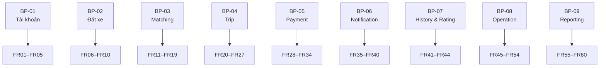

---

## 9.13. Nguyên tắc viết Functional Requirements

Các Functional Requirements trong CAB System tuân theo nguyên tắc:

* Mỗi FR mô tả **một chức năng hoặc hành vi cụ thể của hệ thống**.
* FR phải có khả năng liên kết với Business Process tương ứng.
* FR phải có thể được kiểm chứng thông qua Use Case và Acceptance Criteria.
* Các chính sách chưa được ABC xác nhận không được tự giả định.
* Các giá trị chưa xác định phải được đánh dấu **TBD**.

Các hành vi tự động như:

* Tìm Driver.
* Xếp hạng Driver.
* Phân công Driver.
* Tính cước.
* Gửi Notification.
* Lưu giao dịch.

vẫn được xem là **Functional Requirements**, mặc dù không nhất thiết được kích hoạt trực tiếp bởi một Actor.

---

## 9.14. Chuỗi truy vết Functional Requirements

Các Functional Requirements được truy vết theo chuỗi:

```text id="xa7w2m"
Business Goal
      ↓
Business Requirement
      ↓
Business Process
      ↓
Functional Requirement
      ↓
Use Case
      ↓
Acceptance Criteria
```

Ví dụ:

```text id="dqcdms"
BG-02
↓
BG02_TimTaiXePhuHop
↓
BP-03
↓
FR13_TimTaiXePhuHop
↓
UC08_TimVaPhanCongTaiXe
↓
AC12_TimTaiXePhuHop
```

---


## 10. BUSINESS RULES

### 10.1. Mục đích

Business Rules mô tả các quy tắc nghiệp vụ bắt buộc mà CAB System phải tuân theo trong quá trình vận hành.

Business Rules không mô tả chi tiết cách hệ thống triển khai chức năng, mà xác định các điều kiện, giới hạn và ràng buộc nghiệp vụ áp dụng cho các Functional Requirements.

Quy tắc đặt mã:

`BR-xx`

Trong đó:

* `BR`: Business Rule.
* `xx`: số thứ tự của quy tắc nghiệp vụ.

---

## 10.2. Quy tắc tài khoản và xác thực

### BR-01 – Xác thực trước khi sử dụng chức năng yêu cầu tài khoản

Customer, Driver, Operation Staff và Administrator phải đăng nhập thành công trước khi sử dụng các chức năng yêu cầu xác thực.

Các chức năng yêu cầu quyền cụ thể chỉ được cung cấp cho người dùng có vai trò phù hợp.

---

### BR-02 – Mỗi Customer chỉ có một chuyến đang hoạt động

Một Customer không được đồng thời có nhiều hơn một Trip đang ở trạng thái hoạt động.

Trip được xem là đang hoạt động khi chưa chuyển sang trạng thái kết thúc như:

* `COMPLETED`
* `CANCELLED`

Quy tắc này nhằm hạn chế việc một Customer tạo nhiều chuyến đang diễn ra cùng lúc.

---

## 10.3. Quy tắc tài xế và phân công chuyến

### BR-03 – Driver chỉ nhận chuyến khi ở trạng thái Available

Chỉ Driver có trạng thái phù hợp để nhận chuyến mới được đưa vào danh sách tìm kiếm và phân công.

Ví dụ:

`Driver Status = AVAILABLE`

---

### BR-04 – Driver đang thực hiện chuyến không được nhận chuyến mới

Khi Driver đang thực hiện một Trip, CAB System không được phân công thêm một Trip khác cho Driver đó.

Driver chỉ có thể tiếp tục nhận chuyến khi trở lại trạng thái cho phép nhận chuyến.

---

### BR-05 – Driver phải phù hợp với yêu cầu chuyến

Driver được xem xét để phân công khi đáp ứng các tiêu chí nghiệp vụ cần thiết, bao gồm:

* Trạng thái hoạt động phù hợp.
* Vị trí phù hợp.
* Loại phương tiện phù hợp.
* Các điều kiện vận hành khác do Công ty ABC quy định.

> Tiêu chí chi tiết và trọng số ưu tiên là **TBD**.

---

### BR-06 – Tìm Driver tiếp theo khi Driver từ chối hoặc không phản hồi

Nếu Driver được lựa chọn:

* Từ chối chuyến; hoặc
* Không phản hồi trong thời gian cho phép,

CAB System phải tiếp tục tìm Driver phù hợp tiếp theo.

Customer không phải tạo lại yêu cầu đặt xe.

> Thời gian phản hồi cụ thể là **TBD**.

---

### BR-07 – Phải thông báo khi không tìm được Driver

Nếu CAB System không tìm được Driver phù hợp, hệ thống phải:

* Kết thúc quá trình tìm Driver cho yêu cầu hiện tại.
* Cập nhật trạng thái yêu cầu phù hợp.
* Thông báo cho Customer.

---

## 10.4. Quy tắc trạng thái chuyến đi

### BR-08 – Trip chỉ được thực hiện sau khi có Driver được phân công

Trip không được bắt đầu khi chưa có Driver hợp lệ được phân công.

Trước khi chuyển sang quá trình thực hiện chuyến, Trip phải đạt trạng thái:

`DRIVER_ASSIGNED`

---

### BR-09 – Trạng thái Trip phải tuân theo trình tự hợp lệ

Luồng trạng thái chính của Trip:

```text id="xbjepz"
CREATED
   ↓
SEARCHING_DRIVER
   ↓
DRIVER_ASSIGNED
   ↓
DRIVER_ARRIVED
   ↓
PASSENGER_PICKED_UP
   ↓
IN_PROGRESS
   ↓
COMPLETED
```

Trạng thái `CANCELLED` có thể xuất hiện theo chính sách hủy chuyến.

CAB System không được cho phép chuyển trạng thái trái với quy trình nghiệp vụ hợp lệ.

Ví dụ:

* Không được chuyển từ `SEARCHING_DRIVER` trực tiếp sang `IN_PROGRESS`.
* Không được chuyển sang `COMPLETED` khi chuyến chưa được bắt đầu.

---

## 10.5. Quy tắc cước phí và thanh toán

### BR-10 – Chỉ tính cước cuối cùng khi Trip hoàn thành

Cước phí cuối cùng của chuyến chỉ được xác định khi Trip đạt trạng thái:

`COMPLETED`

Việc tính cước phải dựa trên chính sách của Công ty ABC.

> Công thức tính cước cụ thể là **TBD**.

---

### BR-11 – Hỗ trợ các phương thức thanh toán trong phạm vi MVP

Trong phạm vi MVP, CAB System phải hỗ trợ:

* Thanh toán tiền mặt.
* Thanh toán điện tử thông qua Payment Provider được tích hợp.

Việc bổ sung các phương thức khác được xem xét trong các phiên bản sau.

---

### BR-12 – Không lưu thông tin thanh toán nhạy cảm

CAB System không được trực tiếp lưu trữ các thông tin nhạy cảm như:

* Số thẻ đầy đủ.
* Mã bảo mật thẻ.
* Mật khẩu tài khoản thanh toán.
* Dữ liệu xác thực thanh toán nhạy cảm.

CAB System chỉ lưu các dữ liệu cần thiết để quản lý giao dịch như:

* Mã giao dịch.
* Số tiền.
* Trạng thái.
* Payment Provider.
* Mã tham chiếu nếu có.

---

### BR-13 – Thanh toán điện tử thất bại được xử lý theo chính sách

Nếu giao dịch điện tử không thành công, CAB System phải:

* Ghi nhận kết quả giao dịch.
* Thông báo cho Customer.
* Cho phép xử lý lại hoặc lựa chọn phương án được hỗ trợ theo chính sách.

> Số lần retry và quy trình xử lý cụ thể là **TBD**.

---

## 10.6. Quy tắc đánh giá

### BR-14 – Chỉ được đánh giá sau khi Trip hoàn thành

Customer chỉ được phép đánh giá Driver khi Trip đạt trạng thái:

`COMPLETED`

Các Trip đang diễn ra, bị hủy hoặc chưa hoàn thành không được phép tạo đánh giá chính thức.

---

### BR-15 – Mỗi Trip chỉ có một đánh giá chính thức

Mỗi Trip chỉ được liên kết với tối đa một Rating chính thức từ Customer.

Nếu Trip đã có Rating, CAB System không tạo thêm một Rating chính thức khác cho cùng Trip.

---

## 10.7. Quy tắc quản trị và bảo mật

### BR-16 – Chức năng quản trị phải được phân quyền

Các chức năng quản trị và vận hành nhạy cảm chỉ được thực hiện bởi người dùng có quyền phù hợp.

Ví dụ:

* Operation Staff thực hiện nghiệp vụ vận hành.
* Administrator thực hiện quản lý tài khoản và phân quyền.
* Management truy cập báo cáo theo quyền được cấp.

Người dùng không có quyền phải bị từ chối truy cập.

---

### BR-17 – Các thao tác quan trọng phải được lưu vết

CAB System phải lưu vết các thao tác quản trị hoặc vận hành quan trọng để hỗ trợ kiểm tra và truy vết.

Các thao tác có thể bao gồm:

* Thay đổi quyền.
* Thay đổi trạng thái tài khoản.
* Xử lý sự cố.
* Điều chỉnh dữ liệu quan trọng theo quyền.
* Các thao tác quản trị nhạy cảm khác.

Thông tin Audit Log cần xác định được tối thiểu:

* Người thực hiện.
* Thao tác.
* Đối tượng bị tác động.
* Thời điểm thực hiện.

---

## 10.8. Quy tắc báo cáo

### BR-18 – Báo cáo phải sử dụng dữ liệu hợp lệ của hệ thống

Các báo cáo của CAB System phải được tạo từ dữ liệu được lưu trữ hợp lệ trong hệ thống.

Ví dụ:

* Thống kê số chuyến phải dựa trên dữ liệu Trip.
* Doanh thu phải dựa trên dữ liệu Trip và Payment phù hợp.
* Tỷ lệ hoàn thành phải dựa trên trạng thái Trip.
* Tỷ lệ hủy phải dựa trên các Trip có trạng thái `CANCELLED`.

CAB System không được sử dụng dữ liệu không hợp lệ hoặc chưa được ghi nhận chính thức để tạo báo cáo chính thức.

---

## 10.9. Tổng hợp Business Rules

| Mã        | Business Rule                                          | Nhóm             |
| --------- | ------------------------------------------------------ | ---------------- |
| **BR-01** | Xác thực trước khi sử dụng chức năng yêu cầu tài khoản | Tài khoản        |
| **BR-02** | Mỗi Customer chỉ có một chuyến đang hoạt động          | Đặt xe           |
| **BR-03** | Driver chỉ nhận chuyến khi Available                   | Driver           |
| **BR-04** | Driver đang thực hiện chuyến không nhận chuyến mới     | Driver           |
| **BR-05** | Driver phải phù hợp với yêu cầu chuyến                 | Matching         |
| **BR-06** | Tìm Driver tiếp theo khi từ chối hoặc không phản hồi   | Matching         |
| **BR-07** | Thông báo khi không tìm được Driver                    | Matching         |
| **BR-08** | Trip chỉ thực hiện sau khi có Driver                   | Trip             |
| **BR-09** | Trạng thái Trip phải tuân theo trình tự hợp lệ         | Trip             |
| **BR-10** | Chỉ tính cước cuối cùng khi Trip hoàn thành            | Fare             |
| **BR-11** | Hỗ trợ phương thức thanh toán trong MVP                | Payment          |
| **BR-12** | Không lưu thông tin thanh toán nhạy cảm                | Payment/Security |
| **BR-13** | Thanh toán thất bại xử lý theo chính sách              | Payment          |
| **BR-14** | Chỉ đánh giá sau khi Trip hoàn thành                   | Rating           |
| **BR-15** | Mỗi Trip chỉ có một đánh giá chính thức                | Rating           |
| **BR-16** | Chức năng quản trị phải được phân quyền                | Administration   |
| **BR-17** | Thao tác quan trọng phải được lưu vết                  | Audit            |
| **BR-18** | Báo cáo phải sử dụng dữ liệu hợp lệ                    | Reporting        |

---

## 10.10. Mapping Business Rules – Functional Requirements

| Business Rule | Functional Requirements liên quan |
| ------------- | --------------------------------- |
| **BR-01**     | FR02, FR04, FR05, FR45–FR60       |
| **BR-02**     | FR09                              |
| **BR-03**     | FR11, FR13                        |
| **BR-04**     | FR11, FR13, FR17                  |
| **BR-05**     | FR12–FR14                         |
| **BR-06**     | FR16, FR18                        |
| **BR-07**     | FR19                              |
| **BR-08**     | FR17, FR23–FR26                   |
| **BR-09**     | FR22–FR27                         |
| **BR-10**     | FR26, FR28                        |
| **BR-11**     | FR30–FR32                         |
| **BR-12**     | FR32, FR34                        |
| **BR-13**     | FR32, FR33                        |
| **BR-14**     | FR43                              |
| **BR-15**     | FR43, FR44                        |
| **BR-16**     | FR45–FR54, FR60                   |
| **BR-17**     | FR50, FR53, FR54                  |
| **BR-18**     | FR55–FR60                         |

---

## 10.11. Business Rules chưa xác định chi tiết

Một số Business Rules phụ thuộc vào chính sách nghiệp vụ của Công ty ABC và chưa đủ thông tin để xác định chi tiết.

Các nội dung này được đánh dấu **TBD** thay vì tự giả định:

| Nội dung                                 | Trạng thái |
| ---------------------------------------- | ---------- |
| Công thức tính cước                      | TBD        |
| Tiêu chí và trọng số ưu tiên Driver      | TBD        |
| Thời gian Driver phản hồi yêu cầu chuyến | TBD        |
| Điều kiện và phí hủy chuyến              | TBD        |
| Số lần retry thanh toán                  | TBD        |
| Các điều kiện xử lý khi mất kết nối      | TBD        |
| Thời gian lưu trữ dữ liệu                | TBD        |

Các nội dung trên được quản lý tập trung tại **Mục 13 – Open Questions / TBD**.

---

## 11. NON-FUNCTIONAL REQUIREMENTS

### 11.1. Mục đích

Non-Functional Requirements (NFR) mô tả các yêu cầu về chất lượng và đặc tính vận hành mà **CAB System** phải đáp ứng bên cạnh các Functional Requirements.

Các NFR của CAB System được chia thành 6 nhóm:

1. Performance.
2. Availability & Reliability.
3. Scalability.
4. Security.
5. Maintainability & Extensibility.
6. Usability.

Quy tắc đặt mã:

`NFR-xx`

Trong đó:

* `NFR`: Non-Functional Requirement.
* `xx`: số thứ tự của yêu cầu.

> Các giá trị định lượng chưa được Công ty ABC xác nhận sẽ không được tự giả định và được đánh dấu **TBD** khi cần thiết.

---

## 11.2. Performance

### NFR-01 – Thời gian phản hồi

CAB System phải cung cấp thời gian phản hồi phù hợp cho các thao tác thông thường của người dùng như:

* Đăng nhập.
* Tạo yêu cầu đặt xe.
* Xem thông tin chuyến.
* Xem lịch sử.
* Tra cứu dữ liệu vận hành.

> Ngưỡng thời gian phản hồi cụ thể: **TBD**.

---

### NFR-02 – Hiệu suất tìm và phân công Driver

Quá trình tìm và phân công Driver phải được xử lý đủ nhanh để hạn chế thời gian chờ của Customer.

Hệ thống phải có khả năng:

* Tìm Driver Available.
* Lọc Driver phù hợp.
* Xếp hạng Driver.
* Gửi yêu cầu chuyến.
* Tiếp tục tìm Driver khác khi cần.

> Thời gian tối đa cho quá trình tìm Driver: **TBD**.

---

### NFR-03 – Xử lý yêu cầu đồng thời

CAB System phải có khả năng xử lý nhiều yêu cầu đồng thời từ:

* Customer.
* Driver.
* Operation Staff.
* Các dịch vụ tích hợp.

Các yêu cầu đồng thời không được làm mất tính nhất quán của dữ liệu Trip, Driver và Payment.

> Số lượng concurrent users/requests mục tiêu: **TBD**.

---

## 11.3. Availability & Reliability

### NFR-04 – Hoạt động ổn định khi tải tăng

CAB System phải duy trì hoạt động ổn định khi số lượng Customer, Driver hoặc yêu cầu đặt xe tăng cao.

Các chức năng cốt lõi cần được ưu tiên duy trì gồm:

* Đặt xe.
* Tìm Driver.
* Cập nhật trạng thái Trip.
* Theo dõi Trip.

---

### NFR-05 – Độc lập với Payment Provider

Lỗi hoặc gián đoạn của Payment Provider không được làm ngừng toàn bộ CAB System.

Khi Payment Provider gặp lỗi:

* Quá trình đặt xe vẫn phải hoạt động.
* Các Trip đang diễn ra vẫn phải tiếp tục được quản lý.
* Lỗi thanh toán phải được xử lý riêng.

---

### NFR-06 – Độc lập với Notification Provider

Lỗi của Notification Provider không được làm gián đoạn:

* Tạo yêu cầu đặt xe.
* Tìm và phân công Driver.
* Thực hiện Trip.
* Hoàn thành Trip.

CAB System phải ghi nhận lỗi thông báo để có thể kiểm tra hoặc xử lý sau.

---

### NFR-07 – Tính nhất quán của dữ liệu quan trọng

CAB System phải duy trì tính nhất quán đối với các dữ liệu quan trọng, đặc biệt:

* Trạng thái Driver.
* Trạng thái Trip.
* Driver được phân công.
* Payment.
* Rating.
* Audit Log.

Hệ thống phải hạn chế các trường hợp dữ liệu mâu thuẫn giữa các module.

---

## 11.4. Scalability

### NFR-08 – Khả năng mở rộng các thành phần có tải lớn

Các thành phần có khả năng chịu tải lớn phải có khả năng mở rộng độc lập khi cần thiết.

Các thành phần chính gồm:

* Booking.
* Driver Matching.
* Trip Management.
* Notification.

Việc mở rộng một thành phần cần hạn chế ảnh hưởng đến các thành phần khác.

---

### NFR-09 – Khả năng tăng quy mô hệ thống

CAB System phải hỗ trợ sự gia tăng về:

* Số lượng Customer.
* Số lượng Driver.
* Số lượng Trip.
* Số lượng giao dịch.
* Số lượng yêu cầu đồng thời.

Việc tăng quy mô không nên yêu cầu thiết kế lại toàn bộ kiến trúc hệ thống.

---

## 11.5. Security

### NFR-10 – Xác thực người dùng

CAB System phải xác thực người dùng trước khi cho phép truy cập các chức năng yêu cầu tài khoản.

Hệ thống phải từ chối truy cập khi thông tin xác thực không hợp lệ.

---

### NFR-11 – Phân quyền truy cập

CAB System phải kiểm soát quyền truy cập dựa trên vai trò của người dùng.

Ví dụ:

* Customer chỉ truy cập dữ liệu và chức năng thuộc phạm vi của mình.
* Driver chỉ truy cập chức năng dành cho Driver.
* Operation Staff truy cập chức năng vận hành theo quyền.
* Administrator truy cập chức năng quản trị theo quyền.
* Management truy cập báo cáo theo quyền được cấp.

---

### NFR-12 – Bảo vệ dữ liệu

CAB System phải bảo vệ các dữ liệu nhạy cảm và quan trọng, bao gồm:

* Thông tin cá nhân.
* Thông tin Driver.
* Thông tin Vehicle.
* Dữ liệu vị trí.
* Dữ liệu Trip.
* Dữ liệu giao dịch.

Các dữ liệu cần được bảo vệ phù hợp trong quá trình:

* Lưu trữ.
* Truyền giữa các thành phần.
* Trao đổi với dịch vụ bên ngoài.

---

### NFR-13 – Bảo vệ dữ liệu thanh toán

CAB System không được lưu trực tiếp các dữ liệu thanh toán nhạy cảm như:

* Số thẻ đầy đủ.
* Mã bảo mật thẻ.
* Mật khẩu tài khoản thanh toán.
* Dữ liệu xác thực thanh toán nhạy cảm.

Việc xử lý dữ liệu thanh toán nhạy cảm thuộc trách nhiệm của Payment Provider.

CAB System chỉ lưu các thông tin giao dịch cần thiết để phục vụ quản lý và truy vết.

---

### NFR-14 – Audit các thao tác quan trọng

CAB System phải lưu Audit Log cho các thao tác quản trị hoặc vận hành quan trọng.

Audit Log cần xác định được tối thiểu:

* Người thực hiện.
* Hành động.
* Đối tượng bị tác động.
* Thời điểm thực hiện.

Người dùng thông thường không được phép tự ý sửa hoặc xóa Audit Log.

---

## 11.6. Maintainability & Extensibility

### NFR-15 – Thiết kế theo module

CAB System phải được tổ chức theo các module có trách nhiệm rõ ràng nhằm:

* Hạn chế phụ thuộc giữa các thành phần.
* Hỗ trợ bảo trì.
* Hỗ trợ kiểm thử.
* Hạn chế ảnh hưởng khi thay đổi một module.
* Hỗ trợ triển khai từng phần khi phù hợp.

---

### NFR-16 – Mở rộng Payment Provider

Kiến trúc CAB System phải hỗ trợ khả năng tích hợp thêm Payment Provider trong tương lai mà hạn chế thay đổi các module nghiệp vụ không liên quan.

Trong MVP chỉ yêu cầu tích hợp một Payment Provider chính.

---

### NFR-17 – Mở rộng Notification Provider

CAB System phải cho phép bổ sung:

* Notification Provider mới.
* Kênh thông báo mới.

Việc mở rộng cần hạn chế ảnh hưởng đến Booking, Matching và Trip Management.

---

### NFR-18 – Mở rộng loại dịch vụ

CAB System phải được thiết kế để có thể bổ sung trong tương lai:

* Loại Vehicle mới.
* Loại dịch vụ vận chuyển mới.
* Phương thức thanh toán mới.
* Tích hợp bên ngoài mới.

Việc mở rộng không nên yêu cầu thiết kế lại toàn bộ hệ thống.

---

## 11.7. Usability

### NFR-19 – Giao diện dễ sử dụng

Giao diện dành cho Customer và Driver phải đơn giản, dễ hiểu và phù hợp với các thao tác thường xuyên trên thiết bị di động.

Các chức năng quan trọng như:

* Đặt xe.
* Nhận chuyến.
* Theo dõi chuyến.
* Cập nhật trạng thái.
* Thanh toán.

phải dễ nhận biết và thao tác.

---

### NFR-20 – Hiển thị trạng thái rõ ràng

CAB System phải hiển thị rõ ràng trạng thái của các nghiệp vụ quan trọng.

Đặc biệt:

* Trạng thái yêu cầu đặt xe.
* Trạng thái tìm Driver.
* Trạng thái Trip.
* Trạng thái Payment.

Customer và Driver phải có khả năng nhận biết trạng thái hiện tại của nghiệp vụ đang thực hiện.

---

### NFR-21 – Thông báo lỗi dễ hiểu

Khi xảy ra lỗi, CAB System phải cung cấp thông báo phù hợp để người dùng hiểu:

* Vấn đề đã xảy ra.
* Thao tác có thành công hay không.
* Hành động tiếp theo nếu có.

Hệ thống cần tránh hiển thị trực tiếp các thông tin kỹ thuật nội bộ hoặc dữ liệu nhạy cảm cho người dùng cuối.

---

## 11.8. Tổng hợp Non-Functional Requirements

| Nhóm                                | NFR                 | Nội dung                          |
| ----------------------------------- | ------------------- | --------------------------------- |
| **Performance**                     | NFR-01              | Thời gian phản hồi                |
|                                     | NFR-02              | Hiệu suất tìm và phân công Driver |
|                                     | NFR-03              | Xử lý yêu cầu đồng thời           |
| **Availability & Reliability**      | NFR-04              | Hoạt động ổn định khi tải tăng    |
|                                     | NFR-05              | Độc lập với Payment Provider      |
|                                     | NFR-06              | Độc lập với Notification Provider |
|                                     | NFR-07              | Tính nhất quán dữ liệu            |
| **Scalability**                     | NFR-08              | Mở rộng các thành phần có tải lớn |
|                                     | NFR-09              | Mở rộng quy mô hệ thống           |
| **Security**                        | NFR-10              | Xác thực người dùng               |
|                                     | NFR-11              | Phân quyền truy cập               |
|                                     | NFR-12              | Bảo vệ dữ liệu                    |
|                                     | NFR-13              | Bảo vệ dữ liệu thanh toán         |
|                                     | NFR-14              | Audit thao tác quan trọng         |
| **Maintainability & Extensibility** | NFR-15              | Thiết kế theo module              |
|                                     | NFR-16              | Mở rộng Payment Provider          |
|                                     | NFR-17              | Mở rộng Notification Provider     |
|                                     | NFR-18              | Mở rộng loại dịch vụ              |
| **Usability**                       | NFR-19              | Giao diện dễ sử dụng              |
|                                     | NFR-20              | Hiển thị trạng thái rõ ràng       |
|                                     | NFR-21              | Thông báo lỗi dễ hiểu             |
| **Tổng**                            | **NFR-01 → NFR-21** | **21 yêu cầu**                    |

---

## 11.9. Mapping NFR – Business Goals

| Business Goal                               | NFR liên quan                                  |
| ------------------------------------------- | ---------------------------------------------- |
| **BG-01 – Nền tảng đặt xe toàn diện**       | NFR-01, NFR-03, NFR-07, NFR-19, NFR-20, NFR-21 |
| **BG-02 – Tự động tìm và phân công Driver** | NFR-02, NFR-03, NFR-04, NFR-08                 |
| **BG-03 – Trải nghiệm và theo dõi chuyến**  | NFR-01, NFR-06, NFR-19, NFR-20, NFR-21         |
| **BG-04 – Cước phí và thanh toán**          | NFR-05, NFR-07, NFR-12, NFR-13                 |
| **BG-05 – Quản lý và vận hành**             | NFR-07, NFR-11, NFR-14                         |
| **BG-06 – Ổn định, bảo mật và mở rộng**     | NFR-04 → NFR-18                                |

---

## 11.10. Mapping NFR – MVP Modules

| NFR    | Module chính                 |
| ------ | ---------------------------- |
| NFR-01 | M01, M02, M05, M08, M09      |
| NFR-02 | M04                          |
| NFR-03 | M02, M04, M05                |
| NFR-04 | Toàn hệ thống                |
| NFR-05 | M06                          |
| NFR-06 | M07                          |
| NFR-07 | M03, M04, M05, M06, M08, M09 |
| NFR-08 | M02, M04, M05, M07           |
| NFR-09 | Toàn hệ thống                |
| NFR-10 | M01                          |
| NFR-11 | M01, M09, M10                |
| NFR-12 | Toàn hệ thống                |
| NFR-13 | M06                          |
| NFR-14 | M09                          |
| NFR-15 | Toàn hệ thống                |
| NFR-16 | M06, M11                     |
| NFR-17 | M07, M11                     |
| NFR-18 | M03, M06, M07, M11           |
| NFR-19 | Giao diện Customer/Driver    |
| NFR-20 | M02, M04, M05, M06           |
| NFR-21 | Toàn hệ thống                |

---

## 11.11. Các NFR cần xác định chỉ số định lượng

Một số Non-Functional Requirements hiện mới xác định ở mức nghiệp vụ và cần được ABC hoặc nhóm dự án thống nhất tiêu chí đo lường trước khi kiểm thử chính thức.

| Nội dung                          | Trạng thái |
| --------------------------------- | ---------- |
| Thời gian phản hồi tối đa         | **TBD**    |
| Thời gian xử lý Matching          | **TBD**    |
| Số lượng người dùng đồng thời     | **TBD**    |
| Số lượng yêu cầu đặt xe đồng thời | **TBD**    |
| Mức Availability mục tiêu         | **TBD**    |
| Khối lượng dữ liệu mục tiêu       | **TBD**    |
| Thời gian lưu trữ Audit Log       | **TBD**    |

Các giá trị này sẽ được quản lý tại **Mục 13 – Open Questions / TBD**.

---

## 11.12. Quan hệ FR và NFR

Functional Requirements và Non-Functional Requirements có vai trò khác nhau:

```text id="u6f5ws"
Functional Requirement
→ Hệ thống phải làm GÌ?

Non-Functional Requirement
→ Hệ thống phải thực hiện TỐT NHƯ THẾ NÀO?
```

Ví dụ:

```text id="x0is6j"
FR13_TimTaiXePhuHop
→ CAB System phải tìm Driver phù hợp.

NFR-02
→ Quá trình tìm Driver phải được thực hiện
   đủ nhanh để hạn chế thời gian chờ của Customer.
```

Một NFR có thể áp dụng cho nhiều Functional Requirements hoặc cho toàn bộ CAB System.

---

## 12. EXCEPTION CASES

### 12.1. Mục đích

Exception Cases mô tả các tình huống bất thường, lỗi hoặc trường hợp ngoại lệ có thể xảy ra trong quá trình vận hành CAB System.

Mục tiêu của phần này là xác định:

* Khi nào ngoại lệ xảy ra.
* Hệ thống phải phản ứng như thế nào.
* Quy trình có tiếp tục hay kết thúc.
* Functional Requirement nào bị ảnh hưởng.

Quy tắc đặt mã:

`EX-xx`

Trong đó:

* `EX`: Exception Case.
* `xx`: số thứ tự ngoại lệ.

---

## 12.2. EX-01 – Đăng nhập không hợp lệ

**Điều kiện xảy ra:**

Người dùng nhập thông tin đăng nhập không chính xác hoặc tài khoản không hợp lệ.

**Xử lý:**

CAB System phải:

* Từ chối đăng nhập.
* Không tạo phiên đăng nhập.
* Hiển thị thông báo phù hợp.
* Cho phép người dùng nhập lại thông tin.

**Liên quan:**

* BP-01
* FR02_DangNhap
* BR-01
* NFR-10
* NFR-21

---

## 12.3. EX-02 – Thông tin đặt xe không hợp lệ

**Điều kiện xảy ra:**

Customer nhập dữ liệu đặt xe không hợp lệ, ví dụ:

* Điểm đón không xác định được.
* Điểm đến không hợp lệ.
* Thiếu thông tin bắt buộc.
* Loại xe không hợp lệ hoặc không được hỗ trợ.

**Xử lý:**

CAB System phải:

* Không tạo Trip.
* Thông báo dữ liệu chưa hợp lệ.
* Cho phép Customer chỉnh sửa thông tin.
* Chỉ tạo yêu cầu khi dữ liệu hợp lệ.

**Liên quan:**

* BP-02
* FR06_NhapThongTinChuyenDi
* FR07_ChonLoaiXe
* FR09_TaoYeuCauDatXe
* NFR-21

---

## 12.4. EX-03 – Không tìm được Driver phù hợp

**Điều kiện xảy ra:**

CAB System đã thực hiện quá trình tìm Driver nhưng không còn Driver đáp ứng điều kiện phân công.

**Xử lý:**

CAB System phải:

* Dừng quá trình Matching hiện tại.
* Không phân công Driver không phù hợp.
* Cập nhật trạng thái yêu cầu phù hợp.
* Thông báo cho Customer rằng chưa thể tìm được Driver.

Customer có thể thực hiện hành động tiếp theo theo chính sách của hệ thống.

**Liên quan:**

* BP-03
* FR13_TimTaiXePhuHop
* FR19_ThongBaoKhongCoTaiXe
* BR-05
* BR-07

---

## 12.5. EX-04 – Driver không phản hồi yêu cầu chuyến

**Điều kiện xảy ra:**

CAB System gửi yêu cầu nhận chuyến đến Driver nhưng Driver không phản hồi trong thời gian cho phép.

**Xử lý:**

CAB System phải:

* Ghi nhận Driver không phản hồi.
* Không phân công Trip cho Driver đó.
* Chuyển sang Driver phù hợp tiếp theo.
* Customer không phải tạo lại yêu cầu đặt xe.

> Thời gian chờ Driver phản hồi là **TBD**.

**Liên quan:**

* BP-03
* FR15_GuiYeuCauNhanChuyen
* FR18_TimLaiTaiXe
* BR-06

---

## 12.6. EX-05 – Driver từ chối chuyến

**Điều kiện xảy ra:**

Driver nhận được yêu cầu chuyến nhưng lựa chọn từ chối.

**Xử lý:**

CAB System phải:

* Ghi nhận phản hồi từ chối.
* Không phân công Trip cho Driver đó.
* Tiếp tục tìm Driver phù hợp khác.
* Không yêu cầu Customer tạo lại booking.

**Liên quan:**

* BP-03
* FR16_PhanHoiYeuCauChuyen
* FR18_TimLaiTaiXe
* BR-06

---

## 12.7. EX-06 – Customer hủy chuyến

**Điều kiện xảy ra:**

Customer yêu cầu hủy Trip trước khi chuyến kết thúc.

**Xử lý:**

CAB System phải:

1. Kiểm tra Trip có được phép hủy ở trạng thái hiện tại hay không.
2. Nếu được phép:

   * Cập nhật Trip thành `CANCELLED`.
   * Giải phóng Driver nếu cần.
   * Cập nhật trạng thái Driver phù hợp.
   * Gửi thông báo cho các bên liên quan.
3. Nếu không được phép:

   * Từ chối yêu cầu hủy.
   * Thông báo lý do phù hợp.

> Các trạng thái được phép hủy và phí hủy là **TBD**.

**Liên quan:**

* BP-02
* BP-04
* FR10_HuyYeuCauDatXe
* FR27_HuyChuyenDi
* BR-09

---

## 12.8. EX-07 – Driver hủy chuyến

**Điều kiện xảy ra:**

Driver yêu cầu hủy Trip sau khi đã được phân công.

**Xử lý:**

CAB System phải:

* Kiểm tra điều kiện hủy.
* Ghi nhận việc Driver hủy chuyến.
* Cập nhật trạng thái Trip theo chính sách.
* Cập nhật trạng thái Driver.
* Thông báo cho Customer.

Tùy theo chính sách của ABC, hệ thống có thể:

* Tìm Driver thay thế; hoặc
* Hủy Trip.

> Quy trình tìm Driver thay thế sau khi Driver hủy là **TBD**.

**Liên quan:**

* BP-03
* BP-04
* FR18_TimLaiTaiXe
* FR27_HuyChuyenDi

---

## 12.9. EX-08 – Thanh toán điện tử thất bại

**Điều kiện xảy ra:**

Payment Provider trả về kết quả giao dịch không thành công.

**Xử lý:**

CAB System phải:

* Không ghi nhận giao dịch là thành công.
* Lưu trạng thái giao dịch thất bại.
* Thông báo kết quả cho Customer.
* Cho phép xử lý lại theo chính sách thanh toán.

Tùy phạm vi được hỗ trợ, Customer có thể:

* Thử thanh toán điện tử lại.
* Chọn phương thức thanh toán khác được hỗ trợ.

> Số lần retry và điều kiện chuyển phương thức thanh toán là **TBD**.

**Liên quan:**

* BP-05
* FR32_ThanhToanDienTu
* FR33_XuLyThanhToanThatBai
* FR34_LuuThongTinGiaoDich
* BR-13
* NFR-05

---

## 12.10. EX-09 – Payment Provider không phản hồi

**Điều kiện xảy ra:**

CAB System đã gửi yêu cầu thanh toán nhưng không nhận được kết quả từ Payment Provider trong thời gian xử lý cho phép.

**Xử lý:**

CAB System phải:

* Không tự mặc định giao dịch thành công.
* Ghi nhận trạng thái giao dịch phù hợp.
* Thông báo tình trạng cho Customer nếu cần.
* Cho phép hệ thống kiểm tra hoặc xử lý lại giao dịch theo chính sách.

Trạng thái có thể được quản lý dưới dạng:

`PENDING`

hoặc

`FAILED`

tùy theo quy định được thống nhất.

> Timeout và quy tắc xác định trạng thái cuối cùng là **TBD**.

**Liên quan:**

* BP-05
* FR32_ThanhToanDienTu
* FR33_XuLyThanhToanThatBai
* FR34_LuuThongTinGiaoDich
* NFR-05
* NFR-07

---

## 12.11. EX-10 – Notification Provider gặp lỗi

**Điều kiện xảy ra:**

CAB System gửi yêu cầu Notification nhưng Notification Provider không xử lý thành công.

**Xử lý:**

CAB System phải:

* Ghi nhận lỗi gửi Notification.
* Không làm dừng quy trình nghiệp vụ chính.
* Booking, Matching, Trip và Payment vẫn tiếp tục hoạt động độc lập.
* Có thể thực hiện xử lý lại nếu chính sách Notification cho phép.

Ví dụ:

Driver đã nhận chuyến nhưng Notification gửi cho Customer thất bại thì Trip vẫn phải duy trì trạng thái:

`DRIVER_ASSIGNED`

**Liên quan:**

* BP-06
* FR35–FR40
* NFR-06
* NFR-17

---

## 12.12. EX-11 – Mất kết nối trong quá trình thực hiện chuyến

**Điều kiện xảy ra:**

Customer hoặc Driver mất kết nối mạng trong khi Trip đang diễn ra.

**Xử lý mong muốn:**

CAB System phải hạn chế mất dữ liệu nghiệp vụ quan trọng.

Khi kết nối được khôi phục, hệ thống cần:

* Xác định trạng thái Trip gần nhất.
* Đồng bộ các cập nhật còn thiếu khi có thể.
* Không tự tạo thêm Trip mới.
* Hạn chế ghi nhận trạng thái trái với trình tự nghiệp vụ.

> Cơ chế Offline cụ thể, thời gian đồng bộ và xử lý xung đột dữ liệu là **TBD**.

**Liên quan:**

* BP-04
* FR22–FR27
* BR-09
* NFR-07

---

## 12.13. EX-12 – Người dùng thực hiện chức năng không có quyền

**Điều kiện xảy ra:**

Người dùng cố truy cập hoặc thực hiện một chức năng không thuộc quyền được cấp.

Ví dụ:

* Operation Staff truy cập chức năng quản lý quyền của Administrator.
* Customer cố truy cập chức năng vận hành.
* Driver cố xem dữ liệu của Customer không thuộc phạm vi được phép.

**Xử lý:**

CAB System phải:

* Từ chối thao tác.
* Không thay đổi dữ liệu.
* Hiển thị thông báo truy cập không được phép.
* Lưu Audit Log nếu thao tác thuộc nhóm cần giám sát.

**Liên quan:**

* BP-08
* BP-09
* FR45–FR60
* BR-16
* BR-17
* NFR-11
* NFR-14

---

## 12.14. Tổng hợp Exception Cases

| Mã        | Exception Case                  | Business Process chính |
| --------- | ------------------------------- | ---------------------- |
| **EX-01** | Đăng nhập không hợp lệ          | BP-01                  |
| **EX-02** | Thông tin đặt xe không hợp lệ   | BP-02                  |
| **EX-03** | Không tìm được Driver phù hợp   | BP-03                  |
| **EX-04** | Driver không phản hồi           | BP-03                  |
| **EX-05** | Driver từ chối chuyến           | BP-03                  |
| **EX-06** | Customer hủy chuyến             | BP-02, BP-04           |
| **EX-07** | Driver hủy chuyến               | BP-03, BP-04           |
| **EX-08** | Thanh toán điện tử thất bại     | BP-05                  |
| **EX-09** | Payment Provider không phản hồi | BP-05                  |
| **EX-10** | Notification Provider gặp lỗi   | BP-06                  |
| **EX-11** | Mất kết nối trong chuyến        | BP-04                  |
| **EX-12** | Người dùng không có quyền       | BP-08, BP-09           |

---

## 12.15. Mapping Exception Cases – Functional Requirements

| Exception Case | Functional Requirements liên quan |
| -------------- | --------------------------------- |
| **EX-01**      | FR02                              |
| **EX-02**      | FR06, FR07, FR09                  |
| **EX-03**      | FR13, FR18, FR19                  |
| **EX-04**      | FR15, FR18                        |
| **EX-05**      | FR16, FR18                        |
| **EX-06**      | FR10, FR27                        |
| **EX-07**      | FR18, FR27                        |
| **EX-08**      | FR32, FR33, FR34, FR39            |
| **EX-09**      | FR32, FR33, FR34, FR39            |
| **EX-10**      | FR35–FR40                         |
| **EX-11**      | FR22–FR27                         |
| **EX-12**      | FR45–FR60                         |

---

## 12.16. Mapping Exception Cases – Business Rules

| Exception Case | Business Rules liên quan                            |
| -------------- | --------------------------------------------------- |
| EX-01          | BR-01                                               |
| EX-02          | BR-02                                               |
| EX-03          | BR-05, BR-07                                        |
| EX-04          | BR-06                                               |
| EX-05          | BR-06                                               |
| EX-06          | BR-09                                               |
| EX-07          | BR-06, BR-09                                        |
| EX-08          | BR-11, BR-13                                        |
| EX-09          | BR-12, BR-13                                        |
| EX-10          | Không có Business Rule riêng; chịu ràng buộc NFR-06 |
| EX-11          | BR-09                                               |
| EX-12          | BR-16, BR-17                                        |

---

## 12.17. Quan hệ giữa Business Rule và Exception Case

Business Rule xác định **điều kiện nghiệp vụ phải tuân theo**, trong khi Exception Case mô tả **hệ thống phải xử lý thế nào khi điều kiện thông thường không được đáp ứng hoặc phát sinh sự cố**.

Ví dụ:

```text id="7jqrac"
BR-06
Driver từ chối hoặc không phản hồi
→ phải tiếp tục tìm Driver khác.

        ↓

EX-04
Driver không phản hồi
→ bỏ Driver hiện tại
→ tìm Driver tiếp theo.
```

Một ví dụ khác:

```text id="zw1rcd"
BR-13
Thanh toán thất bại phải được xử lý theo chính sách.

        ↓

EX-08
Payment Provider trả FAILED
→ ghi nhận thất bại
→ thông báo Customer
→ cho phép xử lý lại theo chính sách.
```

---

## 12.18. Các ngoại lệ còn phụ thuộc chính sách TBD

Một số Exception Cases chưa thể xác định hoàn toàn vì yêu cầu ban đầu của ABC chưa cung cấp chính sách chi tiết.

| Nội dung cần xác định           | Exception liên quan | Trạng thái |
| ------------------------------- | ------------------- | ---------- |
| Thời gian Driver phản hồi       | EX-04               | TBD        |
| Quy tắc tìm Driver thay thế     | EX-07               | TBD        |
| Trạng thái được phép hủy        | EX-06, EX-07        | TBD        |
| Phí hủy chuyến                  | EX-06, EX-07        | TBD        |
| Số lần retry Payment            | EX-08               | TBD        |
| Timeout Payment Provider        | EX-09               | TBD        |
| Cách xử lý giao dịch PENDING    | EX-09               | TBD        |
| Cơ chế Offline                  | EX-11               | TBD        |
| Quy tắc đồng bộ sau mất kết nối | EX-11               | TBD        |

Các vấn đề này được chuyển sang **Mục 13 – OPEN QUESTIONS / TBD** để BA xác nhận với Công ty ABC.

---

## 13. OPEN QUESTIONS / TBD

### 13.1. Mục đích

Trong quá trình phân tích yêu cầu, một số nội dung nghiệp vụ của CAB System chưa được Công ty ABC xác định chi tiết. Những vấn đề này được ghi nhận dưới dạng **Open Questions / TBD (To Be Determined)** để Business Analyst làm rõ với các bên liên quan trước khi thiết kế và phát triển hệ thống.

Nguyên tắc xử lý:

* Không tự giả định chính sách nghiệp vụ khi chưa có xác nhận.
* Các nội dung TBD phải được theo dõi cho đến khi có quyết định chính thức.
* Sau khi được xác nhận, thông tin sẽ được cập nhật vào Business Rules, Functional Requirements hoặc Non-Functional Requirements tương ứng.

---

### 13.2. Danh sách Open Questions

| Mã         | Nội dung cần xác nhận          | Câu hỏi cần làm rõ                                                                                      | Stakeholder cần xác nhận           | Ảnh hưởng                |
| ---------- | ------------------------------ | ------------------------------------------------------------------------------------------------------- | ---------------------------------- | ------------------------ |
| **TBD-01** | Công thức tính cước            | Cước được tính dựa trên khoảng cách, thời gian, loại xe hay kết hợp nhiều yếu tố? Có phụ phí hay không? | Ban Giám đốc, Bộ phận vận hành     | BR-10, FR28, BP-05       |
| **TBD-02** | Tiêu chí ưu tiên Driver        | Hệ thống ưu tiên tài xế gần nhất, điểm đánh giá, tỷ lệ nhận chuyến hay tiêu chí khác?                   | Bộ phận vận hành                   | BR-05, FR13, FR14, BP-03 |
| **TBD-03** | Thời gian Driver phản hồi      | Driver có bao nhiêu giây để chấp nhận hoặc từ chối chuyến trước khi hệ thống chuyển sang người khác?    | Bộ phận vận hành                   | BR-06, FR18, EX-04       |
| **TBD-04** | Chính sách Customer hủy chuyến | Customer được phép hủy ở những trạng thái nào? Có áp dụng phí hủy hay không?                            | Ban Giám đốc, Bộ phận vận hành     | BR-09, FR10, FR27, EX-06 |
| **TBD-05** | Chính sách Driver hủy chuyến   | Khi Driver hủy sau khi nhận chuyến thì hệ thống tìm Driver thay thế hay hủy luôn chuyến?                | Bộ phận vận hành                   | FR18, FR27, EX-07        |
| **TBD-06** | Xử lý mất kết nối mạng         | Khi Driver hoặc Customer mất mạng, dữ liệu được lưu tạm như thế nào và đồng bộ lại ra sao?              | Bộ phận kỹ thuật, Bộ phận vận hành | EX-11, NFR-07            |
| **TBD-07** | Chính sách Retry thanh toán    | Thanh toán điện tử thất bại được phép thử lại bao nhiêu lần và trong khoảng thời gian nào?              | Ban Giám đốc, Đối tác thanh toán   | BR-13, FR33, EX-08       |
| **TBD-08** | Timeout Payment Provider       | Sau bao lâu không nhận được phản hồi thì giao dịch được xem là Pending hoặc Failed?                     | Payment Provider, Bộ phận kỹ thuật | EX-09, NFR-05            |
| **TBD-09** | Trạng thái giao dịch Pending   | Nếu Payment Provider trả kết quả chậm thì CAB System xử lý giao dịch Pending như thế nào?               | Payment Provider                   | FR32, FR33, EX-09        |
| **TBD-10** | Thời gian lưu trữ dữ liệu      | Dữ liệu Trip, Payment, Rating, Audit Log và vị trí Driver cần được lưu trong bao lâu?                   | Ban Giám đốc, Bộ phận pháp lý      | NFR-12, NFR-14           |
| **TBD-11** | Chính sách lưu vị trí Driver   | Tần suất cập nhật vị trí là bao lâu? Có lưu toàn bộ lịch sử di chuyển hay chỉ vị trí gần nhất?          | Bộ phận vận hành                   | FR12, NFR-12             |
| **TBD-12** | ETA hiển thị cho Customer      | Thời gian dự kiến tài xế đến được tính theo dữ liệu nào và cập nhật với tần suất bao lâu?               | Bộ phận vận hành                   | FR21, BP-04              |
| **TBD-13** | Loại xe trong MVP              | MVP hỗ trợ bao nhiêu loại xe và mỗi loại có quy tắc phân công riêng hay không?                          | Ban Giám đốc                       | FR07, FR13               |
| **TBD-14** | Phạm vi báo cáo MVP            | Báo cáo cần hiển thị theo ngày, tuần, tháng hay có thêm bộ lọc nâng cao?                                | Management                         | FR55–FR60                |
| **TBD-15** | Kênh thông báo MVP             | MVP sử dụng Push Notification, SMS hay Email? Có hỗ trợ nhiều kênh cùng lúc không?                      | Ban Giám đốc, Bộ phận kỹ thuật     | FR35–FR40, NFR-17        |

---

### 13.3. Phân loại theo mức độ ưu tiên

Các Open Questions được chia thành ba mức độ ưu tiên để hỗ trợ quá trình xác nhận yêu cầu.

| Mức độ     | Ý nghĩa                                                     | TBD                                                    |
| ---------- | ----------------------------------------------------------- | ------------------------------------------------------ |
| **High**   | Phải xác nhận trước khi phát triển chức năng chính          | TBD-01, TBD-02, TBD-03, TBD-04, TBD-05                 |
| **Medium** | Cần xác nhận trước khi hoàn thiện thiết kế chi tiết         | TBD-06, TBD-07, TBD-08, TBD-09, TBD-11, TBD-12, TBD-13 |
| **Low**    | Có thể xác nhận trong giai đoạn hoàn thiện hoặc mở rộng MVP | TBD-10, TBD-14, TBD-15                                 |

---

### 13.4. Liên kết Open Questions với Business Processes

| Business Process                         | Open Questions liên quan               |
| ---------------------------------------- | -------------------------------------- |
| **BP-01 – Đăng ký và quản lý tài khoản** | Không có                               |
| **BP-02 – Tạo yêu cầu đặt xe**           | TBD-04, TBD-13                         |
| **BP-03 – Tìm và phân công Driver**      | TBD-02, TBD-03, TBD-05                 |
| **BP-04 – Thực hiện và theo dõi chuyến** | TBD-04, TBD-05, TBD-06, TBD-11, TBD-12 |
| **BP-05 – Tính cước và thanh toán**      | TBD-01, TBD-07, TBD-08, TBD-09         |
| **BP-06 – Gửi thông báo**                | TBD-15                                 |
| **BP-07 – Lịch sử và đánh giá**          | Không có                               |
| **BP-08 – Quản lý và vận hành**          | TBD-10, TBD-11                         |
| **BP-09 – Báo cáo và giám sát**          | TBD-14                                 |

---

### 13.5. Liên kết Open Questions với Requirements

| TBD    | Business Rules | Functional Requirements | NFR            | Exception |
| ------ | -------------- | ----------------------- | -------------- | --------- |
| TBD-01 | BR-10          | FR28                    | –              | –         |
| TBD-02 | BR-05          | FR13, FR14              | NFR-02         | EX-03     |
| TBD-03 | BR-06          | FR18                    | NFR-02         | EX-04     |
| TBD-04 | BR-09          | FR10, FR27              | –              | EX-06     |
| TBD-05 | BR-06          | FR18, FR27              | –              | EX-07     |
| TBD-06 | BR-09          | FR22–FR27               | NFR-07         | EX-11     |
| TBD-07 | BR-13          | FR33                    | NFR-05         | EX-08     |
| TBD-08 | BR-13          | FR32, FR33              | NFR-05         | EX-09     |
| TBD-09 | BR-13          | FR32–FR34               | NFR-07         | EX-09     |
| TBD-10 | –              | FR54                    | NFR-12, NFR-14 | –         |
| TBD-11 | –              | FR12                    | NFR-12         | EX-11     |
| TBD-12 | –              | FR21                    | NFR-01         | –         |
| TBD-13 | BR-05          | FR07, FR13              | –              | –         |
| TBD-14 | BR-18          | FR55–FR60               | –              | –         |
| TBD-15 | –              | FR35–FR40               | NFR-17         | EX-10     |

---

### 13.6. Trạng thái theo dõi

Trong quá trình thực hiện dự án, Business Analyst sẽ cập nhật trạng thái của từng Open Question.

| Trạng thái        | Ý nghĩa                        |
| ----------------- | ------------------------------ |
| **Open**          | Chưa được xác nhận             |
| **In Discussion** | Đang trao đổi với Stakeholders |
| **Approved**      | Đã có quyết định chính thức    |
| **Rejected**      | Không áp dụng cho hệ thống     |
| **Deferred**      | Chuyển sang phiên bản sau MVP  |

Ban đầu, toàn bộ các mục từ **TBD-01 đến TBD-15** đều ở trạng thái **Open**.

---

### 13.7. Quy trình xử lý Open Questions

```mermaid
flowchart LR

    A[Phát hiện yêu cầu chưa rõ] --> B[Ghi nhận Open Question]
    B --> C[Phân tích ảnh hưởng BR FR NFR BP]
    C --> D[Xác định Stakeholder cần xác nhận]
    D --> E[Thảo luận và làm rõ]
    E --> F{Có quyết định?}

    F -- Có --> G[Cập nhật SRS]
    G --> H[Cập nhật BR FR AC RTM]

    F -- Chưa --> I[Giữ trạng thái Open]
    I --> D
```

---

### 13.8. Nguyên tắc cập nhật sau khi xác nhận

Khi một Open Question được giải quyết, Business Analyst phải cập nhật đồng bộ các phần liên quan trong SRS.

Ví dụ:

**TBD-03 – Thời gian Driver phản hồi**

Sau khi ABC xác nhận:

> Driver có 15 giây để phản hồi yêu cầu chuyến.

Các mục cần cập nhật gồm:

* Business Rules: BR-06.
* Business Process: BP-03.
* Functional Requirement: FR18.
* Exception Case: EX-04.
* Acceptance Criteria tương ứng.
* Traceability Matrix.

Điều này giúp tài liệu luôn duy trì tính nhất quán giữa yêu cầu nghiệp vụ và yêu cầu kỹ thuật.

---

## 14. ENTITY MODEL & ERD

### 14.1. Mục đích

Entity Model xác định các thực thể dữ liệu chính mà CAB System cần quản lý để hỗ trợ các nghiệp vụ:

* Quản lý người dùng.
* Quản lý Customer và Driver.
* Quản lý Vehicle.
* Đặt và thực hiện Trip.
* Theo dõi vị trí Driver.
* Thanh toán.
* Đánh giá.
* Notification.
* Phân quyền.
* Audit.

Mô hình dữ liệu ở mức SRS tập trung vào **các thực thể và quan hệ nghiệp vụ chính**, chưa đi sâu vào thiết kế vật lý của cơ sở dữ liệu.

---

### 14.2. Danh sách thực thể

CAB System xác định **12 thực thể chính**:

| Mã      | Entity         | Mô tả                                      |
| ------- | -------------- | ------------------------------------------ |
| **E01** | User           | Thông tin tài khoản và xác thực người dùng |
| **E02** | Customer       | Thông tin nghiệp vụ riêng của Customer     |
| **E03** | Driver         | Thông tin nghiệp vụ riêng của Driver       |
| **E04** | Vehicle        | Phương tiện của Driver                     |
| **E05** | Trip           | Thông tin yêu cầu đặt xe và chuyến đi      |
| **E06** | DriverLocation | Vị trí được ghi nhận của Driver            |
| **E07** | Payment        | Thông tin thanh toán của Trip              |
| **E08** | Rating         | Đánh giá Driver sau chuyến                 |
| **E09** | Notification   | Thông tin các Notification được tạo/gửi    |
| **E10** | VehicleType    | Danh mục loại phương tiện/dịch vụ          |
| **E11** | Role           | Vai trò và quyền truy cập của User         |
| **E12** | AuditLog       | Nhật ký các thao tác quan trọng            |

---

## 14.3. E01 – User

**Mục đích:**
Lưu thông tin tài khoản dùng để xác thực và nhận diện người dùng CAB System.

| Thuộc tính     | Kiểu dữ liệu gợi ý | Ràng buộc   | Mô tả                |
| -------------- | ------------------ | ----------- | -------------------- |
| user_id        | UUID               | PK          | Mã User              |
| role_id        | UUID               | FK          | Vai trò của User     |
| full_name      | VARCHAR            | NOT NULL    | Họ tên               |
| phone          | VARCHAR            | UNIQUE      | Số điện thoại        |
| email          | VARCHAR            | NULL/UNIQUE | Email                |
| password_hash  | VARCHAR            | NOT NULL    | Mật khẩu đã được băm |
| account_status | ENUM               | NOT NULL    | Trạng thái tài khoản |
| created_at     | DATETIME           | NOT NULL    | Thời điểm tạo        |
| updated_at     | DATETIME           | NOT NULL    | Thời điểm cập nhật   |

**Quan hệ chính:**

* User thuộc một Role.
* User có thể có hồ sơ Customer hoặc Driver.
* User có thể tạo AuditLog.

> Hệ thống không lưu mật khẩu ở dạng văn bản thuần.

---

## 14.4. E02 – Customer

**Mục đích:**
Lưu thông tin nghiệp vụ riêng của người sử dụng dịch vụ đặt xe.

| Thuộc tính  | Kiểu dữ liệu gợi ý | Ràng buộc  | Mô tả               |
| ----------- | ------------------ | ---------- | ------------------- |
| customer_id | UUID               | PK         | Mã Customer         |
| user_id     | UUID               | FK, UNIQUE | Liên kết User       |
| created_at  | DATETIME           | NOT NULL   | Thời điểm tạo hồ sơ |

**Quan hệ:**

* Một Customer liên kết với một User.
* Một Customer có thể tạo nhiều Trip.
* Một Customer có thể tạo nhiều Rating qua các Trip khác nhau.

---

## 14.5. E03 – Driver

**Mục đích:**
Lưu thông tin nghiệp vụ của Driver.

| Thuộc tính     | Kiểu dữ liệu gợi ý | Ràng buộc  | Mô tả                  |
| -------------- | ------------------ | ---------- | ---------------------- |
| driver_id      | UUID               | PK         | Mã Driver              |
| user_id        | UUID               | FK, UNIQUE | Liên kết User          |
| driver_status  | ENUM               | NOT NULL   | Trạng thái hoạt động   |
| rating_average | DECIMAL            | NULL       | Điểm đánh giá tổng hợp |
| created_at     | DATETIME           | NOT NULL   | Thời điểm tạo          |
| updated_at     | DATETIME           | NOT NULL   | Thời điểm cập nhật     |

**Các trạng thái nghiệp vụ chính có thể gồm:**

```text
AVAILABLE
UNAVAILABLE
ON_TRIP
```

**Quan hệ:**

* Một Driver liên kết với một User.
* Một Driver có thể có Vehicle.
* Một Driver có nhiều DriverLocation.
* Một Driver có thể thực hiện nhiều Trip theo thời gian.
* Một Driver có thể nhận nhiều Rating.

---

## 14.6. E04 – Vehicle

**Mục đích:**
Quản lý phương tiện được Driver sử dụng để cung cấp dịch vụ.

| Thuộc tính      | Kiểu dữ liệu gợi ý | Ràng buộc | Mô tả                 |
| --------------- | ------------------ | --------- | --------------------- |
| vehicle_id      | UUID               | PK        | Mã Vehicle            |
| driver_id       | UUID               | FK        | Driver sở hữu/sử dụng |
| vehicle_type_id | UUID               | FK        | Loại Vehicle          |
| license_plate   | VARCHAR            | UNIQUE    | Biển số               |
| brand           | VARCHAR            | NULL      | Hãng xe               |
| model           | VARCHAR            | NULL      | Mẫu xe                |
| vehicle_status  | ENUM               | NOT NULL  | Trạng thái Vehicle    |
| created_at      | DATETIME           | NOT NULL  | Thời điểm tạo         |
| updated_at      | DATETIME           | NOT NULL  | Thời điểm cập nhật    |

**Quan hệ:**

* Vehicle thuộc một Driver tại thời điểm liên kết.
* Vehicle thuộc một VehicleType.
* Vehicle có thể được sử dụng cho nhiều Trip theo thời gian.

---

## 14.7. E05 – Trip

**Mục đích:**
Là thực thể trung tâm quản lý yêu cầu đặt xe và toàn bộ vòng đời chuyến đi.

| Thuộc tính            | Kiểu dữ liệu gợi ý | Ràng buộc | Mô tả                    |
| --------------------- | ------------------ | --------- | ------------------------ |
| trip_id               | UUID               | PK        | Mã Trip                  |
| customer_id           | UUID               | FK        | Customer đặt xe          |
| driver_id             | UUID               | FK, NULL  | Driver được phân công    |
| vehicle_id            | UUID               | FK, NULL  | Vehicle thực hiện chuyến |
| vehicle_type_id       | UUID               | FK        | Loại xe Customer yêu cầu |
| pickup_address        | VARCHAR            | NOT NULL  | Điểm đón                 |
| pickup_latitude       | DECIMAL            | NOT NULL  | Vĩ độ điểm đón           |
| pickup_longitude      | DECIMAL            | NOT NULL  | Kinh độ điểm đón         |
| destination_address   | VARCHAR            | NOT NULL  | Điểm đến                 |
| destination_latitude  | DECIMAL            | NOT NULL  | Vĩ độ điểm đến           |
| destination_longitude | DECIMAL            | NOT NULL  | Kinh độ điểm đến         |
| trip_status           | ENUM               | NOT NULL  | Trạng thái Trip          |
| final_fare            | DECIMAL            | NULL      | Cước cuối cùng           |
| created_at            | DATETIME           | NOT NULL  | Thời điểm tạo            |
| started_at            | DATETIME           | NULL      | Thời điểm bắt đầu        |
| completed_at          | DATETIME           | NULL      | Thời điểm hoàn thành     |
| cancelled_at          | DATETIME           | NULL      | Thời điểm hủy            |

**Luồng trạng thái chính:**

```text
CREATED
   ↓
SEARCHING_DRIVER
   ↓
DRIVER_ASSIGNED
   ↓
DRIVER_ARRIVED
   ↓
PASSENGER_PICKED_UP
   ↓
IN_PROGRESS
   ↓
COMPLETED
```

Ngoài ra:

```text
CANCELLED
```

được sử dụng khi Trip bị hủy theo chính sách.

**Quan hệ:**

* Trip thuộc một Customer.
* Trip có thể được phân công cho một Driver.
* Trip có thể sử dụng một Vehicle.
* Trip yêu cầu một VehicleType.
* Trip có Payment.
* Trip có thể có Rating.
* Trip có thể phát sinh nhiều Notification.

---

## 14.8. E06 – DriverLocation

**Mục đích:**
Lưu thông tin vị trí Driver phục vụ Matching và theo dõi hoạt động.

| Thuộc tính  | Kiểu dữ liệu gợi ý | Ràng buộc | Mô tả              |
| ----------- | ------------------ | --------- | ------------------ |
| location_id | UUID               | PK        | Mã vị trí          |
| driver_id   | UUID               | FK        | Driver             |
| latitude    | DECIMAL            | NOT NULL  | Vĩ độ              |
| longitude   | DECIMAL            | NOT NULL  | Kinh độ            |
| recorded_at | DATETIME           | NOT NULL  | Thời điểm ghi nhận |

**Quan hệ:**

Một Driver có thể có nhiều bản ghi DriverLocation theo thời gian.

> Tần suất cập nhật và thời gian lưu lịch sử vị trí thuộc **TBD-11**.

---

## 14.9. E07 – Payment

**Mục đích:**
Lưu thông tin cần thiết của giao dịch thanh toán liên quan đến Trip.

| Thuộc tính         | Kiểu dữ liệu gợi ý | Ràng buộc | Mô tả                  |
| ------------------ | ------------------ | --------- | ---------------------- |
| payment_id         | UUID               | PK        | Mã Payment             |
| trip_id            | UUID               | FK        | Trip liên quan         |
| payment_method     | ENUM               | NOT NULL  | Phương thức thanh toán |
| amount             | DECIMAL            | NOT NULL  | Số tiền                |
| payment_status     | ENUM               | NOT NULL  | Trạng thái             |
| provider           | VARCHAR            | NULL      | Payment Provider       |
| provider_reference | VARCHAR            | NULL      | Mã tham chiếu Provider |
| created_at         | DATETIME           | NOT NULL  | Thời điểm tạo          |
| updated_at         | DATETIME           | NOT NULL  | Thời điểm cập nhật     |

**Phương thức trong MVP:**

```text
CASH
ELECTRONIC
```

**Trạng thái có thể gồm:**

```text
PENDING
SUCCESS
FAILED
```

> Quy tắc xử lý `PENDING` được xác định tại **TBD-09**.

**Yêu cầu bảo mật:**

Payment không lưu:

* Số thẻ đầy đủ.
* CVV/CVC.
* Mật khẩu tài khoản thanh toán.
* Thông tin xác thực thanh toán nhạy cảm.

---

## 14.10. E08 – Rating

**Mục đích:**
Lưu đánh giá của Customer đối với Driver sau Trip.

| Thuộc tính  | Kiểu dữ liệu gợi ý | Ràng buộc  | Mô tả                |
| ----------- | ------------------ | ---------- | -------------------- |
| rating_id   | UUID               | PK         | Mã Rating            |
| trip_id     | UUID               | FK, UNIQUE | Trip được đánh giá   |
| customer_id | UUID               | FK         | Customer đánh giá    |
| driver_id   | UUID               | FK         | Driver được đánh giá |
| score       | INTEGER            | NOT NULL   | Điểm đánh giá        |
| comment     | TEXT               | NULL       | Nội dung nhận xét    |
| created_at  | DATETIME           | NOT NULL   | Thời điểm đánh giá   |

**Ràng buộc:**

* Chỉ Trip `COMPLETED` mới được đánh giá.
* Mỗi Trip chỉ có tối đa một Rating chính thức.
* Rating phải liên kết đúng Customer và Driver của Trip.

> Thang điểm Rating cụ thể cần được xác nhận nếu ABC chưa quy định.

---

## 14.11. E09 – Notification

**Mục đích:**
Ghi nhận các Notification được tạo trong quá trình vận hành CAB System.

| Thuộc tính         | Kiểu dữ liệu gợi ý | Ràng buộc | Mô tả             |
| ------------------ | ------------------ | --------- | ----------------- |
| notification_id    | UUID               | PK        | Mã Notification   |
| user_id            | UUID               | FK        | Người nhận        |
| trip_id            | UUID               | FK, NULL  | Trip liên quan    |
| notification_type  | VARCHAR            | NOT NULL  | Loại Notification |
| content            | TEXT               | NOT NULL  | Nội dung          |
| delivery_status    | ENUM               | NOT NULL  | Trạng thái gửi    |
| provider_reference | VARCHAR            | NULL      | Mã tham chiếu     |
| created_at         | DATETIME           | NOT NULL  | Thời điểm tạo     |
| sent_at            | DATETIME           | NULL      | Thời điểm gửi     |

**Các loại Notification chính:**

* Booking received.
* Driver accepted.
* Driver arrived.
* Trip completed.
* Payment result.
* New trip request for Driver.

---

## 14.12. E10 – VehicleType

**Mục đích:**
Quản lý danh mục loại Vehicle/dịch vụ CAB hỗ trợ.

| Thuộc tính      | Kiểu dữ liệu gợi ý | Ràng buộc | Mô tả              |
| --------------- | ------------------ | --------- | ------------------ |
| vehicle_type_id | UUID               | PK        | Mã loại xe         |
| type_name       | VARCHAR            | NOT NULL  | Tên loại xe        |
| description     | VARCHAR            | NULL      | Mô tả              |
| status          | ENUM               | NOT NULL  | Trạng thái sử dụng |

**Quan hệ:**

* Một VehicleType có nhiều Vehicle.
* Một VehicleType có thể được yêu cầu bởi nhiều Trip.

> Danh sách loại Vehicle trong MVP thuộc **TBD-13**.

---

## 14.13. E11 – Role

**Mục đích:**
Xác định vai trò của User để hỗ trợ phân quyền truy cập.

| Thuộc tính  | Kiểu dữ liệu gợi ý | Ràng buộc | Mô tả    |
| ----------- | ------------------ | --------- | -------- |
| role_id     | UUID               | PK        | Mã Role  |
| role_name   | VARCHAR            | UNIQUE    | Tên Role |
| description | VARCHAR            | NULL      | Mô tả    |

Các Role chính có thể gồm:

```text
CUSTOMER
DRIVER
OPERATION_STAFF
ADMINISTRATOR
MANAGEMENT
```

**Quan hệ:**

Một Role có thể được gán cho nhiều User.

> Payment Provider và Notification Provider là **external actors**, không phải Role nội bộ của CAB System.

---

## 14.14. E12 – AuditLog

**Mục đích:**
Lưu vết các thao tác quan trọng phục vụ kiểm tra và truy vết.

| Thuộc tính  | Kiểu dữ liệu gợi ý | Ràng buộc | Mô tả                 |
| ----------- | ------------------ | --------- | --------------------- |
| audit_id    | UUID               | PK        | Mã Audit Log          |
| user_id     | UUID               | FK        | User thực hiện        |
| action      | VARCHAR            | NOT NULL  | Hành động             |
| entity_type | VARCHAR            | NOT NULL  | Loại đối tượng        |
| entity_id   | UUID               | NULL      | Đối tượng bị tác động |
| description | TEXT               | NULL      | Thông tin bổ sung     |
| created_at  | DATETIME           | NOT NULL  | Thời điểm thực hiện   |

Các thao tác cần lưu vết có thể gồm:

* Thay đổi quyền.
* Thay đổi trạng thái tài khoản.
* Xử lý sự cố.
* Điều chỉnh dữ liệu quan trọng.
* Các thao tác quản trị nhạy cảm.

> Thời gian lưu Audit Log thuộc **TBD-10**.

---

## 14.15. Quan hệ giữa các thực thể

| Entity A    | Quan hệ  | Entity B       | Ý nghĩa                                                |
| ----------- | -------- | -------------- | ------------------------------------------------------ |
| Role        | 1 – N    | User           | Một Role có nhiều User                                 |
| User        | 1 – 0..1 | Customer       | User có thể là Customer                                |
| User        | 1 – 0..1 | Driver         | User có thể là Driver                                  |
| Driver      | 1 – N    | Vehicle        | Driver có thể có nhiều Vehicle theo dữ liệu quản lý    |
| VehicleType | 1 – N    | Vehicle        | Một loại xe có nhiều Vehicle                           |
| Customer    | 1 – N    | Trip           | Customer có nhiều Trip theo thời gian                  |
| Driver      | 1 – N    | Trip           | Driver thực hiện nhiều Trip theo thời gian             |
| Vehicle     | 1 – N    | Trip           | Vehicle được sử dụng cho nhiều Trip theo thời gian     |
| VehicleType | 1 – N    | Trip           | Nhiều Trip có thể yêu cầu cùng loại xe                 |
| Driver      | 1 – N    | DriverLocation | Driver có nhiều bản ghi vị trí                         |
| Trip        | 1 – 0..N | Payment        | Trip có thể phát sinh các bản ghi/giao dịch thanh toán |
| Trip        | 1 – 0..1 | Rating         | Một Trip có tối đa một Rating                          |
| Customer    | 1 – N    | Rating         | Customer có thể tạo nhiều Rating                       |
| Driver      | 1 – N    | Rating         | Driver có thể nhận nhiều Rating                        |
| User        | 1 – N    | Notification   | User nhận nhiều Notification                           |
| Trip        | 1 – N    | Notification   | Trip có thể phát sinh nhiều Notification               |
| User        | 1 – N    | AuditLog       | User có thể tạo nhiều Audit Log                        |

---

## 14.16. ERD tổng thể

```mermaid
erDiagram

    ROLE ||--o{ USER : assigns

    USER ||--o| CUSTOMER : has
    USER ||--o| DRIVER : has
    USER ||--o{ NOTIFICATION : receives
    USER ||--o{ AUDIT_LOG : performs

    CUSTOMER ||--o{ TRIP : creates
    CUSTOMER ||--o{ RATING : submits

    DRIVER ||--o{ VEHICLE : manages
    DRIVER ||--o{ DRIVER_LOCATION : has
    DRIVER ||--o{ TRIP : performs
    DRIVER ||--o{ RATING : receives

    VEHICLE_TYPE ||--o{ VEHICLE : classifies
    VEHICLE_TYPE ||--o{ TRIP : requested_for

    VEHICLE ||--o{ TRIP : used_for

    TRIP ||--o{ PAYMENT : has
    TRIP ||--o| RATING : receives
    TRIP ||--o{ NOTIFICATION : generates

    ROLE {
        UUID role_id PK
        VARCHAR role_name
        VARCHAR description
    }

    USER {
        UUID user_id PK
        UUID role_id FK
        VARCHAR full_name
        VARCHAR phone
        VARCHAR email
        VARCHAR password_hash
        VARCHAR account_status
        DATETIME created_at
        DATETIME updated_at
    }

    CUSTOMER {
        UUID customer_id PK
        UUID user_id FK
        DATETIME created_at
    }

    DRIVER {
        UUID driver_id PK
        UUID user_id FK
        VARCHAR driver_status
        DECIMAL rating_average
        DATETIME created_at
        DATETIME updated_at
    }

    VEHICLE {
        UUID vehicle_id PK
        UUID driver_id FK
        UUID vehicle_type_id FK
        VARCHAR license_plate
        VARCHAR brand
        VARCHAR model
        VARCHAR vehicle_status
        DATETIME created_at
        DATETIME updated_at
    }

    VEHICLE_TYPE {
        UUID vehicle_type_id PK
        VARCHAR type_name
        VARCHAR description
        VARCHAR status
    }

    TRIP {
        UUID trip_id PK
        UUID customer_id FK
        UUID driver_id FK
        UUID vehicle_id FK
        UUID vehicle_type_id FK
        VARCHAR pickup_address
        DECIMAL pickup_latitude
        DECIMAL pickup_longitude
        VARCHAR destination_address
        DECIMAL destination_latitude
        DECIMAL destination_longitude
        VARCHAR trip_status
        DECIMAL final_fare
        DATETIME created_at
        DATETIME started_at
        DATETIME completed_at
        DATETIME cancelled_at
    }

    DRIVER_LOCATION {
        UUID location_id PK
        UUID driver_id FK
        DECIMAL latitude
        DECIMAL longitude
        DATETIME recorded_at
    }

    PAYMENT {
        UUID payment_id PK
        UUID trip_id FK
        VARCHAR payment_method
        DECIMAL amount
        VARCHAR payment_status
        VARCHAR provider
        VARCHAR provider_reference
        DATETIME created_at
        DATETIME updated_at
    }

    RATING {
        UUID rating_id PK
        UUID trip_id FK
        UUID customer_id FK
        UUID driver_id FK
        INTEGER score
        VARCHAR comment
        DATETIME created_at
    }

    NOTIFICATION {
        UUID notification_id PK
        UUID user_id FK
        UUID trip_id FK
        VARCHAR notification_type
        VARCHAR content
        VARCHAR delivery_status
        VARCHAR provider_reference
        DATETIME created_at
        DATETIME sent_at
    }

    AUDIT_LOG {
        UUID audit_id PK
        UUID user_id FK
        VARCHAR action
        VARCHAR entity_type
        UUID entity_id
        VARCHAR description
        DATETIME created_at
    }
```

---

## 14.17. Mô hình dữ liệu nghiệp vụ cốt lõi

Có thể rút gọn mô hình dữ liệu chính của nghiệp vụ đặt xe thành:

```mermaid
flowchart LR

    C[Customer]
    T[Trip]
    D[Driver]
    V[Vehicle]
    VT[VehicleType]
    P[Payment]
    R[Rating]

    C -->|Tạo| T
    T -->|Phân công| D
    D -->|Sử dụng| V
    VT -->|Phân loại| V
    T -->|Yêu cầu| VT
    T -->|Thanh toán| P
    T -->|Sau khi hoàn thành| R
    R -->|Đánh giá| D
```

Trong đó **Trip là thực thể trung tâm** kết nối phần lớn các nghiệp vụ của CAB System.

---

## 14.18. Mapping Entity – Functional Requirements

| Entity             | Functional Requirements chính                          |
| ------------------ | ------------------------------------------------------ |
| **User**           | FR01–FR05, FR52, FR53                                  |
| **Customer**       | FR01, FR04, FR05, FR09, FR41–FR43, FR45                |
| **Driver**         | FR04, FR05, FR11–FR18, FR20, FR46                      |
| **Vehicle**        | FR07, FR13, FR17, FR20, FR47                           |
| **Trip**           | FR06–FR10, FR13–FR29, FR41, FR42, FR48–FR50, FR55–FR60 |
| **DriverLocation** | FR12–FR14, FR21                                        |
| **Payment**        | FR28–FR34, FR39, FR51, FR56                            |
| **Rating**         | FR43, FR44, FR59                                       |
| **Notification**   | FR35–FR40                                              |
| **VehicleType**    | FR07, FR13                                             |
| **Role**           | FR02, FR53                                             |
| **AuditLog**       | FR50, FR53, FR54                                       |

---

## 14.19. Mapping Entity – MVP Modules

| Entity         | Module chính                |
| -------------- | --------------------------- |
| User           | M01 – User & Authentication |
| Customer       | M01, M09                    |
| Driver         | M03, M09                    |
| Vehicle        | M03, M09                    |
| Trip           | M02, M04, M05               |
| DriverLocation | M03, M04                    |
| Payment        | M06                         |
| Rating         | M08                         |
| Notification   | M07                         |
| VehicleType    | M03                         |
| Role           | M01, M09                    |
| AuditLog       | M09                         |

---

## 14.20. Các ràng buộc dữ liệu quan trọng

### Ràng buộc User

* `user_id` phải duy nhất.
* Thông tin đăng nhập định danh phải không bị trùng theo chính sách tài khoản.
* Mật khẩu phải được lưu dưới dạng bảo mật phù hợp, không lưu plaintext.

### Ràng buộc Trip

* Mỗi Trip phải thuộc một Customer.
* Driver và Vehicle có thể chưa tồn tại khi Trip mới được tạo.
* Khi Trip được phân công, Driver và Vehicle phải hợp lệ.
* Trạng thái Trip phải tuân theo BR-09.

### Ràng buộc Driver

* Driver `ON_TRIP` không được phân công Trip mới.
* Driver chỉ được Matching khi đáp ứng trạng thái và điều kiện vận hành.

### Ràng buộc Payment

* Payment phải liên kết với Trip hợp lệ.
* CAB System không lưu dữ liệu thanh toán nhạy cảm.
* Giao dịch thất bại không được ghi nhận là thành công.

### Ràng buộc Rating

* Rating phải thuộc Trip `COMPLETED`.
* Mỗi Trip có tối đa một Rating chính thức.
* Customer và Driver trong Rating phải tương ứng với Trip.

### Ràng buộc AuditLog

Audit Log phải có khả năng xác định:

* Ai thực hiện.
* Thực hiện hành động gì.
* Khi nào thực hiện.
* Đối tượng nào bị tác động.

---

## 14.21. Phân biệt Actor và Entity

Không phải mọi Actor đều cần trở thành một Entity riêng trong cơ sở dữ liệu.

| Actor                 | Cách biểu diễn trong Entity Model |
| --------------------- | --------------------------------- |
| Customer              | User + Customer                   |
| Driver                | User + Driver                     |
| Operation Staff       | User + Role                       |
| Administrator         | User + Role                       |
| Management            | User + Role                       |
| Payment Provider      | External System – không tạo User  |
| Notification Provider | External System – không tạo User  |

Do đó, không cần tạo riêng các Entity:

```text
OperationStaff
Administrator
Management
PaymentProvider
NotificationProvider
```

để tránh dư thừa dữ liệu và làm phức tạp mô hình.

---

## 14.22. Kết luận

Entity Model của CAB System gồm **12 thực thể chính**:

1. User.
2. Customer.
3. Driver.
4. Vehicle.
5. Trip.
6. DriverLocation.
7. Payment.
8. Rating.
9. Notification.
10. VehicleType.
11. Role.
12. AuditLog.

Trong đó:

* **Trip** là thực thể trung tâm của nghiệp vụ đặt xe.
* **User + Role** hỗ trợ xác thực và phân quyền.
* **Customer và Driver** mở rộng thông tin nghiệp vụ từ User.
* **Payment, Rating và Notification** gắn với vòng đời Trip.
* **DriverLocation** hỗ trợ Matching.
* **AuditLog** hỗ trợ kiểm soát và truy vết.

---

## 15. USE CASE MODELING

### 15.1. Mục đích

Use Case Modeling mô tả các tương tác chính giữa **Actors** và **CAB System** nhằm thực hiện các Functional Requirements đã xác định.

Use Case giúp:

* Xác định chức năng mà từng Actor sử dụng.
* Làm rõ phạm vi tương tác của hệ thống.
* Hỗ trợ đặc tả Use Case chi tiết.
* Liên kết Functional Requirements với Acceptance Criteria.
* Hỗ trợ kiểm thử và truy vết yêu cầu.

Quy tắc đặt mã:

`UCxx_TenUseCase`

Trong đó:

* `UC`: Use Case.
* `xx`: số thứ tự.
* `TenUseCase`: tên ngắn gọn của chức năng.

---

## 15.2. Danh sách Actors

Các Actor tham gia CAB System:

| Mã         | Actor                 | Vai trò                          |
| ---------- | --------------------- | -------------------------------- |
| **ACT-01** | Customer              | Sử dụng dịch vụ đặt xe           |
| **ACT-02** | Driver                | Nhận và thực hiện chuyến         |
| **ACT-03** | Operation Staff       | Vận hành và hỗ trợ hệ thống      |
| **ACT-04** | Administrator         | Quản trị tài khoản và phân quyền |
| **ACT-05** | Management            | Theo dõi báo cáo hoạt động       |
| **ACT-06** | Payment Provider      | Xử lý thanh toán điện tử         |
| **ACT-07** | Notification Provider | Cung cấp dịch vụ gửi thông báo   |

> **CAB System không phải Actor.** Các hành vi tự động như tìm Driver, tính cước hoặc tạo Notification là xử lý bên trong System Boundary.

---

## 15.3. Danh sách Use Cases

| Mã       | Use Case                      | Actor chính                                      |
| -------- | ----------------------------- | ------------------------------------------------ |
| **UC01** | Đăng ký tài khoản             | Customer                                         |
| **UC02** | Đăng nhập                     | Customer, Driver, Operation Staff, Administrator |
| **UC03** | Quản lý thông tin cá nhân     | Customer, Driver                                 |
| **UC04** | Tạo yêu cầu đặt xe            | Customer                                         |
| **UC05** | Hủy chuyến                    | Customer, Driver                                 |
| **UC06** | Cập nhật trạng thái hoạt động | Driver                                           |
| **UC07** | Cập nhật vị trí tài xế        | Driver                                           |
| **UC08** | Tìm và phân công tài xế       | Xử lý nội bộ CAB System                          |
| **UC09** | Chấp nhận / Từ chối chuyến    | Driver                                           |
| **UC10** | Theo dõi chuyến đi            | Customer                                         |
| **UC11** | Cập nhật trạng thái chuyến    | Driver                                           |
| **UC12** | Hoàn thành chuyến             | Driver                                           |
| **UC13** | Tính cước chuyến đi           | Xử lý nội bộ CAB System                          |
| **UC14** | Thanh toán chuyến đi          | Customer, Payment Provider                       |
| **UC15** | Xem lịch sử chuyến đi         | Customer                                         |
| **UC16** | Đánh giá tài xế               | Customer                                         |
| **UC17** | Quản lý khách hàng            | Operation Staff                                  |
| **UC18** | Quản lý tài xế                | Operation Staff                                  |
| **UC19** | Quản lý phương tiện           | Operation Staff                                  |
| **UC20** | Theo dõi chuyến đang diễn ra  | Operation Staff                                  |
| **UC21** | Xử lý sự cố chuyến đi         | Operation Staff                                  |
| **UC22** | Tra cứu giao dịch             | Operation Staff                                  |
| **UC23** | Quản lý tài khoản hệ thống    | Administrator                                    |
| **UC24** | Quản lý phân quyền            | Administrator                                    |
| **UC25** | Xem nhật ký hệ thống          | Administrator                                    |
| **UC26** | Xem báo cáo hoạt động         | Management                                       |
| **UC27** | Gửi thông báo                 | Notification Provider                            |
| **UC28** | Xử lý thanh toán điện tử      | Payment Provider                                 |

---

## 15.4. Use Cases của Customer

### UC01 – Đăng ký tài khoản

**Actor:** Customer

**Mục tiêu:**
Cho phép Customer tạo tài khoản để sử dụng CAB System.

**FR liên quan:**

* FR01_DangKyTaiKhoan

**Luồng chính:**

1. Customer chọn đăng ký.
2. Nhập thông tin cần thiết.
3. CAB System kiểm tra dữ liệu.
4. Hệ thống tạo tài khoản nếu dữ liệu hợp lệ.
5. Thông báo đăng ký thành công.

**Ngoại lệ:**

* Dữ liệu không hợp lệ → yêu cầu chỉnh sửa.

---

### UC02 – Đăng nhập

**Actors:**

* Customer.
* Driver.
* Operation Staff.
* Administrator.

**Mục tiêu:**
Xác thực người dùng trước khi truy cập các chức năng được bảo vệ.

**FR liên quan:**

* FR02_DangNhap

**Luồng chính:**

1. Actor nhập thông tin đăng nhập.
2. CAB System xác thực.
3. Hệ thống xác định vai trò.
4. Nếu thành công, cho phép truy cập chức năng phù hợp.

**Ngoại lệ:**

* Thông tin không hợp lệ → EX-01.

---

### UC03 – Quản lý thông tin cá nhân

**Actors:**

* Customer.
* Driver.

**Mục tiêu:**
Cho phép người dùng xem và cập nhật thông tin cá nhân.

**FR liên quan:**

* FR04_XemThongTinCaNhan
* FR05_CapNhatThongTinCaNhan

**Luồng chính:**

1. Actor truy cập hồ sơ.
2. Hệ thống hiển thị thông tin.
3. Actor chỉnh sửa các trường được phép.
4. Hệ thống kiểm tra dữ liệu.
5. Hệ thống lưu thay đổi hợp lệ.

---

### UC04 – Tạo yêu cầu đặt xe

**Actor:** Customer

**Mục tiêu:**
Cho phép Customer tạo yêu cầu sử dụng dịch vụ CAB.

**FR liên quan:**

* FR06_NhapThongTinChuyenDi
* FR07_ChonLoaiXe
* FR08_XemThongTinDatXe
* FR09_TaoYeuCauDatXe

**Luồng chính:**

1. Customer nhập điểm đón.
2. Nhập điểm đến.
3. Chọn loại xe.
4. Hệ thống hiển thị thông tin đặt xe.
5. Customer xác nhận.
6. CAB System tạo Trip.
7. Trip chuyển sang `SEARCHING_DRIVER`.

**Ngoại lệ:**

* Dữ liệu không hợp lệ → EX-02.

---

### UC05 – Hủy chuyến

**Actors:**

* Customer.
* Driver.

**Mục tiêu:**
Cho phép hủy Trip trong các điều kiện được chính sách cho phép.

**FR liên quan:**

* FR10_HuyYeuCauDatXe
* FR27_HuyChuyenDi

**Ngoại lệ / ràng buộc:**

* Chính sách hủy chuyến là TBD.
* Customer hủy → EX-06.
* Driver hủy → EX-07.

---

### UC10 – Theo dõi chuyến đi

**Actor:** Customer

**Mục tiêu:**
Cho phép Customer theo dõi Driver và trạng thái Trip.

**FR liên quan:**

* FR20_XemThongTinTaiXe
* FR21_XemThoiGianDuKien
* FR22_XemTrangThaiChuyenDi

Customer có thể xem:

* Thông tin Driver.
* Thông tin Vehicle.
* ETA.
* Trạng thái chuyến.

---

### UC14 – Thanh toán chuyến đi

**Actors:**

* Customer.
* Payment Provider đối với thanh toán điện tử.

**Mục tiêu:**
Cho phép Customer thanh toán cước sau khi Trip hoàn thành.

**FR liên quan:**

* FR29_XemChiTietCuoc
* FR30_ChonPhuongThucThanhToan
* FR31_ThanhToanTienMat
* FR32_ThanhToanDienTu
* FR33_XuLyThanhToanThatBai
* FR34_LuuThongTinGiaoDich

---

### UC15 – Xem lịch sử chuyến đi

**Actor:** Customer

**FR liên quan:**

* FR41_XemLichSuChuyenDi
* FR42_XemChiTietChuyenDi

Customer có thể:

* Xem danh sách Trip.
* Chọn một Trip.
* Xem chi tiết Trip.

---

### UC16 – Đánh giá tài xế

**Actor:** Customer

**Mục tiêu:**
Cho phép Customer đánh giá Driver sau Trip hoàn thành.

**FR liên quan:**

* FR43_DanhGiaTaiXe
* FR44_XemDanhGiaChuyenDi

**Ràng buộc:**

* Trip phải `COMPLETED`.
* Mỗi Trip chỉ có một Rating chính thức.

---

## 15.5. Use Cases của Driver

### UC06 – Cập nhật trạng thái hoạt động

**Actor:** Driver

**FR liên quan:**

* FR11_CapNhatTrangThaiTaiXe

Driver có thể thay đổi trạng thái hoạt động phù hợp, ví dụ:

* AVAILABLE.
* UNAVAILABLE.

Trạng thái `ON_TRIP` được quản lý phù hợp với vòng đời Trip.

---

### UC07 – Cập nhật vị trí tài xế

**Actor:** Driver

**FR liên quan:**

* FR12_CapNhatViTriTaiXe

CAB System nhận vị trí Driver để hỗ trợ:

* Matching.
* ETA.
* Theo dõi chuyến.

---

### UC09 – Chấp nhận / Từ chối chuyến

**Actor:** Driver

**FR liên quan:**

* FR15_GuiYeuCauNhanChuyen
* FR16_PhanHoiYeuCauChuyen

**Luồng chính:**

1. Driver nhận yêu cầu chuyến.
2. Xem thông tin cần thiết.
3. Chọn chấp nhận hoặc từ chối.
4. CAB System ghi nhận phản hồi.

Nếu Driver chấp nhận:

* CAB System tiếp tục phân công.

Nếu từ chối:

* Hệ thống tìm Driver khác.

---

### UC11 – Cập nhật trạng thái chuyến

**Actor:** Driver

**FR liên quan:**

* FR23_XacNhanDaDenDiemDon
* FR24_XacNhanDaDonKhach
* FR25_BatDauChuyenDi

Driver cập nhật Trip theo trình tự:

```text
DRIVER_ASSIGNED
      ↓
DRIVER_ARRIVED
      ↓
PASSENGER_PICKED_UP
      ↓
IN_PROGRESS
```

---

### UC12 – Hoàn thành chuyến

**Actor:** Driver

**FR liên quan:**

* FR26_HoanThanhChuyenDi

**Luồng chính:**

1. Driver đến điểm đến.
2. Driver xác nhận hoàn thành.
3. CAB System cập nhật:
   `Trip Status = COMPLETED`
4. Kích hoạt quá trình tính cước.

---

## 15.6. Use Cases xử lý tự động của CAB System

### UC08 – Tìm và phân công tài xế

**Loại:** Internal System Use Case

**Kích hoạt bởi:**
UC04 – Tạo yêu cầu đặt xe.

**FR liên quan:**

* FR13_TimTaiXePhuHop
* FR14_XepHangTaiXe
* FR15_GuiYeuCauNhanChuyen
* FR17_PhanCongTaiXe
* FR18_TimLaiTaiXe
* FR19_ThongBaoKhongCoTaiXe

**Luồng chính:**

1. CAB System tìm Driver Available.
2. Lọc Driver theo điều kiện phù hợp.
3. Xếp hạng Driver.
4. Gửi yêu cầu đến Driver.
5. Nhận phản hồi qua UC09.
6. Nếu Driver chấp nhận → phân công Driver.
7. Nếu từ chối hoặc timeout → tìm Driver tiếp theo.
8. Nếu không còn Driver → thông báo Customer.

> Không vẽ “CAB System” thành Actor cho UC08.

---

### UC13 – Tính cước chuyến đi

**Loại:** Internal System Use Case

**Kích hoạt bởi:**
UC12 – Hoàn thành chuyến.

**FR liên quan:**

* FR28_TinhCuocChuyenDi

**Luồng chính:**

1. Trip đạt trạng thái `COMPLETED`.
2. CAB System lấy dữ liệu cần thiết.
3. Áp dụng chính sách tính cước.
4. Lưu cước cuối cùng.
5. Cho phép Customer tiếp tục thanh toán.

> Công thức tính cước là TBD.

---

## 15.7. Use Cases của Operation Staff

### UC17 – Quản lý khách hàng

**Actor:** Operation Staff

**FR liên quan:**

* FR45_QuanLyKhachHang

Cho phép tra cứu và quản lý thông tin Customer theo quyền.

---

### UC18 – Quản lý tài xế

**Actor:** Operation Staff

**FR liên quan:**

* FR46_QuanLyTaiXe

Cho phép tra cứu và quản lý Driver phục vụ vận hành.

---

### UC19 – Quản lý phương tiện

**Actor:** Operation Staff

**FR liên quan:**

* FR47_QuanLyPhuongTien

Cho phép quản lý Vehicle và liên kết Vehicle với Driver.

---

### UC20 – Theo dõi chuyến đang diễn ra

**Actor:** Operation Staff

**FR liên quan:**

* FR48_TheoDoiChuyenDangDienRa
* FR49_XemChiTietChuyenVanHanh

Cho phép Operation Staff:

* Xem danh sách Trip đang hoạt động.
* Xem trạng thái.
* Xem chi tiết phục vụ giám sát.

---

### UC21 – Xử lý sự cố chuyến đi

**Actor:** Operation Staff

**FR liên quan:**

* FR50_XuLySuCoChuyenDi

Các thao tác quan trọng phải được lưu Audit Log.

---

### UC22 – Tra cứu giao dịch

**Actor:** Operation Staff

**FR liên quan:**

* FR51_TraCuuLichSuGiaoDich

Cho phép tra cứu thông tin Payment phục vụ hỗ trợ và vận hành.

---

## 15.8. Use Cases của Administrator

### UC23 – Quản lý tài khoản hệ thống

**Actor:** Administrator

**FR liên quan:**

* FR52_QuanLyTaiKhoanHeThong

Administrator quản lý các tài khoản thuộc phạm vi quản trị được cấp.

---

### UC24 – Quản lý phân quyền

**Actor:** Administrator

**FR liên quan:**

* FR53_QuanLyPhanQuyen

Cho phép quản lý Role/quyền của các tài khoản nội bộ.

Các thay đổi quan trọng phải được Audit.

---

### UC25 – Xem nhật ký hệ thống

**Actor:** Administrator

**FR liên quan:**

* FR54_XemNhatKyHeThong

Cho phép xem Audit Log của các thao tác quan trọng.

---

## 15.9. Use Case của Management

### UC26 – Xem báo cáo hoạt động

**Actor:** Management

**FR liên quan:**

* FR55_ThongKeSoLuongChuyen
* FR56_ThongKeDoanhThu
* FR57_ThongKeTyLeHoanThanh
* FR58_ThongKeTyLeHuy
* FR59_ThongKeHieuQuaTaiXe
* FR60_XemBaoCaoTongHop

Management có thể xem các báo cáo được cấp quyền phục vụ theo dõi hoạt động CAB System.

---

## 15.10. Use Cases tích hợp bên ngoài

### UC27 – Gửi thông báo

**External Actor:** Notification Provider

**FR liên quan:**

* FR35–FR40

**Mục tiêu:**
Cho phép CAB System sử dụng dịch vụ Notification bên ngoài để gửi thông báo đến Customer hoặc Driver.

Nếu Provider gặp lỗi:

* CAB System ghi nhận lỗi.
* Quy trình Trip không được dừng.

---

### UC28 – Xử lý thanh toán điện tử

**External Actor:** Payment Provider

**FR liên quan:**

* FR32_ThanhToanDienTu
* FR33_XuLyThanhToanThatBai
* FR34_LuuThongTinGiaoDich

**Luồng chính:**

1. CAB System gửi yêu cầu thanh toán.
2. Payment Provider xử lý giao dịch.
3. Provider trả kết quả.
4. CAB System cập nhật Payment.

**Ngoại lệ:**

* Thanh toán thất bại → EX-08.
* Provider không phản hồi → EX-09.

---

## 15.11. Mapping Actor – Use Case

| Actor                     | Use Cases                                            |
| ------------------------- | ---------------------------------------------------- |
| **Customer**              | UC01, UC02, UC03, UC04, UC05, UC10, UC14, UC15, UC16 |
| **Driver**                | UC02, UC03, UC05, UC06, UC07, UC09, UC11, UC12       |
| **Operation Staff**       | UC02, UC17, UC18, UC19, UC20, UC21, UC22             |
| **Administrator**         | UC02, UC23, UC24, UC25                               |
| **Management**            | UC26                                                 |
| **Payment Provider**      | UC14, UC28                                           |
| **Notification Provider** | UC27                                                 |

Các Use Case:

* UC08 – Tìm và phân công tài xế.
* UC13 – Tính cước chuyến đi.

là xử lý nội bộ, do đó không gán CAB System như một Actor.

---

## 15.12. Mapping Functional Requirements – Use Cases

| Functional Requirements | Use Case                                                |
| ----------------------- | ------------------------------------------------------- |
| FR01                    | UC01                                                    |
| FR02                    | UC02                                                    |
| FR03                    | Không cần Use Case riêng; thuộc phiên làm việc của User |
| FR04–FR05               | UC03                                                    |
| FR06–FR09               | UC04                                                    |
| FR10                    | UC05                                                    |
| FR11                    | UC06                                                    |
| FR12                    | UC07                                                    |
| FR13–FR19               | UC08, UC09                                              |
| FR20–FR22               | UC10                                                    |
| FR23–FR25               | UC11                                                    |
| FR26                    | UC12                                                    |
| FR27                    | UC05                                                    |
| FR28                    | UC13                                                    |
| FR29–FR34               | UC14, UC28                                              |
| FR35–FR40               | UC27                                                    |
| FR41–FR42               | UC15                                                    |
| FR43–FR44               | UC16                                                    |
| FR45                    | UC17                                                    |
| FR46                    | UC18                                                    |
| FR47                    | UC19                                                    |
| FR48–FR49               | UC20                                                    |
| FR50                    | UC21                                                    |
| FR51                    | UC22                                                    |
| FR52                    | UC23                                                    |
| FR53                    | UC24                                                    |
| FR54                    | UC25                                                    |
| FR55–FR60               | UC26                                                    |

---

## 15.13. Quan hệ Include / Extend chính

Các quan hệ Use Case quan trọng:

### Include

`<<include>>` được sử dụng khi một Use Case luôn cần thực hiện Use Case khác.

```text
UC04 Tạo yêu cầu đặt xe
        <<include>>
UC08 Tìm và phân công tài xế
```

```text
UC12 Hoàn thành chuyến
        <<include>>
UC13 Tính cước chuyến đi
```

```text
UC14 Thanh toán chuyến đi
        <<include>>
UC28 Xử lý thanh toán điện tử
```

> Quan hệ UC14 → UC28 chỉ áp dụng khi Customer chọn thanh toán điện tử. Nếu mô hình hóa UML chi tiết, có thể tách thanh toán điện tử thành nhánh mở rộng thay vì xem là include bắt buộc cho toàn bộ UC14.

### Extend

Các hành vi chỉ xảy ra trong điều kiện nhất định có thể được mô hình hóa bằng `<<extend>>`.

Ví dụ:

```text
UC05 Hủy chuyến
        <<extend>>
UC04 / UC10
```

việc hủy chỉ phát sinh khi Customer hoặc Driver yêu cầu và thỏa điều kiện chính sách.

---

## 15.14. Use Case Diagram tổng thể

```mermaid
flowchart LR

    CUSTOMER["Customer"]
    DRIVER["Driver"]
    OPS["Operation Staff"]
    ADMIN["Administrator"]
    MGMT["Management"]
    PAY["Payment Provider"]
    NOTI["Notification Provider"]

    subgraph CAB["CAB SYSTEM"]

        UC01(["UC01 Đăng ký tài khoản"])
        UC02(["UC02 Đăng nhập"])
        UC03(["UC03 Quản lý thông tin cá nhân"])

        UC04(["UC04 Tạo yêu cầu đặt xe"])
        UC05(["UC05 Hủy chuyến"])

        UC06(["UC06 Cập nhật trạng thái hoạt động"])
        UC07(["UC07 Cập nhật vị trí tài xế"])
        UC08(["UC08 Tìm & phân công tài xế"])
        UC09(["UC09 Chấp nhận / Từ chối chuyến"])

        UC10(["UC10 Theo dõi chuyến đi"])
        UC11(["UC11 Cập nhật trạng thái chuyến"])
        UC12(["UC12 Hoàn thành chuyến"])
        UC13(["UC13 Tính cước chuyến đi"])
        UC14(["UC14 Thanh toán chuyến đi"])

        UC15(["UC15 Xem lịch sử chuyến"])
        UC16(["UC16 Đánh giá tài xế"])

        UC17(["UC17 Quản lý khách hàng"])
        UC18(["UC18 Quản lý tài xế"])
        UC19(["UC19 Quản lý phương tiện"])
        UC20(["UC20 Theo dõi chuyến đang diễn ra"])
        UC21(["UC21 Xử lý sự cố chuyến"])
        UC22(["UC22 Tra cứu giao dịch"])

        UC23(["UC23 Quản lý tài khoản hệ thống"])
        UC24(["UC24 Quản lý phân quyền"])
        UC25(["UC25 Xem nhật ký hệ thống"])

        UC26(["UC26 Xem báo cáo hoạt động"])

        UC27(["UC27 Gửi thông báo"])
        UC28(["UC28 Xử lý thanh toán điện tử"])
    end

    CUSTOMER --- UC01
    CUSTOMER --- UC02
    CUSTOMER --- UC03
    CUSTOMER --- UC04
    CUSTOMER --- UC05
    CUSTOMER --- UC10
    CUSTOMER --- UC14
    CUSTOMER --- UC15
    CUSTOMER --- UC16

    DRIVER --- UC02
    DRIVER --- UC03
    DRIVER --- UC05
    DRIVER --- UC06
    DRIVER --- UC07
    DRIVER --- UC09
    DRIVER --- UC11
    DRIVER --- UC12

    OPS --- UC02
    OPS --- UC17
    OPS --- UC18
    OPS --- UC19
    OPS --- UC20
    OPS --- UC21
    OPS --- UC22

    ADMIN --- UC02
    ADMIN --- UC23
    ADMIN --- UC24
    ADMIN --- UC25

    MGMT --- UC26

    PAY --- UC28
    NOTI --- UC27

    UC04 -. "include" .-> UC08
    UC08 -.-> UC09
    UC12 -. "include" .-> UC13
    UC14 -. "điện tử" .-> UC28

    UC04 -.-> UC27
    UC08 -.-> UC27
    UC11 -.-> UC27
    UC12 -.-> UC27
    UC14 -.-> UC27
```

> Mermaid không có ký pháp UML Use Case đầy đủ như PlantUML, vì vậy sơ đồ trên sử dụng `flowchart` để biểu diễn Actor, System Boundary và quan hệ Use Case theo cách tương thích với GitHub Markdown.

---

## 15.15. Use Case Diagram – Customer & Driver

```mermaid
flowchart LR

    C["Customer"]
    D["Driver"]

    subgraph CAB["CAB SYSTEM"]

        U1(["Đăng ký"])
        U2(["Đăng nhập"])
        U3(["Quản lý hồ sơ"])

        U4(["Tạo yêu cầu đặt xe"])
        U5(["Tìm & phân công Driver"])
        U6(["Nhận / Từ chối chuyến"])
        U7(["Theo dõi chuyến"])
        U8(["Cập nhật trạng thái chuyến"])
        U9(["Hoàn thành chuyến"])
        U10(["Tính cước"])
        U11(["Thanh toán"])
        U12(["Lịch sử chuyến"])
        U13(["Đánh giá Driver"])
        U14(["Hủy chuyến"])
    end

    C --- U1
    C --- U2
    C --- U3
    C --- U4
    C --- U7
    C --- U11
    C --- U12
    C --- U13
    C --- U14

    D --- U2
    D --- U3
    D --- U6
    D --- U8
    D --- U9
    D --- U14

    U4 -.-> U5
    U5 -.-> U6
    U9 -.-> U10
    U10 -.-> U11
```

---

## 15.16. Use Case Diagram – Operation & Administration

```mermaid
flowchart LR

    OPS["Operation Staff"]
    ADMIN["Administrator"]
    MGMT["Management"]

    subgraph CAB["CAB SYSTEM"]

        U17(["Quản lý Customer"])
        U18(["Quản lý Driver"])
        U19(["Quản lý Vehicle"])
        U20(["Theo dõi Trip"])
        U21(["Xử lý sự cố"])
        U22(["Tra cứu giao dịch"])

        U23(["Quản lý tài khoản"])
        U24(["Quản lý phân quyền"])
        U25(["Xem Audit Log"])

        U26(["Xem báo cáo"])
    end

    OPS --- U17
    OPS --- U18
    OPS --- U19
    OPS --- U20
    OPS --- U21
    OPS --- U22

    ADMIN --- U23
    ADMIN --- U24
    ADMIN --- U25

    MGMT --- U26
```

---

## 15.17. Luồng Use Case cốt lõi

Luồng chính từ khi Customer đặt xe đến khi hoàn thành:

```mermaid
flowchart LR

    UC04["UC04<br/>Tạo yêu cầu đặt xe"]
    UC08["UC08<br/>Tìm & phân công"]
    UC09["UC09<br/>Driver phản hồi"]
    UC10["UC10<br/>Theo dõi chuyến"]
    UC11["UC11<br/>Cập nhật trạng thái"]
    UC12["UC12<br/>Hoàn thành"]
    UC13["UC13<br/>Tính cước"]
    UC14["UC14<br/>Thanh toán"]
    UC15["UC15<br/>Lịch sử"]
    UC16["UC16<br/>Đánh giá"]

    UC04 --> UC08
    UC08 --> UC09
    UC09 --> UC10
    UC09 --> UC11
    UC11 --> UC12
    UC12 --> UC13
    UC13 --> UC14
    UC14 --> UC15
    UC15 --> UC16
```

---

## 15.18. Mapping Business Process – Use Case

| Business Process | Use Cases chính        |
| ---------------- | ---------------------- |
| **BP-01**        | UC01, UC02, UC03       |
| **BP-02**        | UC04, UC05             |
| **BP-03**        | UC06, UC07, UC08, UC09 |
| **BP-04**        | UC05, UC10, UC11, UC12 |
| **BP-05**        | UC13, UC14, UC28       |
| **BP-06**        | UC27                   |
| **BP-07**        | UC15, UC16             |
| **BP-08**        | UC17–UC25              |
| **BP-09**        | UC26                   |

---

## 15.19. Tổng hợp số lượng Use Cases

| Nhóm                 | Use Cases     | Số lượng |
| -------------------- | ------------- | -------: |
| Customer / tài khoản | UC01–UC05     |        5 |
| Driver & Matching    | UC06–UC09     |        4 |
| Trip & Payment       | UC10–UC14     |        5 |
| History & Rating     | UC15–UC16     |        2 |
| Operation            | UC17–UC22     |        6 |
| Administration       | UC23–UC25     |        3 |
| Reporting            | UC26          |        1 |
| External Integration | UC27–UC28     |        2 |
| **Tổng**             | **UC01–UC28** |   **28** |

---

## 15.20. Lưu ý về FR03_DangXuat

`FR03_DangXuat` hiện chưa có một Use Case độc lập trong danh sách UC01–UC28.

Có hai cách xử lý:

1. Xem đăng xuất là chức năng phụ thuộc phiên làm việc và giữ trong FR nhưng không tạo Use Case riêng.
2. Nếu yêu cầu truy vết tuyệt đối 1 FR → ít nhất 1 UC, có thể bổ sung `UC29_DangXuat`.

Trong phạm vi SRS hiện tại, chọn **cách 1** để giữ nguyên hệ thống **UC01–UC28**.

Tuy nhiên, khi xây dựng Requirements Traceability Matrix phải đảm bảo `FR03` vẫn có Acceptance Criteria tương ứng để không bị mất truy vết.

---

## 15.21. Nguyên tắc UML cần tuân thủ

Khi vẽ Use Case Diagram:

* Actor phải nằm **ngoài System Boundary**.
* Use Case phải nằm **bên trong CAB System**.
* Không sử dụng `CAB System` làm Actor.
* Payment Provider và Notification Provider là Actor ngoài hệ thống.
* Các xử lý tự động như Matching và Fare Calculation nằm bên trong CAB System.
* Chỉ dùng `<<include>>` khi hành vi được thực hiện như một phần bắt buộc của Use Case gốc.
* Chỉ dùng `<<extend>>` khi hành vi chỉ xảy ra theo điều kiện.

---

## 16. ACCEPTANCE CRITERIA

### 16.1. Mục đích

Acceptance Criteria (AC) xác định các điều kiện để một Functional Requirement được xem là đáp ứng yêu cầu nghiệp vụ và có thể được chấp nhận trong quá trình kiểm thử/UAT.

Mỗi Acceptance Criterion phải:

* Có thể kiểm tra được.
* Liên kết với Functional Requirement cụ thể.
* Mô tả rõ điều kiện và kết quả mong đợi.
* Không tự giả định các chính sách nghiệp vụ chưa được xác nhận.
* Đánh dấu `TBD` đối với các tiêu chí phụ thuộc chính sách chưa chốt.

Quy tắc đặt mã:

`ACxx_TenTieuChi`

---

## 16.2. Acceptance Criteria – BP-01: Tài khoản và xác thực

| Mã AC                            | Functional Requirement | Acceptance Criteria                                                                                                                             |
| -------------------------------- | ---------------------- | ----------------------------------------------------------------------------------------------------------------------------------------------- |
| **AC01_DangKyThanhCong**         | FR01                   | Khi Customer nhập đầy đủ dữ liệu đăng ký hợp lệ và xác nhận, CAB System phải tạo tài khoản thành công và thông báo kết quả.                     |
| **AC02_TuChoiDangKyKhongHopLe**  | FR01                   | Khi dữ liệu đăng ký thiếu hoặc không hợp lệ, hệ thống không tạo tài khoản và phải thông báo để Customer chỉnh sửa.                              |
| **AC03_DangNhapThanhCong**       | FR02                   | Khi người dùng nhập thông tin xác thực hợp lệ, hệ thống phải cho phép đăng nhập và truy cập đúng phạm vi quyền.                                 |
| **AC04_DangNhapThatBai**         | FR02                   | Khi thông tin xác thực không hợp lệ, hệ thống phải từ chối đăng nhập và không tạo phiên làm việc.                                               |
| **AC05_DangXuatThanhCong**       | FR03                   | Khi người dùng đã đăng nhập chọn đăng xuất, phiên làm việc hiện tại phải kết thúc và các chức năng yêu cầu xác thực phải yêu cầu đăng nhập lại. |
| **AC06_XemThongTinCaNhan**       | FR04                   | Khi Customer hoặc Driver đã đăng nhập truy cập hồ sơ, hệ thống phải hiển thị đúng thông tin của chính tài khoản đó.                             |
| **AC07_CapNhatThongTinCaNhan**   | FR05                   | Khi người dùng thay đổi trường được phép với dữ liệu hợp lệ, hệ thống phải lưu và hiển thị thông tin mới.                                       |
| **AC08_TuChoiCapNhatKhongHopLe** | FR05                   | Khi dữ liệu cập nhật không hợp lệ hoặc trường không được phép chỉnh sửa, hệ thống phải từ chối thay đổi.                                        |

---

## 16.3. Acceptance Criteria – BP-02: Tạo yêu cầu đặt xe

| Mã AC                                   | Functional Requirement | Acceptance Criteria                                                                                                      |
| --------------------------------------- | ---------------------- | ------------------------------------------------------------------------------------------------------------------------ |
| **AC09_NhapThongTinChuyenHopLe**        | FR06                   | Khi Customer nhập điểm đón và điểm đến hợp lệ, hệ thống phải chấp nhận dữ liệu và cho phép tiếp tục quy trình đặt xe.    |
| **AC10_TuChoiThongTinChuyenKhongHopLe** | FR06                   | Khi điểm đón hoặc điểm đến không hợp lệ, hệ thống không được tạo Trip và phải yêu cầu Customer chỉnh sửa.                |
| **AC11_ChonLoaiXe**                     | FR07                   | Hệ thống phải hiển thị các loại xe đang được hỗ trợ và cho phép Customer chọn một loại phù hợp.                          |
| **AC12_XemThongTinDatXe**               | FR08                   | Trước khi xác nhận, hệ thống phải hiển thị tối thiểu điểm đón, điểm đến và loại xe Customer đã chọn.                     |
| **AC13_TaoYeuCauDatXeThanhCong**        | FR09                   | Khi Customer xác nhận thông tin hợp lệ, hệ thống phải tạo Trip và chuyển trạng thái sang `SEARCHING_DRIVER`.             |
| **AC14_HuyYeuCauDatXe**                 | FR10                   | Khi Customer yêu cầu hủy trong trạng thái được chính sách cho phép, hệ thống phải cập nhật Trip theo quy tắc hủy chuyến. |
| **AC15_TuChoiHuyKhongHopLe**            | FR10                   | Khi Trip không được phép hủy ở trạng thái hiện tại, hệ thống phải từ chối yêu cầu và thông báo phù hợp.                  |

> Các trạng thái được phép hủy phụ thuộc **TBD-04**.

---

## 16.4. Acceptance Criteria – BP-03: Tìm và phân công Driver

| Mã AC                            | Functional Requirement | Acceptance Criteria                                                                                                                                            |
| -------------------------------- | ---------------------- | -------------------------------------------------------------------------------------------------------------------------------------------------------------- |
| **AC16_CapNhatTrangThaiDriver**  | FR11                   | Khi Driver thay đổi trạng thái hoạt động hợp lệ, hệ thống phải lưu trạng thái mới và sử dụng trạng thái này trong Matching.                                    |
| **AC17_GhiNhanViTriDriver**      | FR12                   | Khi CAB System nhận vị trí hợp lệ của Driver, hệ thống phải lưu tọa độ và thời điểm ghi nhận.                                                                  |
| **AC18_TimDriverPhuHop**         | FR13                   | Khi có Trip ở trạng thái `SEARCHING_DRIVER`, hệ thống chỉ được lựa chọn các Driver đáp ứng các điều kiện Matching đã xác định.                                 |
| **AC19_XepHangDriver**           | FR14                   | Khi có nhiều Driver phù hợp, hệ thống phải áp dụng tiêu chí ưu tiên được ABC xác nhận để xác định thứ tự xử lý.                                                |
| **AC20_GuiYeuCauNhanChuyen**     | FR15                   | Khi Driver được lựa chọn, hệ thống phải gửi yêu cầu nhận chuyến chứa đủ thông tin cần thiết để Driver phản hồi.                                                |
| **AC21_DriverChapNhanChuyen**    | FR16                   | Khi Driver chọn chấp nhận, hệ thống phải ghi nhận phản hồi và tiếp tục bước phân công.                                                                         |
| **AC22_DriverTuChoiChuyen**      | FR16                   | Khi Driver từ chối, hệ thống phải ghi nhận phản hồi và tiếp tục tìm Driver khác mà không yêu cầu Customer đặt lại.                                             |
| **AC23_PhanCongDriverThanhCong** | FR17                   | Khi Driver hợp lệ chấp nhận chuyến, hệ thống phải gán Driver và Vehicle cho Trip, cập nhật Trip thành `DRIVER_ASSIGNED` và cập nhật trạng thái Driver phù hợp. |
| **AC24_TimLaiDriver**            | FR18                   | Khi Driver từ chối hoặc không phản hồi trong thời gian quy định, hệ thống phải tiếp tục xử lý Driver phù hợp tiếp theo.                                        |
| **AC25_KhongCoDriverPhuHop**     | FR19                   | Khi không còn Driver phù hợp, hệ thống phải kết thúc Matching hiện tại và thông báo kết quả cho Customer.                                                      |

> Tiêu chí ưu tiên Driver và timeout phản hồi phụ thuộc **TBD-02** và **TBD-03**.

---

## 16.5. Acceptance Criteria – BP-04: Thực hiện và theo dõi chuyến

| Mã AC                                    | Functional Requirement | Acceptance Criteria                                                                                                                               |
| ---------------------------------------- | ---------------------- | ------------------------------------------------------------------------------------------------------------------------------------------------- |
| **AC26_XemThongTinDriver**               | FR20                   | Khi Trip đã có Driver được phân công, Customer phải xem được thông tin Driver và Vehicle cần thiết để nhận biết chuyến.                           |
| **AC27_XemETA**                          | FR21                   | Khi có đủ dữ liệu tính ETA, hệ thống phải hiển thị thời gian dự kiến Driver đến điểm đón cho Customer.                                            |
| **AC28_XemTrangThaiTrip**                | FR22                   | Customer phải xem được trạng thái hiện tại của Trip và trạng thái hiển thị phải phù hợp với dữ liệu lưu trong hệ thống.                           |
| **AC29_DriverDenDiemDon**                | FR23                   | Khi Driver xác nhận đã đến điểm đón từ trạng thái hợp lệ, Trip phải chuyển sang `DRIVER_ARRIVED`.                                                 |
| **AC30_DriverDaDonKhach**                | FR24                   | Khi Driver xác nhận đã đón Customer, Trip phải chuyển sang `PASSENGER_PICKED_UP`.                                                                 |
| **AC31_BatDauTrip**                      | FR25                   | Khi Driver bắt đầu chuyến sau khi đã đón khách, Trip phải chuyển sang `IN_PROGRESS`.                                                              |
| **AC32_HoanThanhTrip**                   | FR26                   | Khi Driver hoàn thành chuyến từ trạng thái hợp lệ, Trip phải chuyển sang `COMPLETED` và ghi nhận thời gian hoàn thành.                            |
| **AC33_HuyTripThanhCong**                | FR27                   | Khi Customer hoặc Driver hủy chuyến trong điều kiện được phép, hệ thống phải cập nhật Trip thành `CANCELLED` và cập nhật các đối tượng liên quan. |
| **AC34_TuChoiChuyenTrangThaiKhongHopLe** | FR22–FR27              | Hệ thống không được cho phép Trip chuyển sang trạng thái trái với trình tự nghiệp vụ của BR-09.                                                   |

---

## 16.6. Acceptance Criteria – BP-05: Cước phí và thanh toán

| Mã AC                                   | Functional Requirement | Acceptance Criteria                                                                                                            |
| --------------------------------------- | ---------------------- | ------------------------------------------------------------------------------------------------------------------------------ |
| **AC35_TinhCuocSauKhiHoanThanh**        | FR28                   | Hệ thống chỉ được tính cước cuối cùng khi Trip đã đạt trạng thái `COMPLETED`.                                                  |
| **AC36_TinhCuocDungChinhSach**          | FR28                   | Cước phải được tính theo công thức và chính sách đã được ABC xác nhận.                                                         |
| **AC37_HienThiChiTietCuoc**             | FR29                   | Sau khi tính cước, Customer phải xem được số tiền cần thanh toán và thông tin chi tiết được hỗ trợ.                            |
| **AC38_ChonPhuongThucThanhToan**        | FR30                   | Customer phải có thể lựa chọn một phương thức thanh toán đang được CAB System hỗ trợ.                                          |
| **AC39_GhiNhanThanhToanTienMat**        | FR31                   | Khi Customer chọn tiền mặt, hệ thống phải lưu phương thức, số tiền và trạng thái thanh toán tương ứng.                         |
| **AC40_GuiThanhToanDienTu**             | FR32                   | Khi Customer chọn thanh toán điện tử, hệ thống phải tạo và gửi yêu cầu thanh toán đến Payment Provider.                        |
| **AC41_NhanKetQuaThanhToanDienTu**      | FR32                   | Khi Payment Provider trả kết quả, CAB System phải cập nhật đúng trạng thái Payment.                                            |
| **AC42_KhongLuuDuLieuThanhToanNhayCam** | FR32                   | CAB System không được lưu số thẻ đầy đủ, CVV/CVC, mật khẩu hoặc dữ liệu xác thực thanh toán nhạy cảm.                          |
| **AC43_XuLyThanhToanThatBai**           | FR33                   | Khi thanh toán thất bại, hệ thống phải ghi nhận thất bại, thông báo Customer và cho phép bước xử lý tiếp theo theo chính sách. |
| **AC44_LuuGiaoDichThanhCong**           | FR34                   | Khi phát sinh giao dịch, hệ thống phải lưu Trip, phương thức, số tiền, trạng thái, thời gian và mã tham chiếu Provider nếu có. |
| **AC45_LuuLichSuNhieuLanThanhToan**     | FR34                   | Nếu một Trip có nhiều lần thử thanh toán, hệ thống phải có khả năng lưu và phân biệt các lần giao dịch tương ứng.              |

> Công thức cước và chính sách retry phụ thuộc **TBD-01**, **TBD-07**, **TBD-08**, **TBD-09**.

---

## 16.7. Acceptance Criteria – BP-06: Notification

| Mã AC                                 | Functional Requirement | Acceptance Criteria                                                                                                                                 |
| ------------------------------------- | ---------------------- | --------------------------------------------------------------------------------------------------------------------------------------------------- |
| **AC46_ThongBaoTiepNhanDatXe**        | FR35                   | Khi Booking được tiếp nhận thành công, hệ thống phải tạo thông báo phù hợp cho Customer.                                                            |
| **AC47_ThongBaoDriverNhanChuyen**     | FR36                   | Khi Driver chấp nhận và được phân công, Customer phải nhận thông báo về việc Driver đã nhận chuyến nếu Notification Provider hoạt động bình thường. |
| **AC48_ThongBaoDriverDenDiemDon**     | FR37                   | Khi Trip chuyển sang `DRIVER_ARRIVED`, CAB System phải tạo yêu cầu Notification tương ứng cho Customer.                                             |
| **AC49_ThongBaoHoanThanhTrip**        | FR38                   | Khi Trip chuyển sang `COMPLETED`, hệ thống phải tạo thông báo hoàn thành chuyến.                                                                    |
| **AC50_ThongBaoKetQuaThanhToan**      | FR39                   | Khi trạng thái Payment được xác định, hệ thống phải tạo thông báo kết quả tương ứng cho Customer.                                                   |
| **AC51_ThongBaoChuyenMoiChoDriver**   | FR40                   | Khi một Driver được chọn để phản hồi yêu cầu chuyến mới, CAB System phải tạo và gửi Notification đến đúng Driver.                                   |
| **AC52_LoiNotificationKhongDungTrip** | FR35–FR40              | Nếu Notification Provider thất bại, lỗi phải được ghi nhận nhưng không được làm dừng Booking, Matching, Trip hoặc Payment.                          |

---

## 16.8. Acceptance Criteria – BP-07: Lịch sử và Rating

| Mã AC                                  | Functional Requirement | Acceptance Criteria                                                                                     |
| -------------------------------------- | ---------------------- | ------------------------------------------------------------------------------------------------------- |
| **AC53_XemLichSuTrip**                 | FR41                   | Customer phải xem được danh sách các Trip thuộc tài khoản của mình.                                     |
| **AC54_XemChiTietTrip**                | FR42                   | Khi Customer chọn một Trip trong lịch sử, hệ thống phải hiển thị thông tin chi tiết của Trip đó.        |
| **AC55_DanhGiaDriverThanhCong**        | FR43                   | Khi Trip đã `COMPLETED` và chưa có Rating chính thức, Customer phải có thể gửi đánh giá cho Driver.     |
| **AC56_KhongDanhGiaTripChuaHoanThanh** | FR43                   | Hệ thống phải từ chối đánh giá nếu Trip chưa ở trạng thái `COMPLETED`.                                  |
| **AC57_MotRatingMoiTrip**              | FR43, FR44             | Khi Trip đã có Rating chính thức, hệ thống không được tạo thêm Rating chính thức thứ hai cho cùng Trip. |
| **AC58_XemLaiRating**                  | FR44                   | Customer phải có thể xem lại Rating đã gửi cho Trip tương ứng.                                          |

---

## 16.9. Acceptance Criteria – BP-08: Operation & Administration

| Mã AC                           | Functional Requirement | Acceptance Criteria                                                                                                     |
| ------------------------------- | ---------------------- | ----------------------------------------------------------------------------------------------------------------------- |
| **AC59_QuanLyCustomer**         | FR45                   | Operation Staff có quyền phù hợp phải có thể tra cứu và thực hiện các thao tác quản lý Customer trong phạm vi được cấp. |
| **AC60_QuanLyDriver**           | FR46                   | Operation Staff có quyền phải có thể tra cứu và quản lý thông tin Driver phục vụ vận hành.                              |
| **AC61_QuanLyVehicle**          | FR47                   | Operation Staff có quyền phải có thể quản lý Vehicle và thông tin liên kết với Driver.                                  |
| **AC62_TheoDoiTripDangDienRa**  | FR48                   | Operation Staff phải xem được danh sách Trip đang hoạt động theo dữ liệu hiện tại của hệ thống.                         |
| **AC63_XemChiTietTripVanHanh**  | FR49                   | Operation Staff phải xem được thông tin chi tiết của Trip được lựa chọn nếu có quyền truy cập.                          |
| **AC64_XuLySuCoTrip**           | FR50                   | Operation Staff có quyền phải có thể ghi nhận/xử lý sự cố và các thao tác quan trọng phải được lưu vết.                 |
| **AC65_TraCuuGiaoDich**         | FR51                   | Operation Staff có quyền phải có thể tra cứu Payment theo các điều kiện được hệ thống hỗ trợ.                           |
| **AC66_QuanLyTaiKhoanHeThong**  | FR52                   | Administrator phải có thể quản lý tài khoản hệ thống trong phạm vi quyền được cấp.                                      |
| **AC67_QuanLyPhanQuyen**        | FR53                   | Administrator phải có thể thay đổi quyền hợp lệ và thay đổi quan trọng phải được ghi Audit Log.                         |
| **AC68_XemAuditLog**            | FR54                   | Administrator có quyền phải có thể xem các Audit Log được hệ thống ghi nhận.                                            |
| **AC69_TuChoiTruyCapTraiQuyen** | FR45–FR54              | Khi người dùng không có quyền thực hiện chức năng vận hành/quản trị, hệ thống phải từ chối và không thay đổi dữ liệu.   |

---

## 16.10. Acceptance Criteria – BP-09: Báo cáo và thống kê

| Mã AC                         | Functional Requirement | Acceptance Criteria                                                                                                              |
| ----------------------------- | ---------------------- | -------------------------------------------------------------------------------------------------------------------------------- |
| **AC70_ThongKeSoLuongTrip**   | FR55                   | Khi người dùng có quyền chọn phạm vi báo cáo hợp lệ, hệ thống phải tổng hợp số lượng Trip từ dữ liệu tương ứng.                  |
| **AC71_ThongKeDoanhThu**      | FR56                   | Hệ thống phải tính doanh thu từ các dữ liệu Trip/Payment hợp lệ theo quy tắc báo cáo.                                            |
| **AC72_ThongKeTyLeHoanThanh** | FR57                   | Hệ thống phải tính tỷ lệ Trip hoàn thành dựa trên các Trip trong phạm vi báo cáo.                                                |
| **AC73_ThongKeTyLeHuy**       | FR58                   | Hệ thống phải tính tỷ lệ Trip `CANCELLED` theo phạm vi dữ liệu báo cáo.                                                          |
| **AC74_ThongKeHieuQuaDriver** | FR59                   | Hệ thống phải tổng hợp dữ liệu hỗ trợ đánh giá hiệu quả Driver theo các chỉ số được ABC xác nhận.                                |
| **AC75_XemBaoCaoTongHop**     | FR60                   | Management hoặc người dùng có quyền phải xem được báo cáo tổng hợp từ dữ liệu hợp lệ.                                            |
| **AC76_KhongCoDuLieuBaoCao**  | FR55–FR60              | Nếu không có dữ liệu phù hợp với điều kiện báo cáo, hệ thống phải thông báo rõ thay vì hiển thị dữ liệu sai hoặc tự tạo số liệu. |

---

## 16.11. Acceptance Criteria cho Non-Functional Requirements

Ngoài các Functional Requirements, một số NFR quan trọng cũng cần tiêu chí chấp nhận.

### Performance & Reliability

| Mã AC                                 | NFR    | Acceptance Criteria                                                                                                                     |
| ------------------------------------- | ------ | --------------------------------------------------------------------------------------------------------------------------------------- |
| **AC77_ResponseTime**                 | NFR-01 | Các chức năng chính phải đáp ứng ngưỡng thời gian phản hồi được ABC phê duyệt. Giá trị hiện tại: **TBD**.                               |
| **AC78_MatchingPerformance**          | NFR-02 | Quá trình Matching phải đáp ứng ngưỡng xử lý được phê duyệt. Giá trị hiện tại: **TBD**.                                                 |
| **AC79_ConcurrentRequests**           | NFR-03 | Hệ thống phải xử lý được mức tải đồng thời mục tiêu mà không làm mất tính nhất quán dữ liệu. Mức tải: **TBD**.                          |
| **AC80_StableUnderPeakLoad**          | NFR-04 | Khi hệ thống đạt mức tải mục tiêu được xác định, các chức năng cốt lõi phải duy trì hoạt động trong tiêu chí chấp nhận được phê duyệt.  |
| **AC81_PaymentFailureIsolation**      | NFR-05 | Khi Payment Provider không khả dụng, các chức năng Booking và Trip không phụ thuộc trực tiếp vào Provider vẫn phải hoạt động.           |
| **AC82_NotificationFailureIsolation** | NFR-06 | Khi Notification Provider gặp lỗi, Booking, Matching và Trip Management vẫn phải tiếp tục hoạt động.                                    |
| **AC83_DataConsistency**              | NFR-07 | Sau các thao tác nghiệp vụ thành công, trạng thái Trip, Driver và Payment liên quan không được tồn tại mâu thuẫn nghiệp vụ đã xác định. |

### Scalability & Security

| Mã AC                              | NFR    | Acceptance Criteria                                                                                                             |
| ---------------------------------- | ------ | ------------------------------------------------------------------------------------------------------------------------------- |
| **AC84_IndependentScaling**        | NFR-08 | Kiến trúc phải cho phép các thành phần tải lớn được mở rộng mà hạn chế thay đổi thành phần không liên quan.                     |
| **AC85_SystemScalability**         | NFR-09 | Hệ thống phải hỗ trợ tăng quy mô theo kiến trúc đã thiết kế mà không yêu cầu viết lại toàn bộ CAB System.                       |
| **AC86_AuthenticationRequired**    | NFR-10 | Người dùng chưa xác thực không được truy cập chức năng được bảo vệ.                                                             |
| **AC87_RoleBasedAccess**           | NFR-11 | Actor chỉ được truy cập các chức năng phù hợp với Role/quyền được cấp.                                                          |
| **AC88_DataProtection**            | NFR-12 | Dữ liệu nhạy cảm phải được bảo vệ trong lưu trữ và truyền thông theo thiết kế bảo mật đã được phê duyệt.                        |
| **AC89_NoSensitivePaymentStorage** | NFR-13 | Kiểm tra dữ liệu CAB System không được chứa số thẻ đầy đủ, CVV/CVC hoặc thông tin xác thực thanh toán nhạy cảm.                 |
| **AC90_AuditImportantActions**     | NFR-14 | Các thao tác quản trị quan trọng thuộc phạm vi Audit phải tạo Audit Log chứa tối thiểu người thực hiện, hành động và thời điểm. |

### Maintainability & Usability

| Mã AC                               | NFR    | Acceptance Criteria                                                                                                                          |
| ----------------------------------- | ------ | -------------------------------------------------------------------------------------------------------------------------------------------- |
| **AC91_ModularArchitecture**        | NFR-15 | Các module chính phải có trách nhiệm rõ ràng và thay đổi cục bộ phải hạn chế ảnh hưởng đến module không liên quan.                           |
| **AC92_ExtendPaymentProvider**      | NFR-16 | Thiết kế phải cho phép bổ sung Payment Provider mới thông qua điểm tích hợp được xác định mà không thay đổi toàn bộ nghiệp vụ Trip.          |
| **AC93_ExtendNotificationProvider** | NFR-17 | Thiết kế phải cho phép bổ sung Provider/kênh Notification mới với ảnh hưởng hạn chế đến Booking và Trip.                                     |
| **AC94_ExtendServiceType**          | NFR-18 | Việc bổ sung loại Vehicle/dịch vụ mới phải có thể thực hiện mà không thiết kế lại toàn bộ kiến trúc.                                         |
| **AC95_UsableCoreUI**               | NFR-19 | Các chức năng cốt lõi của Customer và Driver phải có luồng thao tác rõ ràng theo tiêu chí usability được nhóm/ABC phê duyệt.                 |
| **AC96_ClearStatusDisplay**         | NFR-20 | Giao diện phải hiển thị rõ trạng thái Booking, Matching, Trip và Payment tương ứng với dữ liệu hệ thống.                                     |
| **AC97_UnderstandableErrors**       | NFR-21 | Khi lỗi nghiệp vụ xảy ra, giao diện phải hiển thị thông báo dễ hiểu và không để lộ dữ liệu kỹ thuật hoặc thông tin nhạy cảm không cần thiết. |

---

## 16.12. Tổng hợp Acceptance Criteria

| Nhóm                        | Phạm vi AC    | Số lượng |
| --------------------------- | ------------- | -------: |
| Tài khoản & xác thực        | AC01–AC08     |        8 |
| Đặt xe                      | AC09–AC15     |        7 |
| Matching                    | AC16–AC25     |       10 |
| Trip                        | AC26–AC34     |        9 |
| Fare & Payment              | AC35–AC45     |       11 |
| Notification                | AC46–AC52     |        7 |
| History & Rating            | AC53–AC58     |        6 |
| Operation & Administration  | AC59–AC69     |       11 |
| Reporting                   | AC70–AC76     |        7 |
| Non-Functional Requirements | AC77–AC97     |       21 |
| **Tổng**                    | **AC01–AC97** |   **97** |

---

## 16.13. Coverage Functional Requirements – Acceptance Criteria

| FR   | AC         |
| ---- | ---------- |
| FR01 | AC01, AC02 |
| FR02 | AC03, AC04 |
| FR03 | AC05       |
| FR04 | AC06       |
| FR05 | AC07, AC08 |
| FR06 | AC09, AC10 |
| FR07 | AC11       |
| FR08 | AC12       |
| FR09 | AC13       |
| FR10 | AC14, AC15 |
| FR11 | AC16       |
| FR12 | AC17       |
| FR13 | AC18       |
| FR14 | AC19       |
| FR15 | AC20       |
| FR16 | AC21, AC22 |
| FR17 | AC23       |
| FR18 | AC24       |
| FR19 | AC25       |
| FR20 | AC26       |
| FR21 | AC27       |
| FR22 | AC28, AC34 |
| FR23 | AC29, AC34 |
| FR24 | AC30, AC34 |
| FR25 | AC31, AC34 |
| FR26 | AC32, AC34 |
| FR27 | AC33, AC34 |
| FR28 | AC35, AC36 |
| FR29 | AC37       |
| FR30 | AC38       |
| FR31 | AC39       |
| FR32 | AC40–AC42  |
| FR33 | AC43       |
| FR34 | AC44, AC45 |
| FR35 | AC46, AC52 |
| FR36 | AC47, AC52 |
| FR37 | AC48, AC52 |
| FR38 | AC49, AC52 |
| FR39 | AC50, AC52 |
| FR40 | AC51, AC52 |
| FR41 | AC53       |
| FR42 | AC54       |
| FR43 | AC55–AC57  |
| FR44 | AC57, AC58 |
| FR45 | AC59, AC69 |
| FR46 | AC60, AC69 |
| FR47 | AC61, AC69 |
| FR48 | AC62, AC69 |
| FR49 | AC63, AC69 |
| FR50 | AC64, AC69 |
| FR51 | AC65, AC69 |
| FR52 | AC66, AC69 |
| FR53 | AC67, AC69 |
| FR54 | AC68, AC69 |
| FR55 | AC70, AC76 |
| FR56 | AC71, AC76 |
| FR57 | AC72, AC76 |
| FR58 | AC73, AC76 |
| FR59 | AC74, AC76 |
| FR60 | AC75, AC76 |

Kết quả:

> **60/60 Functional Requirements đều có ít nhất một Acceptance Criterion.**

---

## 16.14. Coverage Non-Functional Requirements – Acceptance Criteria

| NFR    | AC   |
| ------ | ---- |
| NFR-01 | AC77 |
| NFR-02 | AC78 |
| NFR-03 | AC79 |
| NFR-04 | AC80 |
| NFR-05 | AC81 |
| NFR-06 | AC82 |
| NFR-07 | AC83 |
| NFR-08 | AC84 |
| NFR-09 | AC85 |
| NFR-10 | AC86 |
| NFR-11 | AC87 |
| NFR-12 | AC88 |
| NFR-13 | AC89 |
| NFR-14 | AC90 |
| NFR-15 | AC91 |
| NFR-16 | AC92 |
| NFR-17 | AC93 |
| NFR-18 | AC94 |
| NFR-19 | AC95 |
| NFR-20 | AC96 |
| NFR-21 | AC97 |

Kết quả:

> **21/21 Non-Functional Requirements đều có Acceptance Criterion tương ứng.**

---

## 16.15. Acceptance Criteria còn phụ thuộc TBD

Một số Acceptance Criteria chưa thể kiểm thử bằng giá trị cụ thể cho đến khi ABC giải quyết các Open Questions.

| AC               | Nội dung phụ thuộc          | Open Question             |
| ---------------- | --------------------------- | ------------------------- |
| AC14, AC15, AC33 | Chính sách hủy chuyến       | TBD-04, TBD-05            |
| AC19             | Tiêu chí xếp hạng Driver    | TBD-02                    |
| AC24             | Timeout Driver              | TBD-03                    |
| AC27             | Cách tính/cập nhật ETA      | TBD-12                    |
| AC36             | Công thức tính cước         | TBD-01                    |
| AC43             | Retry Payment               | TBD-07                    |
| AC40–AC45        | Timeout/Pending Payment     | TBD-08, TBD-09            |
| AC74             | Chỉ số hiệu quả Driver      | TBD-14                    |
| AC77             | Response time               | TBD                       |
| AC78             | Matching performance        | TBD                       |
| AC79–AC80        | Peak load / concurrent load | TBD                       |
| AC95             | Tiêu chí usability chi tiết | TBD nếu cần đo định lượng |

Các AC này vẫn được ghi nhận để đảm bảo truy vết nhưng chỉ có thể chuyển sang trạng thái **Approved/Testable** đầy đủ khi giá trị TBD liên quan được xác nhận.

---

## 16.16. Nguyên tắc đánh giá Acceptance Criteria

Một Acceptance Criterion được xem là **PASS** khi:

1. Điều kiện tiền đề phù hợp.
2. Actor thực hiện đúng thao tác.
3. Hệ thống trả kết quả đúng như AC.
4. Trạng thái dữ liệu sau thao tác đúng.
5. Không vi phạm Business Rules.
6. Không phát sinh lỗi ngoài mong đợi.

Nếu một trong các điều kiện bắt buộc không đáp ứng thì kết quả là:

`FAIL`

Nếu AC phụ thuộc một chính sách chưa được xác nhận thì trạng thái có thể là:

`BLOCKED / TBD`

---

## 16.17. Chuỗi truy vết đến Acceptance Criteria

Ví dụ đối với quy trình Matching:

```text
BG-02
↓
BG02_TimTaiXePhuHop
↓
BP-03
↓
FR13_TimTaiXePhuHop
↓
UC08_TimVaPhanCongTaiXe
↓
AC18_TimDriverPhuHop
```

Ví dụ đối với thanh toán:

```text
BG-04
↓
BG04_ThanhToanDienTu
↓
BP-05
↓
FR32_ThanhToanDienTu
↓
UC14 / UC28
↓
AC40, AC41, AC42
```

Ví dụ đối với đăng xuất:

```text
BG-01
↓
BG01_QuanLyTaiKhoanKhachHang
↓
BP-01
↓
FR03_DangXuat
↓
Không có UC riêng
↓
AC05_DangXuatThanhCong
```

Nhờ bổ sung **AC05**, `FR03_DangXuat` không còn bị mất khỏi chuỗi kiểm thử dù không tạo `UC29`.

---


## 17. REQUIREMENTS TRACEABILITY MATRIX

### 17.1. Mục đích

Requirements Traceability Matrix (RTM) được sử dụng để theo dõi mối liên hệ giữa các yêu cầu của CAB System từ mức nghiệp vụ đến mức kiểm thử.

Chuỗi truy vết chính:

```text
Business Goal
    ↓
Business Requirement
    ↓
Business Process
    ↓
Functional / Non-Functional Requirement
    ↓
Use Case
    ↓
Acceptance Criteria
```

Ngoài ra, RTM còn liên kết với:

* Business Rules.
* Exception Cases.
* Open Questions / TBD.

RTM giúp đảm bảo:

* Không có yêu cầu bị bỏ sót.
* Mỗi Functional Requirement đều có nguồn gốc nghiệp vụ.
* Mỗi Functional Requirement đều có Acceptance Criteria.
* Các yêu cầu chưa rõ được liên kết với TBD tương ứng.
* Nhóm phát triển và kiểm thử có thể truy ngược từ AC về Business Goal.

---

## 17.2. Quy ước

| Ký hiệu | Ý nghĩa                          |
| ------- | -------------------------------- |
| BG      | Business Goal                    |
| BRQ     | Business Requirement             |
| BP      | Business Process                 |
| FR      | Functional Requirement           |
| NFR     | Non-Functional Requirement       |
| UC      | Use Case                         |
| BR      | Business Rule                    |
| EX      | Exception Case                   |
| AC      | Acceptance Criteria              |
| TBD     | Open Question / To Be Determined |

> Để tránh nhầm giữa **Business Requirement** và **Business Rule**, trong bảng RTM sử dụng ký hiệu `BRQ` cho Business Requirement.

---

# 17.3. RTM – BG01: Nền tảng đặt xe trực tuyến toàn diện

| Business Goal | Business Requirement         | BP          | FR   | Use Case | Business Rule / EX  | AC               |
| ------------- | ---------------------------- | ----------- | ---- | -------- | ------------------- | ---------------- |
| BG-01         | BG01_QuanLyTaiKhoanKhachHang | BP-01       | FR01 | UC01     | –                   | AC01, AC02       |
| BG-01         | BG01_QuanLyTaiKhoanKhachHang | BP-01       | FR02 | UC02     | BR-01, EX-01        | AC03, AC04       |
| BG-01         | BG01_QuanLyTaiKhoanKhachHang | BP-01       | FR03 | –        | BR-01               | AC05             |
| BG-01         | BG01_QuanLyTaiKhoanKhachHang | BP-01       | FR04 | UC03     | BR-01               | AC06             |
| BG-01         | BG01_QuanLyTaiKhoanKhachHang | BP-01       | FR05 | UC03     | BR-01               | AC07, AC08       |
| BG-01         | BG01_TaoYeuCauDatXe          | BP-02       | FR06 | UC04     | EX-02               | AC09, AC10       |
| BG-01         | BG01_TaoYeuCauDatXe          | BP-02       | FR07 | UC04     | BR-05, EX-02        | AC11             |
| BG-01         | BG01_TaoYeuCauDatXe          | BP-02       | FR08 | UC04     | –                   | AC12             |
| BG-01         | BG01_TaoYeuCauDatXe          | BP-02       | FR09 | UC04     | BR-02, EX-02        | AC13             |
| BG-01         | BG01_QuanLyChuyenDi          | BP-02/BP-04 | FR10 | UC05     | BR-09, EX-06        | AC14, AC15       |
| BG-01         | BG01_QuanLyChuyenDi          | BP-04       | FR23 | UC11     | BR-09               | AC29, AC34       |
| BG-01         | BG01_QuanLyChuyenDi          | BP-04       | FR24 | UC11     | BR-09               | AC30, AC34       |
| BG-01         | BG01_QuanLyChuyenDi          | BP-04       | FR25 | UC11     | BR-09               | AC31, AC34       |
| BG-01         | BG01_QuanLyChuyenDi          | BP-04       | FR26 | UC12     | BR-09, BR-10        | AC32, AC34       |
| BG-01         | BG01_QuanLyChuyenDi          | BP-04       | FR27 | UC05     | BR-09, EX-06, EX-07 | AC33, AC34       |
| BG-01         | BG01_QuanLyLichSuChuyenDi    | BP-07       | FR41 | UC15     | –                   | AC53             |
| BG-01         | BG01_QuanLyLichSuChuyenDi    | BP-07       | FR42 | UC15     | –                   | AC54             |
| BG-01         | BG01_DanhGiaTaiXe            | BP-07       | FR43 | UC16     | BR-14, BR-15        | AC55, AC56, AC57 |
| BG-01         | BG01_DanhGiaTaiXe            | BP-07       | FR44 | UC16     | BR-15               | AC57, AC58       |

---

# 17.4. RTM – BG02: Tự động hóa tìm và phân công Driver

| Business Goal | Business Requirement      | BP    | FR   | Use Case   | Business Rule / EX         | AC         |
| ------------- | ------------------------- | ----- | ---- | ---------- | -------------------------- | ---------- |
| BG-02         | BG02_QuanLyTrangThaiTaiXe | BP-03 | FR11 | UC06       | BR-03, BR-04               | AC16       |
| BG-02         | BG02_TheoDoiViTriTaiXe    | BP-03 | FR12 | UC07       | –                          | AC17       |
| BG-02         | BG02_TimTaiXePhuHop       | BP-03 | FR13 | UC08       | BR-03, BR-04, BR-05, EX-03 | AC18       |
| BG-02         | BG02_TimTaiXePhuHop       | BP-03 | FR14 | UC08       | BR-05                      | AC19       |
| BG-02         | BG02_PhanCongTaiXe        | BP-03 | FR15 | UC08, UC09 | BR-06                      | AC20       |
| BG-02         | BG02_PhanCongTaiXe        | BP-03 | FR16 | UC09       | BR-06, EX-05               | AC21, AC22 |
| BG-02         | BG02_PhanCongTaiXe        | BP-03 | FR17 | UC08       | BR-03, BR-04, BR-05        | AC23       |
| BG-02         | BG02_TimLaiTaiXe          | BP-03 | FR18 | UC08       | BR-06, EX-04, EX-05, EX-07 | AC24       |
| BG-02         | BG02_XuLyKhongCoTaiXe     | BP-03 | FR19 | UC08       | BR-07, EX-03               | AC25       |

---

# 17.5. RTM – BG03: Theo dõi chuyến và trải nghiệm Customer

| Business Goal | Business Requirement          | BP          | FR   | Use Case | Business Rule / EX | AC         |
| ------------- | ----------------------------- | ----------- | ---- | -------- | ------------------ | ---------- |
| BG-03         | BG03_TheoDoiTrangThaiDatXe    | BP-02/BP-03 | FR09 | UC04     | BR-02              | AC13       |
| BG-03         | BG03_TheoDoiTrangThaiDatXe    | BP-03       | FR19 | UC08     | BR-07, EX-03       | AC25       |
| BG-03         | BG03_HienThiThongTinTaiXe     | BP-04       | FR20 | UC10     | –                  | AC26       |
| BG-03         | BG03_HienThiThoiGianDuKien    | BP-04       | FR21 | UC10     | TBD-12             | AC27       |
| BG-03         | BG03_TheoDoiTrangThaiChuyenDi | BP-04       | FR22 | UC10     | BR-09, EX-11       | AC28, AC34 |
| BG-03         | BG03_ThongBaoSuKienChuyenDi   | BP-06       | FR35 | UC27     | EX-10              | AC46, AC52 |
| BG-03         | BG03_ThongBaoSuKienChuyenDi   | BP-06       | FR36 | UC27     | EX-10              | AC47, AC52 |
| BG-03         | BG03_ThongBaoSuKienChuyenDi   | BP-06       | FR37 | UC27     | EX-10              | AC48, AC52 |
| BG-03         | BG03_ThongBaoSuKienChuyenDi   | BP-06       | FR38 | UC27     | EX-10              | AC49, AC52 |
| BG-03         | BG03_ThongBaoSuKienChuyenDi   | BP-06       | FR39 | UC27     | EX-10              | AC50, AC52 |
| BG-03         | BG03_ThongBaoSuKienChuyenDi   | BP-06       | FR40 | UC27     | EX-10              | AC51, AC52 |

---

# 17.6. RTM – BG04: Cước phí và thanh toán

| Business Goal | Business Requirement        | BP    | FR   | Use Case   | Business Rule / EX         | AC         |
| ------------- | --------------------------- | ----- | ---- | ---------- | -------------------------- | ---------- |
| BG-04         | BG04_TinhCuocChuyenDi       | BP-05 | FR28 | UC13       | BR-10, TBD-01              | AC35, AC36 |
| BG-04         | BG04_TinhCuocChuyenDi       | BP-05 | FR29 | UC14       | –                          | AC37       |
| BG-04         | BG04_ThanhToanTienMat       | BP-05 | FR30 | UC14       | BR-11                      | AC38       |
| BG-04         | BG04_ThanhToanTienMat       | BP-05 | FR31 | UC14       | BR-11                      | AC39       |
| BG-04         | BG04_ThanhToanDienTu        | BP-05 | FR30 | UC14       | BR-11                      | AC38       |
| BG-04         | BG04_ThanhToanDienTu        | BP-05 | FR32 | UC14, UC28 | BR-11, BR-12, EX-08, EX-09 | AC40–AC42  |
| BG-04         | BG04_BaoVeThongTinThanhToan | BP-05 | FR32 | UC28       | BR-12                      | AC42       |
| BG-04         | BG04_XuLyThanhToanThatBai   | BP-05 | FR33 | UC14, UC28 | BR-13, EX-08, EX-09        | AC43       |
| BG-04         | BG04_LuuLichSuGiaoDich      | BP-05 | FR34 | UC14, UC28 | BR-13                      | AC44, AC45 |

---

# 17.7. RTM – BG05: Quản lý và vận hành

| Business Goal | Business Requirement  | BP    | FR   | Use Case | Business Rule / EX  | AC         |
| ------------- | --------------------- | ----- | ---- | -------- | ------------------- | ---------- |
| BG-05         | BG05_QuanLyKhachHang  | BP-08 | FR45 | UC17     | BR-16, EX-12        | AC59, AC69 |
| BG-05         | BG05_QuanLyTaiXe      | BP-08 | FR46 | UC18     | BR-16, EX-12        | AC60, AC69 |
| BG-05         | BG05_QuanLyPhuongTien | BP-08 | FR47 | UC19     | BR-16, EX-12        | AC61, AC69 |
| BG-05         | BG05_GiamSatChuyenDi  | BP-08 | FR48 | UC20     | BR-16               | AC62, AC69 |
| BG-05         | BG05_GiamSatChuyenDi  | BP-08 | FR49 | UC20     | BR-16               | AC63, AC69 |
| BG-05         | BG05_XuLySuCoChuyenDi | BP-08 | FR50 | UC21     | BR-16, BR-17, EX-12 | AC64, AC69 |
| BG-05         | BG05_TraCuuGiaoDich   | BP-08 | FR51 | UC22     | BR-16               | AC65, AC69 |
| BG-05         | BG05_BaoCaoHoatDong   | BP-09 | FR55 | UC26     | BR-18               | AC70, AC76 |
| BG-05         | BG05_BaoCaoHoatDong   | BP-09 | FR56 | UC26     | BR-18               | AC71, AC76 |
| BG-05         | BG05_BaoCaoHoatDong   | BP-09 | FR57 | UC26     | BR-18               | AC72, AC76 |
| BG-05         | BG05_BaoCaoHoatDong   | BP-09 | FR58 | UC26     | BR-18               | AC73, AC76 |
| BG-05         | BG05_BaoCaoHoatDong   | BP-09 | FR59 | UC26     | BR-18               | AC74, AC76 |
| BG-05         | BG05_BaoCaoHoatDong   | BP-09 | FR60 | UC26     | BR-18               | AC75, AC76 |

---

# 17.8. RTM – BG06: Bảo mật, ổn định và khả năng mở rộng

| Business Goal | Business Requirement    | BP    | FR / NFR | Use Case         | Business Rule / EX | AC         |
| ------------- | ----------------------- | ----- | -------- | ---------------- | ------------------ | ---------- |
| BG-06         | BG06_XacThucNguoiDung   | BP-01 | FR02     | UC02             | BR-01, EX-01       | AC03, AC04 |
| BG-06         | BG06_XacThucNguoiDung   | –     | NFR-10   | UC02             | BR-01              | AC86       |
| BG-06         | BG06_PhanQuyenQuanTri   | BP-08 | FR53     | UC24             | BR-16, EX-12       | AC67, AC69 |
| BG-06         | BG06_PhanQuyenQuanTri   | –     | NFR-11   | UC17–UC26        | BR-16, EX-12       | AC87       |
| BG-06         | BG06_BaoVeDuLieu        | –     | NFR-12   | Toàn hệ thống    | BR-12              | AC88       |
| BG-06         | BG06_BaoVeDuLieu        | BP-05 | NFR-13   | UC28             | BR-12              | AC89       |
| BG-06         | BG06_LuuVetHoatDong     | BP-08 | FR54     | UC25             | BR-17              | AC68       |
| BG-06         | BG06_LuuVetHoatDong     | –     | NFR-14   | UC21, UC24, UC25 | BR-17              | AC90       |
| BG-06         | BG06_DamBaoTinhSanSang  | –     | NFR-04   | Toàn hệ thống    | –                  | AC80       |
| BG-06         | BG06_DamBaoTinhSanSang  | BP-05 | NFR-05   | UC14, UC28       | EX-08, EX-09       | AC81       |
| BG-06         | BG06_DamBaoTinhSanSang  | BP-06 | NFR-06   | UC27             | EX-10              | AC82       |
| BG-06         | BG06_DamBaoTinhSanSang  | –     | NFR-07   | Toàn hệ thống    | EX-11              | AC83       |
| BG-06         | BG06_HoTroMoRongHeThong | –     | NFR-08   | –                | –                  | AC84       |
| BG-06         | BG06_HoTroMoRongHeThong | –     | NFR-09   | –                | –                  | AC85       |
| BG-06         | BG06_HoTroMoRongHeThong | –     | NFR-15   | –                | –                  | AC91       |
| BG-06         | BG06_HoTroMoRongTichHop | –     | NFR-16   | UC28             | –                  | AC92       |
| BG-06         | BG06_HoTroMoRongTichHop | –     | NFR-17   | UC27             | EX-10              | AC93       |
| BG-06         | BG06_HoTroMoRongTichHop | –     | NFR-18   | –                | –                  | AC94       |

---

# 17.9. RTM – Non-Functional Requirements

| NFR        | Category        | Business Goal       | Module / Scope          | Acceptance Criteria |
| ---------- | --------------- | ------------------- | ----------------------- | ------------------- |
| **NFR-01** | Performance     | BG-01, BG-03, BG-06 | M01, M02, M05, M08, M09 | AC77                |
| **NFR-02** | Performance     | BG-02, BG-06        | M04                     | AC78                |
| **NFR-03** | Performance     | BG-01, BG-02, BG-06 | M02, M04, M05           | AC79                |
| **NFR-04** | Availability    | BG-06               | Toàn hệ thống           | AC80                |
| **NFR-05** | Reliability     | BG-04, BG-06        | M06                     | AC81                |
| **NFR-06** | Reliability     | BG-03, BG-06        | M07                     | AC82                |
| **NFR-07** | Reliability     | BG-01, BG-04, BG-06 | M03, M04, M05, M06      | AC83                |
| **NFR-08** | Scalability     | BG-02, BG-06        | M02, M04, M05, M07      | AC84                |
| **NFR-09** | Scalability     | BG-06               | Toàn hệ thống           | AC85                |
| **NFR-10** | Security        | BG-06               | M01                     | AC86                |
| **NFR-11** | Security        | BG-05, BG-06        | M01, M09, M10           | AC87                |
| **NFR-12** | Security        | BG-06               | Toàn hệ thống           | AC88                |
| **NFR-13** | Security        | BG-04, BG-06        | M06                     | AC89                |
| **NFR-14** | Security        | BG-05, BG-06        | M09                     | AC90                |
| **NFR-15** | Maintainability | BG-06               | Toàn hệ thống           | AC91                |
| **NFR-16** | Extensibility   | BG-04, BG-06        | M06, M11                | AC92                |
| **NFR-17** | Extensibility   | BG-03, BG-06        | M07, M11                | AC93                |
| **NFR-18** | Extensibility   | BG-01, BG-06        | M03, M11                | AC94                |
| **NFR-19** | Usability       | BG-01, BG-03        | Customer/Driver UI      | AC95                |
| **NFR-20** | Usability       | BG-03               | M02, M04, M05, M06      | AC96                |
| **NFR-21** | Usability       | BG-01, BG-03        | Toàn UI                 | AC97                |

---

# 17.10. Traceability – Business Rules

| Business Rule | FR / NFR liên quan       | Exception liên quan |
| ------------- | ------------------------ | ------------------- |
| **BR-01**     | FR02, FR03, NFR-10       | EX-01               |
| **BR-02**     | FR09                     | –                   |
| **BR-03**     | FR11, FR13, FR17         | –                   |
| **BR-04**     | FR11, FR13, FR17         | –                   |
| **BR-05**     | FR07, FR13, FR14, FR17   | EX-03               |
| **BR-06**     | FR15, FR16, FR18         | EX-04, EX-05, EX-07 |
| **BR-07**     | FR19                     | EX-03               |
| **BR-08**     | FR17, FR23               | –                   |
| **BR-09**     | FR10, FR22–FR27          | EX-06, EX-07, EX-11 |
| **BR-10**     | FR26, FR28               | –                   |
| **BR-11**     | FR30–FR32                | EX-08               |
| **BR-12**     | FR32, NFR-13             | EX-09               |
| **BR-13**     | FR33, FR34               | EX-08, EX-09        |
| **BR-14**     | FR43                     | –                   |
| **BR-15**     | FR43, FR44               | –                   |
| **BR-16**     | FR45–FR53, NFR-11        | EX-12               |
| **BR-17**     | FR50, FR53, FR54, NFR-14 | EX-12               |
| **BR-18**     | FR55–FR60                | –                   |

---

# 17.11. Traceability – Exception Cases

| Exception Case | Functional / NFR liên quan | AC chính              |
| -------------- | -------------------------- | --------------------- |
| **EX-01**      | FR02, NFR-10               | AC04, AC86            |
| **EX-02**      | FR06, FR07, FR09           | AC10–AC13             |
| **EX-03**      | FR13, FR18, FR19           | AC18, AC24, AC25      |
| **EX-04**      | FR15, FR18                 | AC20, AC24            |
| **EX-05**      | FR16, FR18                 | AC22, AC24            |
| **EX-06**      | FR10, FR27                 | AC14, AC15, AC33      |
| **EX-07**      | FR18, FR27                 | AC24, AC33            |
| **EX-08**      | FR32–FR34, NFR-05          | AC40–AC45, AC81       |
| **EX-09**      | FR32–FR34, NFR-05, NFR-07  | AC40–AC45, AC81, AC83 |
| **EX-10**      | FR35–FR40, NFR-06          | AC46–AC52, AC82       |
| **EX-11**      | FR22–FR27, NFR-07          | AC28–AC34, AC83       |
| **EX-12**      | FR45–FR54, NFR-11, NFR-14  | AC59–AC69, AC87, AC90 |

---

# 17.12. Traceability – Open Questions / TBD

| TBD        | Requirements bị ảnh hưởng | AC bị ảnh hưởng        |
| ---------- | ------------------------- | ---------------------- |
| **TBD-01** | FR28                      | AC36                   |
| **TBD-02** | FR13, FR14, NFR-02        | AC18, AC19, AC78       |
| **TBD-03** | FR18, NFR-02              | AC24, AC78             |
| **TBD-04** | FR10, FR27                | AC14, AC15, AC33       |
| **TBD-05** | FR18, FR27                | AC24, AC33             |
| **TBD-06** | FR22–FR27, NFR-07         | AC28–AC34, AC83        |
| **TBD-07** | FR33, NFR-05              | AC43, AC81             |
| **TBD-08** | FR32, FR33, NFR-05        | AC40, AC41, AC43, AC81 |
| **TBD-09** | FR32–FR34, NFR-07         | AC40–AC45, AC83        |
| **TBD-10** | FR54, NFR-12, NFR-14      | AC68, AC88, AC90       |
| **TBD-11** | FR12, NFR-12              | AC17, AC88             |
| **TBD-12** | FR21, NFR-01              | AC27, AC77             |
| **TBD-13** | FR07, FR13                | AC11, AC18             |
| **TBD-14** | FR55–FR60                 | AC70–AC76              |
| **TBD-15** | FR35–FR40, NFR-17         | AC46–AC52, AC93        |

---

# 17.13. Kiểm tra Coverage

## 17.13.1. Functional Requirement Coverage

Tổng số Functional Requirements:

```text
FR01 → FR60 = 60 FR
```

Kết quả:

| Nội dung                                   | Kết quả |
| ------------------------------------------ | ------: |
| FR có Business Process                     |   60/60 |
| FR có nguồn gốc Business Requirement       |   60/60 |
| FR có Use Case hoặc xử lý nội bộ tương ứng |   59/60 |
| FR có Acceptance Criteria                  |   60/60 |
| FR chưa có UC riêng                        |    FR03 |

`FR03_DangXuat` không có Use Case độc lập nhưng đã có:

```text
FR03
↓
AC05_DangXuatThanhCong
```

Do đó FR03 vẫn được kiểm thử và truy vết.

---

## 17.13.2. NFR Coverage

```text
NFR-01 → NFR-21 = 21 NFR
```

Kết quả:

| Nội dung                       | Kết quả |
| ------------------------------ | ------: |
| NFR được phân loại             |   21/21 |
| NFR liên kết Business Goal     |   21/21 |
| NFR có Acceptance Criteria     |   21/21 |
| NFR còn cần giá trị định lượng |      Có |

Một số NFR có AC nhưng vẫn cần xác định giá trị đo lường cụ thể trước khi kiểm thử chính thức.

---

## 17.13.3. Business Rule Coverage

```text
BR-01 → BR-18 = 18 Business Rules
```

Tất cả Business Rules đều được liên kết với ít nhất một:

* Functional Requirement; hoặc
* Non-Functional Requirement.

---

## 17.13.4. Exception Coverage

```text
EX-01 → EX-12 = 12 Exception Cases
```

Tất cả Exception Cases đều được liên kết với:

* FR/NFR liên quan.
* Acceptance Criteria liên quan.

---

## 17.13.5. Open Questions Coverage

```text
TBD-01 → TBD-15 = 15 Open Questions
```

Tất cả các TBD đều xác định được yêu cầu hoặc AC bị ảnh hưởng.

---

# 17.14. Tổng hợp Coverage toàn hệ thống

| Loại yêu cầu                | Số lượng | Coverage |
| --------------------------- | -------: | -------- |
| Business Goals              |        6 | 6/6      |
| Business Requirements       |       36 | 36/36    |
| Business Processes          |        9 | 9/9      |
| Functional Requirements     |       60 | 60/60    |
| Non-Functional Requirements |       21 | 21/21    |
| Business Rules              |       18 | 18/18    |
| Exception Cases             |       12 | 12/12    |
| Open Questions / TBD        |       15 | 15/15    |
| Use Cases                   |       28 | 28       |
| Acceptance Criteria         |       97 | 97       |

---

# 17.15. Ví dụ truy vết End-to-End

### Ví dụ 1 – Đặt xe

```text
BG-01
Nền tảng đặt xe trực tuyến toàn diện

↓
BG01_TaoYeuCauDatXe

↓
BP-02
Tạo yêu cầu đặt xe

↓
FR09_TaoYeuCauDatXe

↓
UC04_TaoYeuCauDatXe

↓
AC13_TaoYeuCauDatXeThanhCong
```

---

### Ví dụ 2 – Matching Driver

```text
BG-02
Tự động hóa quá trình tìm Driver

↓
BG02_TimTaiXePhuHop

↓
BP-03

↓
FR13_TimTaiXePhuHop

↓
UC08_TimVaPhanCongTaiXe

↓
BR-03
BR-04
BR-05

↓
EX-03

↓
AC18_TimDriverPhuHop
```

---

### Ví dụ 3 – Thanh toán điện tử

```text
BG-04
Quản lý tập trung cước và thanh toán

↓
BG04_ThanhToanDienTu

↓
BP-05

↓
FR32_ThanhToanDienTu

↓
UC14_ThanhToanChuyenDi
UC28_XuLyThanhToanDienTu

↓
BR-11
BR-12

↓
EX-08
EX-09

↓
AC40
AC41
AC42
```

---

### Ví dụ 4 – Phân quyền quản trị

```text
BG-06
Ổn định, bảo mật và mở rộng

↓
BG06_PhanQuyenQuanTri

↓
BP-08

↓
FR53_QuanLyPhanQuyen
NFR-11

↓
UC24_QuanLyPhanQuyen

↓
BR-16
BR-17

↓
EX-12

↓
AC67
AC69
AC87
```

---

# 17.16. Sơ đồ Traceability tổng thể

```mermaid
flowchart LR

    BG["Business Goal<br/>BG-01 → BG-06"]
    BRQ["Business Requirement<br/>36 BRQ"]
    BP["Business Process<br/>BP-01 → BP-09"]
    R["Requirements<br/>FR01–FR60<br/>NFR-01–NFR-21"]
    UC["Use Case<br/>UC01–UC28"]
    AC["Acceptance Criteria<br/>AC01–AC97"]

    RULE["Business Rules<br/>BR-01 → BR-18"]
    EX["Exception Cases<br/>EX-01 → EX-12"]
    TBD["Open Questions<br/>TBD-01 → TBD-15"]

    BG --> BRQ
    BRQ --> BP
    BP --> R
    R --> UC
    UC --> AC

    RULE -. constrains .-> R
    EX -. affects .-> R
    TBD -. clarifies .-> R

    RULE -. validates .-> AC
    EX -. tested by .-> AC
    TBD -. blocks / refines .-> AC
```

---

# 17.17. Nguyên tắc cập nhật RTM

RTM phải được cập nhật khi có thay đổi đối với:

* Business Goal.
* Business Requirement.
* Business Process.
* Functional Requirement.
* Non-Functional Requirement.
* Business Rule.
* Exception Case.
* Use Case.
* Acceptance Criteria.
* Open Question.

Ví dụ:

Nếu `TBD-03` được ABC xác nhận về thời gian Driver phản hồi thì cần cập nhật:

```text
TBD-03
↓
BR-06
↓
BP-03
↓
FR18
↓
EX-04
↓
AC24 / AC78
↓
RTM
```

Điều này giúp tránh trường hợp một yêu cầu được thay đổi nhưng Test Case hoặc Acceptance Criteria vẫn sử dụng phiên bản cũ.

---


