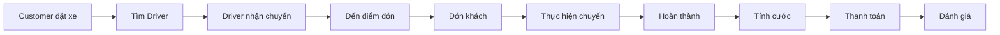
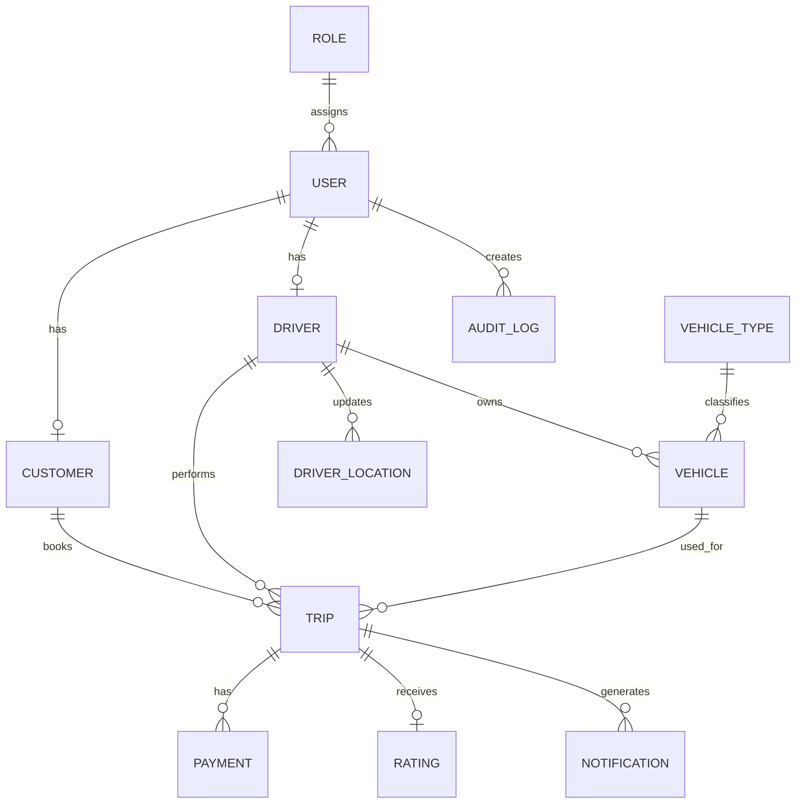
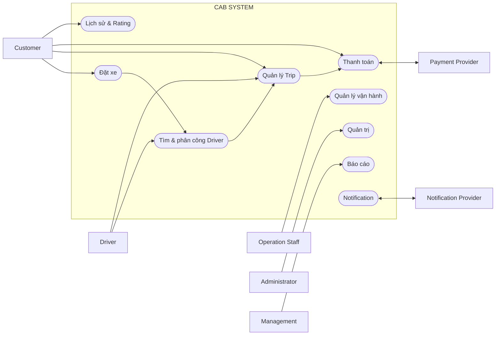

## 1. STAKEHOLDERS

Stakeholders là các cá nhân, nhóm hoặc tổ chức có liên quan đến việc sử dụng, vận hành, quản lý và phát triển **CAB System**.

| STT | Stakeholder               | Vai trò chính                                                        |
| --: | ------------------------- | -------------------------------------------------------------------- |
|   1 | **Customer**              | Đặt xe, theo dõi chuyến, thanh toán, xem lịch sử và đánh giá tài xế. |
|   2 | **Driver**                | Cập nhật trạng thái/vị trí, nhận chuyến và thực hiện chuyến đi.      |
|   3 | **Operation Staff**       | Quản lý khách hàng, tài xế, phương tiện, chuyến đi và xử lý sự cố.   |
|   4 | **Administrator**         | Quản lý tài khoản, phân quyền và nhật ký hệ thống.                   |
|   5 | **Management**            | Theo dõi hoạt động và các báo cáo của CAB System.                    |
|   6 | **Payment Provider**      | Cung cấp dịch vụ xử lý thanh toán điện tử.                           |
|   7 | **Notification Provider** | Cung cấp dịch vụ gửi thông báo cho Customer và Driver.               |
|   8 | **Business Analyst**      | Thu thập, phân tích và quản lý yêu cầu hệ thống.                     |
|   9 | **Development Team**      | Thiết kế, phát triển và triển khai CAB System.                       |
|  10 | **QA / Tester**           | Kiểm thử và xác nhận hệ thống đáp ứng yêu cầu.                       |

---

## 2. STAKEHOLDER MATRIX

Stakeholders được phân loại theo **Influence** (mức độ ảnh hưởng) và **Interest** (mức độ quan tâm).

| Stakeholder           | Influence | Interest | Nhóm           |
| --------------------- | --------- | -------- | -------------- |
| Customer              | Low       | High     | Keep Informed  |
| Driver                | Low       | High     | Keep Informed  |
| Operation Staff       | High      | High     | Manage Closely |
| Administrator         | High      | High     | Manage Closely |
| Management            | High      | High     | Manage Closely |
| Payment Provider      | High      | Low      | Keep Satisfied |
| Notification Provider | High      | Low      | Keep Satisfied |
| Business Analyst      | High      | High     | Manage Closely |
| Development Team      | High      | High     | Manage Closely |
| QA / Tester           | Low       | High     | Keep Informed  |

---

## 3. BUSINESS GOALS

| Mã        | Business Goal               | Mô tả                                                                                  |
| --------- | --------------------------- | -------------------------------------------------------------------------------------- |
| **BG-01** | Nền tảng đặt xe trực tuyến  | Hỗ trợ đầy đủ quy trình từ đặt xe đến hoàn thành chuyến.                               |
| **BG-02** | Tự động phân công tài xế    | Tự động tìm và phân công Driver phù hợp thay cho xử lý thủ công.                       |
| **BG-03** | Theo dõi chuyến đi          | Cho phép Customer theo dõi Driver và trạng thái chuyến.                                |
| **BG-04** | Quản lý cước và thanh toán  | Tập trung thông tin cước phí và hỗ trợ nhiều phương thức thanh toán trong phạm vi MVP. |
| **BG-05** | Quản lý và vận hành         | Hỗ trợ quản lý Customer, Driver, Vehicle, Trip và báo cáo.                             |
| **BG-06** | Ổn định, bảo mật và mở rộng | Đảm bảo hệ thống an toàn, ổn định và có khả năng mở rộng.                              |

---

## 4. SYSTEM SCOPE

CAB System MVP được phát triển trong **7 tuần**, tập trung vào quy trình đặt xe cốt lõi.

### 4.1. In Scope

* Đăng ký, đăng nhập, đăng xuất và quản lý hồ sơ.
* Tạo và hủy yêu cầu đặt xe.
* Quản lý Driver và Vehicle.
* Tự động tìm và phân công Driver.
* Theo dõi và cập nhật trạng thái Trip.
* Xem lịch sử Trip và đánh giá Driver.
* Quản lý Customer, Driver, Vehicle và Trip.
* Quản lý tài khoản, phân quyền và nhật ký.

### 4.2. Limited Scope

* Tính cước và thanh toán.
* Một Payment Provider chính.
* Một giải pháp Notification chính.
* Báo cáo hoạt động cơ bản.

### 4.3. Out of Scope

* AI/ML nâng cao cho Matching.
* Dynamic/Surge Pricing phức tạp.
* Business Intelligence nâng cao.
* Loyalty/Reward và khuyến mãi phức tạp.
* Nhiều Payment/Notification Provider đồng thời.

Luồng MVP:

`Đăng nhập → Đặt xe → Tìm Driver → Thực hiện chuyến → Thanh toán → Đánh giá`

---

## 5. ACTORS

| Mã         | Actor                 | Chức năng chính                                  |
| ---------- | --------------------- | ------------------------------------------------ |
| **ACT-01** | Customer              | Đặt xe, theo dõi, thanh toán, lịch sử, đánh giá. |
| **ACT-02** | Driver                | Nhận chuyến, cập nhật vị trí và trạng thái Trip. |
| **ACT-03** | Operation Staff       | Quản lý và giám sát hoạt động.                   |
| **ACT-04** | Administrator         | Quản lý tài khoản và phân quyền.                 |
| **ACT-05** | Management            | Xem báo cáo hoạt động.                           |
| **ACT-06** | Payment Provider      | Xử lý thanh toán điện tử.                        |
| **ACT-07** | Notification Provider | Gửi thông báo.                                   |

> BA, Development Team và QA/Tester là Stakeholders nhưng không phải Actor nghiệp vụ.

---

## 6. MVP MODULES

| Mã      | Module                           | Scope    |
| ------- | -------------------------------- | -------- |
| **M01** | User & Authentication            | In Scope |
| **M02** | Booking Management               | In Scope |
| **M03** | Driver & Vehicle Management      | In Scope |
| **M04** | Driver Matching & Dispatch       | In Scope |
| **M05** | Trip Management & Tracking       | In Scope |
| **M06** | Fare & Payment                   | Limited  |
| **M07** | Notification                     | Limited  |
| **M08** | Trip History & Rating            | In Scope |
| **M09** | Operation & Administration       | In Scope |
| **M10** | Reporting & Analytics            | Limited  |
| **M11** | Advanced Services & Integrations | Post-MVP |

---

## 7. BUSINESS REQUIREMENTS

### BG-01 – Đặt xe trực tuyến

* **BG01_QuanLyTaiKhoanKhachHang:** Quản lý tài khoản Customer.
* **BG01_TaoYeuCauDatXe:** Cho phép Customer tạo yêu cầu đặt xe.
* **BG01_QuanLyChuyenDi:** Quản lý vòng đời Trip.
* **BG01_QuanLyLichSuChuyenDi:** Lưu và tra cứu lịch sử Trip.
* **BG01_DanhGiaTaiXe:** Cho phép Customer đánh giá Driver.

### BG-02 – Tự động phân công Driver

* **BG02_QuanLyTrangThaiTaiXe:** Quản lý trạng thái hoạt động Driver.
* **BG02_TheoDoiViTriTaiXe:** Ghi nhận vị trí Driver.
* **BG02_TimTaiXePhuHop:** Tìm Driver phù hợp.
* **BG02_PhanCongTaiXe:** Phân công Driver cho Trip.
* **BG02_TimLaiTaiXe:** Tìm Driver khác khi cần.
* **BG02_XuLyKhongCoTaiXe:** Xử lý khi không có Driver phù hợp.

### BG-03 – Theo dõi chuyến

* **BG03_TheoDoiTrangThaiDatXe**
* **BG03_HienThiThongTinTaiXe**
* **BG03_HienThiThoiGianDuKien**
* **BG03_TheoDoiTrangThaiChuyenDi**
* **BG03_ThongBaoSuKienChuyenDi**

### BG-04 – Cước và thanh toán

* **BG04_TinhCuocChuyenDi**
* **BG04_ThanhToanTienMat**
* **BG04_ThanhToanDienTu**
* **BG04_BaoVeThongTinThanhToan**
* **BG04_XuLyThanhToanThatBai**
* **BG04_LuuLichSuGiaoDich**

### BG-05 – Quản lý và vận hành

* **BG05_QuanLyKhachHang**
* **BG05_QuanLyTaiXe**
* **BG05_QuanLyPhuongTien**
* **BG05_GiamSatChuyenDi**
* **BG05_XuLySuCoChuyenDi**
* **BG05_TraCuuGiaoDich**
* **BG05_BaoCaoHoatDong**

### BG-06 – Bảo mật và mở rộng

* **BG06_XacThucNguoiDung**
* **BG06_PhanQuyenQuanTri**
* **BG06_BaoVeDuLieu**
* **BG06_LuuVetHoatDong**
* **BG06_DamBaoTinhSanSang**
* **BG06_HoTroMoRongHeThong**
* **BG06_HoTroMoRongTichHop**

---

## 8. BUSINESS PROCESS MODELING

| Mã        | Business Process        | Luồng chính                                     |
| --------- | ----------------------- | ----------------------------------------------- |
| **BP-01** | Quản lý tài khoản       | Đăng ký → Đăng nhập → Quản lý hồ sơ             |
| **BP-02** | Tạo yêu cầu đặt xe      | Nhập thông tin → Chọn xe → Xác nhận             |
| **BP-03** | Tìm và phân công Driver | Tìm → Xếp hạng → Gửi yêu cầu → Phân công        |
| **BP-04** | Thực hiện Trip          | Driver đến → Đón khách → Di chuyển → Hoàn thành |
| **BP-05** | Cước và thanh toán      | Tính cước → Chọn phương thức → Thanh toán       |
| **BP-06** | Notification            | Sự kiện → Tạo thông báo → Gửi                   |
| **BP-07** | Lịch sử và Rating       | Xem lịch sử → Xem chi tiết → Đánh giá           |
| **BP-08** | Quản lý vận hành        | Theo dõi → Tra cứu → Xử lý sự cố                |
| **BP-09** | Báo cáo                 | Thu thập dữ liệu → Tổng hợp → Hiển thị          |

Luồng nghiệp vụ cốt lõi:

---

## 9. FUNCTIONAL REQUIREMENTS

| Nhóm      | Functional Requirements                                                                                                                                                    |
| --------- | -------------------------------------------------------------------------------------------------------------------------------------------------------------------------- |
| **BP-01** | FR01 Đăng ký; FR02 Đăng nhập; FR03 Đăng xuất; FR04 Xem hồ sơ; FR05 Cập nhật hồ sơ                                                                                          |
| **BP-02** | FR06 Nhập thông tin chuyến; FR07 Chọn loại xe; FR08 Xem thông tin đặt xe; FR09 Tạo yêu cầu; FR10 Hủy yêu cầu                                                               |
| **BP-03** | FR11 Cập nhật trạng thái Driver; FR12 Cập nhật vị trí; FR13 Tìm Driver; FR14 Xếp hạng; FR15 Gửi yêu cầu; FR16 Phản hồi; FR17 Phân công; FR18 Tìm lại; FR19 Không có Driver |
| **BP-04** | FR20 Xem Driver; FR21 Xem ETA; FR22 Xem trạng thái; FR23 Driver đến; FR24 Đón khách; FR25 Bắt đầu; FR26 Hoàn thành; FR27 Hủy Trip                                          |
| **BP-05** | FR28 Tính cước; FR29 Xem cước; FR30 Chọn thanh toán; FR31 Tiền mặt; FR32 Điện tử; FR33 Xử lý thất bại; FR34 Lưu giao dịch                                                  |
| **BP-06** | FR35–FR40 Gửi các thông báo nghiệp vụ                                                                                                                                      |
| **BP-07** | FR41 Xem lịch sử; FR42 Xem chi tiết; FR43 Đánh giá Driver; FR44 Xem Rating                                                                                                 |
| **BP-08** | FR45–FR54 Quản lý Customer, Driver, Vehicle, Trip, giao dịch, tài khoản, quyền và Audit Log                                                                                |
| **BP-09** | FR55–FR60 Thống kê và báo cáo                                                                                                                                              |

---

## 10. BUSINESS RULES

| Mã        | Business Rule                                                                |
| --------- | ---------------------------------------------------------------------------- |
| **BR-01** | Người dùng phải được xác thực trước khi sử dụng chức năng yêu cầu đăng nhập. |
| **BR-02** | Mỗi Customer chỉ có một Trip đang hoạt động.                                 |
| **BR-03** | Driver chỉ nhận chuyến khi Available.                                        |
| **BR-04** | Driver đang thực hiện Trip không được nhận Trip mới.                         |
| **BR-05** | Driver được phân công phải phù hợp yêu cầu chuyến.                           |
| **BR-06** | Nếu Driver từ chối/không phản hồi, hệ thống tìm Driver tiếp theo.            |
| **BR-07** | Customer phải được thông báo nếu không tìm được Driver.                      |
| **BR-08** | Trip chỉ thực hiện sau khi có Driver được phân công.                         |
| **BR-09** | Trạng thái Trip phải chuyển theo trình tự hợp lệ.                            |
| **BR-10** | Cước cuối cùng chỉ được tính khi Trip hoàn thành.                            |
| **BR-11** | Chỉ sử dụng phương thức thanh toán được hệ thống hỗ trợ.                     |
| **BR-12** | Không lưu dữ liệu thanh toán nhạy cảm.                                       |
| **BR-13** | Thanh toán thất bại được xử lý theo chính sách.                              |
| **BR-14** | Chỉ đánh giá Driver sau khi Trip hoàn thành.                                 |
| **BR-15** | Mỗi Trip chỉ có một Rating chính thức.                                       |
| **BR-16** | Chức năng quản trị phải được phân quyền.                                     |
| **BR-17** | Thao tác quan trọng phải được lưu Audit Log.                                 |
| **BR-18** | Báo cáo phải sử dụng dữ liệu hợp lệ của hệ thống.                            |

---

## 11. NON-FUNCTIONAL REQUIREMENTS

| Nhóm            | Mã        | Yêu cầu                                                                                     |
| --------------- | --------- | ------------------------------------------------------------------------------------------- |
| Performance     | NFR-01–03 | Phản hồi phù hợp, Matching nhanh và hỗ trợ nhiều yêu cầu đồng thời.                         |
| Availability    | NFR-04–07 | Hệ thống ổn định; lỗi Payment/Notification không làm dừng toàn hệ thống; dữ liệu nhất quán. |
| Scalability     | NFR-08–09 | Có khả năng mở rộng thành phần và quy mô sử dụng.                                           |
| Security        | NFR-10–14 | Xác thực, phân quyền, bảo vệ dữ liệu, bảo vệ thanh toán và Audit.                           |
| Maintainability | NFR-15    | Thiết kế theo module, hạn chế phụ thuộc.                                                    |
| Extensibility   | NFR-16–18 | Có thể mở rộng Payment, Notification và loại dịch vụ.                                       |
| Usability       | NFR-19–21 | Giao diện dễ sử dụng, trạng thái rõ ràng và lỗi dễ hiểu.                                    |

> Các giá trị định lượng về thời gian phản hồi, tải và độ sẵn sàng: **TBD**.

---

## 12. EXCEPTION CASES

| Mã        | Exception                       | Xử lý chính                                   |
| --------- | ------------------------------- | --------------------------------------------- |
| **EX-01** | Đăng nhập không hợp lệ          | Từ chối và thông báo lỗi.                     |
| **EX-02** | Thông tin đặt xe không hợp lệ   | Không tạo Trip, yêu cầu chỉnh sửa.            |
| **EX-03** | Không có Driver                 | Thông báo Customer.                           |
| **EX-04** | Driver không phản hồi           | Tìm Driver tiếp theo.                         |
| **EX-05** | Driver từ chối                  | Tìm Driver tiếp theo.                         |
| **EX-06** | Customer hủy                    | Xử lý theo chính sách hủy.                    |
| **EX-07** | Driver hủy                      | Xử lý theo chính sách và tìm lại nếu phù hợp. |
| **EX-08** | Thanh toán thất bại             | Ghi nhận lỗi và xử lý theo chính sách.        |
| **EX-09** | Payment Provider không phản hồi | Không tự xác nhận thanh toán thành công.      |
| **EX-10** | Notification lỗi                | Ghi nhận lỗi, không dừng Trip.                |
| **EX-11** | Mất kết nối                     | Đồng bộ lại dữ liệu khi kết nối phục hồi.     |
| **EX-12** | Truy cập không có quyền         | Từ chối thao tác.                             |

---

## 13. OPEN QUESTIONS / TBD

| Mã         | Nội dung cần xác nhận        |
| ---------- | ---------------------------- |
| **TBD-01** | Công thức tính cước          |
| **TBD-02** | Tiêu chí ưu tiên Driver      |
| **TBD-03** | Thời gian Driver phản hồi    |
| **TBD-04** | Chính sách Customer hủy Trip |
| **TBD-05** | Chính sách Driver hủy Trip   |
| **TBD-06** | Xử lý khi mất kết nối        |
| **TBD-07** | Chính sách retry Payment     |
| **TBD-08** | Timeout Payment Provider     |
| **TBD-09** | Xử lý Payment Pending        |
| **TBD-10** | Thời gian lưu dữ liệu        |
| **TBD-11** | Chính sách lưu vị trí Driver |
| **TBD-12** | Cách tính ETA                |
| **TBD-13** | Danh sách loại xe MVP        |
| **TBD-14** | Phạm vi báo cáo MVP          |
| **TBD-15** | Kênh Notification MVP        |

---

## 14. ENTITY MODEL

### 14.1. Các Entity chính

| Entity             | Mô tả                     |
| ------------------ | ------------------------- |
| **User**           | Thông tin tài khoản chung |
| **Customer**       | Thông tin Customer        |
| **Driver**         | Thông tin Driver          |
| **Vehicle**        | Phương tiện của Driver    |
| **VehicleType**    | Loại phương tiện          |
| **Trip**           | Thông tin chuyến đi       |
| **DriverLocation** | Vị trí Driver             |
| **Payment**        | Giao dịch thanh toán      |
| **Rating**         | Đánh giá Driver           |
| **Notification**   | Thông báo                 |
| **Role**           | Vai trò/quyền người dùng  |
| **AuditLog**       | Nhật ký thao tác          |

### 14.2. ERD

---

## 15. USE CASES

| Mã        | Use Case                      | Actor                          |
| --------- | ----------------------------- | ------------------------------ |
| UC01      | Đăng ký tài khoản             | Customer                       |
| UC02      | Đăng nhập                     | Customer, Driver, Staff, Admin |
| UC03      | Quản lý thông tin cá nhân     | Customer, Driver               |
| UC04      | Tạo yêu cầu đặt xe            | Customer                       |
| UC05      | Hủy chuyến                    | Customer, Driver               |
| UC06      | Cập nhật trạng thái hoạt động | Driver                         |
| UC07      | Cập nhật vị trí               | Driver                         |
| UC08      | Tìm và phân công Driver       | Xử lý nội bộ                   |
| UC09      | Chấp nhận/Từ chối chuyến      | Driver                         |
| UC10      | Theo dõi chuyến               | Customer                       |
| UC11      | Cập nhật trạng thái Trip      | Driver                         |
| UC12      | Hoàn thành Trip               | Driver                         |
| UC13      | Tính cước                     | Xử lý nội bộ                   |
| UC14      | Thanh toán                    | Customer                       |
| UC15      | Xem lịch sử Trip              | Customer                       |
| UC16      | Đánh giá Driver               | Customer                       |
| UC17–UC22 | Quản lý vận hành              | Operation Staff                |
| UC23–UC25 | Quản trị hệ thống             | Administrator                  |
| UC26      | Xem báo cáo                   | Management                     |
| UC27      | Gửi Notification              | Notification Provider          |
| UC28      | Thanh toán điện tử            | Payment Provider               |

### Use Case Diagram tổng quát

---

## 16. REQUIREMENTS TRACEABILITY MATRIX

RTM liên kết các yêu cầu từ Business Goal đến Functional Requirement, Use Case và tiêu chí kiểm thử.

| Business Goal | Business Requirement          | BP            | FR            | UC               |
| ------------- | ----------------------------- | ------------- | ------------- | ---------------- |
| BG-01         | BG01_QuanLyTaiKhoanKhachHang  | BP-01         | FR01–FR05     | UC01–UC03        |
| BG-01         | BG01_TaoYeuCauDatXe           | BP-02         | FR06–FR10     | UC04, UC05       |
| BG-02         | BG02_QuanLyTrangThaiTaiXe     | BP-03         | FR11          | UC06             |
| BG-02         | BG02_TheoDoiViTriTaiXe        | BP-03         | FR12          | UC07             |
| BG-02         | BG02_TimTaiXePhuHop           | BP-03         | FR13–FR14     | UC08             |
| BG-02         | BG02_PhanCongTaiXe            | BP-03         | FR15–FR17     | UC08, UC09       |
| BG-02         | BG02_TimLaiTaiXe              | BP-03         | FR18          | UC08             |
| BG-02         | BG02_XuLyKhongCoTaiXe         | BP-03         | FR19          | UC08             |
| BG-03         | BG03_TheoDoiTrangThaiChuyenDi | BP-04         | FR20–FR27     | UC10–UC12        |
| BG-04         | BG04_TinhCuocChuyenDi         | BP-05         | FR28–FR29     | UC13, UC14       |
| BG-04         | BG04_ThanhToanTienMat         | BP-05         | FR30–FR31     | UC14             |
| BG-04         | BG04_ThanhToanDienTu          | BP-05         | FR32–FR34     | UC14, UC28       |
| BG-03         | BG03_ThongBaoSuKienChuyenDi   | BP-06         | FR35–FR40     | UC27             |
| BG-01         | BG01_QuanLyLichSuChuyenDi     | BP-07         | FR41–FR42     | UC15             |
| BG-01         | BG01_DanhGiaTaiXe             | BP-07         | FR43–FR44     | UC16             |
| BG-05         | Quản lý vận hành              | BP-08         | FR45–FR54     | UC17–UC25        |
| BG-05         | BG05_BaoCaoHoatDong           | BP-09         | FR55–FR60     | UC26             |
| BG-06         | Bảo mật & mở rộng             | Toàn hệ thống | NFR-01–NFR-21 | Các UC liên quan |

### Tổng hợp

| Loại                        | Số lượng |
| --------------------------- | -------: |
| Business Goals              |        6 |
| Business Requirements       |       36 |
| Business Processes          |        9 |
| Functional Requirements     |       60 |
| Business Rules              |       18 |
| Non-Functional Requirements |       21 |
| Exception Cases             |       12 |
| Open Questions / TBD        |       15 |
| Use Cases                   |       28 |

Chuỗi truy vết:

`Business Goal → Business Requirement → Business Process → FR/NFR → Use Case`
